# Frame-Atomic Visibility v2 — Echo-Gated Forwarding with Explicit Provenance

> Status: design sketch v2, supersedes v1 (`frame-atomic-visibility.md`).
> Branch: `frame-atomic-visibility` · Date: 2026-05-18
>
> v1 was adversarially reviewed by Codex (gpt-5.5 high-reasoning) and
> Claude Opus (consultant). Both returned `major-rethink`. Five blockers
> emerged from the convergent finding set:
>
>   B1. σ_s semantic conflation (TCP-drain ≠ perceived bus density)
>   B2. Synthetic failure markers contradict §0 ("no proxy-injected events")
>   B3. NACK retransmit budget unbounded
>   B4. Wall-clock time source (must be CLOCK_MONOTONIC)
>   B5. Byte provenance not plumbed through telegram buffer
>
> Plus the structural finding that **active clients cannot be insulated
> from byte-level wire visibility** because arbitration is intrinsically
> a byte-level protocol — any telegram-atomic abstraction at the
> byte-stream layer creates a temporal split-brain for active sessions
> (M5).
>
> v2 takes those findings as constraints and reformulates the design.

---

## 1. Keep the intent, drop the wrong primitive

What we genuinely want, from the operator's original framing:

  - The **AA-injection bug must die at root**, not be patched at byte-level for the tenth time.
  - **Cross-client visibility must look coherent.** When the gateway writes a telegram, ebusd must not see the request bytes appearing before the wire actually transmitted them.
  - **No client should see the proxy.** Every client behaves as if it has its own ENS-WiFi adapter on the bus.

What v1 got wrong: it tried to deliver these by changing the
*observation unit* from byte to telegram. That broke under active
arbitration, which is byte-level by nature.

v2 keeps the byte-stream observation unit (because that's what active
clients need) and changes **two narrow things instead**:

  - **(A) Provenance** — every byte carries `(value, was_escaped,
    is_wire_syn)`. Plumbed end-to-end from adapter through proxy
    through transport into the gateway's echo matcher.
  - **(B) Echo-gated forwarding** — the proxy holds an outbound write
    in its forwarder queue until the adapter echoes it back, confirming
    wire transmission. Other clients see the byte only at echo time.
    The originator gets the echo through the existing read path.

These two changes deliver the operator's three goals without inventing
synthetic emissions, per-session symbol rates, or telegram-atomic
buffer queues.

---

## 2. What v2 is not

  - **Not** a telegram-atomic byte-stream layer.
  - **Not** a synthetic-SYN generator.
  - **Not** a per-session symbol-rate model.
  - **Not** a new visibility tier above the existing transport.
  - **Not** introducing a new state machine at the proxy. The existing
    `passive_reconstructor` and the existing adaptermux session FSM
    cover the proxy's needs already.

v2 is an instrumented byte forwarder with two narrow contracts (A) and
(B) above.

---

## 3. Provenance contract (A)

Every byte event the proxy emits to any client carries:

```
ByteEvent {
    value            byte    // the actual byte
    was_escaped      bool    // true if logical 0xAA decoded from wire 0xA9 0x01
    is_wire_syn      bool    // true if this is a wire-level SYN (0xAA, was_escaped=false)
    source           {own_echo, foreign_initiator, slave_response, wire_idle}
    t_wire_observed  monotonic_nano
}
```

Invariants on provenance:

  - **I-prov-1.** `is_wire_syn` is true iff `value == 0xAA` AND
    `was_escaped == false`.
  - **I-prov-2.** `was_escaped` is preserved across all layers — the
    adapter's escape decoder annotates each byte once and the
    annotation is never lost or recomputed.
  - **I-prov-3.** `source` is computable deterministically from the
    arbitration FSM state at the moment of receipt — `own_echo` when
    the session is the post-`STARTED` active initiator; otherwise
    derived from the most recent arbitration outcome on the wire.

Consequence for the AA-injection bug:

  - When the adapter spontaneously injects an AUTO-SYN into the
    gateway's mid-frame echo stream, that byte arrives at the gateway
    with `value=0xAA, was_escaped=false, is_wire_syn=true`.
  - The gateway's echo matcher, before round-9, treated this as an
    echo-position byte and triggered echo_mismatch. Round-9 partially
    handled it via a side-channel "absorb" loop that had drift bugs.
  - Under v2, the echo matcher consumes the provenance directly:
    `is_wire_syn=true` means **drop without advancing the expected
    echo position**. This is a one-line semantic in matchEcho, not a
    drain loop. No position counter shift, no timeout escalation.

This is the structural fix for the AA-injection class of bug. The
mechanism is the explicit provenance bit, not a heuristic.

---

## 4. Echo-gated forwarding contract (B)

Today the proxy forwards every outbound byte to every connected client
the moment it arrives from the originating client. That produces the
"frame ripped in half" effect: ebusd sees the gateway's request bytes
at T₀ (proxy-receive time), then nothing for `L_up + W + L_dn`, then
the response.

Under v2, outbound forwarding is gated on echo arrival:

```
When a session A writes byte b at proxy-receive time T_recv :
  enqueue b on A's outbound staging buffer
  forward b to the adapter immediately
  --- adapter eventually echoes b back ---
  when adapter delivers echo of b at T_echo :
    dequeue b from A's staging
    forward b to all OTHER sessions at T_echo
    forward echo to A through the normal read path (so A can match)
```

For inbound wire activity (foreign-initiator bytes, slave responses,
spontaneous adapter events) there is no gating — those events are
forwarded to all sessions immediately as they were observed.

Consequence:

  - ebusd, when not the active initiator, sees the gateway's
    transaction at the timing a real adapter would deliver: an idle
    period (filler SYNs from adapter, observed and forwarded
    immediately), then the gateway's bytes (echo-gated, arrive at
    wire-realistic moment), then the slave response, then more idle.
  - The "frame ripped in half" pattern disappears.
  - No buffer queue per client — gating happens once per outbound byte
    and the byte either lands on the wire (echoed → forwarded) or
    didn't (arbitration FAILED → dropped, never forwarded to others,
    matching wire reality).

For arbitration losers specifically:

  - Gateway sends byte 0 → adapter STARTED → adapter FAILED (some
    other initiator won).
  - Bytes already in A's staging buffer are silently discarded; not
    forwarded to other clients. Other clients see the winning
    initiator's bytes via the normal inbound path. No synthetic
    "failure" event needed — the absence of bytes from A is the
    natural wire signal.
  - A itself gets the FAILED event through the existing transport
    path. Same as today.

---

## 5. NACK retransmit bound (B3 from v1 review)

Per eBUS V1.3.1 spec: **exactly one retransmit per phase**.

This is enforced in the **active client's** FSM (e.g., the gateway's
existing send logic), not at the proxy. The proxy is a byte mirror; it
does not interpret NACK semantics.

The active-client FSM tracks `master_retx_count` and `slave_retx_count`
independently:

```
WAIT_MASTER_ACK on NACK with master_retx_count == 0 :
    master_retx_count := 1
    resend full master telegram (QQ ZZ PB SB NN DB CRC)
    return to WAIT_MASTER_ACK

WAIT_MASTER_ACK on NACK with master_retx_count >= 1 :
    abort telegram (ErrNACK), surface to caller, emit terminator yield

WAIT_SLAVE_ACK on NACK with slave_retx_count == 0 :
    slave_retx_count := 1
    request slave to resend response
    return to SLAVE_LENGTH

WAIT_SLAVE_ACK on NACK with slave_retx_count >= 1 :
    abort telegram (ErrNACK), surface to caller
```

This is already approximately what `helianthus-ebusgo/protocol/bus.go`
implements (`sendInitiatorTelegram` retries once on NACK). v2 just
formalizes the bound explicitly and adds a unit test that proves
unbounded retransmission cannot occur.

---

## 6. Time source (B4 from v1 review)

All timing operations — echo-gate deadlines, retransmit timeouts,
inter-byte gap measurement, EMA windows of the few small things we
still measure (see §8) — use Go's `time.Now()` which is **explicitly
monotonic on Linux** (the kernel uses CLOCK_BOOTTIME internally for
monotonic readings on Go ≥ 1.9 on platforms where it exists, with
CLOCK_MONOTONIC fallback).

Wall-clock times are used **only** for log lines and admin-channel
telemetry, never for scheduling or correlation logic. Negative deltas
are unreachable by construction.

---

## 7. What v2 deletes from the codebase

Once v2 ships, these layers can be removed from active-client paths:

  - `helianthus-ebusgo/protocol/bus.go` round-9 `payloadAaAutoSyn*`
    absorb loop and atomic counters. Replaced by the
    `is_wire_syn`-aware echo matcher.
  - `helianthus-ebusgateway/internal/adaptermux/mux.go` P10.2 gate,
    `betweenWritesSyn` gate, postGrantPreEcho windowing — these all
    exist to hide AUTO-SYN bytes from byte-stream consumers who
    couldn't distinguish them. With explicit provenance, consumers
    distinguish them directly.
  - `helianthus-ebus-adapter-proxy/internal/scheduler/write/shared_path.go`
    suppression heuristics for SYN-during-active-write.

The active-client FSM stays. The transport layer stays. The
arbitration multiplexer stays. The byte stream stays. The fixes are
**narrowly inside echo matching and proxy forwarding**.

---

## 8. What v2 still measures

Only what's necessary for echo-gate deadline tuning:

  - **`L_dn_EMA`** — adapter→proxy latency, estimated from
    `RequestInfo` round-trip with the symmetry assumption acknowledged
    as approximate (see §10).
  - **Per-byte echo arrival timeout** — bounded at `2 × L_dn_EMA +
    spec wire byte time + safety margin`. If echo doesn't arrive
    within this, declare wire transmission failure and drop the byte
    from staging (matches real adapter behavior: lost byte = wire
    didn't transmit).

No per-session symbol-rate. No synthetic SYN generator. No
prefix/postfix counting. No queue of telegrams. The proxy is
stateless beyond the per-session staging buffer (which holds at most
the bytes of an in-flight write — typically <20 bytes).

---

## 9. State diagram (active-client write path)

```mermaid
stateDiagram-v2
    [*] --> WRITE_QUEUED

    WRITE_QUEUED --> AWAIT_ARBITRATION : forward byte to adapter
    AWAIT_ARBITRATION --> WIRE_TX : adapter STARTED
    AWAIT_ARBITRATION --> ABORT_ARB_LOST : adapter FAILED

    WIRE_TX --> WIRE_TX : echo received (is_wire_syn=false) → forward to other sessions, advance match position
    WIRE_TX --> WIRE_TX : echo received (is_wire_syn=true) → forward to other sessions, do NOT advance match position
    WIRE_TX --> ABORT_ECHO_TIMEOUT : echo not received within 2×L_dn_EMA + τ_byte

    WIRE_TX --> WRITE_QUEUED : staging buffer not yet empty, next byte ready
    WIRE_TX --> DONE_OWN_TELEGRAM : all bytes echoed AND active-client FSM signals telegram-complete

    ABORT_ARB_LOST --> [*] : nothing forwarded to others; originator sees FAILED via read path
    ABORT_ECHO_TIMEOUT --> [*] : byte not forwarded to others; originator sees timeout via read path
    DONE_OWN_TELEGRAM --> [*]
```



This is the proxy's *forwarder* FSM for one outbound write. The
active-client's own telegram FSM (master-header → master-data →
master-CRC → wait-ack → ...) runs separately, on the read path, and
interprets the echo stream the proxy delivered. v2 does not change
that FSM beyond the provenance-aware NACK retransmit bound (§5).

The forwarder FSM is the smallest possible state machine that
implements echo-gated forwarding. It has no notion of telegram
boundaries — it forwards byte-by-byte based on echo arrival.

---

## 10. Invariants

  - **I0 (clock):** All scheduling and correlation timestamps are
    monotonic. Wall-clock used only for human-readable logs.
  - **I1 (provenance):** `(was_escaped, is_wire_syn)` is preserved on
    every byte from adapter receipt to client emission. No layer
    recomputes it.
  - **I2 (echo gate):** A byte enqueued for write by session A is
    forwarded to other sessions **only after** the adapter echoes it.
  - **I3 (silent drop):** If a queued byte is not echoed within the
    deadline, it is silently discarded. No synthetic failure event is
    emitted into the byte stream — the absence of the byte is the
    natural wire signal.
  - **I4 (retx bound):** master_retx_count ≤ 1, slave_retx_count ≤ 1
    per telegram. Enforced in the active client's FSM, unit-tested.
  - **I5 (no proxy events):** The proxy never inserts a byte into a
    session's read stream that did not correspond to an actual
    adapter event. Diagnostic counters live on a separate admin
    channel.
  - **I6 (forwarding fan-out):** A wire event is forwarded to all
    connected sessions equally, modulo the echo-gate filter that
    suppresses outbound bytes from the originator's view of other
    initiators (see §11 for the gateway-arbitrates case).

---

## 11. The gateway-arbitrates / ebusd-observes case (operator's original concern)

Worked example with concrete numbers.

Setup: gateway is active initiator, ebusd is connected and observing.
Both via TCP/ENS to the proxy. L_up = 12 ms, L_dn = 8 ms, wire byte
time ~4 ms, telegram length 22 bytes.

Timeline (wall-clock from gateway's send):

| t          | gateway                  | proxy                                          | ebusd                          |
|-----------:|--------------------------|------------------------------------------------|--------------------------------|
| T₀         | sends byte 0 to proxy    | enqueues b₀ on gateway staging                 | sees nothing for b₀ yet        |
| T₀ + L_up  | —                        | adapter transmits b₀ on wire                   | —                              |
| +L_up+~4ms | —                        | wire echo of b₀ arrives at adapter             | —                              |
| +L_up+L_dn | receives echo of b₀     | adapter delivers echo to proxy                 | **forwarded b₀ to ebusd**       |
| (repeat for b₁..b₂₁ with same offset)                                                                                |
| T_slave    | reads slave response     | adapter forwards slave bytes                   | forwarded slave bytes          |
| T_end      | reads terminator         | adapter forwards terminator SYN                | forwarded terminator           |

ebusd's view: filler SYNs (forwarded immediately from adapter idle),
then the gateway's request bytes arriving at wire-time, then slave
response, then terminator. Indistinguishable from what ebusd would see
if it had its own ENS adapter on the same bus.

If an AUTO-SYN injects mid-telegram (the round-9 motivating scenario):

  - Adapter sends AUTO-SYN to proxy with `is_wire_syn=true`.
  - Proxy forwards immediately to all sessions including gateway and
    ebusd.
  - Gateway's echo matcher: `is_wire_syn=true` → drop, no position
    advance. Continues waiting for the actual echo of its next byte.
    The actual echo arrives next, matches, advances. No
    `echo_mismatch`, no `timeout`, no drain loop.
  - ebusd's parser: same provenance — AUTO-SYN treated as wire idle,
    no impact on its own telegram parsing.

---

## 12. What this does NOT solve

Honest accounting of what stays open:

  - **Slow client backpressure on outbound staging buffer.** If session
    A writes faster than the adapter accepts (rare on a 2400-baud wire
    but possible during burst), the staging buffer grows. v2 caps it
    at the maximum eBUS telegram size (~40 bytes) and drops the write
    with a transport-layer `EAGAIN`-equivalent. Same behavior a real
    adapter would have on a full TX FIFO.
  - **Multi-initiator wire collisions.** If two clients write
    simultaneously, the arbitration multiplexer (`adaptermux`) decides
    the winner via the existing FSM. v2 changes nothing here.
  - **Slave-response retransmit count enforcement** requires the
    active-client FSM update (§5) which lands in `helianthus-ebusgo`
    behind v2's plumbing changes. It is a strict implementation pin,
    not new design.

---

## 13. Migration path

  1. **Plumb provenance** (`is_wire_syn`) through the existing transport
     stack. Touch points: ENH transport `ReadByteWithEscape`, proxy's
     forwarder, adaptermux read loop. Backward compatible with
     existing matchers (default `is_wire_syn=false`).
  2. **Switch echo matcher** to consume provenance directly. Remove
     round-9 absorb loop. Land in `helianthus-ebusgo`. Verify on live
     bus that AA-injection no longer triggers echo_mismatch or timeout.
  3. **Echo-gate the proxy forwarder.** Add staging buffer. Modify
     forward-to-other-sessions to fire on echo, not on receive. Land
     in `helianthus-ebus-adapter-proxy`. Verify on live bus that ebusd
     sees coherent telegram timing.
  4. **Pin NACK retransmit count** to exactly 1 per phase, add unit
     tests in `helianthus-ebusgo/protocol`.
  5. **Audit and remove dead gates** (P10.2, betweenWritesSyn,
     postGrantPreEcho windowing) once steps 1-3 are validated.

Each step is independently verifiable and rollback-able. No "big
bang" migration.
