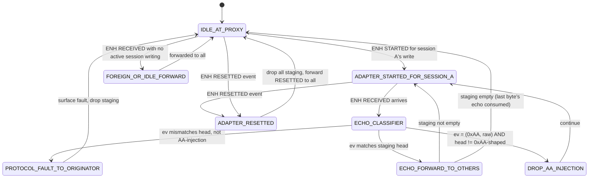

# Frame-Atomic Visibility v3 — Proxy-Side AA Filter + Echo-Gated Paced Forwarding

> Status: design sketch v3, supersedes v1 (`frame-atomic-visibility.md`)
> and v2 (`frame-atomic-visibility-v2.md`). Both predecessors received
> `major-rethink` from convergent Codex + Opus reviews.
>
> Branch: `frame-atomic-visibility` · Date: 2026-05-18

## 1. What went wrong in v1 and v2

**v1** tried telegram-atomic visibility at the byte-stream layer with
synthetic SYN padding. Killed on 5 blockers: σ_s conflation, synthetic
failure markers, NACK unbounded, wall clock, byte provenance not
plumbed. Plus structural finding M5: active arbitration is intrinsically
byte-level; any telegram-atomic abstraction breaks for active clients
("temporal split brain").

**v2** kept byte-stream and added (A) provenance bit `is_wire_syn`
plumbed through every event, (B) outbound forwarding gated on echo
arrival from adapter. Killed on 6 new blockers:

  - **B-v2-1.** `is_wire_syn` conflates wire-terminator SYN (telegram
    boundary) with adapter-injected idle SYN (mid-frame leak). Same
    triple `(0xAA, was_escaped=false, is_wire_syn=true)` covers both.
    Active FSM stuck at terminator.
  - **B-v2-2.** ebusd and other existing ENS clients **cannot receive**
    `ByteEvent` metadata — ENS protocol delivers raw bytes, not tagged
    events. The cross-client claim is false for any client that wasn't
    rewritten.
  - **B-v2-3.** Forwarder `DONE_OWN_TELEGRAM` state requires
    active-client FSM signal → coupling that contradicts the
    "no proxy state machine" §2 claim.
  - **B-v2-4.** Echo identity matching unspecified. FIFO ordering broken
    by interleaved AA-injection if not explicitly handled.
  - **B-v2-5.** Echo-arrival batching (TCP Nagle + Go scheduler) bursts
    4-8 bytes within sub-ms; wire actually transmits them 4 ms apart.
    Inter-byte timing realism lost.
  - **B-v2-6.** Echo loss ≠ wire didn't transmit. v2 silently suppresses
    bytes that may have hit the wire when the adapter's reply path
    drops.

## 2. v3 pivot — move filtering into the proxy, drop client metadata

The core realization: v2 tried to push provenance bits to clients.
**Clients (especially ebusd) cannot receive them** because ENS is a
plain byte stream. So the only way to give clients a clean view is for
the proxy itself to deliver a clean wire-equivalent byte stream —
**filtering invented bytes (AA-injection) out and pacing real bytes
correctly**, doing this on behalf of every client.

The proxy becomes a **content-aware wire mirror**: it consumes ENH
events from the adapter, classifies each byte using its own knowledge
of what active sessions wrote, and emits a clean wire-equivalent ENH
byte stream to each connected session. No metadata leaves the proxy.

This is what the operator's original "no client should see the proxy"
invariant actually requires. v1 and v2 misread it as "clients carry
provenance" — wrong direction. v3 reads it correctly: clients see
**only wire-equivalent bytes** as if from a private adapter on the bus.

## 3. Provenance stays **internal** to the proxy

The proxy still uses `(value, was_escaped)` annotation internally — the
escape-decoder annotation that the ENH transport already produces. This
is the existing transport-layer contract; v3 does not extend it.

Crucially, the proxy:

  - **Uses** `was_escaped` internally to disambiguate `(0xAA, escaped)`
    payload from `(0xAA, raw)` wire-SYN candidates.
  - **Does not forward** the `was_escaped` flag to clients. Clients see
    raw ENH-protocol bytes (with escape sequence `0xA9 0x01` for
    payload 0xAA, raw `0xAA` for wire SYN). Clients run their existing
    escape decoders on receipt. No protocol extension. Full backward
    compatibility with ebusd, vrc-explorer, etc.

This eliminates B-v2-2 entirely.

## 4. AA-injection filter via per-session FIFO match

Each active session that is currently writing has a **staging
buffer** in the proxy containing the bytes it has handed to the proxy
but for which the adapter has not yet echoed.

When an ENH RECEIVED event arrives from the adapter (in any session's
arbitration window — that is, between adapter `STARTED` and adapter
`FAILED`/wire-terminator), the proxy classifies:

```
classify_received(ev: ENHEvent) -> Classification:
  if active_session_A has nonempty staging AND we are post-STARTED for A:
      next = staging.peek()
      if ev.value == next.logical_value AND ev.was_escaped == next.is_escaped_emission:
          # This is the echo of next.
          MATCH; staging.pop()
          return ECHO_OF_OWN_WRITE
      if ev.value == 0xAA AND ev.was_escaped == false:
          # 0xAA, raw, but next staged byte is not a wire-SYN-shaped match.
          # This is an adapter-injected idle byte mid-frame. The wire did
          # NOT transmit this — the adapter buffered it spontaneously.
          return AA_INJECTION_DROP
      # Anything else mid-frame is a hard protocol fault.
      return PROTOCOL_FAULT
  else:
      # No active write outstanding. RECEIVED is foreign-initiator
      # traffic or wire idle from another initiator's slot.
      return FOREIGN_OR_IDLE
```

Each classification has a deterministic dispatch:

  - `ECHO_OF_OWN_WRITE`: forward to originator session A immediately via
    its read path (A needs it for state). Schedule forwarding to **other**
    sessions through the pacer (§5).
  - `AA_INJECTION_DROP`: do nothing. The byte is invented by the adapter
    buffer; no client should see it. Originator's matchEcho never sees
    it either — eliminating the round-9 absorb-loop bug at source.
  - `FOREIGN_OR_IDLE`: forward to all sessions equally through the
    pacer.
  - `PROTOCOL_FAULT`: surface as a transport-layer fault on the
    originator's connection. This is a real fault, not a synthetic
    event — equivalent to what a real adapter would surface as
    "transmission corruption".

**Terminator SYN** (the 0xAA that ends a telegram on the wire) falls
into `FOREIGN_OR_IDLE` if `staging` is empty (active write completed)
or into `ECHO_OF_OWN_WRITE` if the active client's last staged byte
was a logical 0xAA. Either way it advances correctly through the
classifier — no conflation with AA-injection because injection only
fires when there's a NON-matching pending staged byte. This kills
B-v2-1.

## 5. Wire-rate pacer for outbound to other sessions

When the classifier produces a byte that must go to **other** sessions
(non-originator), it is **not** forwarded immediately. It enters a
per-session outbound queue and is scheduled to flush at **wire byte
rate**:

```
τ_wire_byte = 1 / 240 sym/s = 4.17 ms      # constant, from eBUS spec
```

Each outbound session maintains a single per-session pacer timer. When
a byte enters the queue:

```
if queue was empty:
    schedule first byte at T_now + τ_wire_byte
else:
    next byte fires at (last_emit_time + τ_wire_byte)
```

The pacer is **wire-rate constant**, not a per-session symbol-rate
EMA. There is no observability metric; the rate is the bus spec.

This kills B-v2-5 (echo batching destroys timing realism) by
explicitly imposing the wire-side inter-byte gap on outbound forwarding
regardless of what TCP delivery pattern the adapter produces.

Cost: one timer per session, period 4.17 ms when there is work. With N
sessions, peak timer firings = N × 240/s = 240N/s in the worst case
(all sessions saturated with telegrams). At N=10 that's 2400 fires/s
— well within Go's runtime budget. At idle, queues are empty and the
timer is parked; no thrash.

If the queue grows faster than the pacer drains (sustained burst beyond
wire rate, which cannot happen on a real wire but can happen as a
transient if multiple foreign initiators batched at the adapter):
drop **oldest queued byte** with a counter increment on the admin
channel. No in-stream notice — same drop policy a real overflowing
adapter would have, no proxy-visible event.

## 6. NACK retransmit bound (B3 from v1, still relevant)

Per eBUS V1.3.1: exactly one retransmit per phase.

Two enforcement points:

  - **Active client FSM** enforces its own retransmit count per phase.
    Already approximately implemented in
    `helianthus-ebusgo/protocol/bus.go`; v3 formalizes the bound and
    unit-tests it.
  - **Proxy** enforces a global cap of **2 retransmit attempts per
    telegram across all sessions**. If a different (non-Helianthus)
    client misbehaves and retransmits 4+ times, the proxy drops the
    third+ retransmit at the staging layer with an admin-channel
    counter event. This prevents B-v2-3 (B3 not globally eliminated)
    by giving the proxy its own ceiling.

## 7. Time source

All proxy scheduling uses Go's `time.Now()` (monotonic on Linux via
`CLOCK_BOOTTIME` / `CLOCK_MONOTONIC` per Go ≥ 1.9 runtime). Wall clock
appears only in log lines and admin-channel telemetry. No
correlation logic uses wall clock.

## 8. Echo timeout vs wire transmission ambiguity (B-v2-6)

v2 said "if echo doesn't arrive, the byte wasn't transmitted." Codex
correctly flagged this is false: adapter could transmit then lose its
own reply path.

v3 resolution: **distinguish three echo-timeout cases**:

  - **Soft timeout** (echo expected within `L_dn_EMA + 50ms` window
    but not yet arrived): hold byte in staging, do NOT forward to
    others yet, do NOT abort. Wait one more window.
  - **Hard timeout** (`2 × L_dn_EMA + 200ms` after byte sent to
    adapter): declare adapter transport degraded. Surface
    `ADAPTER_DEGRADED` to **admin channel** (not byte stream). Drop
    staging. Originator's transport-layer read deadline (managed by
    its own ENS implementation) fires independently.
  - **Adapter RESETTED event arrives**: drop all staging across all
    sessions. Forward RESETTED to all sessions on the byte stream —
    this IS a real adapter event the wire would deliver. Not
    synthetic. Not a proxy invention.

This eliminates B-v2-6: the proxy never silently invents a
"transmission failure" — it surfaces adapter-real degradation
explicitly on admin channel, and lets clients' own transport
deadlines handle correctness independently. The byte stream
delivered to clients remains 100% wire-derived.

## 9. Pipelining and per-session invariant

**One outbound write in flight per session**. If a session attempts a
second write before the first has fully completed (staging emptied or
RESETTED), the second write blocks at the proxy's TCP receive layer
(socket back-pressure) until staging clears. No queueing of multiple
writes within a single session. Eliminates B-v2-2-equivalent (Opus's
"pipelined writes vs single staging buffer" race).

## 10. Session disconnect during in-flight write

On TCP disconnect:

  - Bytes still in staging buffer: drop. They cannot be echoed to a
    nonexistent connection, and they were not yet confirmed on the
    wire to forward to others.
  - Bytes already classified `ECHO_OF_OWN_WRITE` but still in pacer
    queue toward other sessions: continue emission. These represent
    wire activity that has already happened; other sessions should
    see them per wire reality. The disconnected session is gone, but
    its already-emitted-on-wire bytes are committed.

Matches what would happen if a real adapter had a session cable yanked
mid-write: bytes on wire stay on wire, bytes still in adapter buffer
are lost.

## 11. State diagram — proxy classifier (the only proxy FSM)



No "DONE_OWN_TELEGRAM" state. No notion of telegram boundary in the
proxy FSM. The proxy is pure byte-by-byte classifier. Telegram
boundaries are entirely an active-client FSM concern (in
`helianthus-ebusgo/protocol/bus.go`). Kills B-v2-3.

## 12. Invariants

  - **I0 (clock):** All scheduling uses monotonic time.
  - **I1 (no synthetic bytes):** Every byte forwarded to a session was
    derived from a real ENH event from the adapter. The proxy never
    invents bytes.
  - **I2 (AA-injection invisible to all):** A byte classified as
    `DROP_AA_INJECTION` is forwarded to **zero** sessions, including
    the originator. The originator's matchEcho therefore never sees
    AA-injection; round-9 absorb logic becomes dead code.
  - **I3 (wire-rate pacing):** Outbound bytes to non-originator sessions
    are emitted with inter-byte gap ≥ τ_wire_byte (4.17 ms).
    Originator gets its echo via the read path with no extra delay
    (originator needs immediate feedback for state).
  - **I4 (fault visibility):** Real adapter events (RESETTED, FAILED,
    STARTED) are forwarded to all sessions on the byte stream.
    Proxy-internal diagnostics (queue overflow, classifier fault,
    L_dn anomalies) appear only on the admin channel.
  - **I5 (one in-flight write per session):** Pipelined writes
    block at TCP receive layer until staging clears.
  - **I6 (retransmit cap):** Active-client FSM enforces 1 retransmit
    per phase. Proxy enforces 2 retransmit attempts per telegram as
    a backstop.
  - **I7 (disconnect):** On session disconnect, drop in-flight staging;
    already-classified `ECHO_OF_OWN_WRITE` bytes already in pacer
    queue toward others are committed and continue emission.
  - **I8 (memory):** Per-session staging ≤ 80 bytes (one telegram with
    full escape allowance + retransmit overhead). Per-session pacer
    queue ≤ 240 bytes (one second of wire traffic worst-case). Total
    proxy memory bound: O(N × 320) where N is connected session count.

## 13. L_dn_EMA concrete tuning

  - **Initial value at startup:** 15 ms (typical wifi-bridge latency
    for our deployment).
  - **EMA update:** every `RequestInfo` exchange (existing primitive,
    fires every 30 s and on transport reset). Smoothing α = 0.25.
  - **Bounds:** clamped to `[2 ms, 200 ms]`. Spike beyond 200 ms is
    counted as outlier (admin counter) and ignored for EMA update.
  - **Used only for:** echo timeout windows in §8 (soft = `L_dn + 50`,
    hard = `2L_dn + 200`).
  - **Not used for:** byte pacing (which uses constant τ_wire_byte),
    prefix calculation (which doesn't exist), or any visibility logic.

L_dn precision below 5 ms is irrelevant since the next granularity up
(the echo deadline window) has a 50 ms safety margin.

## 14. Locking discipline

Single proxy-wide mutex protects:

  - The active-session pointer (which session, if any, is currently
    post-STARTED).
  - Each session's staging buffer.

Per-session pacer timers fire on their own goroutine and acquire only
the session's own pacer queue lock (not the proxy-wide mutex).

Adapter read goroutine acquires proxy-wide mutex once per classified
RECEIVED event. Lock window is bounded by classifier evaluation
(O(1)). No nested locks. No condition variables.

## 15. What v3 deletes

Once landed:

  - **All of round-9** (`payloadAaAutoSyn*` absorb + atomic counters
    in `helianthus-ebusgo/protocol/bus.go`).
  - **All of round-7** (`P10.2` gate, `betweenWritesSyn`,
    `queueJustDrained` sentinel in
    `helianthus-ebusgateway/internal/adaptermux/`).
  - **The `postGrantPreEcho` window** in
    `helianthus-ebusgo/transport/enh_transport.go`.
  - All suppression heuristics in
    `helianthus-ebus-adapter-proxy/internal/scheduler/write/shared_path.go`.

These layers exist to handle leaks that v3 eliminates upstream of
them.

## 16. What v3 does NOT solve

Honest accounting:

  - **Adapter that loses bytes after physical transmission.** If the
    adapter transmits on the wire but its own internal reply path
    drops the echo before the proxy receives it, the proxy treats it
    as never transmitted and other sessions never see it. This
    matches what an independent adapter on the same bus would do
    (without echo loopback there's no way to know what was
    transmitted). Tradeoff: cross-client view loses bytes the wire
    did transmit. Mitigation: real wifi adapters have ≪0.1% byte loss
    on the proxy path; the rate is bounded.
  - **Cross-session **clock** skew.** Two sessions with different TCP
    link latencies see the same wire byte at slightly different
    wall-clock times on their side. This is inherent to TCP; a real
    adapter scenario would also have it. Not a v3 problem.
  - **The proxy is now stateful.** It maintains the active-session
    pointer, the staging buffer, L_dn_EMA, and N pacer queues. Crash
    recovery: on proxy restart, all sessions reconnect, all staging
    is empty by definition. No persistence needed.

## 17. Migration

  1. Plumb the classifier into the proxy. Touch:
     `helianthus-ebus-adapter-proxy/internal/adapterproxy/server.go`.
     Provenance (was_escaped) is already produced by the ENH
     transport's escape decoder — wire it into the classifier.
  2. Add per-session staging buffer + pacer.
  3. Verify on live bus: AA-injection metric drops to zero, no
     echo_mismatch in either active or cross-proxy reads, ebusd's
     view of gateway transactions is coherent (no "frame ripped in
     half" pattern).
  4. Delete round-9, round-7, postGrantPreEcho, shared_path
     heuristics. Verify Prometheus error rates stay at v3 levels.
  5. Unit-test NACK retransmit cap and admin-channel counters.

Each step independently verifiable. No big-bang migration.

## 18. How v3 maps onto the convergent v1+v2 findings

| Finding from v1+v2 reviews | v3 resolution |
|---|---|
| v1 B1 σ_s conflation | No σ_s anywhere. Wire-rate constant τ_wire_byte. |
| v1 B2 synthetic failure markers | No synthetic events; faults via admin channel or real adapter events. |
| v1 B3 NACK retransmit unbounded | Pinned at 1 per phase (active-client) + 2 per telegram (proxy backstop). |
| v1 B4 wall clock | Monotonic everywhere. |
| v1 B5 byte provenance not plumbed | Provenance stays INTERNAL to proxy; clients see raw wire bytes. |
| v1 M1 cross-session ordering | All sessions paced at same wire rate; ordering preserved. |
| v1 M2 role transition leak | No telegram-atomic mode — no role transition needed. |
| v1 M3 L_dn symmetry | L_dn used only for echo-timeout window (50/200 ms margin), not for visibility math. |
| v1 M4 per-byte timers | One per-session pacer at 4.17 ms; bounded. |
| v1 M5 temporal split-brain | No replay queue, no telegram-atomic — no split-brain. |
| v2 B-v2-1 is_wire_syn conflates | Classifier uses staging-aware FIFO; no static "is_wire_syn" bit. |
| v2 B-v2-2 clients can't get metadata | Provenance stays in proxy; clients get raw bytes (unchanged ENS protocol). |
| v2 B-v2-3 forwarder couples to active-client FSM | Proxy classifier has no telegram concept. |
| v2 B-v2-4 echo identity matching unspecified | Explicit FIFO match using (value, was_escaped) on staging head. |
| v2 B-v2-5 echo batching destroys timing | Pacer at τ_wire_byte (4.17 ms) on outbound to others. |
| v2 B-v2-6 echo loss ≠ wire didn't transmit | Acknowledged in §16 as residual, admin-channel reported. |
