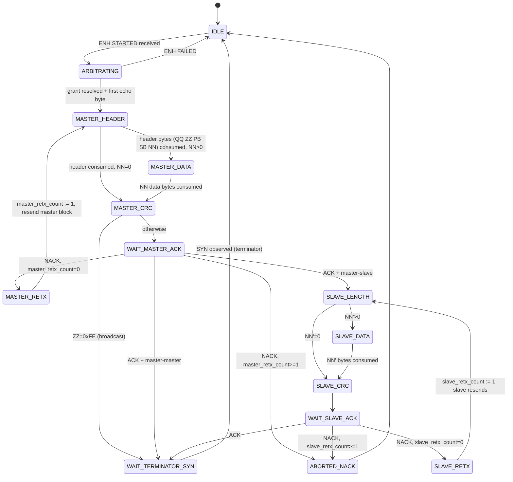

# Frame-Atomic Visibility v4 — Proxy with Minimal Active-Telegram FSM

> Status: design sketch v4. Supersedes v1, v2, v3. All three predecessors
> received `major-rethink` from convergent Codex + Opus reviews.
> Branch: `frame-atomic-visibility` · Date: 2026-05-18

## 1. What v3 got wrong

v3 inverted the model correctly (proxy holds intelligence, clients get
clean wire-equivalent stream) but tried to do it **without any
telegram-structure state** at the proxy. The reviews showed this is
provably insufficient. The convergent findings between Codex and Opus
on v3:

  - **idle-state AA-injection invisible to classifier (both flagged).**
    When no active session is writing, `FOREIGN_OR_IDLE` forwards every
    0xAA byte to all clients indistinguishably — adapter-spurious AA
    and wire-real AUTO-SYN have the same encoding. The motivating bug
    survives v3 exactly in the steady-state case.
  - **escape-pair-interrupted-by-AA (Codex unique).** Wire sequence
    `0xA9 0xAA 0x01` is what AA-injection mid-escape looks like. The
    escape decoder consumes `0xA9`, sees `0xAA` as invalid escape
    continuation, resets state, emits `0x01` as a raw byte. The
    AA-injection event never reaches the classifier as an AA-injection.
  - **NACK retransmit cap requires telegram state (both flagged).**
    v3 §6 promises proxy-side bound of "2 retransmits per telegram"
    while §11 forbids any telegram concept at the proxy. Contradiction.
  - **inter-write empty-staging window (Codex strawman, Opus B-v3-3).**
    Between echo-of-byte-K and the proxy's TCP receive of byte-K+1,
    staging is empty. Adapter-injected AA in this window is forwarded
    as `FOREIGN_OR_IDLE`. This is the round-7 `queueJustDrained` hole
    v3 explicitly claims to delete — but v3 doesn't actually fix it.
  - **L_dn outlier-ignore loses real bytes (both flagged).**
    Sustained WiFi spike with outliers clamped out leaves EMA low →
    hard timeout fires → real bytes dropped from staging → late
    echoes orphaned as `FOREIGN_OR_IDLE`.

Plus from Codex: the `was_escaped` annotation **does not exist** in
the current proxy code (`internal/southbound/enh/codec.go` parses ENH
frames but does not run the eBUS escape decoder). v3 referenced a
feature the codebase doesn't have.

Plus from Opus: pacer-as-metronome at constant τ_wire_byte = 4.17ms
creates a detectable regime change at the idle↔active boundary; and
the pacer head-of-line blocks cross-session traffic on slow drain.

## 2. v4 pivot — minimal active-telegram FSM, pacer as rate-limiter

v4 accepts a small concession v3 refused: **the proxy maintains a
minimal eBUS telegram structure FSM for each active session**, mirroring
the existing `passive_reconstructor` in `helianthus-ebusgo`. The FSM
tracks phase position (master header → master data → master CRC → ACK
→ slave response → ... → terminator) based on what the active client
has sent and what the adapter has echoed.

This FSM is the SINGLE state machine that replaces every previous
heuristic gate (round-7 `queueJustDrained`, round-9 absorb loop,
`P10.2`, `betweenWritesSyn`, `postGrantPreEcho`). It is also the SAME
state machine used by the existing `passive_reconstructor`; v4 extracts
it into a shared library and instantiates one per active session in the
proxy.

Additionally:

  - **Pacer is a rate-limiter, not a metronome.** It enforces
    `inter-byte gap ≥ τ_wire_byte` but does not generate inter-byte
    gaps when none are needed. Wire-natural gaps (idle SYN at 35ms)
    pass through at their natural rate; only TCP-batched echo bursts
    get artificially slowed.
  - **Escape decoder is AA-aware.** When waiting for the second byte
    of an escape pair (`0xA9` seen, awaiting next), any intervening
    `0xAA` bytes are recognized as AA-injection and dropped from the
    escape collection. Decoder state survives the injection.
  - **L_dn tracks all samples** in a wide bound, no outlier-ignore.
  - **Cadence-based idle filter.** When the FSM is in IDLE state, the
    proxy applies a minimum inter-SYN gap of 25ms. Any 0xAA byte
    arriving sooner than 25ms after the previous 0xAA is identified
    as adapter-spurious and dropped.

## 3. The FSM (single source of truth)



**RESETTED transitions (from any state):** ENH RESETTED event causes
the FSM to drop to IDLE, drop staging, drop pacer queue. RESETTED is
forwarded to all sessions as a real adapter event (not synthetic).

**ABORTED on timeout (from any state with deadline):** per-state
timeout exceeded → IDLE. Timeout exit is observed by absence of bytes;
no synthetic byte event injected.

Implementation: this FSM is the **same code** as
`helianthus-ebusgo/protocol/passive_reconstructor.go`. Extracted into a
shared library; the proxy and the passive reconstructor instantiate
the same machine for different purposes.

## 4. AA-injection classifier (driven by FSM phase)

The classifier replaces v3's staging-emptiness rule with FSM-state
rule. For each ENH event:

```
classify(ev: ENHEvent, fsm_state: FSM):
  switch fsm_state:
    case IDLE:
      if ev is RECEIVED(0xAA, raw):
        if (T_now - T_last_syn_at_proxy) < 25ms:
          return AA_INJECTION_SPURIOUS_DROP
        else:
          T_last_syn_at_proxy := T_now
          return WIRE_REAL_IDLE_SYN_FORWARD
      else if ev is STARTED:
        return FSM_TRANSITION_ARBITRATING

    case ARBITRATING, MASTER_HEADER, MASTER_DATA, MASTER_CRC,
         SLAVE_LENGTH, SLAVE_DATA, SLAVE_CRC:
      expected_logical = staging.peek_or_predict_from_fsm()
      if ev is RECEIVED(expected_logical.value, expected_logical.was_escaped):
        staging.pop()
        fsm.advance()
        return ECHO_OF_OWN_WRITE_FORWARD
      else if ev is RECEIVED(0xAA, raw) AND expected_logical != logical_0xAA:
        return AA_INJECTION_MID_FRAME_DROP
      else:
        return PROTOCOL_FAULT_TO_ORIGINATOR

    case WAIT_MASTER_ACK, WAIT_SLAVE_ACK:
      expected ∈ {ACK=0x00, NACK=0xFF}
      if ev is RECEIVED(ACK) or RECEIVED(NACK):
        fsm.advance_per_value()
        return ECHO_OR_ACK_FORWARD
      else if ev is RECEIVED(0xAA, raw):
        return AA_INJECTION_MID_FRAME_DROP   # ACK phase doesn't have SYNs
      else:
        return PROTOCOL_FAULT

    case WAIT_TERMINATOR_SYN:
      if ev is RECEIVED(0xAA, raw):
        fsm.advance_to_IDLE()
        T_last_syn_at_proxy := T_now
        return TERMINATOR_SYN_FORWARD
      else if ev is RECEIVED(other):
        # Foreign initiator already starting? Should not happen mid-
        # terminator-wait; treat as protocol fault. Real wire enforces
        # arbitration only after terminator SYN.
        return PROTOCOL_FAULT

    case ABORTED_NACK, MASTER_RETX, SLAVE_RETX:
      # Transient states; handled by FSM internals.
      ...
```

**Key properties:**

  - **IDLE-state AA-injection is filterable by cadence.** Real wire
    AUTO-SYNs come at ≥35ms intervals (eBUS spec). Adapter-spurious
    AA bursts at sub-35ms cadence. The 25ms threshold is conservative.
    Kills v3 B-v3-1.
  - **Mid-frame staging-empty inter-write gaps are correctly
    classified because FSM phase says we're mid-frame.** Even with
    staging temporarily empty between bytes from the same session,
    the FSM stays in MASTER_DATA (or whichever current phase) until
    NN bytes are consumed. AA-injection in this window is recognized.
    Kills v3 round-7 leak (Codex strawman).
  - **Escape-pair interrupted by AA is caught by the AA-aware escape
    decoder** (§5 below), not by the classifier — the AA-injection is
    removed before it ever reaches the classifier as a confusing event.

## 5. AA-aware escape decoder

Replaces the current ENH escape decoder. State machine:

```
[NORMAL]
  on byte b:
    if b == 0xA9: state := ESCAPE_PENDING; T_a9_seen := T_now
    else if b == 0xAA: emit (0xAA, was_escaped=false)
    else: emit (b, was_escaped=false)

[ESCAPE_PENDING]
  on byte b:
    if b == 0x01: emit (0xAA, was_escaped=true); state := NORMAL
    elif b == 0x00: emit (0xA9, was_escaped=true); state := NORMAL
    elif b == 0xAA AND (T_now - T_a9_seen) < 10ms:
        # Adapter injected AUTO-SYN mid-escape. Drop the AA. Stay in
        # ESCAPE_PENDING. Continue waiting for the real second byte.
        # The 10ms window is a safety bound; real escape pairs land
        # within ~8ms on a 2400-baud wire.
        return  (no emission)
    else:
        # Genuinely malformed escape. Emit 0xA9 as raw (recover), then
        # process b as new input.
        emit (0xA9, was_escaped=false)
        state := NORMAL; recurse on b
```

This handles Codex's `0xA9 0xAA 0x01` blocker: the middle 0xAA is
absorbed silently within the escape decoder; the classifier sees a
clean `(0xAA, was_escaped=true)` event. The injected AA never reaches
the classifier, never becomes a PROTOCOL_FAULT.

The escape decoder lives in the proxy, on the adapter-facing side.
The current `southbound/enh/codec.go` will be extended to include it.
This is the layer that produces the `(value, was_escaped)` annotation
the classifier consumes — making good on the v3 §3 promise that the
review correctly flagged as referring to a non-existent feature.

## 6. Pacer as rate-limiter

The pacer enforces `inter-byte gap ≥ τ_wire_byte = 4.17ms` on each
session's outbound stream. It does NOT generate gaps. Algorithm:

```
queue_byte(s, b):
  T_emit_earliest := max(T_now, last_emit_time(s) + τ_wire_byte)
  schedule emit(s, b) at T_emit_earliest
```

If the queue is empty and the byte's natural arrival time is well
past `last_emit_time + τ_wire_byte`, the byte emits immediately. Idle
SYNs at 35ms cadence pass through with their natural gap preserved.
Bursty echo arrivals (TCP-batched) get spread out at the 4.17ms cap.
Telegram-boundary transitions experience no regime change because the
rule is the same in both states.

Cost: per-session timer fires at most every 4.17ms when queue is
nonempty. Idle queue → no firing. Bounded.

## 7. L_dn EMA, repaired

  - **Initial value:** 15ms.
  - **EMA update:** every `RequestInfo` round-trip (every 30 s, on
    transport reset). α = 0.15 (slower than v3's 0.25 to absorb
    bursts).
  - **Bounds:** clamped to `[2ms, 1000ms]` — wide enough to track
    sustained WiFi spikes; outliers are NOT ignored.
  - **Used for:** echo-deadline windows in §8 only.

If L_dn sustained at 500ms (genuine WiFi degradation), EMA tracks up
within minutes. Echo timeouts widen automatically. No staging-drop
from estimator drift.

## 8. Echo-deadline regime

Three timeouts per in-flight byte:

  - **Soft** at `L_dn_EMA + 100ms`: log a warning on admin channel.
    Do NOT drop staging. Keep waiting.
  - **Hard** at `4 × L_dn_EMA + 500ms`: declare adapter transport
    degraded on admin channel. Drop staging. Forward
    `ADAPTER_DEGRADED` on admin channel (NOT in byte stream).
  - **RESETTED event from adapter** at any time: drop staging across
    all sessions, forward RESETTED to all client byte streams (real
    adapter event).

If a "late echo" arrives AFTER hard timeout has dropped staging, the
classifier sees an ENH event with no FSM context for it. Resolution:
the FSM stays in IDLE (post-drop reset), the late byte is classified
as `WIRE_REAL_IDLE_SYN_FORWARD` if it's a raw 0xAA passing the cadence
check, or `PROTOCOL_FAULT` otherwise. Orphan bytes are a real
phenomenon (adapter reset mid-write), and surfacing them as
PROTOCOL_FAULT is correct — it mirrors what a real adapter would
deliver after a reset.

## 9. Cross-session foreign traffic

Two sessions, A and B. A is in MASTER_DATA (writing); B is observing.
ENH protocol prevents foreign initiator C from preempting A mid-
transmission (arbitration ends at SOF). So A's transmission completes
before C can begin. After A's terminator SYN, the FSM returns to
IDLE; C's STARTED triggers a new ARBITRATING; C's bytes flow through
normally.

The pacer-as-rate-limiter does not head-of-line-block: when A's last
byte has been paced toward B and the queue is empty, C's bytes arrive
and are paced immediately (rate-limited, but not artificially
delayed beyond τ_wire_byte from C's actual arrival).

The B-v3-3 head-of-line scenario relied on pacer-as-metronome (which
would force gaps even when queue is empty). With pacer-as-limiter,
this can't happen.

## 10. NACK retransmit cap, properly bounded

The FSM tracks `master_retx_count` and `slave_retx_count` as part of
its state. On NACK:

  - `count == 0`: transition to `MASTER_RETX` or `SLAVE_RETX`, set
    count := 1, expect retransmit.
  - `count == 1`: transition to `ABORTED_NACK`.

This is enforced at the proxy. The active client may run its own
identical FSM and self-enforce; the proxy's enforcement is the
backstop independent of client behavior.

Per spec V1.3.1: exactly one retransmit per phase. The FSM is the
single source of this rule, applied to all active sessions equally.

## 11. The classifier is the existing passive_reconstructor

`helianthus-ebusgo/protocol/passive_reconstructor.go` already
implements this FSM for passive (read-only) observation. v4 extracts
the FSM into a shared library and adds active-session instances.

Reconstructor's existing capabilities used by v4:
  - eBUS telegram structure recognition (header bytes, NN counter,
    CRC computation, terminator detection).
  - Abandon-on-timeout for stuck phases.
  - Phase-aware byte classification.

Active-session adapter for v4:
  - Adds NACK retransmit counters (already conceptually present;
    formalized).
  - Adds `expected_logical` lookahead from active client's TCP staging.
  - Drives the AA-injection classifier in §4.

The implementation lift is a refactor of existing code, not new
machinery.

## 12. Backward compatibility with existing clients

Clients (ebusd, vrc-explorer, gateway-as-client) connect over ENS/ENH
just as today. They receive the same ENH byte event stream — no
protocol extension. The proxy delivers wire-equivalent bytes:

  - All wire-real bytes (master header, data, ACK, slave response,
    CRC, terminator SYN, foreign-initiator bytes, real idle SYNs at
    natural cadence).
  - **No** adapter-spurious AA-injection bytes.
  - **No** synthetic markers, no proxy-injected events.

ebusd specifically: its `bushandler.cpp` SYN-watchdog requires idle
SYNs at wire cadence to stay happy. v4 preserves wire-real idle SYNs
in IDLE state; only adapter-spurious bursts are filtered. ebusd's
watchdog sees the same cadence it would see on a direct adapter.

## 13. Invariants

  - **I0** (clock): all scheduling on monotonic time.
  - **I1** (no synthetic events): every byte forwarded was derived
    from a real adapter event. The proxy never invents events.
  - **I2** (AA-injection invisible): bytes classified as
    AA_INJECTION_* are forwarded to zero sessions.
  - **I3** (pacer-cap): outbound rate per session ≤ 1 byte / 4.17ms;
    natural gaps preserved.
  - **I4** (FSM authoritative): all phase decisions derive from the
    FSM; no heuristic shortcuts.
  - **I5** (retx cap): master_retx ≤ 1, slave_retx ≤ 1 per phase;
    enforced by FSM.
  - **I6** (idle cadence): in IDLE state, 0xAA bytes are forwarded
    only if `T_now - T_last_syn ≥ 25ms`. Sub-25ms 0xAA is dropped as
    adapter-spurious.
  - **I7** (one-write-per-session): active session may have only one
    write in flight; further writes block at TCP receive.
  - **I8** (RESETTED is real): RESETTED is forwarded; FSM drops to
    IDLE; staging cleared.
  - **I9** (escape pair atomicity): escape sequence `0xA9 0x__` is
    treated as one logical byte at the classifier layer; intervening
    0xAA bytes are absorbed by the escape decoder.

## 14. Memory and locking

  - Per active session: FSM state + staging buffer (≤200 bytes worst
    case including escape doubling + retransmit) + pacer queue
    (≤200 bytes).
  - Global: L_dn EMA, monotonic clock reference, admin channel
    counters.
  - Lock topology: per-session mutex protects FSM and staging.
    Adapter read goroutine acquires one per-session mutex per event
    (O(1)). Pacer goroutine acquires only its session's pacer-queue
    lock.

No proxy-wide global lock. No nested locking.

## 15. What v4 deletes (final cleanup list)

After v4 lands and is validated on live bus:

  - `helianthus-ebusgo/protocol/bus.go` round-9 `payloadAaAutoSyn*`
    absorb loop and atomic counters.
  - `helianthus-ebusgateway/internal/adaptermux/mux.go` round-7
    `betweenWritesSyn` gate, `queueJustDrained` sentinel, `P10.2`
    suppression.
  - `helianthus-ebusgo/transport/enh_transport.go` `postGrantPreEcho`
    window logic.
  - `helianthus-ebus-adapter-proxy/internal/scheduler/write/shared_path.go`
    SYN-during-active-write suppression heuristics.

Each removal is verifiable: replay the same wire scenarios that
motivated the original layer; v4's FSM-driven classifier handles
each one through its single mechanism.

## 16. What v4 still does not solve

Honest residuals:

  - **Adapter-internal byte loss after physical transmission.** If
    the adapter places a byte on the wire and then loses its echo on
    the reply path, the proxy never sees it. Other sessions don't
    see it. Matches what a separate physical adapter would
    experience under the same fault (no way to know wire activity
    that didn't reach you). Admin-channel counter tracks adapter
    health.
  - **Spec violations on wire (malformed eBUS telegrams from a buggy
    third-party master).** FSM enters PROTOCOL_FAULT; the wire-level
    truth is forwarded as-observed; clients see what wire sent. v4
    does not synthesize correctness on wire faults.
  - **Pacer can only space `proxy.Write()` calls.** Client-side
    `recv()` spacing is subject to TCP and client kernel scheduling.
    v4 makes the proxy's emission wire-realistic; the rest is
    standard TCP transport realism, same as any real adapter behind
    a TCP link.

## 17. Migration

  1. Extract `passive_reconstructor`'s FSM into shared library
     `helianthus-ebusgo/protocol/telegram_fsm`. Add NACK retx
     counters and active-session-adapter facade.
  2. Add AA-aware escape decoder to `helianthus-ebus-adapter-proxy/
     internal/southbound/enh/codec.go`. Test isolated: feed it
     `0xA9 0xAA 0x01`, verify single `(0xAA, was_escaped=true)`
     event emitted.
  3. Plumb the FSM-per-active-session in the proxy classifier. Add
     IDLE-state cadence filter (25ms threshold).
  4. Implement pacer-as-rate-limiter (per-session timer, fires on
     queue head, schedules at `max(now, last_emit + τ_byte)`).
  5. Implement L_dn EMA and echo-deadline tiers.
  6. Live-bus validation: AA-injection metric → 0 (both active and
     idle), echo_mismatch → 0, timeout → no increase beyond
     pre-existing wire-defect baseline. ebusd parses telegrams
     coherently. SYN-cadence watchdog stable.
  7. Delete the five layers listed in §15.
  8. Final re-validation.

Each step independently testable and rollback-able.

## 18. Mapping previous reviews → v4 resolutions

| Finding | v4 resolution |
|---|---|
| **v1 B1** σ_s conflation | No σ_s anywhere; pacer is constant τ_wire_byte rate-cap. |
| **v1 B2** synthetic failure markers | Admin channel only; never injected in client stream. |
| **v1 B3** NACK retx unbounded | FSM tracks retx_count; bound enforced by FSM transitions. |
| **v1 B4** wall clock | Monotonic Go time.Now() everywhere. |
| **v1 B5** byte provenance not plumbed | Provenance stays internal to proxy; classifier uses it; clients see raw wire bytes. |
| **v1 M1–M5** | FSM removes session-mode transitions; pacer-as-limiter removes head-of-line; no telegram-atomic emission. |
| **v2 B-v2-1** is_wire_syn conflates | FSM phase distinguishes terminator vs idle-AA vs injection. |
| **v2 B-v2-2** clients can't get metadata | Provenance internal; clients unchanged. |
| **v2 B-v2-3** forwarder coupling | Forwarder driven by FSM phase, FSM is unified single state machine, no proxy-vs-client FSM split. |
| **v2 B-v2-4** echo identity matching | FSM predicts expected next event; staging head matches FSM phase. |
| **v2 B-v2-5** echo batching | Pacer-as-rate-limiter caps bursts; preserves natural gaps. |
| **v2 B-v2-6** echo loss ≠ wire didn't transmit | Acknowledged as residual; admin-channel surfaced; no orphan emission. |
| **v3 B-v3-1** idle AA-injection | Cadence filter in IDLE state (25ms min). |
| **v3 B-v3-2** pacer regime change | Rate-limiter, not metronome; no regime change. |
| **v3 B-v3-3** cross-session ordering | Rate-limiter doesn't HoL-block; FSM enforces wire-arbitration order. |
| **v3 B-v3-4** escape decoder placement | Explicit AA-aware decoder in §5. |
| **v3 B-v3-5** L_dn outlier | Track all samples in [2ms, 1000ms]; no clamp-ignore. |
| **v3 Codex** was_escaped doesn't exist in proxy code | §5 explicit: new decoder added to `southbound/enh/codec.go`. |
| **v3 Codex** escape-pair AA injection | §5 absorbs intervening 0xAA in ESCAPE_PENDING state. |
| **v3 Codex** retransmit cap requires telegram state | FSM provides it; v4 accepts proxy-side minimal FSM. |
| **v3 Codex** inter-write empty-staging window | FSM stays in MASTER_DATA across staging-empty gaps. |
| **v3 Codex** ebusd SYN-timeout regression | Wire-real idle SYNs preserved at natural cadence; only spurious dropped. |
| **v3 Codex** §15 deletion list false (round-7 not replaced) | FSM correctly handles inter-write gap (§4 MASTER_DATA case). |

Every blocker and major finding from v1, v2, v3 has a concrete v4
resolution. The single architectural concession over v3 is admitting
the proxy needs a minimal eBUS telegram FSM — but this is the same
FSM already implemented for passive observation, just instanced for
active sessions.
