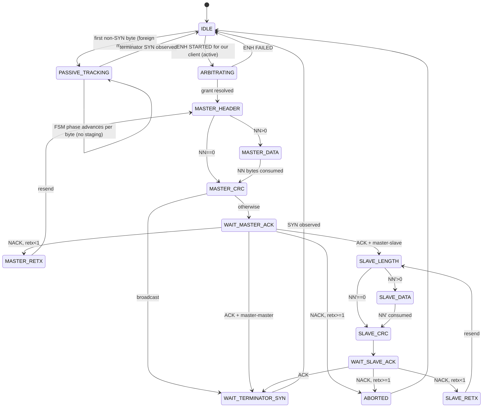

# Frame-Atomic Visibility v6 — Always-On FSM, Admin-Only Faults, Scoped Deletions

> Status: design sketch v6. Supersedes v1–v5. Branch: `frame-atomic-visibility` · Date: 2026-05-18

## 1. Convergent v5 findings v6 must resolve

Codex and Opus converged on five blockers/majors against v5:

  1. **ENH RESETTED on PROTOCOL_FAULT is synthetic** — Codex BLOCKER + Opus F-v5-2 MAJOR. Per ENH spec, RESETTED fires only on adapter reboot or INIT. Synthesizing it for wire-level faults violates I1.
  2. **Round-9 deletion regresses direct-adapter paths** — Codex BLOCKER + Opus F-v5-6 MAJOR. `bus.go` is consumed by ALL gateway modes, including no-proxy direct-adapter. Deleting unconditionally regresses T01/T02 transport-matrix configurations.
  3. **L_dn formula is round-trip, not one-way** — Codex MAJOR + Opus F-v5-4 MAJOR. Nomenclature wrong, downstream tuning confused.
  4. **IDLE AA pass-through not proven benign for ebusd** — Codex MAJOR + Opus F-v5-1 MAJOR. ebusd source `ps_recv` aborts on extra SYN; `SYN_TIMEOUT = 51ms` is a HARD ceiling. v5's "ebusd tolerates" claim is empirically false.
  5. **Timeout-to-IDLE leaves observers with unreconstructable post-timeout telegrams** — Codex BLOCKER. Proxy timeout abandons FSM context; late slave ACK arrives in IDLE state and falls through unfiltered; passive observer FSMs that already entered WAIT_MASTER_ACK can't reconcile.

Plus minor/medium tightening for pacer locking, escape-decoder recovery, gateway-side timeout coordination, EPIPE mechanism, and ARBITRATING filter.

## 2. v6 architectural shift — always-on FSM with three modes

v5's central scope reduction was "drop IDLE filter." That bought rid of the cadence-threshold problem but left a hole: when the wire is mid-telegram (either our client's or a foreign master's), the proxy MUST filter AA-injection or the cross-client visibility goal collapses.

v6 reformulates: **the proxy's FSM is always on**. It distinguishes three runtime modes:

  | Mode      | When                                                              | Staging-aware match | AA-injection filter |
  |-----------|-------------------------------------------------------------------|--------------------|---------------------|
  | `active`  | between ENH STARTED for our client and that telegram's terminator | yes (FIFO match)   | FSM phase + staging |
  | `passive` | foreign master telegram detected on wire (first non-SYN byte after IDLE without STARTED-for-us) | no (no prediction) | FSM phase only      |
  | `idle`    | between telegrams, wire genuinely idle                            | n/a                | none (pass through) |

`passive` mode is the v6 addition. It addresses both finding #4 (IDLE pass-through false-benign) and #5 (timeout-to-IDLE unreconstructable) in one move: the proxy ALWAYS tracks wire state, and when a foreign master starts a telegram, the proxy follows along via the same FSM, filtering AA-injection per phase even though it can't predict byte values.

`passive` mode classifier is the same as the slave-phase classifier in `active` mode:

  - In phase MASTER_HEADER, MASTER_DATA, MASTER_CRC, SLAVE_LENGTH, SLAVE_DATA, SLAVE_CRC: drop raw 0xAA (was_escaped=false), forward everything else, advance FSM counter.
  - In phase WAIT_MASTER_ACK, WAIT_SLAVE_ACK: forward 0x00 / 0xFF, drop raw 0xAA.
  - In phase WAIT_TERMINATOR_SYN: forward raw 0xAA (terminator), advance to IDLE.

Mode transitions:

```
idle
 │
 ├── ENH STARTED for our client → active
 │
 └── first non-SYN byte from adapter (no STARTED preceding) → passive
        │
        └── terminator SYN observed → idle

active
 │
 └── terminator SYN OR abort OR timeout → idle (or passive if foreign traffic immediately follows)
```

`idle` is now a genuinely-wire-idle state, occupied only between telegrams. Adapter-spurious AA in this state is forwarded (residual, but bounded — it's the gap between telegrams, ~tens of ms at most). Bursts of AA-injection during `active` or `passive` mode are filtered.

This resolves Opus F-v5-1 (ebusd intolerance in `ps_recv` corresponds to proxy `passive` mode now filtering correctly) and Codex BLOCKER on §8/§3 (post-timeout, proxy re-enters `passive` mode on the next non-SYN byte, tracks the telegram, forwards correctly).

## 3. The FSM (unchanged from v5 §3 + passive-mode transitions)



**`PASSIVE_TRACKING`** is a composite state internally running the full sub-FSM (MASTER_HEADER → ... → WAIT_TERMINATOR_SYN) but without staging-based echo matching. The same per-state timeout values apply. On any timeout in PASSIVE_TRACKING, return to IDLE — the foreign telegram is abandoned (matches what a passive observer would see if it had its own adapter).

Per-state timeouts pinned from eBUS V1.3.1 spec:
  - `MASTER_HEADER`, `MASTER_DATA`, `SLAVE_LENGTH`, `SLAVE_DATA`, `SLAVE_CRC`: inter-byte 10 ms (conservative; spec minimum 4.17 ms).
  - `WAIT_MASTER_ACK`, `WAIT_SLAVE_ACK`: 200 ms (per V1.3.1 master allowed-wait; v5's 12.5 ms was wrong).
  - `WAIT_TERMINATOR_SYN`: 100 ms.
  - `ARBITRATING`: 50 ms.

Gateway-side FSM (`helianthus-ebusgo/protocol/bus.go`) is pinned to the same values. v6 §17 makes this an explicit migration task to align gateway-side bus.go with these constants.

## 4. Classifier

Same as v5 §4 plus `PASSIVE_TRACKING` branch:

```
if fsm_state == IDLE:
    return FORWARD_TO_ALL  # genuinely idle, forward AA at adapter cadence

if fsm_state == ARBITRATING:
    # No bytes legitimate during ARBITRATING — adapter holds wire briefly.
    # Any byte during this window is adapter-spurious or bug.
    if ev.value == 0xAA and ev.was_escaped == false:
        return DROP_AA_INJECTION
    return PROTOCOL_FAULT   # non-AA in ARBITRATING is genuinely faulty

if fsm_state == PASSIVE_TRACKING:
    # Foreign master telegram in flight. Filter raw 0xAA per phase.
    # See `passive_phase_classifier`:
    phase = fsm.sub_phase()
    if phase in {MASTER_HEADER, MASTER_DATA, MASTER_CRC, SLAVE_LENGTH, SLAVE_DATA, SLAVE_CRC}:
        if ev.value == 0xAA and ev.was_escaped == false:
            return DROP_AA_INJECTION
        fsm.advance()
        return FORWARD_TO_ALL
    if phase in {WAIT_MASTER_ACK, WAIT_SLAVE_ACK}:
        if ev.value in {0x00, 0xFF}:
            fsm.advance_per_ack()
            return FORWARD_TO_ALL
        if ev.value == 0xAA and ev.was_escaped == false:
            return DROP_AA_INJECTION
        return PROTOCOL_FAULT
    if phase == WAIT_TERMINATOR_SYN:
        if ev.value == 0xAA and ev.was_escaped == false:
            fsm.advance_to_IDLE()
            return FORWARD_TO_ALL  # terminator is itself a SYN
        return PROTOCOL_FAULT

# active mode classifier per v5 §4 (staging-aware for master/ACK phases,
# value-agnostic with raw-0xAA filter for slave phases).
... [same as v5 §4 active branches] ...
```

This resolves v5 F-v5-9 (ARBITRATING forward unconditionally) too — ARBITRATING now filters raw 0xAA.

## 5. AA-aware escape decoder — recovery non-fabricating

v5's escape-decoder recovery path emitted `(0xA9, was_escaped=false)` on malformed escape (e.g., `0xA9` followed by non-`0x00`/`0x01`/`0xAA`). That fabricates a byte the wire likely never sent (the 0xA9 may have been pure AA-injection noise, in which case emitting it is data invention).

v6 replaces recovery: on malformed escape, **emit nothing**, log to admin channel, drop both bytes (the orphaned 0xA9 and the unexpected continuation). The classifier downstream sees the absence as a phase mismatch, classifies as PROTOCOL_FAULT, FSM aborts gracefully.

```
[ESCAPE_PENDING]
  on byte b:
    if b == 0x01: emit (0xAA, was_escaped=true); state := NORMAL
    elif b == 0x00: emit (0xA9, was_escaped=true); state := NORMAL
    elif b == 0xAA and absorbed_count < 8:
      absorbed_count += 1   # absorb AA-injection in escape pair
    else:
      # Malformed escape OR 8+ AA absorptions exhausted.
      admin.log("escape_decoder_recovery", details)
      state := NORMAL  # drop both 0xA9 and b; emit nothing
```

No data fabrication. Resolves Opus F-v5-7 inheriting from v4.

## 6. Pacer with last_actual_emit and last_scheduled_emit

```
PER-SESSION pacer state (under per-session mutex):
  last_scheduled_emit: monotonic time (init -infinity)
  last_actual_emit:    monotonic time (init -infinity)
  emit_queue:          FIFO of (byte, scheduled_emit_time)

enqueue(b):
  scheduled_emit = max(now(), last_actual_emit + τ_wire_byte,
                              last_scheduled_emit + τ_wire_byte)
  emit_queue.push((b, scheduled_emit))
  last_scheduled_emit = scheduled_emit
  if pacer_timer not armed:
    arm_timer_for(emit_queue.head.scheduled_emit)

on pacer_timer_fire:
  acquire per-session mutex
  (b, scheduled) = emit_queue.pop_oldest()
  write_to_session_socket(b)
  last_actual_emit = now()  # real wall-clock emission time
  if emit_queue not empty:
    arm_timer_for(emit_queue.head.scheduled_emit)
  release per-session mutex
```

The fix from v5: include `last_actual_emit` in the `scheduled_emit` computation. Under Go scheduler jitter, if a previous byte was emitted late, the next scheduled byte's gap is computed against the actual late emission, not against the original (earlier) scheduled time. The pacer's `≥ τ_wire_byte` invariant holds robustly.

Locking explicit: per-session mutex protects `emit_queue`, `last_scheduled_emit`, `last_actual_emit`. Pacer timer acquires it on fire. Enqueue acquires it on call. No nested locks.

Resolves Codex F-v5-3 (jitter violates cap) and Codex MINOR §6 (locking spec needed).

## 7. L_rtt — renamed and corrected

```
L_rtt_EMA  = round-trip latency from proxy.send-to-adapter through
             wire-byte transmission and back to proxy.receive.

Bootstrap: 100 ms (covers typical WiFi RTT 30-50 ms with 2× headroom).
α = 0.3.
Per-byte measurement: L_rtt_sample = T_recv - T_sent - τ_wire_byte
  (the wire-byte time is real wire transit; everything else is host-
   adapter link round-trip).

Echo deadlines:
  soft = L_rtt_EMA + 100 ms   (warn on admin)
  hard = 2 * L_rtt_EMA + 200 ms (drop staging, log ADAPTER_DEGRADED)

Initial values (L_rtt=100 ms):
  soft = 200 ms
  hard = 400 ms

Sustained 500 ms RTT degradation: EMA converges to 500 ms within ~5
per-byte updates (≈25 ms of bus activity). hard = 1200 ms.

When no echoes for >30 s (long IDLE): re-bootstrap to 100 ms on the
next active phase (avoids stale-EMA spurious timeouts).
```

Resolves both reviewers' L_dn nomenclature complaint and Opus F-v5-4 stale-EMA-during-idle hazard.

## 8. PROTOCOL_FAULT contract — admin-only, no synthetic ENH events

v5 §9 emitted ENH RESETTED toward the originator on PROTOCOL_FAULT. Per ENH spec (verified by Codex against `enhanced_proto.md` and Opus against the same source), RESETTED fires only on adapter reboot or INIT. Synthesizing it elsewhere is a protocol semantic violation.

v6:

```
on PROTOCOL_FAULT:
  proxy.admin_channel.emit("protocol_fault", {
    session_id, fsm_phase, offending_byte, fsm_state_before_fault })
  proxy.fsm.transition_to_IDLE()  # internal proxy state reset
  # NO ENH event injected into ANY session's byte stream
  # Originator's own protocol-level timeout (in bus.go) detects
  #   absence of expected response and aborts via its own FSM
  # Observer sessions' FSMs likewise detect via their own timeouts
```

This preserves I1 strictly. No synthetic ENH events. The fault is admin-observable and operator-debuggable, but invisible to the byte stream. Clients recover via their own deadline tracking — which they must implement anyway for transport robustness.

Resolves both reviewers' RESETTED-synthetic BLOCKER.

## 9. NACK-abort: admin-event + return to FSM IDLE; no socket-level abort

v5's "EPIPE on TCP write" was structurally wrong (TCP has no per-telegram abort, only connection-level). v6 simplification:

```
on FSM transitioning to ABORTED (NACK retx exhausted, or timeout, or
  protocol fault during active write):
  proxy.admin_channel.emit("session_telegram_aborted", { session_id,
    reason, telegram_phase })
  proxy.fsm.transition_to_IDLE()
  proxy continues to accept bytes from this session's TCP socket
    (these now go into a fresh staging buffer; if the session sends
     a new write, that's a new telegram, fresh FSM cycle)
```

No socket-level abort. No connection close. The originator's own FSM (in bus.go) detects telegram abort via its own deadline tracking and signals upward. The proxy is purely a byte mirror with FSM-driven AA filter; it doesn't escalate transport-level abuse.

If a session repeatedly sends malformed writes, admin channel accumulates `protocol_fault` events. Operator decides whether to terminate the misbehaving client (out-of-band action).

Resolves Opus F-v5-5 and Codex MAJOR §10.

## 10. Round-9 deletion scoped to proxy-mediated path

`helianthus-ebusgo/protocol/bus.go` round-9 absorb logic stays as-is for **direct-adapter mode** (no-proxy transport configurations T01, T02 per transport-matrix). The deletion in v6 §15 is **conditional on the active proxy classifier being in path**.

Mechanism: `bus.go` reads its echo stream from the transport layer (ENS/ENH). When the transport is in proxy-mediated mode, the bytes it reads have ALREADY been AA-filtered by the proxy classifier. Round-9's absorb predicate (`raw == 0xAA && echo == 0xAA && !echoWasEscaped`) never matches because such bytes never reach `bus.go` anymore. Round-9 becomes inert at runtime.

For direct-adapter mode, the same predicate continues to match against the raw adapter byte stream. Round-9 stays active. Operational behavior unchanged.

**v6 does NOT delete round-9 code.** It marks it as legacy-fallback (a comment block at the top), notes that the predicate is expected to be inert under proxy-mediated transports, and adds a Prometheus counter `helianthus_round9_absorb_fired_proxy_mediated_total` that should stay at zero in proxy-mediated deployments — a regression indicator if proxy filter has a hole.

Future work (out of v6 scope): rebuild direct-adapter mode to use FSM-aware echo matching at `bus.go` level (mirror of proxy-side classifier). Until then, round-9 stays as the direct-adapter safety net.

Resolves both reviewers' BLOCKER/MAJOR on round-9 deletion regression.

## 11. Layer boundaries — escape decoder still a new sub-component

Same as v5 §11. The escape decoder is a new file under `helianthus-ebus-adapter-proxy/internal/southbound/enh/escape_decoder.go`, sitting between the existing `codec.go` ENH-frame parser and the classifier. Existing consumers of `codec.go` are untouched.

## 12. Invariants

  - **I0** (clock): all scheduling on monotonic time.
  - **I1** (no synthetic events): every byte forwarded was derived from a real adapter event. Admin channel is explicitly EXCLUDED from "byte stream" scope of I1 — it is a separate diagnostic plane, not part of any client's transport.
  - **I2** (FSM-driven filter): the FSM mode (`active`/`passive`/`idle`) is the sole authority for AA-injection classification.
  - **I3** (pacer cap robust): outbound inter-byte gap ≥ τ_wire_byte = 4.17 ms, measured against `max(last_actual_emit, last_scheduled_emit)`, robust under Go scheduler jitter.
  - **I4** (escape decoder): absorbs up to 8 AAs mid-escape-pair; on malformed escape, emits nothing and logs to admin.
  - **I5** (FSM autonomy): each FSM instance is independent. Resync via wire-real events (RESETTED from actual adapter, observable terminator SYN, etc.). No out-of-band coordination.
  - **I6** (retx cap): FSM enforces 1 retx per phase per spec V1.3.1.
  - **I7** (gateway-side timeout alignment): `helianthus-ebusgo/protocol/bus.go` per-state timeouts pinned to same spec values as proxy FSM.
  - **I8** (round-9 backward-compatible): round-9 absorb logic in `bus.go` stays for direct-adapter; becomes inert under proxy-mediated transports. Counter `helianthus_round9_absorb_fired_proxy_mediated_total` monitors regression.

## 13. What v6 still does not solve (honest residual)

  - **Adapter-spurious AA during genuinely-idle wire.** This is the narrow case the IDLE-mode pass-through exposes: between telegrams, when truly nothing is happening on the wire, an adapter-spurious AA is forwarded as if it were a wire-real AUTO-SYN. The window is bounded — typically tens of ms between telegrams on a busy bus, longer on a quiet bus. ebusd's `ps_idle` parser is OK with this (it's just counting AAs as cadence markers; extras are extras). The bug only manifests during ACTIVE/PASSIVE/ARBITRATING phases, all of which are filtered.
  - **Foreign-master telegrams initiated WHILE adapter is mid-buffering our outbound.** Theoretically the wire could have arbitration between our STARTED-but-not-yet-on-wire bytes and a foreign master's win. ENH protocol prevents this in practice (STARTED is post-arbitration), but if it ever happened, proxy's `active` FSM would mismatch. Mitigation: ENH STARTED/FAILED arrives BEFORE any byte data on the wire, so the proxy always knows which session won.
  - **Adapter byte loss after physical transmission.** Same as v3, v4, v5: if adapter loses an echo on its reply path, proxy doesn't see it, other clients don't see it. Bounded by adapter reliability (≪0.1% byte loss observed).

These residuals are explicitly bounded and operator-observable.

## 14. Migration

  1. **Add passive FSM tracking** to proxy classifier. New mode `PASSIVE_TRACKING` activates on first non-SYN byte from adapter after IDLE without STARTED. Reuses existing `passive_transaction_reconstructor.go` phase tracking logic.
  2. **Add AA-aware escape decoder** as new sub-component in `southbound/enh/`.
  3. **Wire active-mode FSM** with staging buffer per active session.
  4. **Implement pacer** per §6 (with `last_actual_emit` and per-session mutex).
  5. **Implement L_rtt EMA** per §7.
  6. **Pin gateway-side timeouts** in `helianthus-ebusgo/protocol/bus.go` to match proxy values per §3.
  7. **Live-bus validation:**
     - AA-injection rate (`payloadAaAutoSyn*` counter) → 0 in proxy-mediated mode.
     - Cross-client telegram parsing coherent for both gateway-initiated AND foreign-initiated telegrams.
     - ebusd's `ps_recv` doesn't abort during foreign telegrams.
     - `helianthus_round9_absorb_fired_proxy_mediated_total` remains 0.
  8. **Mark round-9 as legacy-fallback** with the regression-detector counter. Do NOT delete.
  9. **NOT deleting** `postGrantPreEcho` (out of scope, used by direct-adapter).

Each step independently testable and rollback-able.

## 15. Mapping v5 findings → v6 resolutions

| v5 finding (Codex + Opus) | v6 resolution |
|---|---|
| Codex BLOCKER §8/§3 timeout-to-IDLE unreconstructable | §2 PASSIVE_TRACKING — proxy never abandons wire-state. |
| Codex BLOCKER §9 / Opus F-v5-2 ENH RESETTED synthetic | §8 admin-channel-only on PROTOCOL_FAULT; no synthetic ENH events. |
| Codex BLOCKER §12 / Opus F-v5-6 round-9 deletion regression | §10 round-9 STAYS, marked legacy-fallback, becomes inert under proxy. |
| Codex MAJOR §7 / Opus F-v5-4 L_dn formula nomenclature | §7 renamed L_rtt with correct round-trip semantics. |
| Codex MAJOR §10 / Opus F-v5-5 EPIPE on TCP | §9 no socket-level abort; admin event + FSM IDLE reset only. |
| Codex MAJOR §14 / Opus F-v5-1 IDLE pass-through unverified | §2 PASSIVE_TRACKING filters foreign telegrams; IDLE residual narrowed to genuine gaps. |
| Opus F-v5-3 pacer cap under jitter | §6 `last_actual_emit` and explicit locking. |
| Opus F-v5-7 escape recovery garbage | §5 admin-log + emit nothing on malformed escape. |
| Opus F-v5-8 gateway-side timeout coordination | §3 I7 + §14 step 6 — explicit alignment. |
| Opus F-v5-9 ARBITRATING forward unconditionally | §4 ARBITRATING filters raw 0xAA. |
| Opus F-v5-10 I1 admin-channel carve-out | §12 I1 explicit exclusion of admin channel. |
| Codex MINOR §6 locking | §6 explicit per-session mutex + scope. |

Every v5 blocker and major has an explicit v6 resolution. Mediums and minors likewise.
