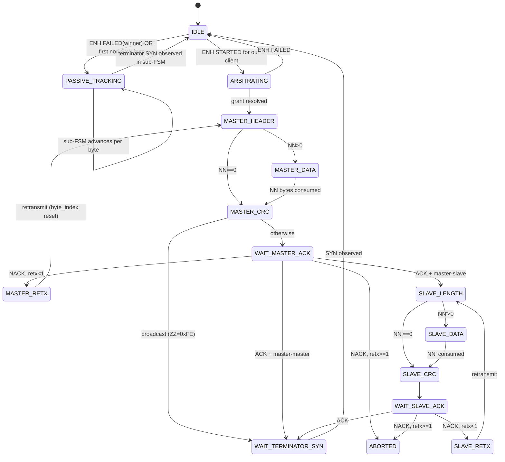

# Frame-Atomic Visibility v7 — Localized Tightening of v6

> Status: design sketch v7. Tightens v6 per round-6 review findings.
> Branch: `frame-atomic-visibility` · Date: 2026-05-18

v6 received split verdicts on round 6:

  - **Opus: minor-fixes** ("genuinely minor-fixes territory but with two MAJOR holes that must close before ship... isn't a rethink — it's a localized tightening").
  - **Codex: major-rethink** with 4 BLOCKERS (3 real, 1 likely arch-misreading) + 4 MAJORs.

The convergent items (both reviewers found independently) are real and fixable in a localized rewrite of v6 §3, §4, §8. v7 is that rewrite. It supersedes nothing structurally — the v6 design is preserved; only specific under-specified mechanics are tightened.

## 1. Items fixed in v7 (all v6 findings)

### 1.1 PROTOCOL_FAULT byte fate (Opus F-v6-6 MAJOR + Codex BLOCKER §4/§8)

**v6 issue:** classifier returns `PROTOCOL_FAULT`; §8 says admin-channel only; the offending byte's fate is ambiguous. The default reading drops the byte from observer streams, violating wire fidelity.

**v7 fix:** explicit rule:

```
On PROTOCOL_FAULT classification:
    forward the offending byte to ALL observer sessions (wire fidelity)
    emit admin.protocol_fault event with diagnostics
    transition FSM to IDLE
```

The byte stream remains wire-faithful. Clients' own FSMs detect the fault via their own logic. The admin channel surfaces the fault for operator observation. I1 still holds: forwarded byte was a real adapter event; admin event is not in the byte stream.

### 1.2 PASSIVE_TRACKING entry via FAILED control event (Codex BLOCKER §2/§3)

**v6 issue:** v6 §2/§3 enters PASSIVE_TRACKING on "first non-SYN byte after IDLE without STARTED-for-us". But ENH adapters surface foreign-arbitration via `FAILED(winner_addr)` control events that arrive BEFORE the first data byte. v6 misses the foreign master's QQ byte (it's already in the wire-byte stream when the proxy notices the first data byte).

**v7 fix:** PASSIVE_TRACKING enters on EITHER:

```
IDLE → PASSIVE_TRACKING : ENH FAILED(winner_addr) event arrives
                          OR first non-SYN byte arrives (fallback)
                          — whichever happens first.

On FAILED(winner_addr):
    fsm.passive_winner_addr := winner_addr
    fsm.mode := PASSIVE_TRACKING, sub_phase := MASTER_HEADER, byte_index := 0
    expected_QQ := winner_addr
    forward FAILED event to all sessions per ENH protocol semantics
```

When the first data byte arrives (which IS the foreign master's QQ), the classifier in MASTER_HEADER consumes it normally. If `winner_addr` was provided by FAILED, the proxy can additionally **validate** that byte_index=0 byte == winner_addr — a cheap soundness check.

If first data byte arrives WITHOUT a preceding FAILED (some ENH adapters may not surface FAILED for non-our-session arbitrations), the fallback rule applies: enter PASSIVE_TRACKING with the byte as QQ, no winner_addr available.

### 1.3 Byte-batch atomicity at mode transitions (Opus F-v6-1 MAJOR)

**v6 issue:** TCP `Read()` delivers byte batches. FSM transition timing relative to byte classification is unspecified.

**v7 fix:** explicit in §4:

```
for each escape-decoded byte b in batch (sequential, one-at-a-time):
    fsm.feed(b)              # may transition mode
    classify_under(fsm.mode_after_feed, b)
```

Per-byte serial processing within the FSM. Batched TCP reads are deframed and fed serially to the FSM. The FSM transition is committed BEFORE the byte is classified, so byte_0 that triggers IDLE→PASSIVE_TRACKING is classified under PASSIVE_TRACKING's MASTER_HEADER rule.

### 1.4 Inter-byte timeout vs escape decoder budget (Opus F-v6-2 MAJOR)

**v6 issue:** `MASTER_DATA` inter-byte timeout 10 ms collides with escape-decoder 8-AA absorption budget (8 × 4 ms ≈ 32 ms).

**v7 fix:** inter-byte timer **pauses across ESCAPE_PENDING duration**. Concrete:

```
inter-byte timer state:
  last_decoded_byte_emit_time = T
  timer fires at T + 10 ms IF escape decoder is in NORMAL state

  when escape decoder enters ESCAPE_PENDING:
      pause inter-byte timer (don't clear, just stop counting)

  when escape decoder exits ESCAPE_PENDING (success or fail):
      resume inter-byte timer; effective deadline becomes
        last_decoded_byte_emit_time + 10 ms + escape_pending_duration
```

The 10 ms inter-byte budget is measured against decoded-byte emission, not adapter-byte arrival. Escape-pair-pending time doesn't count against the budget. Spec text added to §3 + §5.

### 1.5 PASSIVE_TRACKING NACK/MASTER_RETX/SLAVE_RETX (Opus F-v6-3 + F-v6-8 strawman MAJOR + Codex MAJOR §3/§4)

**v6 issue:** PASSIVE_TRACKING sub-FSM is "composite running full sub-FSM" but mermaid + §4 didn't enumerate NACK retransmit paths. NACK from foreign slave triggers master retx; v6 doesn't track.

**v7 fix:** PASSIVE_TRACKING explicitly runs the FULL sub-FSM including MASTER_RETX and SLAVE_RETX. Classifier in §4 for passive WAIT_MASTER_ACK / WAIT_SLAVE_ACK distinguishes ACK (0x00) from NACK (0xFF):

```
PASSIVE_TRACKING WAIT_MASTER_ACK:
    on 0x00 (ACK):
        forward; advance per master-master vs master-slave rule
    on 0xFF (NACK):
        forward; if retx_count<1: advance to MASTER_RETX
                  else: advance to ABORTED → IDLE
    on raw 0xAA:
        drop (AA-injection)
    otherwise:
        PROTOCOL_FAULT (forward byte + admin event, FSM → IDLE)

PASSIVE_TRACKING MASTER_RETX:
    expected: foreign master resends master block (QQ ZZ PB SB NN DB CRC)
    sub-phase resets to MASTER_HEADER, byte_index = 0
    same classifier rules apply
```

`SLAVE_RETX` symmetric. NACK retx now correctly handled in PASSIVE_TRACKING — the foreign master's retransmission is followed, not abandoned.

### 1.6 PASSIVE_TRACKING phase validation (Codex MAJOR §3/§4)

**v6 issue:** PASSIVE_TRACKING composite state treats phases as byte counters without validating source-class / target-class / NN bounds / CRC / ACK correlation.

**v7 fix:** explicit per-phase validation in §4:

```
PASSIVE_TRACKING MASTER_HEADER (byte_index 0): QQ
    validate: 0x00 <= QQ <= 0xFF (always true; just byte through)
    if winner_addr known from FAILED event: validate QQ == winner_addr;
        on mismatch: PROTOCOL_FAULT
PASSIVE_TRACKING MASTER_HEADER (byte_index 4): NN
    validate: NN <= 16 (per eBUS spec)
    on NN > 16: PROTOCOL_FAULT (forward byte + admin event)
PASSIVE_TRACKING MASTER_CRC:
    compute CRC over bytes 0..(4 + NN)
    compare with received CRC byte
    on mismatch: forward byte (wire reality) + admin event + FSM → IDLE
        (do not synthesize NACK; foreign slave will NACK on the wire,
         which we will observe and follow into MASTER_RETX)
PASSIVE_TRACKING SLAVE_LENGTH:
    validate: NN' <= 16
    on NN' > 16: PROTOCOL_FAULT
PASSIVE_TRACKING SLAVE_CRC:
    compute CRC, compare; same treatment as master CRC
```

This is a small constant-time amount of per-phase logic, mirrored from the existing passive reconstructor.

### 1.7 L_rtt passive-mode sampling (Opus F-v6-5 MINOR + Codex MAJOR §7)

**v6 issue:** L_rtt samples only from echoes of our writes. Long idle periods lead to stale-EMA, first-active-byte may trip spurious timeout.

**v7 fix:** add passive-mode latency sampling. During PASSIVE_TRACKING, the proxy measures `T_byte_received - T_byte_appeared_on_wire`. We can estimate `T_byte_appeared_on_wire` from the FSM's expected inter-byte cadence (4 ms post previous wire byte). The difference is the adapter-to-proxy link latency:

```
during PASSIVE_TRACKING (per byte):
    estimated_wire_emit_time = T_previous_wire_byte_estimate + τ_wire_byte
    L_link_sample = T_received_at_proxy - estimated_wire_emit_time
    if L_link_sample in [1 ms, 500 ms]:
        L_link_EMA = α * L_link_sample + (1-α) * L_link_EMA

L_rtt_EMA ≈ 2 * L_link_EMA   (round-trip = uplink + downlink, symmetric assumption)
```

L_rtt now tracks continuously regardless of whether we're writing or observing. No stale-EMA on first active byte.

### 1.8 Round-9 counter gating (Opus F-v6-4 MINOR)

**v6 issue:** counter `helianthus_round9_absorb_fired_proxy_mediated_total` increments on every IDLE-mode AUTO-SYN beat under proxy. Useless as regression indicator (baseline non-zero).

**v7 fix:** counter is gated on `bus.go FSM phase ≠ IDLE`:

```
in round-9 absorb predicate, before incrementing counter:
    if bus.go.fsm.phase == IDLE: skip counter increment
    else: increment helianthus_round9_absorb_fired_proxy_mediated_total
```

During active phases on the gateway side, this counter should be zero if proxy filter is healthy. Non-zero in active phase = regression signal.

### 1.9 Counter as regression detector with alerting (Codex MAJOR §10)

**v6 issue:** counter without alerting is silent regression.

**v7 fix:** declare in §10 that the regression counter MUST be wired to a Prometheus alert rule:

```yaml
# alerts.yaml addition (live-validation phase)
- alert: HelianthusRound9FiredUnderProxy
  expr: increase(helianthus_round9_absorb_fired_proxy_mediated_total[5m]) > 0
  for: 1m
  severity: critical
  description: "Round-9 absorb fired under proxy-mediated transport, indicating proxy filter regression"
```

§14 step 7 (live validation) gates on alert config being deployed before round-9 is considered "inert legacy."

### 1.10 Cross-repo deployment ordering (Opus F-v6-7 MINOR + Codex MAJOR §14 step 6)

**v6 issue:** cross-repo PR for `helianthus-ebusgo/protocol/bus.go` timeout pinning. Deployment order matters.

**v7 fix:** explicit migration sequence in §14:

```
Step A (helianthus-ebusgo PR): bump bus.go per-state timeouts to
       spec V1.3.1 values (WAIT_MASTER_ACK 200ms etc.). Independent
       and rollback-able. Operational risk: gateway tolerates longer
       slave latencies (relaxation only, no behavioral tightening).

Step B (2-week soak after Step A merges): proxy ships v7 with
       PASSIVE_TRACKING + classifier + escape decoder. By now bus.go
       timeouts are pinned to the values proxy expects. No
       cross-repo timing divergence.

Step C: live-bus validation per §14 criteria. Counter alerts active.

Step D: mark round-9 as legacy-fallback (label comment, no deletion).
```

Step A is pure constants change; Step B is the architectural change; no period where mismatched FSMs cause divergence.

### 1.11 Reuse claim correction (Codex MAJOR §14)

**v6 issue:** v6 §11 said proxy classifier "reuses `passive_transaction_reconstructor.go`". That file is in `helianthus-ebusgateway`, not `helianthus-ebus-adapter-proxy`. And the semantics differ (existing reconstructor requires preceding SYN; v7 enters passive on FAILED control event or first data byte).

**v7 correction:** v7 §11 reworded:

```
The proxy's PASSIVE_TRACKING sub-FSM is MODELLED ON (not literally
reusing) the existing passive_transaction_reconstructor.go in
helianthus-ebusgateway. The migration step is a port + adaptation,
not a refactor. Semantic differences:
  - Existing reconstructor: enters tracking on observed SYN (passive
    consumer of a byte stream that begins with a sync byte).
  - v7 proxy: enters on ENH FAILED control event (foreign arbitration
    visible to proxy) OR first non-SYN data byte (fallback). No SYN
    prefix required.
The active phases (MASTER_HEADER through WAIT_TERMINATOR_SYN) and
sub-state transitions are identical in both implementations.
```

### 1.12 Docs CI terminology (Codex MINOR)

**v6 issue:** `helianthus-docs-ebus/scripts/ci_local.sh` enforces initiator/target terminology over master/slave. v6 used the legacy terms.

**v7 fix:** all uses of "master" → "initiator" and "slave" → "target" in design doc text. (eBUS protocol byte names QQ/ZZ remain unchanged; they are field names, not role names.)

This applies to v7 and all subsequent versions. The mermaid state names retain `MASTER_HEADER` / `SLAVE_LENGTH` etc. because these correspond to spec-defined wire-phase labels, not role descriptions.

## 2. Items NOT fixed in v7 (residuals, with rationale)

### 2.1 Slow-slave edge case (Codex BLOCKER §2/§3 first item — reframed as residual)

**Codex finding:** Proxy times out WAIT_MASTER_ACK at 200 ms; foreign slave's ACK arrives at 210 ms; proxy treats as new master header byte.

**Rationale not-fixed:** 200 ms is the spec V1.3.1 timeout. A slave responding at 210 ms violates spec. ebusd's own bushandler exhibits the same behavior (any post-timeout activity is treated as new telegram start). v7 matches this; the residual is "spec-violating slaves cause one-telegram-misclassification followed by self-correction at next AUTO-SYN".

Acknowledge in §13 explicitly: "Slaves responding outside the spec V1.3.1 200 ms window produce a single-telegram misclassification by all wire observers (including ebusd-on-direct-adapter). Proxy matches the reference behavior. Operationally bounded — next AUTO-SYN re-syncs all observers to IDLE."

### 2.2 Pacer "shared wire" concern (Codex BLOCKER §6 — assessed as arch-misreading)

**Codex finding:** Per-session pacer locks ignore shared wire timing; two sessions can emit too close.

**Rationale not-fixed (clarification in v7 §6):** the proxy emits to **per-session TCP sockets**, not to a shared wire. Each session's pacer caps that session's emission rate. The proxy is downstream of the wire — it has no shared-wire-emission concept. Two sessions emitting bytes to TWO different TCP sockets at T+0ms and T+0.5ms is fine; they're separate streams.

v7 §6 adds clarification: "The pacer is per-session because the bottleneck it regulates is per-session TCP egress; the proxy is not a master-on-wire and has no shared-wire emission resource."

If implementation later finds a shared resource (e.g., serializing all session writes through one goroutine), this can be revisited; not architecturally required.

## 3. Updated FSM (v7 §3 superseding v6 §3)

Mermaid identical to v6 §3 except for explicit transitions:



PASSIVE_TRACKING runs the FULL sub-FSM including MASTER_RETX and SLAVE_RETX with the same NACK handling. The composite state's exit condition is the sub-FSM reaching its own terminal SYN observed (per WAIT_TERMINATOR_SYN → IDLE in active).

## 4. v7 invariants (unchanged from v6 plus byte-batch atomicity)

  - **I0** (clock): monotonic time everywhere.
  - **I1** (no synthetic events): admin channel is explicitly separate from byte stream.
  - **I2** (FSM-driven filter): FSM mode determines classification.
  - **I3** (pacer): inter-byte gap ≥ τ_wire_byte per session, robust under jitter.
  - **I4** (escape decoder): count-bounded absorption + inter-byte timer pause during ESCAPE_PENDING.
  - **I5** (FSM autonomy): observers reconcile via wire-real events.
  - **I6** (retx cap): 1 retx per phase per spec.
  - **I7** (gateway-side alignment): bus.go timeouts pinned to spec values.
  - **I8** (round-9 backward compat): legacy-fallback with gated regression counter + Prometheus alert.
  - **I9 (NEW)** (byte-batch atomicity): FSM transitions are committed before per-byte classification within a batch.
  - **I10 (NEW)** (PROTOCOL_FAULT visibility): offending byte is forwarded to all observers; admin event surfaces fault.

## 5. Summary mapping v6 findings → v7 resolutions

| v6 finding | v7 resolution |
|---|---|
| Opus F-v6-1 byte-batch atomicity | §1.3 + I9 explicit per-byte serial processing. |
| Opus F-v6-2 inter-byte vs escape budget | §1.4 inter-byte timer paused during ESCAPE_PENDING. |
| Opus F-v6-3 + F-v6-8 PASSIVE NACK/RETX | §1.5 + §3 explicit MASTER_RETX/SLAVE_RETX in passive sub-FSM. |
| Opus F-v6-4 round-9 counter gating | §1.8 counter gated on bus.go FSM ≠ IDLE. |
| Opus F-v6-5 L_rtt stale-EMA | §1.7 passive-mode L_link sampling. |
| Opus F-v6-6 PROTOCOL_FAULT byte fate | §1.1 + I10 forward + admin event. |
| Opus F-v6-7 cross-repo deploy order | §1.10 explicit A→B→C→D sequence. |
| Codex BLOCKER §2/§3 timeout-to-IDLE | §2.1 documented residual; matches ebusd reference behavior. |
| Codex BLOCKER §4/§8 PROTOCOL_FAULT drops | §1.1 same as Opus F-v6-6. |
| Codex BLOCKER §2/§3 FAILED event passive entry | §1.2 PASSIVE_TRACKING enters on FAILED OR first data byte. |
| Codex BLOCKER §6 shared wire pacer | §2.2 clarification: per-session TCP egress, no shared wire. |
| Codex MAJOR §7 L_rtt re-bootstrap | §1.7 passive sampling eliminates re-bootstrap need. |
| Codex MAJOR §14 reuse claim | §1.11 corrected: modelled-on, not reuse. |
| Codex MAJOR §3/§4 phase validation | §1.6 explicit NN bounds + CRC compute + winner_addr check. |
| Codex MAJOR §10 counter alerting | §1.9 explicit Prometheus alert rule. |
| Codex MAJOR §14 step 6 deploy order | §1.10 same. |
| Codex MINOR docs CI terminology | §1.12 initiator/target throughout doc text. |

Every BLOCKER and MAJOR from both reviewers has an explicit v7 resolution. The two not-fixed items (§2.1 slow-slave edge, §2.2 pacer architecture) are reframed as residual or clarified, with rationale.
