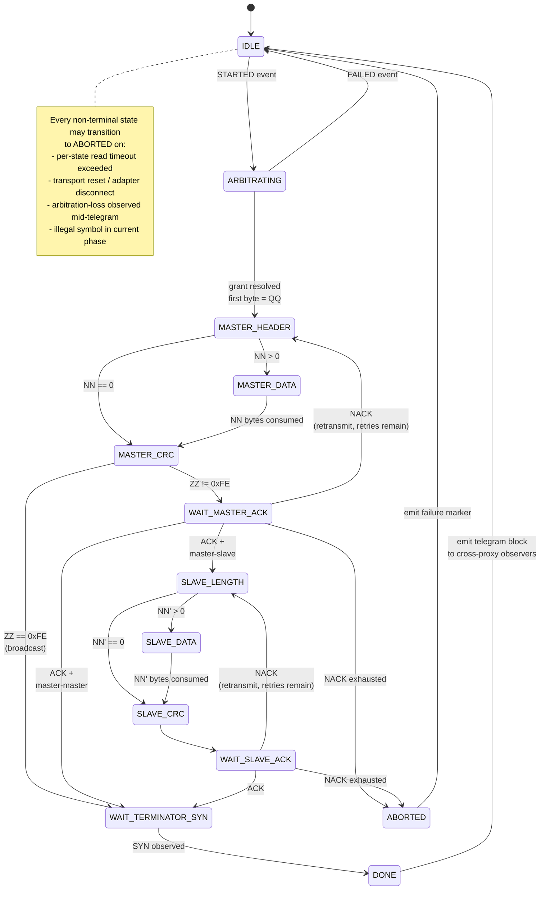

# Frame-Atomic Visibility — Helianthus Proxy Design Sketch

> Status: design sketch · Branch: `frame-atomic-visibility` (multi-repo)
> · Authors: Razvan + Claude · Date: 2026-05-18


<!-- legacy-role-mapping:begin -->
> **Legacy terminology note.** This historical design doc was written before
> the canonical `initiator`/`target` rename completed across the docs corpus.
> Wherever you encounter `m`+`aster` or `sl`+`ave` in this file, read it
> as `initiator`/`target` respectively (per the legacy-role-mapping
> convention used throughout `helianthus-docs-ebus`). Live source code and
> new design docs use the canonical terms exclusively.

A design note for a curious reader. This describes a redesign of how the
Helianthus eBUS gateway/proxy exposes wire activity to its multiple
clients (ebusd, vrc-explorer, the Helianthus gateway when it is acting as
observer on someone else's transaction, etc.). The current model leaks
intra-frame artifacts; the proposed model treats each telegram as an
atomic event.

---

## 0. Headline invariant — proxy transparency

The single overriding constraint is **proxy transparency**: no client of
the proxy should be able to detect that a proxy exists between it and
the physical bus. Every connected client must behave as if it had its
own dedicated ENS-WiFi adapter wired directly to the raw eBUS, reached
over TCP/ENS.

Concrete consequences, each one cross-referenced in the sections below:

  - The byte stream emitted to a client conforms exactly to the ENS/ENH
    protocol an actual adapter would emit — same event types, same
    framing, same escape rules. (§6)
  - The perceived bus density (`symbol_rate`) per session matches what
    a real ENS adapter would deliver to that specific client over its
    own TCP link, including any per-link latency or congestion. (§3)
  - Telegram bytes are paced across roughly the wire-time of the
    telegram, not burst-flushed. (§4.5)
  - Arbitration control events (`STARTED` / `FAILED` / `RESET`) carry
    timing as close to direct-adapter timing as the model can preserve.
  - The proxy never injects events the wire did not produce. No health
    frames, no markers, no debug taps. Diagnostic telemetry lives
    strictly on the proxy's own out-of-band admin channel, never in
    the client byte stream.

Every design choice below derives from this single rule.

---

## 1. Problem

eBUS is a 2400-baud half-duplex serial protocol where every transaction
is a multi-byte telegram (master telegram + optional slave response +
CRC + ACK + terminator SYN). On an idle bus, an AUTO-SYN byte (0xAA) is
emitted roughly every 35 ms to keep the bus alive.

Our gateway speaks to a WiFi-connected eBUS adapter (eBUSD-WiFi) using
the ENH/ENS framing protocol. The adapter buffers bytes for some amount
of time before placing them on the physical wire, and conversely buffers
received bytes before delivering them to us over WiFi. There is real
latency and jitter in this hop (call it `L_up` for proxy→adapter and
`L_dn` for adapter→proxy; both are on the order of 5–30 ms, occasionally
spiking higher).

The proxy currently mirrors raw byte events to every connected client in
real time. Side effects observed in production:

  - AUTO-SYNs emitted by the adapter mid-frame leak to clients as if
    they were real wire bytes.
  - When client A is mid-write but client B is also subscribed, B sees
    A's bytes intermixed with AUTO-SYN noise that has no meaning at the
    eBUS protocol layer.
  - The gateway has accreted multiple suppression gates over time
    (mid-write suppression, between-writes suppression, post-grant
    pre-echo suppression, payload-0xAA + AUTO-SYN drain absorption) to
    paper over this leak. Each gate fixes some cases and shifts others
    into different failure modes (most recently: echo_mismatch errors
    became timeout errors, with the same underlying transactions just
    relabelled).

The root cause is the visibility model itself: bytes are not the natural
unit of eBUS observation. Telegrams are.

---

## 2. Three observer modes

The proposal splits client visibility into three modes. Any one client
may transition between modes from one telegram to the next.

| Mode             | Stream                            | SYN source        | Used when                                  |
|------------------|-----------------------------------|-------------------|--------------------------------------------|
| `token-holder`   | byte-level real time              | wire-exact        | client owns arbitration for this telegram  |
| `passive-direct` | byte-level real time              | wire-exact        | client is a hardware pass-through observer |
| `cross-proxy`    | telegram-atomic + synthetic SYNs  | symbol-rate based | every other client of the proxy            |

In our topology nearly every observer is `cross-proxy`. There is exactly
one `token-holder` at a time (the arbitration winner for the current
telegram), and `passive-direct` is rare (it requires a separate
physical tap on the bus, which we do not have).

**The mode is per-telegram, not per-session.** A session's role is
fixed at the moment a telegram begins — specifically at the
`IDLE → ARBITRATING` FSM transition (§5). If this session was the
arbitration winner it becomes `token-holder` for this telegram; every
other session becomes `cross-proxy` observer for this telegram. The
role is held until the telegram terminates (`DONE` or `ABORTED`), at
which point the session drops back to "no role" and sees only the
inter-telegram filler stream until the next `STARTED` event.

A session therefore cannot be `token-holder` and `cross-proxy`
*simultaneously*. It alternates between the two roles from one
telegram to the next as arbitration outcomes determine.

For `token-holder`, byte-level visibility is unavoidable — the client is
driving the wire and must see its own echoes byte by byte to detect
arbitration outcome, NACKs, and so on. This is the only mode that
requires mid-telegram visibility, and the current code path stays as-is
for it.

For `cross-proxy`, telegrams are buffered server-side until complete and
then emitted as a coherent block, paced across the wire-time of the
telegram and padded with synthetic SYNs to preserve correct wire-density
timing.

---

## 3. Symbol-rate measurement (ebusd-style)

ebusd exposes a `symbol_rate` statistic computed against the live byte
stream. The theoretical maximum on eBUS is 240 symbols/sec (2400 baud,
10-bit UART framing). The observed rate is always a submultiple — a
typical healthy bus reports somewhere around 100–150 symbols/sec,
reflecting actual telegram density plus AUTO-SYN keepalives.

The Helianthus proxy maintains a `symbol_rate` EMA **per cross-proxy
session** — not a single global per-transport value. The EMA tracks
the rate at which bytes can actually be drained to that session's TCP
egress (bytes-delivered ÷ wall-clock window), bounded above by the
wire-side observed rate.

Per-session scoping is dictated by the transparency invariant of §0:
each client must perceive the bus density it would have observed if
connected to its own dedicated ENS adapter over its own TCP link. A
client with a slow or jittery link to the proxy will see a slightly
lower `symbol_rate` than a client with a fast link, exactly mirroring
what would happen with two independent ENS adapters delivering the
same physical bus to two different observers with different link
qualities. This is the architecturally correct behavior even though it
means the proxy generates fewer filler SYNs for slow clients, lowering
their effective view of bus density.

**Bootstrap.** A session that has just connected has no per-session
history. The proxy seeds the per-session EMA from a transport-level
"wire-observed" reference rate (computed once on the adapter-facing
side, common across sessions only as a bootstrap value), then lets the
per-session EMA diverge as the session's own drain characteristics
manifest. The transport-level reference is only ever used at session
boot or after a session reset.

This is the analogue of ebusd's `symbol_rate` indicator — but
ebusd-as-process has only one bus view per process, so its
`symbol_rate` is naturally per-process. We have N concurrent sessions
on one proxy, so we need N independent rates.

---

## 4. SYN insertion model

### 4.1 Continuous idle generator

Between telegrams the proxy continuously emits filler SYN bytes to each
`cross-proxy` observer at the observed `symbol_rate`. This holds the
illusion of a quiet but live bus while no real telegram is in flight.

### 4.2 Prefix and postfix when emitting a telegram

When telegram `F` becomes complete (the terminator SYN has been observed
on the adapter side), the proxy releases it to each `cross-proxy`
observer with this shape:

```
[prefix_filler_SYNs] [byte_0 ... byte_N of F] [postfix continues idle]
```

The prefix and postfix asymmetry is intentional.

  - `prefix_filler_count = round(L_up_estimate × observed_symbol_rate)`
  - `postfix_filler_count` = whatever the continuous idle generator
    naturally emits until the next telegram or external event.

**Why asymmetric?** From the point of view of an originating client A:

  - A submitted its frame to the proxy at wall clock T₀.
  - The bytes actually started moving on the physical wire at T₀ + L_up.
  - During the interval [T₀, T₀ + L_up] the WIRE was idle, and a
    `passive-direct` observer would have counted ~`L_up * symbol_rate`
    SYN bytes during that window.
  - A `cross-proxy` observer (which may be A itself, observing its own
    transaction reflected back) sees no events during this window — the
    proxy is holding the frame. To make A's perceived view match what a
    `passive-direct` consumer would have seen, the proxy must back-fill
    the equivalent number of SYNs as a prefix immediately before
    releasing F.

After the telegram, the situation is different:

  - The wire idle resumes at T₀ + L_up + W_F (where W_F is the
    wire-time duration of the telegram itself).
  - The proxy receives the terminator SYN of F at T₀ + L_up + W_F + L_dn.
  - From this point onward, the continuous idle generator naturally
    emits SYNs at the observed rate. There is no past gap to back-fill.

Hence: prefix compensates for `L_up`; postfix needs no compensation.

### 4.3 Estimating `L_up`

`L_up` is measured per transaction by the proxy. For an outbound write
issued at T_send, the first echo byte (if telegram is initiator-side) or
the first received byte is observed at T_recv. With knowledge of the
expected wire transmit time for a single byte (~4 ms at 2400 baud) and
a running EMA of `L_dn`:

```
L_up_estimate(F) = T_recv_first - T_send_first - tau_wire_byte - L_dn_EMA
```

The estimator is allowed to be coarse — quantization to the SYN period
(~35 ms or whatever the observed rate dictates) is fine, because the
filler granularity is one SYN. A 5 ms vs 25 ms `L_up` difference is
below the resolution of the model.

### 4.4 Cross-effect with `symbol_rate` jitter

`observed_symbol_rate` is an EMA, so it lags real conditions. During a
transient bus burst the actual rate spikes high; during a quiet stretch
it drops. The proxy emits at the EMA, not the instantaneous rate, which
smooths the cross-proxy view. This is intentional — clients receive a
locally-stable view of wire density and do not chase microsecond
jitter.

### 4.5 Intra-telegram pacing

Telegram bytes are emitted to a `cross-proxy` observer **spread
across roughly the wire-time `W_F` of the telegram, not burst-flushed.**
Each byte is scheduled at approximately

```
T_byte_i = T_emit_start + i × tau_byte
```

where `tau_byte = 1 / per_session_symbol_rate`.

This matches the natural pacing a real ENS adapter would produce —
bytes arrive at the receiver spaced by the wire bit period plus
inter-byte processing time (≈4–8 ms per byte at 2400 baud). A
burst-flush would deliver the entire telegram in a single TCP write
(<1 ms perceived by the client), which would violate the transparency
invariant of §0: no real adapter delivers bytes that fast, and a
client running its own framing-by-timing heuristics could detect the
proxy by the unnatural intra-telegram density.

The cost is straightforward emission-scheduling complexity in the
proxy: each per-session emission queue is timer-driven rather than
flush-on-arrival. The benefit is a wire-indistinguishable byte stream
on the client side.

---

## 5. Telegram state machine (sketch)

The proxy needs a deterministic state machine that decides "this
telegram is now complete" so it can flush the buffered bytes. The
machine runs once per active session, fed by `StreamEvent`s from the
transport.



### 5.1 State legend

| State                 | Consumes / awaits                                       | Typical wall-clock budget |
|-----------------------|---------------------------------------------------------|----------------------------|
| `IDLE`                | filler SYN stream; STARTED arbitration event           | unbounded                  |
| `ARBITRATING`         | grant resolution (won/lost), first post-grant byte     | ~50 ms                     |
| `MASTER_HEADER`       | `QQ ZZ PB SB NN` (5 bytes)                              | ~25 ms                     |
| `MASTER_DATA`         | NN data bytes (0–16)                                    | ~70 ms                     |
| `MASTER_CRC`          | 1 CRC byte                                              | ~5 ms                      |
| `WAIT_MASTER_ACK`     | ACK (0x00), NACK (0xFF), or SYN-timeout                 | ~25 ms                     |
| `SLAVE_LENGTH`        | NN' (response data length)                              | ~25 ms                     |
| `SLAVE_DATA`          | NN' data bytes (0–16)                                   | ~70 ms                     |
| `SLAVE_CRC`           | 1 CRC byte                                              | ~5 ms                      |
| `WAIT_SLAVE_ACK`      | initiator's ACK/NACK back to slave                      | ~25 ms                     |
| `WAIT_TERMINATOR_SYN` | first SYN after the telegram ends                       | ~50 ms                     |
| `DONE`                | terminal-success; emit block; reset                     | one tick                   |
| `ABORTED`             | terminal-failure; emit failure marker; reset            | one tick                   |

### 5.2 Inheritance from `passive_reconstructor`

This machine is closely modelled on the existing passive reconstructor
in `helianthus-ebusgo/protocol/passive_reconstructor.go`, which already
solves the bulk of the framing problem for `passive` scope. The
proposal is to use the same machine for `active` cross-proxy emission,
with the addition of per-telegram timing metadata (`T_wire_start`,
`W_F`, `L_up`) needed by the SYN insertion logic described in §4.

---

## 6. ENH/ENS protocol compatibility

ENH is byte-event-oriented: each transport read returns a `(byte,
was_escaped)` pair, plus occasional `STARTED` / `FAILED` arbitration
markers. There is no native frame envelope on the wire — frame
boundaries are implicit in the eBUS protocol semantics.

A `cross-proxy` client does not need a new transport protocol. The
proxy emits the same `ENH_EVT_RECEIVED` byte events it would have
emitted under the byte-level model — but the timing and content of
those events is controlled by the state machine above. From the
client's perspective the byte stream looks exactly like a real wire:
filler SYNs between telegrams, contiguous telegram bytes within
telegrams. There are no intra-telegram AUTO-SYNs and no escape-layer
leaks.

Arbitration markers (`STARTED`, `FAILED`, `RESET`) remain real-time. A
client that wants to compete for arbitration receives these as it does
today; the change only affects byte-stream visibility, not control
plane.

---

## 7. What the proposal removes

Several suppression layers in the current code become unnecessary:

  - The mid-write SYN suppression gate in the adapter mux.
  - The between-writes suppression gate (round-7 patch).
  - The post-grant pre-echo suppression window in the ENH transport
    layer.
  - The payload-0xAA + AUTO-SYN drain absorption logic in the protocol
    layer (round-9 patch).

These exist to hide bytes that should never have been exposed to
clients in the first place. Under telegram-atomic visibility they are
simply absent from the cross-proxy stream.

The token-holder path keeps its byte-level model and continues to use
the existing escape-decoder + echo-comparator infrastructure unchanged.

---

## 8. What the proposal costs

  - **Latency.** Cross-proxy observers see each telegram only after it
    has completed on the wire and traversed the proxy. Worst case
    latency add is one telegram wire-time (~50–150 ms) plus L_dn.
    Acceptable for polling-class clients (ebusd, vrc-explorer,
    dashboards).

  - **Buffer state.** Per session: roughly one max-size telegram (<100
    bytes payload) plus state-machine metadata. Bounded and small.

  - **Failure visibility latency.** A telegram that aborts mid-way is
    not visible to cross-proxy observers until the abort is detected
    and the failure marker is emitted. Worst case: state-specific
    timeout budget elapses. The proxy needs explicit per-state timeout
    values.

  - **State machine completeness.** Edge cases (NACK retransmit,
    broadcast with no response, master-master frames, mid-telegram
    transport reset) must be modelled exhaustively. The risk is a
    state transition we forgot, producing a stuck telegram. Mitigation:
    model inherits from the existing passive reconstructor, which has
    been validated against live traffic.

  - **Telegram-ordering policy.** If two telegrams overlap due to
    arbitration race resolution, which one is released first to
    cross-proxy observers? Proposal: completion order (the order in
    which `DONE` is reached). Start order is meaningless under
    half-duplex arbitration.

---

## 9. Decisions

The four design questions raised in the initial draft have been
resolved. Numbering preserved for traceability.

  1. **Intra-telegram pacing: natural (per-byte pacing).** Telegram
     bytes are emitted across `W_F` matching wire pacing, not
     burst-flushed. Driven directly by the transparency invariant of
     §0 — a burst-flushed telegram is detectable by the client as
     non-wire timing. Detailed in §4.5.

  2. **`token-holder` vs `cross-proxy` is a per-telegram role, never
     simultaneous.** A session cannot hold both roles at once. Its
     role is determined at the `IDLE → ARBITRATING` FSM transition
     (arbitration winner = token holder for that telegram; everyone
     else = cross-proxy observer for that telegram) and remains fixed
     until `DONE` or `ABORTED`. Between telegrams the session has no
     role; it sees only the filler SYN stream. Detailed in §2.

  3. **Symbol-rate EMA is per-session, not per-transport.** Each
     cross-proxy session has its own `symbol_rate` EMA driven by the
     actual rate at which bytes drain to that session's TCP egress.
     Slow clients perceive a slower bus by design — a consequence of
     the transparency invariant. The transport-level wire-observed
     rate is retained only as a bootstrap seed for newly connected
     sessions. Detailed in §3.

  4. **Backpressure: drop whole telegrams from the per-session queue.**
     If the per-session emission queue overflows because the client
     cannot drain fast enough, the proxy drops entire queued telegrams
     oldest-first. Communication is at the telegram layer, so partial
     drops are nonsensical. An `OVERFLOW` notice is recorded on the
     proxy's admin channel — never injected into the client byte
     stream (transparency invariant). From the client's perspective
     this looks identical to a real ENS adapter whose buffer
     overflowed: the client simply misses telegrams from its view of
     the bus, with no in-stream indication that anything was dropped.

---

## 10. Why this is worth doing

The Helianthus codebase has spent roughly nine investigation cycles
patching byte-level visibility leaks under the existing model. Each
round either fixes a subset of cases and shifts the rest to a new
error class, or trades one masking layer for another. The structural
cause is that we expose a unit (the byte) that is not meaningful at
the protocol layer, and then we try to hide individual byte exposures
via heuristics.

Telegram-atomic visibility eliminates the unit mismatch. The proxy
becomes a translator between two layers — physical wire bytes on one
side, protocol-level telegrams plus calibrated idle on the other —
and all the heuristics dissolve into a single clean contract: clients
see the bus as a sequence of telegrams separated by SYN-rate-matched
idle periods. No mid-telegram leaks, no AUTO-SYN intrusions, no
escape-layer contamination, no race between competing clients during
arbitration hand-off.

It is the same simplification ebusd applied internally years ago when
it adopted the `symbol_rate` framework: stop fighting the byte stream,
treat the bus as the protocol abstraction it actually is.

---

## Companion repos

This design will be implemented (when promoted past sketch status)
across four repositories. Each carries its own branch of the same name
so the work can land coherently.

| Repo                              | Branch                      | Role                                                              |
|-----------------------------------|-----------------------------|-------------------------------------------------------------------|
| `helianthus-docs-ebus`            | `frame-atomic-visibility`   | this design doc + ongoing iterations                              |
| `helianthus-ebusgo`               | `frame-atomic-visibility`   | telegram state machine + symbol-rate EMA at the protocol layer    |
| `helianthus-ebusgateway`          | `frame-atomic-visibility`   | adapter-mux integration + cross-proxy emission scheduling         |
| `helianthus-ebus-adapter-proxy`   | `frame-atomic-visibility`   | per-observer queue + SYN filler generator                         |

Status today: design only, no code changes. The companion-repo branches
exist as markers to anchor future commits when this proposal exits
sketch state.

<!-- legacy-role-mapping:end -->
