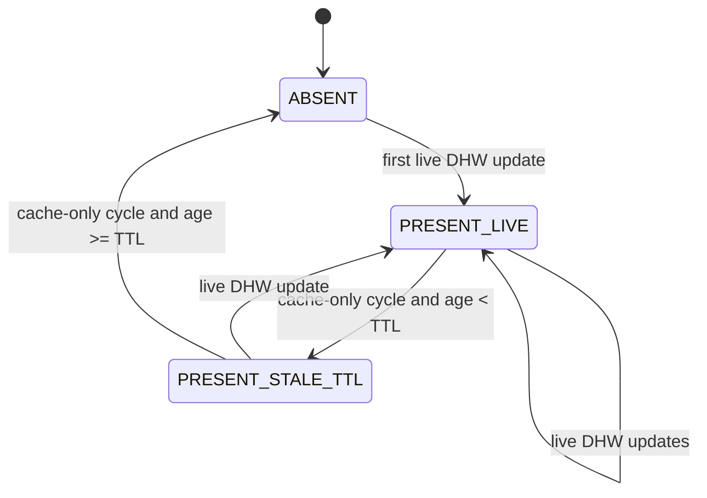

# DHW Freshness Lifecycle (Durability + TTL Expiry)

This document defines how `helianthus-ebusgateway` handles DHW semantic durability under transient failures.

Goal: keep valid last-known DHW values during short cache/transient gaps, but avoid indefinite stale-as-healthy publication.

## Inputs

- Live DHW refresh: B524 reads and/or `ebusd-tcp` fallback hydration.
- Cache-sourced cycle: no live DHW refresh succeeded in the cycle.
- Runtime setting: `-semantic-dhw-stale-ttl` (default `15m`).

## Lifecycle Semantics

At runtime, DHW publication follows this contract:

1. **Live refresh success**
   - Merge/update DHW fields.
   - Mark DHW as live in provider.
   - Update DHW last-update timestamp.

2. **Cache-sourced cycle with existing DHW and age < TTL**
   - Keep previously published DHW unchanged.
   - Do not clear DHW only because current cycle was cache-sourced.

3. **Cache-sourced cycle with age >= TTL**
   - Expire DHW from semantic runtime state.
   - Publish DHW removal (`null`) instead of preserving indefinite stale value.

This prevents permanent stale-but-present DHW output.

## Effective State Model

## Publication Contract

- `PRESENT_LIVE`: GraphQL `dhw` object is present with live-backed data.
- `PRESENT_STALE_TTL`: GraphQL `dhw` remains present with last-known values (durability window).
- `ABSENT`: GraphQL `dhw` is `null`.

Notes:

- TTL expiry is evaluated on cache-sourced publication paths.
- Zone presence FSM is independent; DHW lifecycle is separate from zone anti-flap logic.

## Related

- Startup FSM and source classification: [`startup-semantic-fsm.md`](./startup-semantic-fsm.md)
- GraphQL runtime contract: [`../api/graphql.md`](../api/graphql.md#semantic-startup-runtime-contract)
