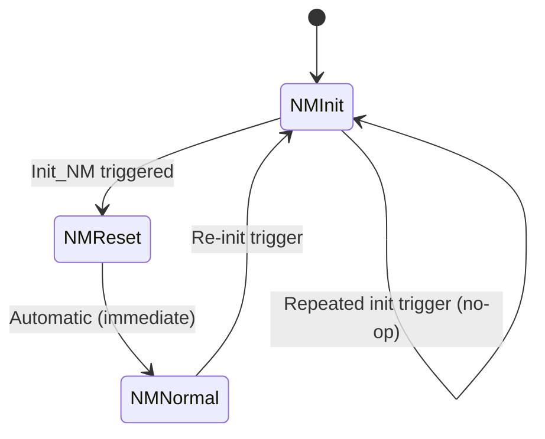

# eBUS Network Management Model

Status: Normative
Plan reference: ebus-good-citizen-network-management.locked (M0/ISSUE-DOC-00)

## Purpose

This document freezes the normative interpretation of the eBUS Network
Management (NM) specification as implemented by the Helianthus gateway.
It defines the runtime model, state machine, wire behaviour lanes, and
OSI Layer 7 service classification that must be satisfied before any NM
runtime code lands in `helianthus-ebusgateway`.

All implementation work references this document as the source of truth
for NM semantics, ownership boundaries, and phasing constraints.

## Why Helianthus Implements Optional NM

eBUS NM participation is optional. Helianthus chooses to implement it
because it delivers concrete benefits:

- **Topology visibility.** Cycle-time monitoring surfaces which nodes
  are present, absent, or failing without dedicated probe traffic.
- **Failure signaling.** `FF 02` NMFailure broadcasts provide an
  explicit, standards-aligned signal when a monitored node disappears.
- **Standards alignment.** Implementing the NM state machine positions
  Helianthus as a well-behaved eBUS participant rather than a passive
  observer.
- **MCP/RE ergonomics.** NM status feeds directly into MCP tool
  responses and reverse-engineering workflows, making topology state
  queryable from external tooling.

Peer NM support is never assumed. The model is designed to function
correctly when no other node on the bus participates in NM.

## The NM Model Is Passive and Indirect

The Helianthus NM model is **not** a probe graph. It does not rely on
`FF 03`/`FF 04`/`FF 05`/`FF 06` interrogation to determine node
presence. Instead, it monitors ordinary cyclic application traffic
(broadcasts, request/response exchanges) to track node presence via
configurable cycle-time windows.

Each monitored node has a configured cycle-time threshold. When the
gateway observes any frame involving that node's address within the
cycle-time window, the node is marked OK. When the window expires
without observed traffic, the node transitions to NOK.

This passive, indirect approach has two key properties:

1. It works without any peer NM support on the bus.
2. It adds zero additional bus load for monitoring purposes.

### Runtime Components

| eBUS NM Spec Concept | Helianthus Component | Owner |
|---|---|---|
| Target configuration | NM target list (which nodes to monitor, with per-node cycle-time) | `helianthus-ebusgateway` |
| Cycle-time monitoring | Per-node timeout tracker driven by observed bus traffic | `helianthus-ebusgateway` |
| Status chart (OK/NOK per node) | Per-node status map | `helianthus-ebusgateway` |
| Net status (aggregate) | Aggregate NM health derived from status chart | `helianthus-ebusgateway` |
| Start flag | NM active/inactive flag | `helianthus-ebusgateway` |
| NM state machine | `NMInit -> NMReset -> NMNormal` FSM | `helianthus-ebusgateway` |

## NM State Machine

### States

- **NMInit**: Initial state. Entered on process start, first
  address-pair acquisition, completed rejoin, operator reset, or
  configuration invalidation.
- **NMReset**: Transitional. All monitored nodes reset to unknown
  status. Status chart is cleared.
- **NMNormal**: Steady state. Cycle-time monitoring is active.
  Per-node OK/NOK transitions are tracked and reported.

### Transitions

### Init_NM Triggers

The following events trigger an `Init_NM` transition (entering or
re-entering `NMInit`):

1. **Process start.** Gateway process launches for the first time.
2. **First successful local address-pair acquisition.** The gateway
   obtains a valid active local initiator address and its companion.
3. **Completed join/rejoin after transport recovery.** Transport
   reconnects after a disconnection event.
4. **Explicit operator NM reset.** An operator or MCP tool issues a
   manual NM reset command.
5. **Configuration changes invalidating target configuration.** The
   NM target list is modified in a way that invalidates the current
   monitoring state.

### Automatic Reset-to-Normal

The `NMReset -> NMNormal` transition is automatic and immediate after
initialization completes. It is **not** gated on receiving a peer
response, an external signal, or any particular bus traffic. The
gateway enters `NMNormal` and begins cycle-time monitoring as soon as
the status chart is cleared during `NMReset`.

## Gateway Runtime Ownership

`helianthus-ebusgateway` owns the NM FSM and all runtime state: target
configuration, cycle-time monitoring, status chart, net status, start
flag, and the state machine itself.

`helianthus-ebusreg` remains the identity and projection layer. It does
not run NM logic. The registry provides device identity, bus-face data,
and alias resolution that the gateway NM runtime consumes but does not
own.

This boundary is deliberate:

- The gateway has access to live bus traffic needed for cycle-time
  monitoring.
- The registry has no transport context and cannot observe bus frames.
- NM state is runtime-scoped (per gateway process lifetime), while
  registry identity is persistent across restarts.

## Wire Behaviour: Two Lanes

NM wire behaviour is split into two lanes based on transport capability
requirements.

### Broadcast Lane

The broadcast lane uses initiator-mode only. It does **not** require
responder-mode transport support (no companion address receive/reply
needed). All services in this lane are eBUS broadcast frames (`0xFE`
destination).

#### Mandatory-First Services

These services are implemented first and form the minimum viable NM
wire presence.

| Service ID | Name | Purpose | Precondition |
|---|---|---|---|
| `FF 00` | NMReset | Announce NM reset/restart to the bus | Valid active local initiator address |
| `FF 02` | NMFailure | Signal a detected node failure | Valid active local initiator address |

`FF 00` is emitted only after a valid active local initiator address
exists. Without an address, the gateway cannot construct a valid eBUS
frame.

`FF 02` is payload-less before responder support is available. It
serves as a partially interrogable failure signal: peers can observe
that a failure was detected, but cannot query details until the
responder lane is active.

#### Optional-Later Services

These services are added after the broadcast lane is proven stable in
production.

| Service ID | Name | Purpose | Notes |
|---|---|---|---|
| `FF 01` | NMState | Periodic NM state broadcast | Added after broadcast lane is proven stable |
| `07 FF` | QueryExistence | Good-citizen existence signal | Cadence floor >= 10 seconds |

`07 FF` QueryExistence is a good-citizen signal announcing the
gateway's presence on the bus. The cadence floor of 10 seconds ensures
the gateway does not contribute excessive bus load.

### Responder Lane

The responder lane is gated on the M7a feasibility spike. It requires
transport support for local companion address receive/reply, which is
not currently available in the Helianthus transport layer.

| Service ID | Name | Purpose |
|---|---|---|
| `07 04` | Identification | Respond to targeted identity query |
| `FF 03` | NMResolutionRequest | Request NM resolution from peer |
| `FF 04` | NMResolutionResponse | Respond to NM resolution request |
| `FF 05` | QueryNMState | Targeted NM state query |
| `FF 06` | ReportNMState | Targeted NM state response |

The interrogation target for responder-lane services is the active
local companion address derived from the active local initiator
address. For example, if the gateway's active local initiator is
`0x71`, the companion (responder) address is `0x76`. This is an
installation-specific derivation, not a constant: the companion address
depends on which initiator address the gateway acquires at runtime.

## OSI Layer 7 Service Classification

The following table classifies each `FF`-series and `07`-series service
by its OSI Layer 7 role within the eBUS application layer.

| Service ID | Name | OSI L7 Category | Direction |
|---|---|---|---|
| `FF 00` | NMReset | Network management | Broadcast |
| `FF 01` | NMState | Network management | Broadcast |
| `FF 02` | NMFailure | Network management | Broadcast |
| `FF 03` | NMResolutionRequest | Network management | Broadcast |
| `FF 04` | NMResolutionResponse | Network management | Broadcast |
| `FF 05` | QueryNMState | Network management | Targeted |
| `FF 06` | ReportNMState | Network management | Targeted |
| `07 04` | Identification | Identification | Targeted |
| `07 FE` | QueryExistence | Existence/presence | Broadcast |
| `07 FF` | QueryExistence (broadcast) | Existence/presence | Broadcast |

These services form a subset of the eBUS OSI Layer 7 application
services. The NM services (`FF 00` through `FF 06`) manage topology
state. The identification service (`07 04`) provides device identity.
The existence services (`07 FE`, `07 FF`) provide presence detection.

Within Helianthus, `07 FE` is used only for bounded active confirmation
during discovery. It is never treated as a direct-answer NM query. See
the discovery model (ISSUE-DOC-01) for details on how `07 FE` fits into
the broader discovery pipeline.

## Evidence Snapshot

The following summarizes the current evidence base for NM model
decisions.

**Proven on live bus:**

- Vaillant bus faces observed: `0x15`, `0xEC`, `0x04`, `0xF6` with
  alias pairs `0xEC -> 0x15` and `0xF6 -> 0x04`.
- `07 04` identification works via targeted query to known addresses.
- Active send path handles `0xFE` broadcast frames without companion
  response waiting.
- Passive observation infrastructure exists and is used by the semantic
  polling runtime.

**Tested but yielded no useful data:**

- Peer `FF 03`/`FF 04`/`FF 05`/`FF 06` interrogation on the observed
  Vaillant system returned no actionable data. This confirms that peer
  NM support cannot be assumed.

**Not yet implemented in the gateway:**

- Target configuration (NM target list).
- Cycle-time monitoring (per-node timeout tracker).
- Status chart (per-node OK/NOK map).
- Net status (aggregate health).
- Start flag (NM active/inactive).
- NM state machine (`NMInit -> NMReset -> NMNormal`).
- Any broadcast-lane wire services (`FF 00`, `FF 02`).

**Architectural constraint:**

- MCP alias/faces parity gap exists in `ebus.v1.registry.devices.*`
  serialization and snapshot lookup. This must be resolved for NM to
  surface accurate topology through MCP tools.

## Cross-References

- [protocols/ebus-overview.md](../protocols/ebus-overview.md) -- wire-level frame formats, QueryExistence, Identification
- [architecture/overview.md](./overview.md) -- layered architecture context
- `architecture/nm-discovery.md` -- discovery realignment and indirect NM (ISSUE-DOC-01, planned)
- `architecture/nm-participant-policy.md` -- local participant behavior and bus-load policy (ISSUE-DOC-02, planned)
