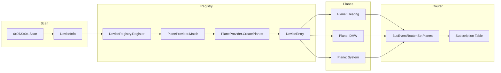
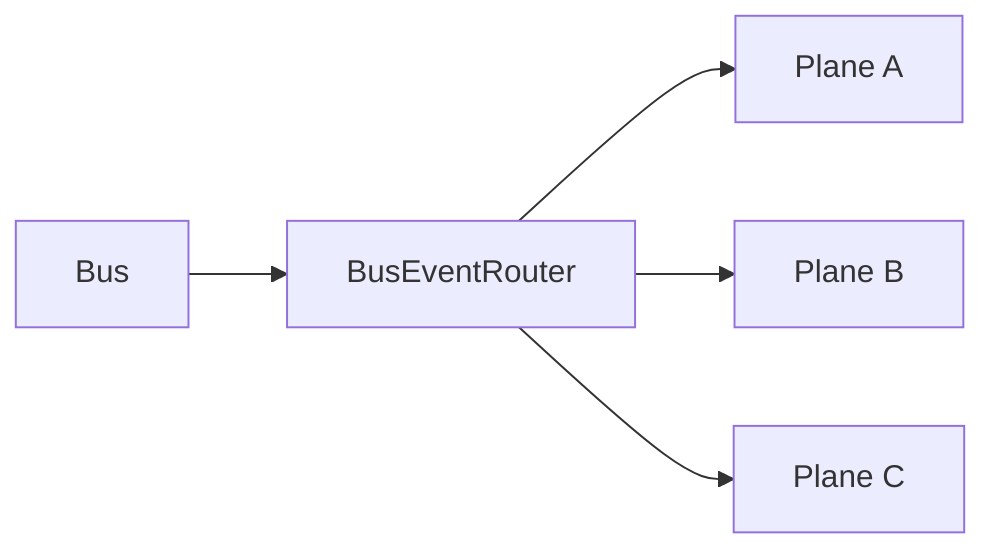
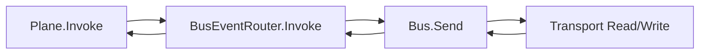
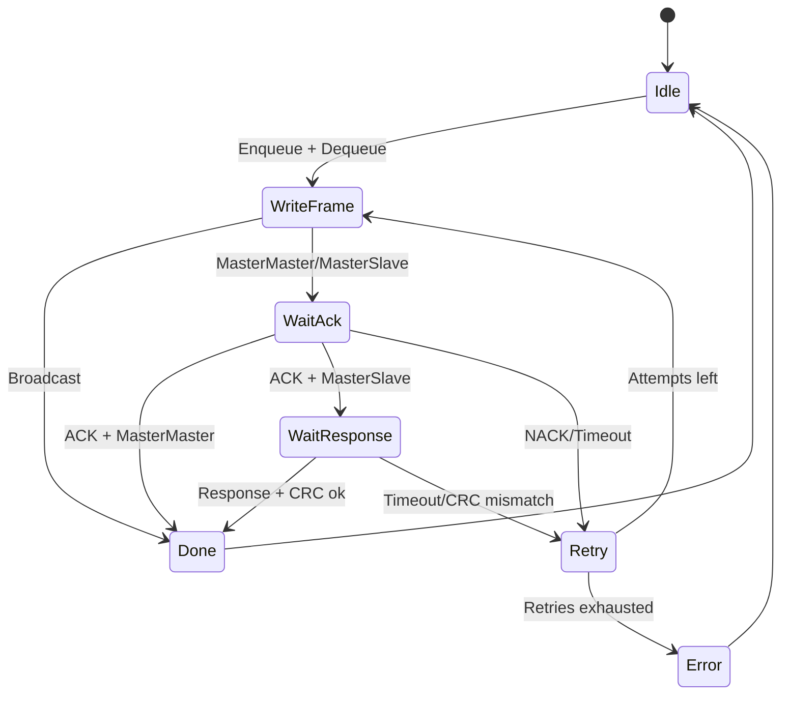

# Architecture Overview

This repository documents the current, implemented architecture of the Helianthus eBUS ecosystem. As of now, `helianthus-ebusgo` and `helianthus-ebusreg` contain the working transport, protocol, type system, registry, and vendor providers. `helianthus-ebusgateway` contains only package stubs (no GraphQL/MCP/mDNS/Matter behavior yet).

## Layered Architecture (Mermaid)

```mermaid
flowchart TB
  subgraph Gateway
    G1[GraphQL (stub)]
    G2[MCP (stub)]
    G3[mDNS (stub)]
    G4[Matter (stub)]
  end

  subgraph Registry
    R1[DeviceRegistry]
    R2[PlaneProviders]
    R3[BusEventRouter]
    R4[Schema + SchemaSelector]
  end

  subgraph Protocol
    P1[Bus + Priority Queue]
    P2[Frame + CRC]
  end

  subgraph Transport
    T1[RawTransport]
    T2[ENH]
    T3[ENS]
  end

  G1 --> R1
  G2 --> R1
  G3 --> R1
  G4 --> R1

  R3 --> P1
  R4 --> P2
  P1 --> T1
  T1 --> T2
  T1 --> T3
```

## Plane/Provider Model

The registry layer treats each physical eBUS device as a **DeviceEntry** discovered via a 0x07/0x04 identification scan. A DeviceEntry does not directly expose behavior; instead, **PlaneProviders** match against the DeviceInfo (address, manufacturer, device ID, HW/SW versions) and **create one or more Planes** that represent distinct semantic views of that same device (e.g., heating, DHW, system).

Each Plane publishes:

- **Methods** with a FrameTemplate (primary/secondary bytes) and a ResponseSchema selector.
- **Subscriptions** for broadcast frames it can decode (router-level Plane).
- **Request/response handling** via BuildRequest and DecodeResponse (router-level Plane).

This keeps protocol mechanics (bus arbitration, ACK/NACK, retries) inside the Bus, while Planes focus purely on domain semantics.

### IOKit / IORegistry Parallels (Inspiration)

This model is inspired by how IOKit organizes devices and drivers in macOS:

- **DeviceRegistry ≈ IORegistry**: a central registry of discovered devices and their properties.
- **PlaneProvider ≈ driver matching/attachment**: a provider matches a device and attaches logical functionality.
- **Plane ≈ IOService instance**: a plane is a semantic service view derived from the same hardware device.
- **Multiple Planes per device ≈ multiple IORegistry planes**: a single device can appear in multiple logical planes (heating, DHW, system) without duplicating the underlying physical identity.

The mapping is conceptual (not API-identical), used to keep a clean separation between discovery, matching, and the semantic surface.

### Plane Relationships (Mermaid)



## Data Flows (Mermaid)

### Broadcast (bus → planes)



### Request/Response (plane → bus → plane)



## Relation to eBUS Protocol State Machines

Planes initiate work (method invocation) or receive broadcast updates, but they do not manage protocol states. The Bus is responsible for the eBUS-level state machine: send, ACK/NACK handling, response read, CRC validation, and retries. The Router sits between the two, translating Plane operations into Bus sends and routing Bus broadcasts back to subscribed Planes.

### eBUS Send/Receive State Machine (Mermaid)



The diagrams show how **Planes** operate at the semantic layer while the **Bus** owns the protocol state machine, keeping retry and framing logic centralized and consistent across all device interactions.
