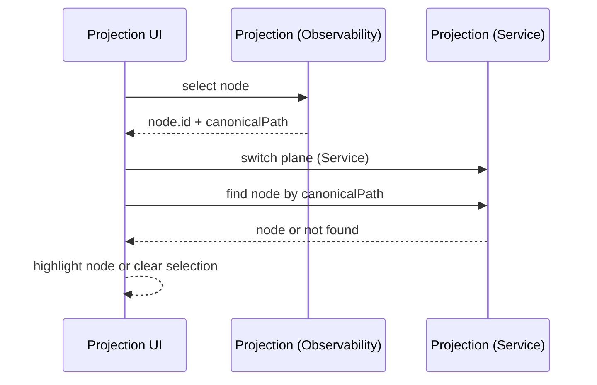
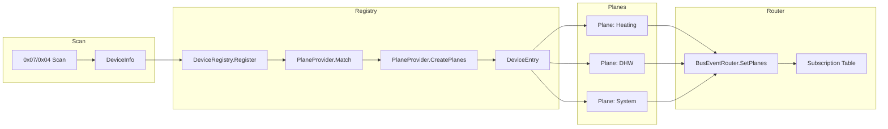
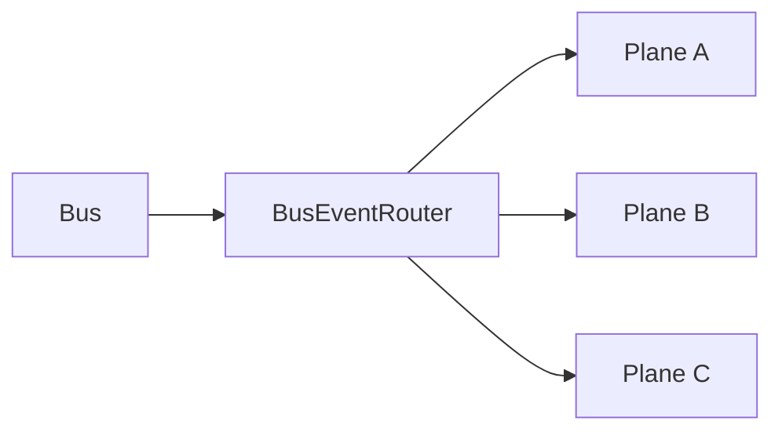
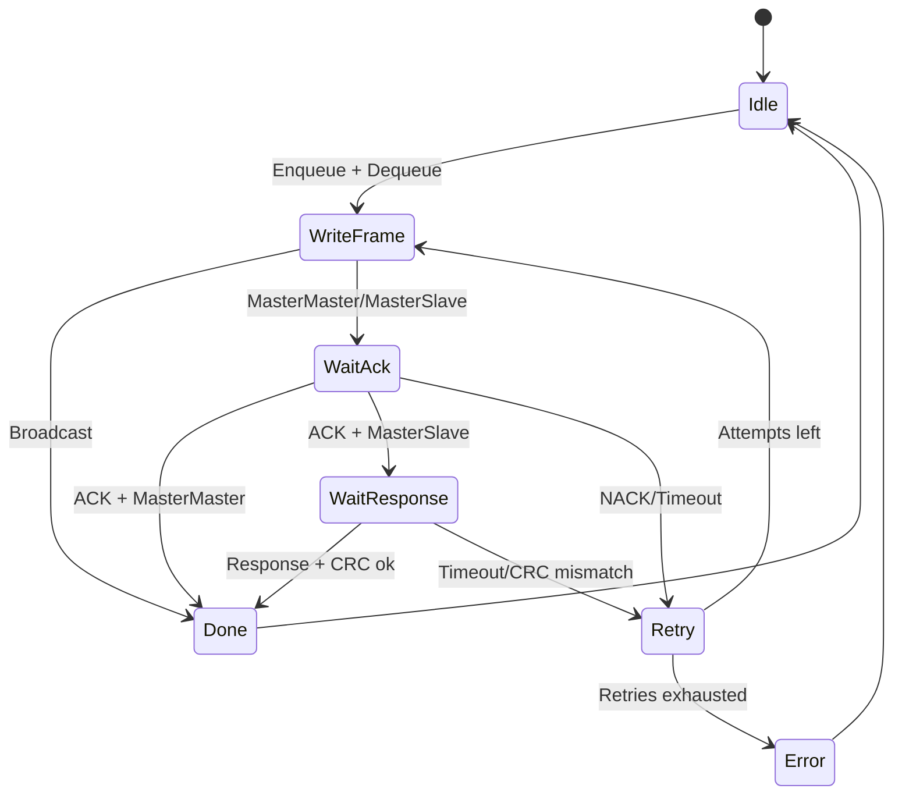

# Architecture Overview

This repository documents the current, implemented architecture of the Helianthus eBUS ecosystem. `helianthus-ebusgo` and `helianthus-ebusreg` provide the transport, protocol, type system, registry, and vendor providers. `helianthus-ebusgateway` is the runnable runtime/API edge: it wires transport, bus, registry, router, and semantic providers into a gateway process and serves GraphQL (`/graphql`, `/graphql/subscriptions`), MCP (`/mcp`), the projection UI (`cfg.UIPath`, default `/ui`), and the Portal shell/API surface (`cfg.PortalPath`, default `/portal`, with versioned API under `cfg.PortalPath + "/api/v1"`, default `/portal/api/v1`).

Detailed API contracts live in [`api/graphql.md`](../api/graphql.md), [`api/mcp.md`](../api/mcp.md), and [`api/portal.md`](../api/portal.md).

## Layered Architecture (Mermaid)

```mermaid
flowchart TB
  subgraph Gateway
    G0[Gateway runtime wired]
    G1[GraphQL API + schema]
    G2[MCP endpoint]
    G3[Projection UI]
    G4[Portal API + UI]
  end

  subgraph Registry
    R1[DeviceRegistry]
    R2[PlaneProviders]
    R3[BusEventRouter]
    R4[Schema + SchemaSelector]
  end

  subgraph Protocol
    P1[Bus + Priority Queue]
    P2[Frame + CRC]
  end

  subgraph Transport
    T1[RawTransport]
    T2[ENH (enhanced adapter protocol)]
    T3[UDP-PLAIN (raw UDP eBUS bytes)]
    T4[TCP-PLAIN (raw TCP eBUS bytes)]
  end

  G1 --> G0
  G2 --> G0
  G3 --> G0
  G4 --> G0

  G0 --> R1
  G0 --> R3
  G0 --> P1

  R3 --> P1
  R4 --> P2
  P1 --> T1
  T1 --> T2
  T1 --> T3
  T1 --> T4
```

Naming note:

- `protocols/enh.md` / `protocols/ens.md` document ebusd’s ENH/ENS adapter protocol semantics.
- The eBUS wire-level escape sequences (`ESC=0xA9`, `SYN=0xAA`) are documented in `protocols/ebus-overview.md` and decoded in the protocol layer (Bus decoder), not as a separate transport.
- `protocols/udp-plain.md` documents raw UDP byte-stream adapters that do not implement ENH framing.
- `tcp-plain` in gateway and proxy uses the same raw-byte semantics as UDP-plain over TCP stream sockets.

## Gateway Runtime (Implemented)

The gateway now provides a runtime wiring layer that instantiates the bus, registry, router, schema builder, and HTTP surfaces from a single config.

- **Construction**: `New(ctx, cfg)` resolves a transport (provided or dialed), then builds a Bus, DeviceRegistry, and BusEventRouter.
- **Startup**: `Start(ctx)` runs the Bus loop; cancellation stops the bus.
- **Shutdown**: `Close()` closes the underlying transport connection (or the provided transport).
- **Router refresh**: `RefreshRouterPlanes()` extracts `router.Plane` implementations from the registry and updates the router’s subscription table.
- **GraphQL schema rebuild**: the schema builder consumes registry entries and rebuilds schema snapshots whenever a registry change signal is emitted.
- **External surfaces**: GraphQL is served at `/graphql` with subscriptions at `/graphql/subscriptions`; MCP is served at `/mcp`; the projection UI is mounted at `cfg.UIPath` (default `/ui`); the Portal shell/API surface is mounted at `cfg.PortalPath` (default `/portal`) with its versioned API under `cfg.PortalPath + "/api/v1"` (default `/portal/api/v1`).

## Semantic Startup Runtime

Gateway semantic publication uses an explicit startup FSM to distinguish cache bootstrap from live runtime updates.

- startup phases: `BOOT_INIT`, `CACHE_LOADED_STALE`, `LIVE_WARMUP`, `LIVE_READY`, `DEGRADED`
- readiness criteria: live-ready requires `live_epoch >= 2` plus live-backed updates for each published semantic stream (zones and/or DHW). System, circuits, boiler_status, and energy are independent streams that do not gate startup phase transitions.
- timeout control: `-boot-live-timeout` (default `2m`)
- source rules: persistent cache preload advances `cache_epoch`; zone/DHW live updates (including successful `ebusd-tcp` grab hydration) advance `live_epoch`; energy broadcasts do not drive startup phase transitions
- per-key B524 semantic reads are guarded by a circuit breaker (`closed`/`open`/`half-open`) with suppression and transition telemetry
- zone publication uses an anti-flapping presence FSM (`ABSENT`, `SUSPECT_RESURRECT`, `PRESENT`, `SUSPECT_MISSING`) with configurable hit/miss hysteresis
- zone/DHW semantic refresh uses non-destructive field-level merge so partial failures keep last-known values and mark freshness internally
- DHW publication uses a stale TTL durability window (`-semantic-dhw-stale-ttl`) and expires to absent when cache-only age exceeds TTL

See full state machine and transition table in [`architecture/startup-semantic-fsm.md`](./startup-semantic-fsm.md).
See breaker details in [`architecture/semantic-read-circuit-breaker.md`](./semantic-read-circuit-breaker.md).
See zone presence details in [`architecture/zone-presence-fsm.md`](./zone-presence-fsm.md).
See DHW lifecycle details in [`architecture/dhw-freshness-fsm.md`](./dhw-freshness-fsm.md).

## Semantic Structure Discovery

The startup/runtime FSMs above explain **when** semantic payload becomes visible. The separate structural decision graph explains **why a family or instance exists at all**.

- authoritative flow: [`architecture/semantic-structure-discovery.md`](./semantic-structure-discovery.md)
- B524 semantic root discovery: [`architecture/b524-semantic-root-discovery.md`](./b524-semantic-root-discovery.md)
- regulator identity enrichment: [`architecture/regulator-identity-enrichment.md`](./regulator-identity-enrichment.md)
- functional-module semantics: [`architecture/functional-modules.md`](./functional-modules.md)
- structural configuration gates: [`architecture/semantic-configuration-gates.md`](./semantic-configuration-gates.md)
- structure/publication/freshness mechanism map: [`architecture/semantic-structure-fsm-map.md`](./semantic-structure-fsm-map.md)
- authoritative B524 decision catalog: [`protocols/ebus-vaillant-B524-structural-decisions.md`](../protocols/ebus-vaillant-B524-structural-decisions.md)

This split is intentional:

- FSM docs cover publication timing, cache/live transitions, and anti-flapping behavior;
- the structural decision catalog covers source registers, evaluation rules, gates, and ownership/subordination fields.

## Plane/Provider Model

The registry layer treats each physical eBUS device as a **DeviceEntry** discovered via a 0x07/0x04 identification scan. A single physical device may be observed on multiple eBUS addresses (alias faces). The registry resolves these to one canonical DeviceEntry with:

- a deterministic primary `Address()` (first/canonical address used in projection paths),
- an alias list `Addresses()` (all observed addresses for that same physical identity).

During scan, Helianthus treats the response source as canonical when available, but still retains the queried target as an alias face when source and target differ. This avoids losing valid faces (for example, a SOL00-style `0xEC` target) when multiple targets answer with the same source identity.

A DeviceEntry does not directly expose behavior; instead, **PlaneProviders** match against the DeviceInfo (manufacturer, device ID, HW/SW versions, and stable identifiers when available) and **create one or more Planes** that represent distinct semantic views of that same device (e.g., heating, DHW, system).

Each Plane publishes:

- **Methods** with a FrameTemplate (primary/secondary bytes) and a ResponseSchema selector.
- **Subscriptions** for broadcast frames it can decode (router-level Plane).
- **Request/response handling** via `BuildRequest(method, params)` and `DecodeResponse(method, response, params)` (router-level Plane).

This keeps protocol mechanics (bus arbitration, ACK/NACK, retries) inside the Bus, while Planes focus purely on domain semantics.

`DecodeResponse` receives the original `params` because some responses are **param-dependent** and cannot be decoded from the frame alone (e.g., op-coded request/response pairs). In Helianthus, this is commonly exposed as a result map containing the request selectors (e.g., `op`) plus the raw `payload`, with optional higher-level fields decoded for known op values (e.g., Vaillant `0xB5 0x04` GetOperationalData and `0xB5 0x05` SetOperationalData use an `op` selector; GetOperationalData decodes `op=0x00` as DateTime when present).

Similarly, Vaillant `0xB5 0x09` register access uses a selector byte (`0x0D` read / `0x0E` write) plus a 16-bit address, so the original request parameters remain important context for decoding and labeling responses.

Vaillant `0xB5 0x24` (“B524”) extended register access follows the same pattern: requests include an opcode family (`0x02`/`0x06`), a read/write selector, a group/instance pair, and a 16-bit register id. Responses do **not** echo the request selector; instead they begin with a 4-byte response header (`FLAGS GG RR_LO RR_HI`) followed by optional value bytes. The instance id is not present in the response, so the original request parameters remain important context for correlating replies.

See also: `architecture/vaillant.md` for higher-level notes on how Vaillant’s regulator-centric selector space differs from classic eBUS “one device ↔ one address” expectations.

## Projection Graph Core

The registry also supports **projection graphs** attached to a DeviceEntry. A `PlaneProvider` may additionally implement `ProjectionProvider` to emit one or more `Projection` objects alongside its planes. In Helianthus, each projection is a plane-scoped graph (nodes + edges) that represents a **projection** of the canonical Service plane.

### Planes as Projections

- The **Service** plane is canonical. Every node has a canonical Service-plane path that defines its identity.
- Other planes (e.g., `Observability`, `Automation`) are **projections** of the same nodes into plane-specific paths.
- Node IDs are derived from the canonical Service path and are stable **within a registration/snapshot**, so the same node can be recognized across multiple planes in that snapshot.

### Multi-dimensional Semantics

Projections are **multi-dimensional** views of the same canonical graph:

- **Plane dimension**: each projection is a single plane (e.g., `Service`, `Observability`, `Debug`). A node may appear in some planes and be absent in others.
- **Canonical dimension**: each node carries a `CanonicalPath` in the `Service` plane, and the node ID is derived from that canonical path.
- **Cross-plane correlation**: nodes in different planes with the same `CanonicalPath` (and thus the same node ID) represent the same canonical entity; edges are plane-local and never connect nodes across planes.

### Canonical Path Examples Across Planes

| Plane | Path | CanonicalPath | Correlation rule |
|---|---|---|---|
| `Service` | `Service:/ebus/addr@10/device@BASV2/method@get_operational_data` | `Service:/ebus/addr@10/device@BASV2/method@get_operational_data` | Canonical node definition |
| `Observability` | `Observability:/ebus/addr@10/device@BASV2/method@get_operational_data` | `Service:/ebus/addr@10/device@BASV2/method@get_operational_data` | Same canonical path ⇒ same node ID as `Service` |
| `Debug` | `Debug:/ebus/addr@10/device@BASV2/register@b524` | `Service:/ebus/addr@10/device@BASV2/method@get_ext_register` | Debug-specific path mapped to canonical service method |

### Path Semantics

- Path format: `Plane:/segment/segment/@location`
- `@` marks a **location segment** (the `@` is a flag; it is not part of the segment name).
- Plane names and segment names **must not** contain `/` or `:`.
- Segment names must be non-empty and **must not** start with `@`.
- `CanonicalPath` uses the same grammar, but the plane is always `Service`. `Path` is the plane-specific view of the same canonical node.

### Invariants (Validated in Registry Core)

- `Projection.Plane` is non-empty and contains no `/` or `:`.
- `Node.Path.Plane` matches `Projection.Plane`.
- `Node.CanonicalPath.Plane` is always `Service`.
- If `Node.Path.Plane` is `Service`, the node path must equal the canonical path exactly.
- Node paths are unique within a projection; node IDs may repeat only when they map to the **same** canonical path.
- Edge IDs are stable (`Plane:from->to`) and edges must reference existing node IDs.

### Projection UI Query Expectations

The read-only projection UI at `cfg.UIPath` (default `/ui`) renders projection graphs and cross-plane views using a single GraphQL query and expects specific fields to be present and stable:

- **Query shape** (example name: `PortalProjections`): `devices { address manufacturer deviceId projections { plane nodes { id path canonicalPath } edges { id from to } } }`
- **Plane graph contract**: each `projections[]` entry is one plane-scoped graph where `plane -> nodes/edges`; clients render exactly one selected plane at a time.
- **Identity**: `ProjectionNode.id` is derived from the `Service`-plane canonical path, so the same node ID appears across planes when they represent the same canonical entity.
- **Display vs. join**: `path` is plane-local display data; `canonicalPath` is the join key used for cross-plane correlation and snapshot diffs.
- **Plane switching**: preserve the selected node’s `canonicalPath`, switch plane, then resolve the target node by canonical path (or clear selection when absent in that plane).

### Projection UI (Projection Browser)

The gateway serves a read-only projection browser at `cfg.UIPath` (default `/ui`). This UI is separate from the Portal shell served at `cfg.PortalPath` (default `/portal`). The projection browser polls the GraphQL endpoint for devices and their projection graphs, then renders:

- A device list (address + manufacturer + device ID).
- A plane selector (canonical planes plus any device-specific planes).
- A graph view for the current plane, plus a node detail card (ID, plane path, canonical path).

Node identity is derived from the canonical Service path, so the same logical node can be correlated across planes within a snapshot. This is what enables **plane switching** without losing identity when a node exists in multiple plane projections.

#### Plane Switching (Mermaid)



### Vaillant Projection Mapping (System Provider)

The Vaillant system provider in `ebusreg` emits projections for a small set of known device IDs and maps Vaillant-specific operations into standardized projection paths.

- **Eligible devices:** normalized `DeviceID` values `BASV2`, `BAI00`, `VR71` (case/spacing/`_`/`-` normalized).
- **Base path:** `Service:/ebus/addr@XX/device@<DeviceID>` where `XX` is the canonical primary address of the device entry; aliases remain available via registry metadata.
- **Always-emitted planes:** `Service`, `Observability`, `Debug`.
- **Conditional root planes:** `System`, `Heating`, `DHW`, `Solar` (only if the corresponding plane exists for that device).

Nodes and edges are created as follows:

- **Service plane:** root node + `method@get_operational_data` node, edge `root → method`.
- **Observability plane:** root node + `method@get_operational_data` node, edge `root → method`.
- **Debug plane:** root node + `register@b509` and `register@b524` nodes, edges `root → register@b509` and `root → register@b524`.
  - `register@b509` maps to canonical `Service:/.../method@get_register` (B5/09).
  - `register@b524` maps to canonical `Service:/.../method@get_ext_register` (B5/24).

Example paths:

```text
Service:/ebus/addr@10/device@BASV2/method@get_operational_data
Observability:/ebus/addr@10/device@BASV2/method@get_operational_data
Debug:/ebus/addr@10/device@BASV2/register@b524
```

### IOKit / IORegistry Parallels (Inspiration)

This model is inspired by how IOKit organizes devices and drivers in macOS:

- **DeviceRegistry ≈ IORegistry**: a central registry of discovered devices and their properties.
- **PlaneProvider ≈ driver matching/attachment**: a provider matches a device and attaches logical functionality.
- **Plane (Helianthus) ≈ IORegistry-style view**: each plane is a view over the same canonical entities, but node membership is plane-specific (a node may exist in one plane and be absent in another).
- **Multiple Planes per device ≈ multiple IORegistry planes (conceptual)**: a single device can appear in multiple logical views without duplicating the underlying physical identity.

The mapping is conceptual (not API-identical), used to keep a clean separation between discovery, matching, and the semantic surface.

### Plane Relationships (Mermaid)



## Data Flows (Mermaid)

### Broadcast (bus → planes)



The router routes bus frames to subscribed planes via `Plane.OnBroadcast(frame)`. For frames that can be decoded into structured values, the router also exposes a typed event stream:

- `BusEventRouter.Events()` is a buffered channel of `router.BroadcastEvent`.
- If a plane implements the optional `router.BroadcastDecoder` interface, `HandleBroadcast(frame)` decodes and publishes a `BroadcastEvent` (non-blocking) alongside calling `OnBroadcast`.

### Request/Response (plane → bus → plane)


## Relation to eBUS Protocol State Machines

Planes initiate work (method invocation) or receive broadcast updates, but they do not manage protocol states. The Bus is responsible for the eBUS-level state machine: send, ACK/NACK handling, response read, CRC validation, and retries. The Router sits between the two, translating Plane operations into Bus sends and routing Bus broadcasts back to subscribed Planes.

While waiting for ACK/NACK, the Bus tolerates idle/noise bytes (e.g., repeated `SYN`) and continues until a definitive ACK/NACK or timeout is reached.

### eBUS Send/Receive State Machine (Mermaid)



The diagrams show how **Planes** operate at the semantic layer while the **Bus** owns the protocol state machine, keeping retry and framing logic centralized and consistent across all device interactions.
