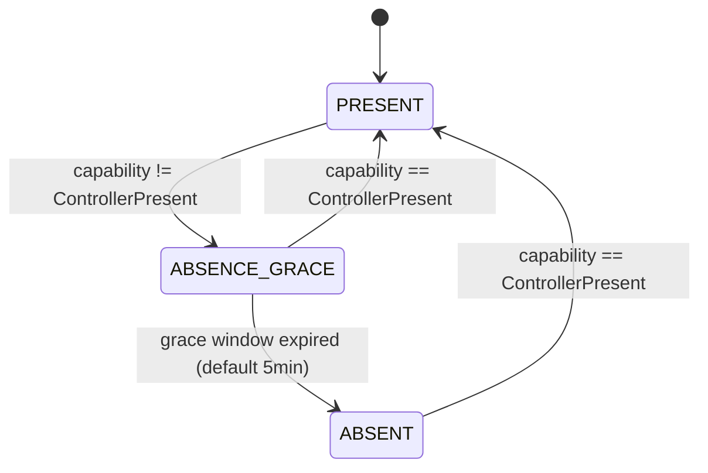

# Regulator Detection Contract

This page documents how the gateway determines whether a Vaillant regulator is present on the eBUS network.

## Motivation

Regulator presence determines the gateway's operational mode:

- **Regulator present:** full zone/DHW semantic polling via B524 selector-multiplexed reads through the regulator address.
- **Regulator absent:** semantic polling is not possible; the gateway operates in reduced mode (broadcast energy ingestion only, if available).

Prior to this contract, regulator detection relied on a **naming heuristic**: scanning the device registry for entries whose identification string started with `BASV` (the eBUS address-family prefix for Vaillant system controllers). This was fragile — it coupled detection to string prefixes that could change across firmware versions or device families.

## Detection Method

Regulator detection uses the **product IDs catalog** from `helianthus-ebusreg` as the single source of truth.

### Algorithm

```text
for each device in registry:
    serial := device.Identification
    partNumber := extractPartNumber(serial)
    if partNumber is valid:
        capability := catalog.ControllerCapability(partNumber)
        if capability == ControllerPresent:
            return ControllerPresent
        if capability == ControllerNone:
            track as non-regulator
    // ControllerUnknown or invalid partNumber: skip

if any device was ControllerNone:
    return ControllerNone
return ControllerUnknown
```

### Part Number Extraction

The eBUS identification string contains a fixed-format serial where positions 4–14 encode the Vaillant article number (part number). The extraction:

1. Strips whitespace from the identification string.
2. Checks minimum length (14 characters).
3. Extracts substring `[4:14]`.
4. Validates all characters are digits.
5. Returns the 10-digit part number, or empty string on failure.

### ControllerCapability Tri-State

The `productids.ControllerCapability` enum in `helianthus-ebusreg` classifies part numbers:

| Value | Meaning |
| --- | --- |
| `ControllerPresent` | Part number maps to a product with `role = "Regulator"` in the catalog |
| `ControllerNone` | Part number found in catalog but role is not Regulator |
| `ControllerUnknown` | Part number not found in catalog |

### Catalog Source

The catalog is the `helianthus-ebus-vaillant-productids` dataset, loaded via `helianthus-ebusreg/vaillant/productids`. As of the initial implementation, the catalog contains 31 regulators and 6 thermostats correctly classified.

## Lifecycle

- Regulator capability is recomputed on every `refreshDiscovery` cycle (default 10 minutes).
- A faster **regulator recheck loop** (default 60 seconds, configurable via `-semantic-regulator-recheck-interval`) runs independently to detect capability changes between discovery cycles.
- The computation runs **before** the BASV address lookup, so capability is always current even when no BASV-prefixed device is found in the registry.
- Capability changes are logged: `semantic_regulator_capability capability=<value>`.
- The legacy `findDeviceAddressByPrefix("BASV")` call remains for obtaining the controller's eBUS address for B524 polling. It is **not** used for regulator presence decisions.

## Re-Detection and Absence Grace

Regulator presence can change after boot (device power cycle, bus fault, firmware update). The gateway handles this with two mechanisms:

### Inventory-Update Trigger

The recheck loop tracks the total device count in the registry. When the count changes (new device registered or device removed), an immediate full `refreshDiscovery` is enqueued. This ensures that registry changes are reflected without waiting for the next 10-minute discovery cycle.

### Absence Grace FSM



| State | Meaning |
| --- | --- |
| `PRESENT` | Regulator confirmed present via catalog lookup |
| `ABSENCE_GRACE` | Regulator not detected; waiting for grace window before declaring absence |
| `ABSENT` | Regulator absent after sustained grace period (`WARN_NO_REGULATOR`) |

**Transitions:**

- **PRESENT → ABSENCE_GRACE:** Capability changes from `ControllerPresent` to anything else. Grace timer starts.
- **ABSENCE_GRACE → ABSENT:** Grace window (`-semantic-regulator-absence-grace`, default 5 minutes) expires with regulator still absent. Logged as `semantic_regulator_absence state=ABSENT`.
- **ABSENCE_GRACE → PRESENT:** Regulator re-detected within grace window. Grace timer cleared.
- **ABSENT → PRESENT:** Regulator re-detected after being absent. Full recovery.

**Design notes:**

- The grace window prevents false `WARN_NO_REGULATOR` from transient bus communication failures.
- Grace expiry is inclusive (`>=`): transition happens at exactly the configured duration.
- Both `ControllerNone` and `ControllerUnknown` trigger the grace window — the FSM does not distinguish between confirmed-absent and unknown devices.

## Known Limitations

- **Multi-regulator systems:** If multiple devices report `ControllerPresent`, the first one found wins. Multi-regulator topologies are not supported in v1.
- **Unknown devices:** Devices with part numbers absent from the catalog produce `ControllerUnknown`. The system does not assume regulator absence from unknown devices — only catalog-confirmed non-regulators produce `ControllerNone`.
- **Catalog coverage:** Detection quality depends on catalog completeness. New Vaillant products require catalog updates in `helianthus-ebus-vaillant-productids`.
- **Inventory trigger granularity:** The inventory-update trigger uses device count, not a fingerprint. Device replacements that maintain the same count are not detected as inventory changes.

## Cross-Links

- Vaillant regulator architecture: [`architecture/vaillant.md`](./vaillant.md)
- Startup FSM (uses regulator detection for readiness): [`architecture/startup-semantic-fsm.md`](./startup-semantic-fsm.md)
- Product IDs catalog: [`helianthus-ebus-vaillant-productids`](https://github.com/Project-Helianthus/helianthus-ebus-vaillant-productids)
- ControllerCapability contract: [`helianthus-ebusreg/vaillant/productids`](https://github.com/Project-Helianthus/helianthus-ebusreg)
