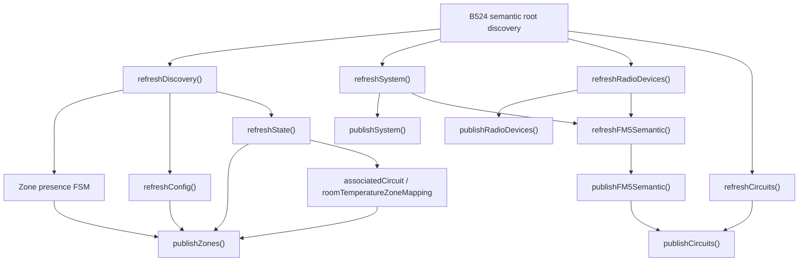

# Semantic Structure Discovery (B524)

This page documents how `helianthus-ebusgateway` discovers **semantic structure** from Vaillant B524 and decides what semantic families and instances exist before publishing them.

This is intentionally different from:

- NM-aligned topology and device-presence discovery as defined in [`architecture/nm-discovery.md`](./nm-discovery.md);
- runtime freshness/publication FSMs such as startup, zone presence, and read breaker behavior;
- state derivation such as zone operating mode, HVAC action, or DHW preset;
- direct-boiler B509 semantics.

> **Separation of concerns.** This document covers B524 register-backed
> structural discovery -- which semantic families, instances, and
> attachments exist within a discovered device. NM-aligned device-presence
> discovery (which devices exist on the bus at the address/wire layer)
> is a separate concern documented in
> [`architecture/nm-discovery.md`](./nm-discovery.md).

Phase 1 scope is **B524 structure discovery only** and is documented in **proven-only** style:

- direct register-backed rules are documented as `PROVEN`;
- naming-prefix or synthetic rules are documented as `HEURISTIC`;
- anything without enough evidence is documented as `UNKNOWN`.

The authoritative decision catalog is [`architecture/b524-structural-decisions.md`](./b524-structural-decisions.md).

Each catalog entry records both the primary B524/register evidence and, where available, a supporting regulator-document statement identified by the source document's own title rather than by file name.

Companion references:

- configuration gates: [`semantic-configuration-gates.md`](./semantic-configuration-gates.md)
- mechanism/FSM map: [`semantic-structure-fsm-map.md`](./semantic-structure-fsm-map.md)
- functional-module semantics: [`functional-modules.md`](./functional-modules.md)

## What Counts as a Structural Decision

A structural decision answers one of these questions:

- does this semantic family exist at all?
- how many instances exist?
- which instances are active vs. absent?
- which published fields define semantic ownership or parent selection?
- which gate must be satisfied before a family is exposed?

Examples:

- how many zones are published;
- whether a cylinder instance is real or only config-shaped noise;
- whether circuits belong to the regulator or the FM5 module;
- how current FM5-specific semantics fit into the broader functional-module model;
- whether the gateway is allowed to expose `solar` and `cylinders` at all.

## Flow Overview

Operational reading:

1. Gateway first needs a B524-capable semantic root endpoint.
2. `refreshDiscovery()` probes zone presence and drives the zone presence FSM.
3. `refreshConfig()` and `refreshState()` enrich already-present zone entries with names and structural config.
4. `refreshSystem()` provides the system properties needed by later structural rules.
5. `refreshRadioDevices()` provides remote inventory/evidence.
6. `refreshFM5Semantic()` evaluates whether FM5-backed families can be interpreted at all.
7. `refreshCircuits()` publishes circuit instances, and `publishCircuits()` attaches explicit `managingDevice`.
8. `publishFM5Semantic()` gates `solar` and `cylinders`, then republishes circuits so ownership downgrades/upgrades stay coherent.

## Controlling FSMs

These FSMs control whether structural decisions become visible or stay suppressed:

- Startup publication FSM: [`startup-semantic-fsm.md`](./startup-semantic-fsm.md)
- Zone presence hysteresis FSM: [`zone-presence-fsm.md`](./zone-presence-fsm.md)
- Per-register read breaker: [`semantic-read-circuit-breaker.md`](./semantic-read-circuit-breaker.md)

The higher-level classification of which mechanisms affect structure vs. publication vs. freshness is documented in [`semantic-structure-fsm-map.md`](./semantic-structure-fsm-map.md).

Their roles are different:

- the startup FSM controls when payloads are considered cache vs. live;
- the zone presence FSM decides whether a zone instance remains published;
- the read breaker suppresses repeated failing reads and therefore affects whether enough evidence exists for a structural rule to fire.

## Structural Decision Classes

### 1. Preconditions

These decide whether B524 structure discovery can run at all.

- B524-capable semantic root
- optional identity enrichment after root discovery
- registry evidence for FM5 hardware

### 2. Family/Instance Discovery

These decide how many items exist.

- zone instances from `GG=0x03 RR=0x001C`
- circuit instances from `GG=0x02 RR=0x0002`
- radio device instances from `GG=0x09/0x0A/0x0C`
- cylinder instances from `GG=0x05 RR=0x0004`

### 3. Structural Attachments

These do not create families, but define how published entities relate to each other.

- `roomTemperatureZoneMapping`
- `associatedCircuit`
- `circuits[].managingDevice`
- `radio_devices[].slot_mode`

### 4. Family Gates

These decide whether a whole semantic family may be published.

- `fm5SemanticMode`
- `solar`
- `cylinders`

The current functional-module architecture and deferred generic target are documented separately in [`functional-modules.md`](./functional-modules.md).

## Current Anti-Pattern Removed

`vr71CircuitStartIndex` was a synthetic threshold that compressed circuit ownership into a single global number. It did not come from a direct bus truth and could mis-model real topologies.

The canonical structural contract is now:

- `circuits[].managingDevice`

That change is the model for future cleanup:

- structure should be documented as explicit evidence-backed contract;
- synthetic convenience thresholds should either be marked `HEURISTIC` or removed.

The semantic-root precondition is documented separately from controller identity labeling:

- root discovery: [`b524-semantic-root-discovery.md`](./b524-semantic-root-discovery.md)
- identity enrichment: [`regulator-identity-enrichment.md`](./regulator-identity-enrichment.md)

## Out of Scope for Phase 1

These remain outside this document and the B524 structural decision catalog:

- zone mode/preset/HVAC action derivation
- DHW operating mode derivation
- energy merge behavior
- boiler/B509 semantic rules
- HA-specific entity naming or registry migration behavior

## Audit Rule

For B524 structure discovery, no rule should remain “only in code”.

Each structural rule in `semantic_vaillant.go` must end up in one of these buckets:

- cataloged as `PROVEN`
- cataloged as `HEURISTIC`
- cataloged as `COMPOSITE`
- cataloged as `UNKNOWN`
- explicitly declared out of scope for Phase 1

The structural decision catalog is authoritative for `Evidence status`, `Scope of validity`, and regulator-document `Constraint strength`.

The decision catalog is the authoritative reference for the rule-by-rule contract:

- [`architecture/b524-structural-decisions.md`](./b524-structural-decisions.md)
