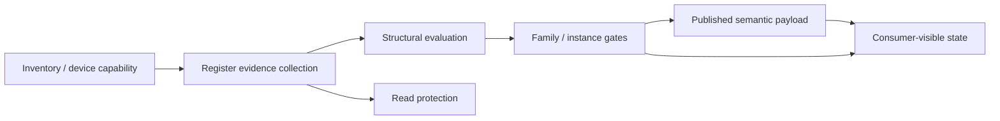

# Semantic Structure FSM Map

This page maps the runtime mechanisms that influence:

- semantic structure discovery;
- semantic publication timing;
- semantic freshness/lifecycle;
- evidence suppression or delay.

It exists to prevent structural decisions from being confused with startup state, freshness behavior, or read-suppression logic.

## Decision Pipeline

Operational reading:

1. inventory and capability determine whether discovery may run;
2. register evidence is collected through polling and slot probes;
3. structural evaluation turns that evidence into decisions;
4. family/instance gates decide what may be published;
5. publication and freshness mechanisms affect timing and durability;
6. protection mechanisms can reduce evidence availability without directly changing topology.

## Mechanism Classes

### Structural FSMs

These directly influence whether a semantic instance exists.

- [`zone-presence-fsm.md`](./zone-presence-fsm.md)

### Structural Evaluation Loops

These are not classic FSMs, but they are the loops that accumulate evidence and evaluate structural decisions:

- `refreshDiscovery()`
- `refreshConfig()`
- `refreshState()`
- `refreshSystem()`
- `refreshRadioDevices()`
- `refreshFM5Semantic()`
- `refreshCircuits()`

### Publication FSMs

These control when semantic payload becomes visible or cache/live-classified.

- [`startup-semantic-fsm.md`](./startup-semantic-fsm.md)

### Freshness / Durability FSMs

These control state retention and expiry, not structure topology.

- [`dhw-freshness-fsm.md`](./dhw-freshness-fsm.md)

### Protection FSMs

These suppress or delay evidence collection without being structural decisions by themselves.

- [`semantic-read-circuit-breaker.md`](./semantic-read-circuit-breaker.md)

## Mechanism Matrix

| Mechanism | Type | Changes structure? | Changes publication timing? | Changes freshness/lifecycle? | Can suppress evidence? | Primary scope |
| --- | --- | --- | --- | --- | --- | --- |
| `Zone Presence FSM` | Structural FSM | Yes | Yes | No | No | Zone instance existence |
| `refreshDiscovery()` | Structural evaluation loop | Yes | Indirect | No | No | Zone/controller structure |
| `refreshConfig()` / `refreshState()` | Structural evaluation loop | Yes | Indirect | No | No | Zone structure-bearing fields |
| `refreshCircuits()` | Structural evaluation loop | Yes | Indirect | No | No | Circuit instance existence |
| `refreshRadioDevices()` | Structural evaluation loop | Yes | Indirect | No | No | Radio inventory structure |
| `refreshFM5Semantic()` | Structural evaluation loop | Yes | Indirect | No | No | FM5 / solar / cylinder gates |
| `Startup Semantic FSM` | Publication FSM | No | Yes | Cache/live classification | No | Semantic visibility timing |
| `DHW Freshness FSM` | Freshness FSM | No | No | Yes | No | DHW lifecycle only |
| `Semantic Read Circuit Breaker` | Protection FSM | Indirect | Indirect | Indirect | Yes | Evidence availability |

## Family Impact Matrix

| Family | Structural evidence | Structural mechanism | Publication mechanism | Protection-sensitive | Removal / absence mode |
| --- | --- | --- | --- | --- | --- |
| `zones` | `GG=0x03` | Zone presence FSM + zone config/state evaluation | Startup semantic FSM | Yes | Removed after presence hysteresis reaches absent |
| `circuits` | `GG=0x02 RR=0x0002` | Circuit discovery + managing-device evaluation | Startup semantic FSM | Yes | Omitted when no active circuit evidence exists |
| `radioDevices` | `GG=0x09/0x0A/0x0C` slot evidence | Radio inventory evaluation | Startup semantic FSM | Yes | Omitted when slot evidence is absent or withheld |
| `fm5SemanticMode` | System + radio + solar/cylinder evidence | FM5 semantic evaluation | Startup semantic FSM | Yes | Downgraded/cleared when evidence falls below gate |
| `solar` | FM5 + `GG=0x04` | Solar family gate | Startup semantic FSM | Yes | Cleared when FM5 is not interpreted |
| `cylinders` | FM5 + `GG=0x05` + per-instance temperature evidence | Cylinder family gate + individual cylinder gate | Startup semantic FSM | Yes | Family cleared when FM5 not interpreted; instance omitted without live evidence |
| `dhw` | B524 reads / fallback hydration | No structural FSM in Phase 1 | Startup semantic FSM + DHW freshness FSM | Yes | Can expire after TTL without changing topology |
| `energyTotals` | Energy broadcast ingestion | No structural FSM in Phase 1 | Published independently of startup readiness | No direct B524 breaker path | Can remain absent or stale independently of structure |

## How to Debug the Wrong Layer

### Structure missing

Likely causes:

- controller or family prerequisite not satisfied;
- no direct register evidence for the instance/family;
- structural gate evaluated to absent/unknown;
- breaker suppression prevented evidence collection.

### Structure present but not visible yet

Likely cause:

- startup/publication timing, not topology itself.

### Structure flapping

Likely causes:

- zone presence hysteresis transitions;
- unstable evidence path;
- repeated read suppression and recovery.

### State expired but topology unchanged

Likely cause:

- freshness lifecycle (for example DHW TTL), not structure discovery.

## Existing Document Classification

- [`semantic-structure-discovery.md`](./semantic-structure-discovery.md): structural evaluation flow
- [`semantic-configuration-gates.md`](./semantic-configuration-gates.md): structural preconditions, family gates, and instance gates
- [`zone-presence-fsm.md`](./zone-presence-fsm.md): structural FSM
- [`startup-semantic-fsm.md`](./startup-semantic-fsm.md): publication FSM
- [`dhw-freshness-fsm.md`](./dhw-freshness-fsm.md): freshness lifecycle FSM
- [`semantic-read-circuit-breaker.md`](./semantic-read-circuit-breaker.md): protection FSM
- [`../protocols/ebus-vaillant-B524-structural-decisions.md`](../protocols/ebus-vaillant-B524-structural-decisions.md): rule-by-rule decision catalog

## Non-Goals

This page does not:

- redefine the structural decisions themselves;
- replace the decision catalog;
- prove protocol semantics by itself;
- document transport-level state machines.
