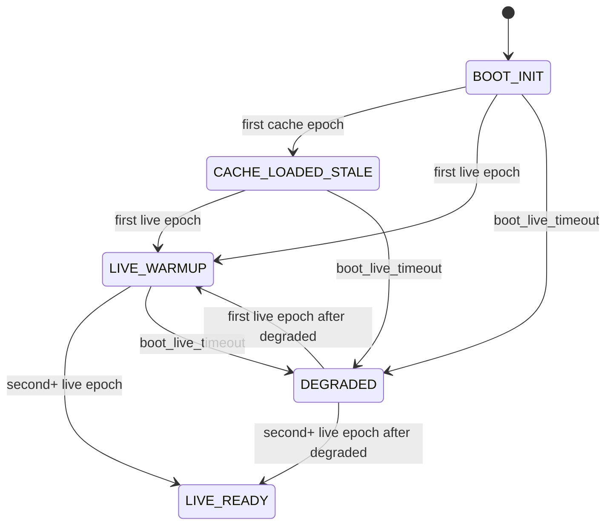

# Semantic Startup FSM

This page documents the startup behavior for semantic data publication in `helianthus-ebusgateway`.

Goal: publish deterministic semantic data during startup without pretending cached values are live.

## State Machine

## Transition Table

| From | To | Trigger | Notes |
| --- | --- | --- | --- |
| `BOOT_INIT` | `CACHE_LOADED_STALE` | first cache snapshot applied | cache is exposed as stale bootstrap data |
| `BOOT_INIT` | `LIVE_WARMUP` | first live semantic update | first confirmed live signal |
| `CACHE_LOADED_STALE` | `LIVE_WARMUP` | first live semantic update | stale cache begins replacement by live stream |
| `LIVE_WARMUP` | `LIVE_READY` | second live semantic update | stable live runtime reached |
| `BOOT_INIT`/`CACHE_LOADED_STALE`/`LIVE_WARMUP` | `DEGRADED` | `boot_live_timeout` elapsed | startup did not reach live-ready in time |
| `DEGRADED` | `LIVE_WARMUP` | first live semantic update after degraded | recovery started |
| `DEGRADED` | `LIVE_READY` | second live semantic update after degraded | recovery complete |

## Epoch Semantics

- `cache_epoch` increments when cache-backed semantic payload is applied.
- `live_epoch` increments when live semantic payload is applied (including live broadcast-derived updates).
- `cache_epoch` and `live_epoch` are tracked independently.
- `live_epoch` is authoritative for startup readiness:
  - `live_epoch = 0`: no live signal yet.
  - `live_epoch = 1`: warmup only.
  - `live_epoch >= 2`: live-ready.

## Timeout Semantics

- Runtime bootstrap timeout is controlled by `-boot-live-timeout` (default `2m`).
- If timeout elapses before live-ready, runtime transitions to `DEGRADED`.
- `DEGRADED` does not block recovery; later live updates can still move runtime to warmup/live-ready.

## API and Runtime Cross-Links

- GraphQL runtime notes: [`api/graphql.md`](../api/graphql.md#semantic-startup-runtime-contract)
- Runtime and wiring context: [`architecture/overview.md`](./overview.md#semantic-startup-runtime)
- HA consumer behavior: [`development/ha-integration.md`](../development/ha-integration.md)
