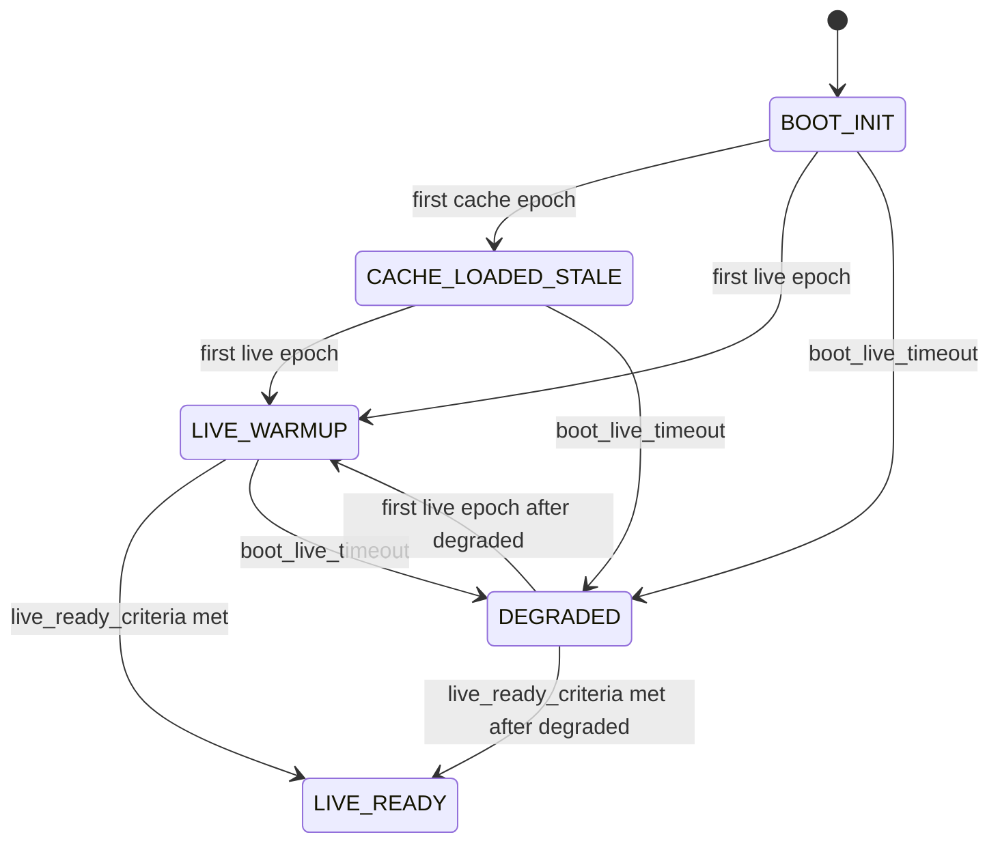

# Semantic Startup FSM

This page documents the startup behavior for semantic data publication in `helianthus-ebusgateway`.

Goal: publish deterministic semantic data during startup without pretending cached values are live.

## State Machine

## Transition Table

| From | To | Trigger | Notes |
| --- | --- | --- | --- |
| `BOOT_INIT` | `CACHE_LOADED_STALE` | first cache snapshot applied | cache is exposed as stale bootstrap data |
| `BOOT_INIT` | `LIVE_WARMUP` | first live semantic update | first confirmed live signal |
| `CACHE_LOADED_STALE` | `LIVE_WARMUP` | first live semantic update | stale cache begins replacement by live stream |
| `LIVE_WARMUP` | `LIVE_READY` | `live_ready_criteria` satisfied | requires `live_epoch >= 2` and live-backed updates for every published stream |
| `BOOT_INIT`/`CACHE_LOADED_STALE`/`LIVE_WARMUP` | `DEGRADED` | `boot_live_timeout` elapsed | startup did not reach live-ready in time |
| `DEGRADED` | `LIVE_WARMUP` | first live semantic update after degraded | recovery started |
| `DEGRADED` | `LIVE_READY` | `live_ready_criteria` satisfied after degraded | same stream-aware readiness criteria used during normal startup |

## Epoch Semantics

- `cache_epoch` increments when cache-backed semantic payload is applied.
- `live_epoch` increments when live semantic payload is applied from zone/DHW refresh paths.
- `cache_epoch` and `live_epoch` are tracked independently.
- `live_epoch` is authoritative for startup readiness:
  - `live_epoch = 0`: no live signal yet.
  - `live_epoch = 1`: warmup only.
  - `live_epoch >= 2`: candidate for live-ready; stream criteria still apply.
- `LIVE_READY` additionally requires live updates for all published semantic streams:
  - if zones were published, at least one zones update must be live-backed;
  - if DHW was published, at least one DHW update must be live-backed.
  - repeated live updates on only one stream keep runtime in `LIVE_WARMUP`.

### Source classification notes

- Persistent semantic snapshot preload (`semantic_cache.json`) is cache-backed and only advances `cache_epoch`.
- In `ebusd-tcp` fallback mode, successful `grab result all` hydration for zones/DHW is classified as **live** and can advance `live_epoch`.
- Energy broadcast ingestion updates `energyTotals` but does **not** advance startup `live_epoch` and does not trigger startup phase transitions.

## M4 L1 Startup Priming

After B524 semantic root discovery succeeds, the gateway runs a bounded startup
priming pass before the normal periodic semantic loop. The purpose is L1 plane
availability: every MCP semantic plane required by the M4 O1 gate must publish a
non-null payload within 60 seconds of add-on startup when live bus access is
working.

Startup priming is a publication-ordering rule, not a transport or protocol
arbitration change. It does not change `bus.Send`, the adaptermux first-byte
arbitration behavior, or the Direction C F-NEW-29 predicate documented in
[`adaptermux/first-byte-arbitration-revalidation.md`](./adaptermux/first-byte-arbitration-revalidation.md).

The priming pass is intentionally bounded:

- run only after a B524-capable semantic root has been found;
- use short per-probe timeouts so a slow register family cannot monopolize the
  startup window;
- publish lightweight structural or skeleton payloads for planes whose full
  detail is filled by later periodic pollers;
- seed radio-device availability from already-known regulator/FM5 registry
  evidence when remote slot scans have not completed yet;
- allow the first coherent zone-discovery result to publish zones during
  startup, then return zone lifecycle control to the normal presence hysteresis
  FSM.

The normal steady-state pollers remain authoritative for complete values,
freshness, removal, and downgrade behavior. For example, schedules may become
non-null during startup before the heavier schedule read cycle fills detailed
entries, and FM5-related planes may publish a bounded startup interpretation
before later system/radio/solar/cylinder reads refine or downgrade the model.

## Incremental Merge and Freshness Semantics

Zone and DHW updates are merged incrementally, not replaced wholesale.

- Merge is field-granular for zone config/state and DHW state/config slices.
- For each polling slice, only attempted fields participate in merge decisions.
- Attempted fields with valid values overwrite previous values and are marked fresh.
- Attempted fields without valid values keep last-known values and are marked stale.
- Unattempted fields are left unchanged (no implicit stale transition).

Operational consequences:

- Partial read failures do not wipe previously valid semantic values.
- Empty/nil partial snapshots do not remove zone or DHW entities by themselves.
- Zone visibility/removal remains controlled by zone presence hysteresis FSM.
- DHW is durable under transient cache-only cycles and expires after `-semantic-dhw-stale-ttl`.
- Startup phase progression remains driven by stream-level live/cache epochs.

Implementation note:

- Field freshness is currently tracked in runtime semantic state and used for merge/lifecycle decisions.
- GraphQL currently exposes the merged semantic values; field-level stale flags are not yet separately exposed as API fields.

## Persistent Cache Schema

- Runtime cache file path is configurable via `-semantic-cache-path` (default `./semantic_cache.json`).
- Current schema is **v2**:
  - top-level `schema_version: 2`
  - `metadata.persisted_at`
  - semantic payload: `zones[]` and optional `dhw`
- Legacy **v1** cache payloads (no `schema_version`) are migrated on load:
  - load as v1, convert to v2, rewrite atomically, continue startup using migrated data.
- Unknown schema versions are rejected as invalid cache (runtime continues without preload).

## Timeout Semantics

- Runtime bootstrap timeout is controlled by `-boot-live-timeout` (default `2m`).
- If timeout elapses before live-ready, runtime transitions to `DEGRADED`.
- `DEGRADED` does not block recovery; later live updates can still move runtime to warmup/live-ready.

## API and Runtime Cross-Links

- GraphQL runtime notes: [`api/graphql.md`](../api/graphql.md#semantic-startup-runtime-contract)
- Runtime and wiring context: [`architecture/overview.md`](./overview.md#semantic-startup-runtime)
- Semantic read breaker behavior for B524 polling: [`architecture/semantic-read-circuit-breaker.md`](./semantic-read-circuit-breaker.md)
- Zone presence hysteresis state machine: [`architecture/zone-presence-fsm.md`](./zone-presence-fsm.md)
- DHW durability and expiry lifecycle: [`architecture/dhw-freshness-fsm.md`](./dhw-freshness-fsm.md)
- B524 semantic root discovery: [`architecture/b524-semantic-root-discovery.md`](./b524-semantic-root-discovery.md)
- Regulator identity enrichment: [`architecture/regulator-identity-enrichment.md`](./regulator-identity-enrichment.md)
- HA consumer behavior: [`development/ha-integration.md`](../development/ha-integration.md)
