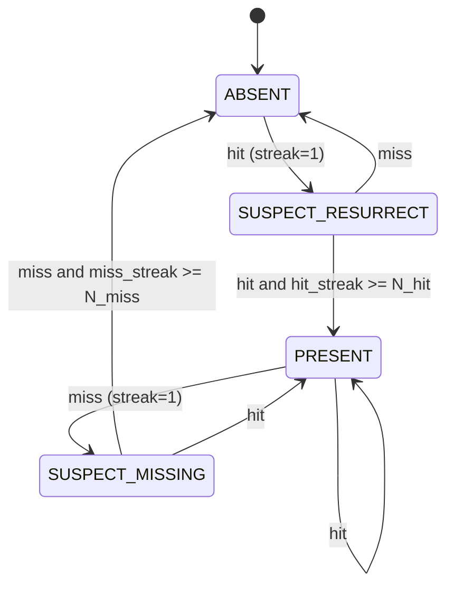

# Zone Presence FSM (Anti-Flapping)

This document defines how `helianthus-ebusgateway` decides whether a semantic zone is present.

The goal is to avoid zone flapping when discovery reads alternate between success and transient failures.

## Inputs

- Discovery probe: B524 `GG=0x03`, register `RR=0x001C` (`zone index`) per instance (`0x00..0x0A`).
- A probe result is treated as:
  - **hit** when the request was checked and `RR=0x001C` is not `0xFF`.
  - **miss** when the request was checked and `RR=0x001C` is `0xFF`.
  - **unknown** when the request was not checked (timeout/error); unknown does not advance counters.

`ebusd-tcp` fallback hydration (`grab result all`) feeds the same hit path for discovered zones.

## Config Knobs

- `-semantic-zone-presence-miss-threshold` (default `3`)
- `-semantic-zone-presence-hit-threshold` (default `2`)

Meaning:

- `N_miss`: consecutive misses required before an existing zone is removed.
- `N_hit`: consecutive hits required before an absent zone is reintroduced.

## State Machine

## Transition Rules

| Current | Event | Next | Counter effect | Publish effect |
| --- | --- | --- | --- | --- |
| `ABSENT` | hit | `SUSPECT_RESURRECT` or `PRESENT` | `hit_streak++`, `miss_streak=0` | no publish until `PRESENT` |
| `SUSPECT_RESURRECT` | hit | `SUSPECT_RESURRECT` or `PRESENT` | `hit_streak++`, `miss_streak=0` | publish only when promoted to `PRESENT` |
| `SUSPECT_RESURRECT` | miss | `ABSENT` | `hit_streak=0` | no zone published |
| `PRESENT` | hit | `PRESENT` | `miss_streak=0` | zone remains published |
| `PRESENT` | miss | `SUSPECT_MISSING` or `ABSENT` | `miss_streak++`, `hit_streak=0` | zone remains published until `ABSENT` |
| `SUSPECT_MISSING` | hit | `PRESENT` | `miss_streak=0` | zone remains published |
| `SUSPECT_MISSING` | miss | `SUSPECT_MISSING` or `ABSENT` | `miss_streak++`, `hit_streak=0` | remove zone only when promoted to `ABSENT` |

## Publication Contract

- Only `PRESENT` zones are included in semantic zone payloads.
- `SUSPECT_MISSING` keeps the existing zone published.
- `ABSENT` removes the zone from published semantic payload.
- `SUSPECT_RESURRECT` does not publish a new zone until `N_hit` is reached.

This provides hysteresis:

- short outages do not immediately remove zones;
- single recovery blips do not immediately re-add zones.
