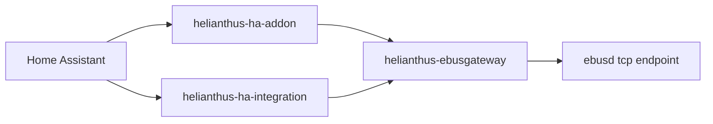

# Canonical End-to-End Smoke Runbook

This runbook defines the canonical smoke topology and execution order across gateway, add-on, and Home Assistant integration.

## Topology

## Execution order

Run in order and stop on first failure:

1. **Gateway smoke** (`helianthus-ebusgateway`, issue [#85](https://github.com/d3vi1/helianthus-ebusgateway/issues/85)).
2. **Add-on smoke** (`helianthus-ha-addon`, issue [#24](https://github.com/d3vi1/helianthus-ha-addon/issues/24)).
3. **HA integration smoke** (`helianthus-ha-integration`, issue [#52](https://github.com/d3vi1/helianthus-ha-integration/issues/52)).

## Artifacts, logs, pass/fail

| Stage | Expected artifacts/logs | Pass criteria | Fail criteria |
| --- | --- | --- | --- |
| Gateway (#85) | `artifacts/smoke-report.json` and smoke stdout | JSON `success=true`, `read_only=true`, and `startup/scan/graphql/mcp.ok=true` | missing report, `success=false`, or any required check `ok=false` |
| Add-on (#24) | exported add-on logs file and checklist output from `scripts/smoke_addon_checklist.py` | checklist ends with `OVERALL PASS` and exits `0`; required log markers present | checklist exits `1` or any `CHECK_*` line is `FAIL` |
| HA integration (#52) | checklist output from `custom_components.helianthus.smoke_profile` | checklist ends with `OVERALL PASS` (or JSON `ok=true`) and exits `0` | checklist exits `1` or any smoke check fails |

## Repo-specific runbooks

- Gateway smoke runbook: `helianthus-ebusgateway` README smoke section  
  https://github.com/d3vi1/helianthus-ebusgateway/blob/main/README.md#smoke-test-context-and-limits
- Add-on smoke runbook: `helianthus-ha-addon/SMOKE_RUNBOOK.md`  
  https://github.com/d3vi1/helianthus-ha-addon/blob/main/SMOKE_RUNBOOK.md
- Integration smoke runbook: `helianthus-ha-integration` README smoke section  
  https://github.com/d3vi1/helianthus-ha-integration/blob/main/README.md#smoke-profile-local-gateway-graphql

## Operational rule

End-to-end smoke is **PASS** only when all three stages pass in sequence with no skipped stage.
