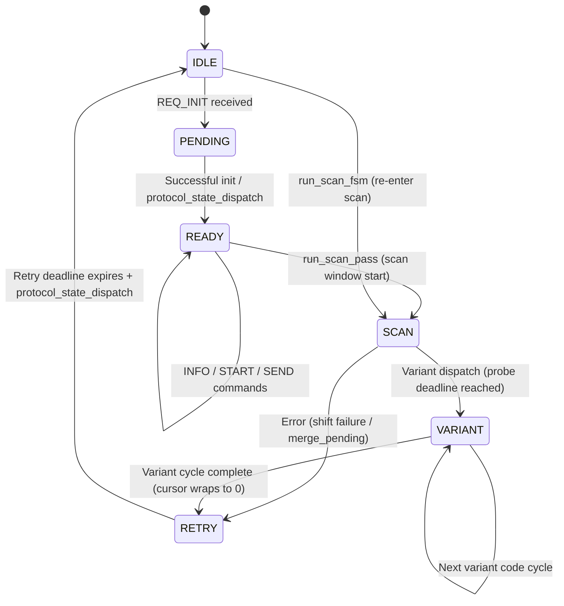
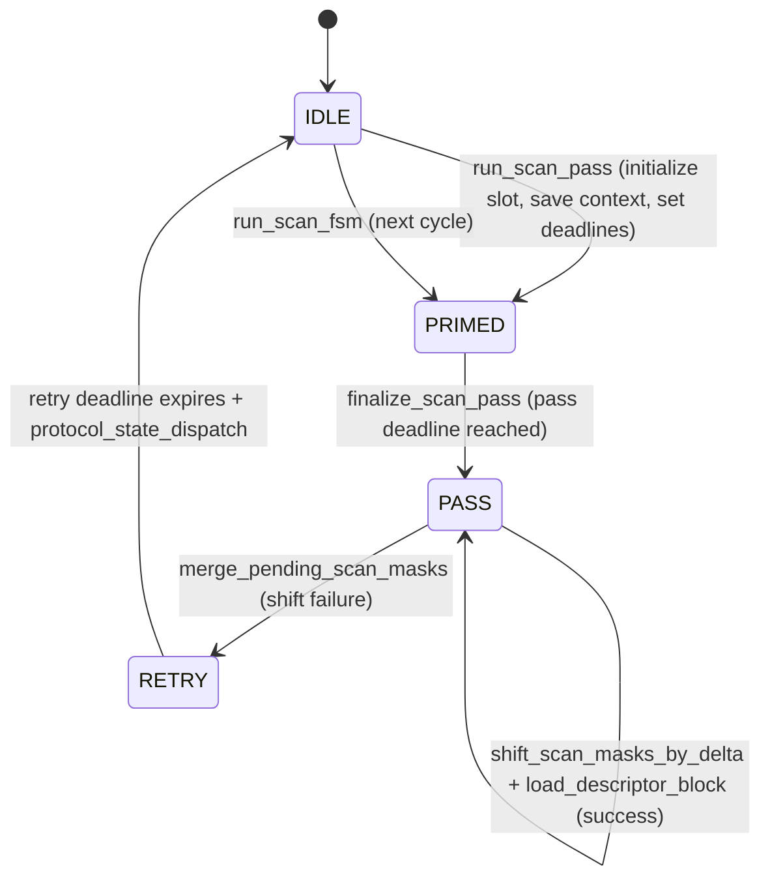
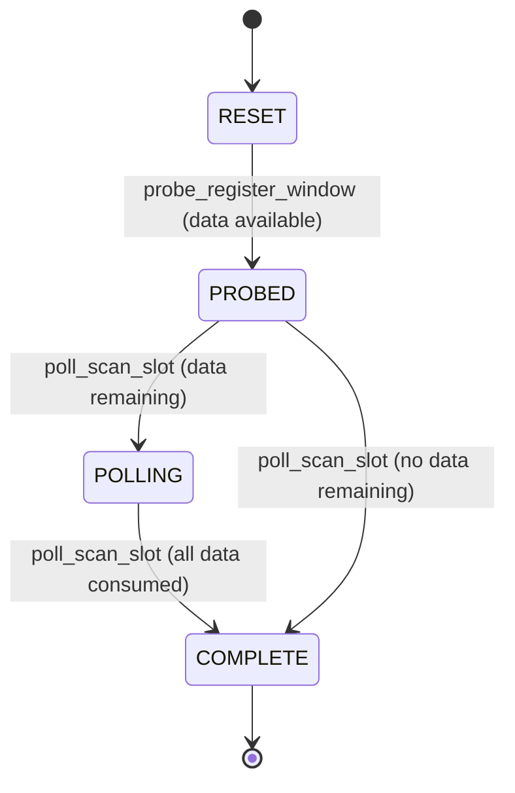
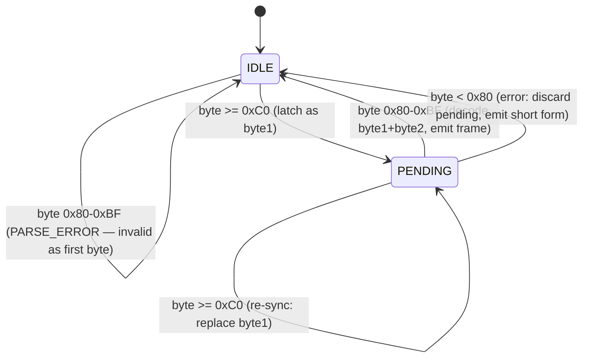
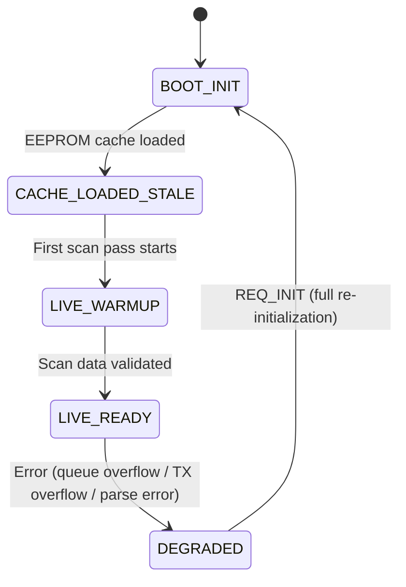

# PIC16F15356 Firmware State Machines

This document describes all state machines in the PIC16F15356 eBUS adapter firmware.

See also:

- [`firmware/pic16f15356-overview.md`](pic16f15356-overview.md) for the firmware architecture.
- [`protocols/enh.md`](../protocols/enh.md) for the Enhanced adapter protocol encoding.

## Protocol State FSM

The protocol state FSM governs the top-level runtime lifecycle. It determines whether the firmware is idle, initializing, scanning, or recovering from an error.

States are defined in `picfw_protocol_state_t`:

| Value | Name | Description |
|---|---|---|
| 0 | IDLE | No active session, waiting for host INIT |
| 1 | PENDING | INIT received, negotiation in progress |
| 2 | ARMED | Defined but unused in current firmware |
| 3 | READY | Session active, processing commands |
| 5 | VARIANT | Scan variant dispatch in progress |
| 6 | OFFSET_SCAN | Offset scan mode (reserved) |
| 7 | SCAN | Active scan pass running |
| 8 | RETRY | Error recovery, waiting for retry deadline |

Note: value 4 is intentionally absent. ARMED (2) is defined in the enum but not used in the current firmware implementation.

Each state transition also carries a flags byte (`protocol_state_flags`):

| Value | Name | Meaning |
|---|---|---|
| `0x00` | FLAGS_IDLE | Normal operation |
| `0x01` | FLAGS_RETRY | Retry recovery active |
| `0x03` | FLAGS_SCAN | Scan window active |

## Scan Phase FSM

The scan phase FSM manages the lifecycle of a single scan pass within the scan engine. It runs inside the protocol state SCAN/VARIANT umbrella.

States are defined in `picfw_runtime_scan_phase_t`:

| Value | Name | Description |
|---|---|---|
| 0 | IDLE | No scan pass active |
| 1 | PRIMED | Scan pass initialized, waiting for pass deadline |
| 2 | PASS | Pass deadline reached, processing descriptors |
| 3 | RETRY | Descriptor processing failed, waiting for retry deadline |

### Descriptor Loading Path in PASS

When the scan phase reaches PASS:

1. `shift_scan_masks_by_delta(delta=1)` -- attempt to shift scan masks by one position
2. On success: `load_descriptor_block()` -- read 8 bytes (data + mask), merge with seed, validate
3. On failure: `merge_pending_scan_masks()` -- fallback merge, transition to RETRY

### Variant Dispatch in PASS

After descriptor processing, if the probe deadline has been reached:

1. Select variant code from the 7-element rotation table: `{0x01, 0x33, 0x35, 0x36, 0x3A, 0x3B, 0x03}`
2. Call `dispatch_scan_code(code)` for the selected variant
3. Re-initialize the scan slot and save context
4. Advance `scan_dispatch_cursor` with bounded reset (`if (cursor >= 7) cursor = 0` -- avoids PIC16 software division; no modulo operator)
5. If cursor wraps to 0: transition to RETRY (full cycle complete)
6. Otherwise: set probe deadline, transition protocol to VARIANT

### Implementation Notes

The monolithic `picfw_runtime_protocol_state_dispatch` function was decomposed into sub-handlers to reduce cyclomatic complexity:

- `dispatch_flags_retry` -- handles the RETRY flag path (PENDING/READY/RETRY states)
- `dispatch_flags_scan` -- handles the SCAN flag path (validates flags + state)
- `dispatch_common_tail` -- shared tail for both paths (seed restore, state transitions)

State validation (`is_valid_protocol_state`) is inlined directly into `set_protocol_state` rather than being a separate function. This saves one hardware stack level on the frozen call path (see [overview](pic16f15356-overview.md#frozen-call-path)).

Similarly, `picfw_runtime_continue_scan_fsm` was split into `continue_fsm_phase_retry`, `continue_fsm_process_pass_descriptors`, and `continue_fsm_variant_dispatch`.

## Scan Slot Sub-Phase FSM

The scan slot sub-phase tracks the lifecycle of a single scan slot operation within a scan pass. It is a simple linear progression.

States are defined in `picfw_runtime_scan_sub_phase_t`:

| Value | Name | Description |
|---|---|---|
| 0 | RESET | Slot not yet probed |
| 1 | PROBED | Register window probed, data available |
| 2 | POLLING | Actively polling descriptor data |
| 3 | COMPLETE | Slot processing finished |

## ENH Parser FSM

The ENH parser decodes the 2-byte enhanced protocol encoding from the host UART stream. It is implemented in `picfw_enh_parser_t` with two fields: `pending` (boolean) and `byte1` (latched first byte).

| State | Condition | Description |
|---|---|---|
| IDLE | `pending == false` | Waiting for first byte |
| PENDING | `pending == true` | First byte latched, waiting for second byte |

### Decoding

Given `byte1` (bits `1 1 C C C C D D`) and `byte2` (bits `1 0 D D D D D D`):

- Command = `(byte1 >> 2) & 0x0F`
- Data = `(byte1 & 0x03) << 6 | (byte2 & 0x3F)`

### Host Parser Timeout

If 64 ms elapses between `byte1` and `byte2`, the parser resets to IDLE and emits `ERROR_HOST`. This prevents a stale partial frame from corrupting subsequent decoding.

## Startup State Machine

The startup state machine tracks the firmware lifecycle from power-on through live operation and degraded mode.

States are defined in `picfw_startup_state_t`:

| Value | Name | Description |
|---|---|---|
| 0 | BOOT_INIT | Bootloader has handed off to application entry point |
| 1 | CACHE_LOADED_STALE | Scan descriptors loaded from EEPROM cache (may be stale) |
| 2 | LIVE_WARMUP | First live scan cycle in progress, accumulating fresh data |
| 3 | LIVE_READY | Live scan data validated, adapter fully operational |
| 4 | DEGRADED | Error detected (queue overflow, parse error), operating in reduced mode |

### Degraded Mode Triggers

The firmware transitions to DEGRADED when:

- Event queue overflow (`dropped_events` counter increments)
- Host TX queue overflow (`dropped_tx_bytes` counter increments)
- Descriptor parse error (`last_error` set to `ERROR_PARSE`)
- Variant dispatch failure (unsupported scan code)
