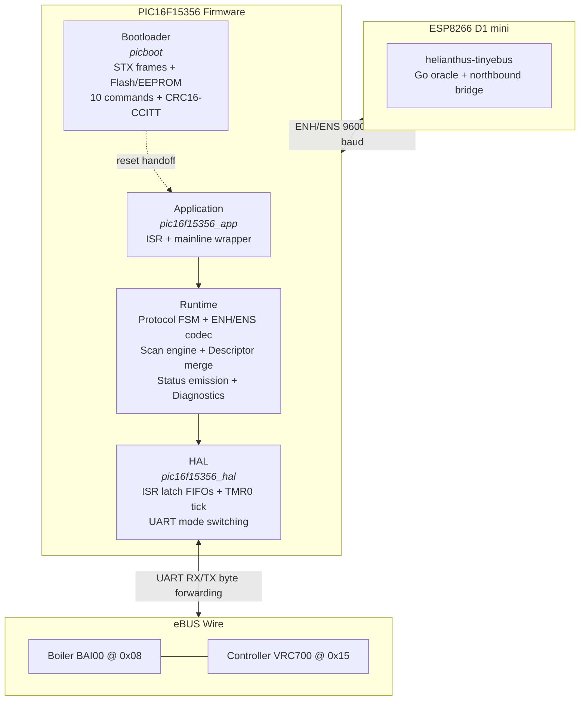

# PIC16F15356 eBUS Adapter Firmware

This document describes the architecture and scope of the PIC16F15356 firmware used in Helianthus eBUS adapter v3.x hardware.

See also:

- [`protocols/enh.md`](../protocols/enh.md) for the Enhanced adapter protocol encoding.
- [`protocols/ens.md`](../protocols/ens.md) for the high-speed serial variant.
- [`architecture/overview.md`](../architecture/overview.md) for the gateway-level architecture.

## Scope

The PIC16F15356 firmware is a **transparent UART bridge** between an ESP host (running the Go gateway) and the eBUS wire. It is **not** an eBUS node. All eBUS protocol responsibilities (CRC-8, frame escaping, arbitration decisions, retransmission) are delegated to the Go gateway running on the ESP host.

The firmware handles:

- SYN byte (`0xAA`) detection and forwarding
- ENH/ENS encoding and decoding between PIC and host
- Bus byte forwarding with arbitration echo suppression
- Scan window management and descriptor processing
- Periodic status emission (snapshot and variant frames)
- Host parser timeout enforcement (64 ms)
- Bootloader for flash and EEPROM updates via STX-framed commands

## Architecture



### Layer Responsibilities

| Layer | Role | Implementation |
|---|---|---|
| **Application** | ISR dispatcher, mainline superloop, clock switch | `pic16f15356_app` |
| **Runtime** | Protocol FSM, ENH/ENS codec, scan engine, descriptor merge, status emission, diagnostics | `runtime.c` (~1920 lines) |
| **HAL** | ISR byte latch into FIFOs, TMR0 tick management, UART baud rate switching | `pic16f15356_hal` |
| **Bootloader** | STX-framed protocol, flash write, EEPROM read/write, 10 commands, CRC16-CCITT verification | `picboot` |

## Protocol Layers

| Layer | Scope | Owner |
|---|---|---|
| Physical | eBUS transceiver, 2400 baud, differential signaling | External hardware |
| Data link | CRC-8, frame escaping (`ESC=0xA9` / `SYN=0xAA`), arbitration decisions | Host gateway (Go) |
| Adapter | ENH/ENS encoding, SYN forwarding, scan windows, status emission | This firmware (PIC) |
| Application | Scan/status interpretation, INFO queries, feature negotiation | Host gateway (Go) |

## Memory Map

| Region | Address Range | Size | Content |
|---|---|---|---|
| Boot | `0x0000`--`0x03FF` | 1 KB | Bootloader image, reset vector, clock-switch helper |
| App | `0x0400`--`0x3FFF` | 15 KB | Application image, ISR dispatcher, runtime, HAL |
| EEPROM | 256 bytes | 256 B | Persistent configuration |
| RAM | 2048 bytes | 2 KB | Runtime state (612 bytes combined static footprint), stack, FIFOs |

The combined static footprint (`picfw_runtime_t` + `picfw_pic16f15356_hal_t`) is 612 bytes (39.8% of the 1536-byte budget -- 75% of 2048). `_Static_assert` guards enforce the struct size limit and power-of-2 ring buffer capacities at compile time.

## Determinism

All code paths have bounded, predictable execution time. 15 determinism rules are enforced automatically by 12 mandatory CI checks (`make check-all`) and a pre-commit hook. See [DETERMINISM.md](https://github.com/Project-Helianthus/helianthus-ebus-adapter-pic/blob/main/DETERMINISM.md) for the full rule set and check commands.

### Rule Summary

| ID | Rule | Threshold | Enforcement |
|----|------|-----------|-------------|
| R1 | No recursion (direct or mutual) | -- | Call graph cycle detection |
| R2 | No malloc/calloc/realloc/free | -- | Pattern scan |
| R3 | All loops bounded by constant | -- | AST pattern analysis |
| R4 | ISR-context WCET | < 60 cycles | Naming pattern + source heuristic |
| R5 | No `__delay` in critical paths | -- | Skipped (HAL simulation model) |
| R6 | No float/double/math.h | -- | Pattern scan |
| R7 | No variable-length arrays | -- | Pattern scan (with R2) |
| R8 | Cyclomatic complexity | < 10 per function (peak: 9) | Decision point counting |
| R9 | Hardware timers for temporal decisions | -- | Manual code review |
| R10 | Ring buffers power-of-2 + bitmask | -- | Buffer size + indexing scan |
| STACK | Call depth limit | < 13 of 16 HW levels | Call graph DFS |
| GUARD | Header include guards | -- | Pattern scan |
| RAM | Static struct footprint | < 75% of 2 KB (612 / 1536) | Host sizeof budget check |
| WCET | ISR-context functions | < 60 cycles (peak: 51) | Source heuristic (`*_isr_*`) |
| CONST | Function pointer arrays | Must be `const` | Qualifier scan |

### Frozen Call Path

The deepest mainline call chain is exactly 13 levels, running through the scan FSM retry path:

```
app_mainline_service -> mainline_service -> runtime_step ->
  service_periodic_status -> try_emit_variant -> emit_periodic_variant ->
    continue_scan_window -> continue_scan_fsm -> continue_fsm_phase_retry ->
      protocol_state_dispatch -> dispatch_flags_retry ->
        set_protocol_state_ready -> set_protocol_state
```

Budget: 13 mainline + 3 ISR (`app_isr_host_rx -> isr_latch_host_rx -> byte_fifo_push`) = 16 hardware stack levels. Zero margin. New function extractions on this path are prohibited.

### Dispatch Table Architecture

The bootloader uses `const` dispatch tables instead of large `switch/case` cascades:

- `PICBOOT_COMMAND_HANDLERS[11]` -- `static const` function pointer array with O(1) command dispatch. Protected by `_Static_assert` on array size and a NULL guard at dispatch time.
- `PICBOOT_VALIDATION_RULES[11]` -- `static const` struct array with per-command validation rules (`min_data_len`, `max_data_len`, `needs_even`). Protected by `_Static_assert`.

This pattern is explicitly permitted by R8 (DETERMINISM.md). Mutable function pointer dispatch remains prohibited.

## Provenance

All register values and code paths were recovered from Ghidra decompilation of the original production `combined.hex` image (76 functions, 10K decompiled lines). The firmware was then re-implemented as a clean-room C codebase, cross-validated against a Go reference oracle (`helianthus-tinyebus`) for bit-exact parity.

## Related Firmware Documents

- [State Machines](pic16f15356-fsm.md) -- protocol FSM, scan phase FSM, ENH parser, startup states
- [Timing Model](pic16f15356-timing.md) -- clock, TMR0, UART baud rates, scan deadlines
- [Register Configuration](pic16f15356-registers.md) -- oscillator, timer, EUSART, interrupt, descriptor addresses
