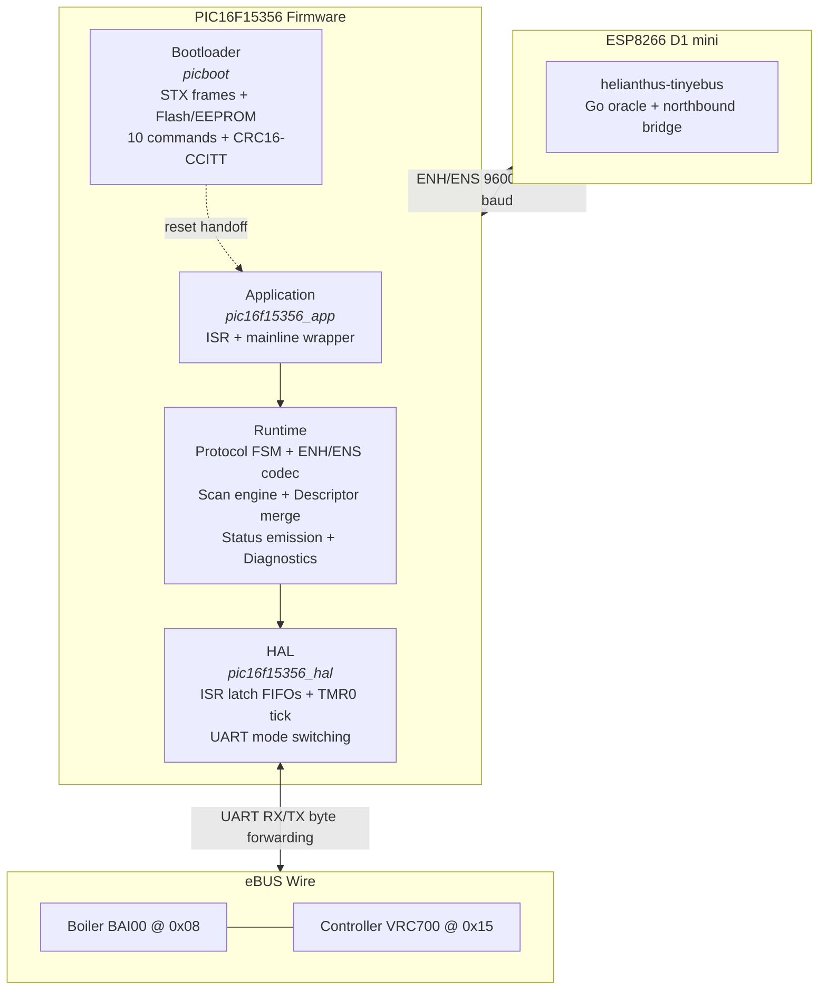

# PIC16F15356 eBUS Adapter Firmware

This document describes the architecture and scope of the PIC16F15356 firmware used in Helianthus eBUS adapter v3.x hardware.

See also:

- [`protocols/enh.md`](../protocols/enh.md) for the Enhanced adapter protocol encoding.
- [`protocols/ens.md`](../protocols/ens.md) for the high-speed serial variant.
- [`architecture/overview.md`](../architecture/overview.md) for the gateway-level architecture.

## Scope

The PIC16F15356 firmware is a **transparent UART bridge** between an ESP host (running the Go gateway) and the eBUS wire. It is **not** an eBUS node. All eBUS protocol responsibilities (CRC-8, frame escaping, arbitration decisions, retransmission) are delegated to the Go gateway running on the ESP host.

The firmware handles:

- SYN byte (`0xAA`) detection and forwarding
- ENH/ENS encoding and decoding between PIC and host
- Bus byte forwarding with arbitration echo suppression
- Scan window management and descriptor processing
- Periodic status emission (snapshot and variant frames)
- Host parser timeout enforcement (64 ms)
- Bootloader for flash and EEPROM updates via STX-framed commands

## Architecture

### Layer Responsibilities

| Layer | Role | Implementation |
|---|---|---|
| **Application** | ISR dispatcher, mainline superloop, clock switch | `pic16f15356_app` |
| **Runtime** | Protocol FSM, ENH/ENS codec, scan engine, descriptor merge, status emission, diagnostics | `runtime.c` (1830 lines) |
| **HAL** | ISR byte latch into FIFOs, TMR0 tick management, UART baud rate switching | `pic16f15356_hal` |
| **Bootloader** | STX-framed protocol, flash write, EEPROM read/write, 10 commands, CRC16-CCITT verification | `picboot` |

## Protocol Layers

| Layer | Scope | Owner |
|---|---|---|
| Physical | eBUS transceiver, 2400 baud, differential signaling | External hardware |
| Data link | CRC-8, frame escaping (`ESC=0xA9` / `SYN=0xAA`), arbitration decisions | Host gateway (Go) |
| Adapter | ENH/ENS encoding, SYN forwarding, scan windows, status emission | This firmware (PIC) |
| Application | Scan/status interpretation, INFO queries, feature negotiation | Host gateway (Go) |

## Memory Map

| Region | Address Range | Size | Content |
|---|---|---|---|
| Boot | `0x0000`--`0x03FF` | 1 KB | Bootloader image, reset vector, clock-switch helper |
| App | `0x0400`--`0x3FFF` | 15 KB | Application image, ISR dispatcher, runtime, HAL |
| EEPROM | 256 bytes | 256 B | Persistent configuration |
| RAM | 2048 bytes | 2 KB | Runtime state (`picfw_runtime_t` <= 600 bytes), stack, FIFOs |

The `picfw_runtime_t` struct is statically asserted to fit within 600 bytes, leaving headroom for the hardware call stack (16 levels) and local variables.

## Determinism

All code paths have bounded, predictable execution time. No recursion, no dynamic allocation, no floating point, all loops bounded by constants. See [DETERMINISM.md](https://github.com/Project-Helianthus/helianthus-ebus-adapter-pic/blob/main/DETERMINISM.md) for the full rule set.

## Provenance

All register values and code paths were recovered from Ghidra decompilation of the original production `combined.hex` image (76 functions, 10K decompiled lines). The firmware was then re-implemented as a clean-room C codebase, cross-validated against a Go reference oracle (`helianthus-tinyebus`) for bit-exact parity.

## Related Firmware Documents

- [State Machines](pic16f15356-fsm.md) -- protocol FSM, scan phase FSM, ENH parser, startup states
- [Timing Model](pic16f15356-timing.md) -- clock, TMR0, UART baud rates, scan deadlines
- [Register Configuration](pic16f15356-registers.md) -- oscillator, timer, EUSART, interrupt, descriptor addresses
