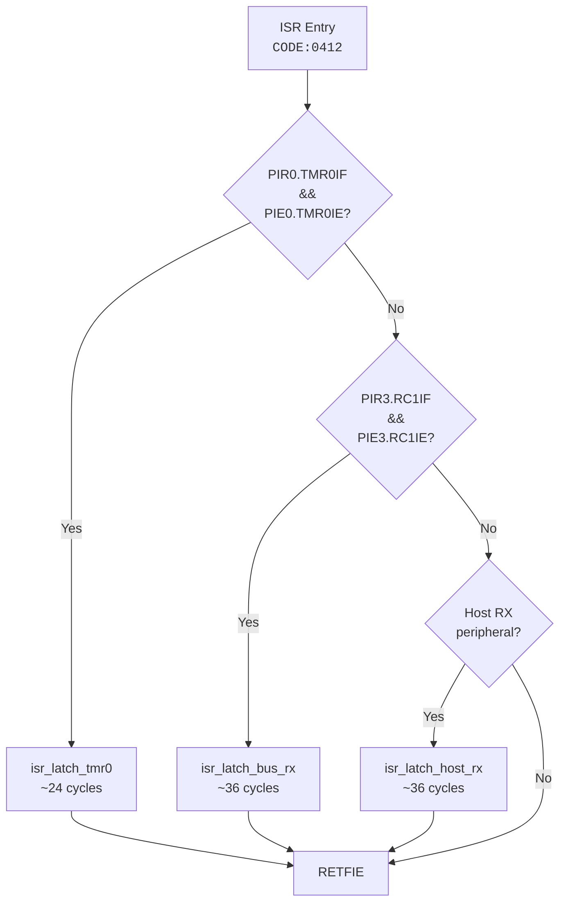

# PIC16F15356 Register Configuration

This document catalogs all PIC16F15356 SFR (Special Function Register) configurations recovered from the original firmware binary via Ghidra decompilation.

See also:

- [`firmware/pic16f15356-timing.md`](pic16f15356-timing.md) for computed timing values derived from these registers.

## Oscillator Registers

| Register | Value | Meaning |
|---|---|---|
| OSCCON1 | `0x60` | NOSC = HFINTOSC (110), NDIV = 1:1 (0000) |
| OSCFRQ | `0x06` | HFINTOSC frequency = 32 MHz |

### CONFIG1 Fuses

| Field | Value | Meaning |
|---|---|---|
| RSTOSC | `110` | Reset oscillator = HFINTOSC at 1 MHz |
| FEXTOSC | `100` | External oscillator = OFF |
| CONFIG1 word | `0x3FEC` | Combined fuse value |

### Clock-Switch Helpers

Two independent copies of the clock-switch helper exist in the binary:

| Copy | Address | Context |
|---|---|---|
| Bootloader | `CODE:0399` | Switches clock before bootloader UART init |
| Application | `CODE:3E84` | Switches clock at application entry after reset handoff |

Both copies write identical values (`OSCCON1=0x60`, `OSCFRQ=0x06`) and produce identical 32 MHz runtime configuration.

## Timer 0 Registers

| Register | Value | Meaning |
|---|---|---|
| T0CON0 | `0x80` | Timer enabled (T0EN=1), 8-bit mode (T016BIT=0) |
| T0CON1 | `0x44` | Clock source = Fosc/4 (T0CS=010), prescaler = 1:16 (T0CKPS=0100) |
| TMR0H | `0xF9` | Period register (counts 0 to 249, total 250 counts) |

### ISR Trigger

The TMR0 ISR is triggered when:

1. `PIE0.TMR0IE` (Timer 0 interrupt enable) is set, **and**
2. `PIR0.TMR0IF` (Timer 0 interrupt flag) is set

The ISR dispatcher at `CODE:0412` checks up to 3 pending/enable bit pairs in sequence to determine which peripheral triggered the interrupt.

### ISR Latch Model

The ISR only latches received bytes into ring buffer FIFOs. All protocol processing (ENH decoding, scan FSM, status emission) happens in the mainline superloop. This ensures the ISR has bounded, minimal execution time (peak: 51 cycles, budget: 60).

### Ring Buffer Capacities

All ring buffers use power-of-2 capacities with bitmask indexing (`& (CAP - 1u)`) instead of modulo. This eliminates software division on PIC16F (no hardware divider) and is enforced by `_Static_assert` at compile time.

| Buffer | Capacity | Type | Use |
|--------|----------|------|-----|
| `ISR_LATCH_CAP` | 16 | Ring (FIFO) | ISR byte FIFOs (`host_rx`, `bus_rx`, `host_tx`) |
| `EVENT_QUEUE_CAP` | 32 | Ring (queue) | Runtime event queue |
| `HOST_TX_CAP` | 128 | Ring (queue) | Host TX byte queue |
| `DESCRIPTOR_DATA_CAP` | 64 | Linear | Descriptor data buffer (sequential, not ring) |

`HOST_TX_CAP` was 96 in the original firmware binary. Changed to 128 (nearest power-of-2 up) to enable correct bitmask indexing -- `& 95` (0x5F) is not a valid ring buffer mask, while `& 127` (0x7F) is. `DESCRIPTOR_DATA_CAP` was 48; changed to 64 for power-of-2 alignment (this is a linear buffer, but consistency avoids false positives from the R10 checker).

## EUSART1 Registers

### Default Baud (9600)

| Register | Value | Meaning |
|---|---|---|
| SP1BRGL | `0x40` | Low byte of SPBRG |
| SP1BRGH | `0x03` | High byte of SPBRG |
| Combined SPBRG | `0x0340` (832) | Baud = 32 MHz / (4 * 833) = ~9604 |

### High-Speed Baud (115200)

| Register | Value | Meaning |
|---|---|---|
| SP1BRGL | `0x44` | Low byte of SPBRG |
| SP1BRGH | `0x00` | High byte of SPBRG |
| Combined SPBRG | `0x0044` (68) | Baud = 32 MHz / (4 * 69) = ~115,942 |

### Common EUSART1 Registers

| Register | Value | Bit Fields |
|---|---|---|
| TX1STA | `0x24` | TXEN=1 (transmit enabled), SYNC=0 (async), BRGH=1 (high baud rate) |
| RC1STA | `0x90` | SPEN=1 (serial port enabled), CREN=1 (continuous receive) |
| BAUD1CON | `0x08` | BRG16=1 (16-bit baud rate generator enabled) |

### Bank Address

SP1BRGL is located at SFR address `0x11B` in bank `0x02`.

## Interrupt Configuration

### Global Interrupt Control

| Register | Bits | State |
|---|---|---|
| INTCON | GIE | Enabled (global interrupt enable) |
| INTCON | PEIE | Enabled (peripheral interrupt enable) |

### ISR Dispatcher

The ISR entry point at `CODE:0412` checks 3 peripheral interrupt pending/enable bit pairs in priority order:



The first two checks are confirmed from the binary (TMR0 timer and EUSART1 receive for bus bytes). The host RX interrupt source depends on the hardware configuration -- the PIC may use a second EUSART, MSSP SPI, or another peripheral for host communication. The exact PIR/PIE pair for the host channel has not been fully recovered from the original binary. No TX interrupt handler exists; transmit is polled.

## Descriptor Address Computation

The scan engine computes descriptor memory addresses from a slot ID using the following formula:

### Address Low Byte

```text
addr_lo = (slot_id * 0x20) + 8
```

### Address High Byte

```text
addr_hi = bit_reverse_5(slot_id[7:3]) | 0x24
```

Where `bit_reverse_5` extracts bits 7 through 3 of `slot_id` and reverses their order into bits 4 through 0:

```text
bit7 -> bit4
bit6 -> bit3
bit5 -> bit2
bit4 -> bit1
bit3 -> bit0
```

An additional carry correction is applied: if `slot_id * 0x20` overflows byte range (i.e., `0xF7 < (slot_id * 0x20) & 0xFF`), `addr_hi` is incremented by 1.

The final descriptor cursor is: `(addr_hi << 8) | addr_lo`.

### Known Descriptor Bases

The firmware uses a pre-computed lookup table (`scan_descriptor_base_for_slot()`) rather than the general formula above. The lookup values were extracted from the original binary:

| Slot | Cursor | High Byte | Low Byte |
|---|---|---|---|
| `0x01` | `0x0264` | `0x02` | `0x64` |
| `0x03` | `0x0260` | `0x02` | `0x60` |
| `0x06` | `0x0268` | `0x02` | `0x68` |

The general formula (addr_lo / addr_hi computation above) describes the algorithm recovered from `initialize_scan_slot_full()` in Ghidra. The lookup table entries may have been pre-computed from a different revision of that algorithm or hand-tuned in the original firmware.

### Cursor Advancement

The descriptor cursor advances by `0x2C` (44 bytes) per recompute cycle in `recompute_scan_masks_tail()`. This stride covers one complete descriptor block (8 bytes data + mask) plus alignment padding.

## Scan Mask Seed

The scan mask seed is a fixed 32-bit constant used to initialize the scan mask at each slot initialization:

```text
SCAN_MASK_SEED_DEFAULT = 0x00060101
```

Byte breakdown:

| Byte | Position | Value |
|---|---|---|
| lo | `[7:0]` | `0x01` |
| b1 | `[15:8]` | `0x01` |
| b2 | `[23:16]` | `0x06` |
| hi | `[31:24]` | `0x00` |

## Determinism Notes

- All register values in this document were recovered from Ghidra decompilation of the original `combined.hex` binary image. They have **not** been measured on live silicon.
- Two copies of the clock-switch helper exist (bootloader at `CODE:0399` and application at `CODE:3E84`). Both produce identical results. This redundancy exists because the bootloader and application are independently linked images sharing the same flash.
- The 921,600 baud bootloader register path has **not yet been recovered** from the binary. The bootloader fast-mode baud rate is documented in the host-side contract (`ebuspicloader`) but the specific SPBRG value for 921,600 baud at 32 MHz has not been extracted.
- The descriptor address computation formula was recovered from the decompiled `initialize_scan_slot_full()` function and cross-validated against the Go reference oracle (`helianthus-tinyebus`).
