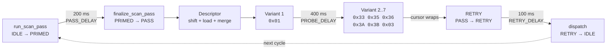

# PIC16F15356 Timing Model

This document describes the clock, timer, UART, and scan timing configuration of the PIC16F15356 eBUS adapter firmware.

See also:

- [`firmware/pic16f15356-overview.md`](pic16f15356-overview.md) for the firmware architecture.
- [`protocols/enh.md`](../protocols/enh.md) for the Enhanced adapter protocol encoding.

## Clock Configuration

The PIC16F15356 uses the internal high-frequency oscillator (HFINTOSC) in two modes:

| Phase | Clock Source | Frequency | Configuration |
|---|---|---|---|
| Reset | HFINTOSC | 1 MHz | CONFIG1 = `0x3FEC` (RSTOSC=110, FEXTOSC=100) |
| Runtime | HFINTOSC | 32 MHz | OSCCON1 = `0x60`, OSCFRQ = `0x06` |

The clock switch from 1 MHz to 32 MHz is performed by a helper function that exists in two identical copies: one in the bootloader region (`CODE:0399`) and one in the application region (`CODE:3E84`). Both produce identical results.

### Instruction Cycle

| Parameter | Value |
|---|---|
| System clock (Fosc) | 32 MHz |
| Instruction clock (Fosc/4) | 8 MHz |
| Instruction cycle time | 125 ns |

## TMR0 Configuration

Timer 0 provides the ISR heartbeat that drives the entire firmware timing model.

| Register | Value | Meaning |
|---|---|---|
| T0CON1 | `0x44` | Clock source = Fosc/4, prescaler = 1:16 |
| T0CON0 | `0x80` | Timer enabled, 8-bit mode |
| TMR0H | `0xF9` | Period register (250 counts, since `0xF9 + 1 = 250`) |

### ISR Interval

```text
ISR period = (TMR0H + 1) * prescaler / instruction_clock
           = 250 * 16 / 8,000,000
           = 500 microseconds
```

### Scheduler Tick

The ISR increments a subtick counter. Every 200 subticks, the scheduler fires:

```text
Scheduler tick = ISR period * divider
               = 500 us * 200
               = 100,000 us
               = 100 ms
```

| Parameter | Value |
|---|---|
| ISR period | 500 microseconds |
| Software divider | 200 subticks |
| Scheduler tick | 100 ms |

All scan delays, deadlines, and status emission periods are expressed in terms of this 100 ms scheduler tick.

## EUSART1 Configuration

The firmware supports two UART baud rates for host communication:

| Mode | SPBRG | BRGH | BRG16 | Actual Baud | Target Baud | Error |
|---|---|---|---|---|---|---|
| Default | `0x0340` (832) | 1 | 1 | ~9604 | 9600 | +0.04% |
| High-speed | `0x0044` (68) | 1 | 1 | ~115,942 | 115200 | +0.64% |

Baud rate formula (async, BRGH=1, BRG16=1):

```text
Baud = Fosc / (4 * (SPBRG + 1))
```

### EUSART1 Register Values

| Register | Value | Meaning |
|---|---|---|
| BAUD1CON | `0x08` | BRG16 = 1 (16-bit baud rate generator) |
| RC1STA | `0x90` | Serial port enabled (SPEN=1), continuous receive (CREN=1) |
| TX1STA | `0x24` | Transmit enabled (TXEN=1), BRGH=1, asynchronous mode |
| SP1BRGL/SP1BRGH | `0x0340` or `0x0044` | Baud rate generator value |

## Scan Timing

All scan timing constants are defined in `runtime.h` and `runtime.c`. Values are in milliseconds unless noted.

| Constant | Value (hex) | Value (decimal) | Description |
|---|---|---|---|
| `SCAN_PASS_DELAY` | -- | 200 ms | Delay before scan pass finalization (2 scheduler ticks) |
| `SCAN_RETRY_DELAY` | -- | 100 ms | Delay before scan retry (1 scheduler tick) |
| `SCAN_PROBE_DELAY` | -- | 400 ms | Delay between variant probes (4 scheduler ticks) |
| `SCAN_MIN_DELAY` | `0x3C` | 60 ms | Floor for all scan delays (eBUS minimum idle time) |
| `SCAN_DEFAULT_TICK` | `0x0140` | 320 ms | Default protocol tick interval |
| `SCAN_DEFAULT_DEADLINE` | `0x01A4` | 420 ms | Default scan deadline |
| `SCAN_DEFAULT_WINDOW_LIMIT` | `0x0156` | 342 ms | Default scan window limit |
| `SCAN_DEFAULT_SEED` | `0x02A4` | 676 ms | Default scan seed value |
| `SCAN_DEFAULT_MERGED_WINDOW` | `0x01A8` | 424 ms | Default merged window value |
| `SCAN_WINDOW_LIMIT_FLOOR` | `0xF0` | 240 ms | Minimum allowed window limit |
| `SCAN_DELAY_THRESHOLD` | `0x78` | 120 ms | Delay validation threshold |
| `SCAN_MERGED_THRESHOLD` | `0xD2` | 210 ms | Merged window validation threshold |
| `SCAN_WINDOW_DELTA_DEFAULT` | `0x2E` | 46 ms | Default scan window delta |

### Scan Timing Diagram



### Delay Floor Enforcement

All scan delays are clamped to a minimum of `SCAN_MIN_DELAY` (60 ms) by `normalize_scan_delay()`. This ensures the eBUS has minimum idle time between transmissions. Zero delay (initial state) is also clamped to 60 ms.

## Host Parser Timeout

| Parameter | Value |
|---|---|
| Timeout | 64 ms (`PICFW_RUNTIME_HOST_RX_TIMEOUT_MS`) |

If the ENH parser receives `byte1` of an encoded pair but `byte2` does not arrive within 64 ms, the parser resets and emits `ERROR_HOST`. This prevents stale partial frames from corrupting subsequent decoding.

## ISR WCET Budget

All ISR-context functions must complete within 60 instruction cycles (7.5 us at 8 MHz instruction clock). This budget is enforced by `check_wcet_isr.py`, which identifies ISR-context functions by naming pattern (`*_isr_*`) and transitively marks their callees.

| Function | Own Cost | Callee Cost | ISR Overhead | Total |
|----------|----------|-------------|--------------|-------|
| `byte_fifo_push` | ~15 | -- | -- | ~15 (transitive callee) |
| `event_queue_push` | ~18 | -- | -- | ~18 (transitive callee) |
| `isr_latch_tmr0` | ~16 | -- | +8 | ~24 |
| `isr_latch_host_rx` | ~13 | fifo_push ~15 | +8 | ~36 |
| `isr_latch_bus_rx` | ~13 | fifo_push ~15 | +8 | ~36 |
| `isr_enqueue_host_byte` | ~14 | queue_push ~18 | +8 | ~40 |
| `isr_enqueue_bus_byte` | ~14 | queue_push ~18 | +8 | ~40 |
| `app_isr_tmr0` | ~9 | latch_tmr0 ~24 | +8 | ~41 |
| **`app_isr_host_rx`** | ~7 | latch_host_rx ~36 | +8 | **~51 (peak)** |
| **`app_isr_bus_rx`** | ~7 | latch_bus_rx ~36 | +8 | **~51 (peak)** |

ISR overhead (+8 cycles) accounts for the PIC16 interrupt context save and restore (CALL + RETFIE). Estimates use a source-level heuristic: `if` = 3 cycles, assignment = 2, function call = 4, etc. Actual XC8-compiled cycle counts will differ but the relative ordering is preserved.

### Ring Buffer Optimization

All ring buffer index operations use bitmask arithmetic (`& (CAP - 1u)`) instead of modulo (`% CAP`). On PIC16F15356 (no hardware divider), this saves ~40 instruction cycles per push/pop operation -- critical for ISR-context functions where every cycle counts toward the 60-cycle budget.

## Bootloader Baud Rates

The bootloader (separate from the application runtime) supports two transfer speeds:

| Mode | Baud Rate | Status |
|---|---|---|
| Slow / legacy | 115,200 | Documented in host-side contract |
| Fast | 921,600 | Documented in host-side contract |

Note: the 921,600 baud register values have not yet been recovered from the bootloader binary. The bootloader uses the same HFINTOSC 32 MHz clock after its own clock-switch helper runs.

## eBUS Timing Reference

These values describe the eBUS wire protocol timing. They are **not implemented in the PIC firmware** -- all eBUS protocol timing is delegated to the Go gateway on the ESP host.

| Parameter | Value |
|---|---|
| Baud rate | 2400 |
| Bit time | 416.7 microseconds |
| SYN timeout | 50 ms |
| Arbitration window | Within 1 bit-time (~417 microseconds) |
| Arbitration jitter tolerance | ~10 microseconds |

The 10 microsecond jitter tolerance is why the firmware enforces strict determinism: any jitter in byte forwarding can cause lost arbitration and bus corruption.
