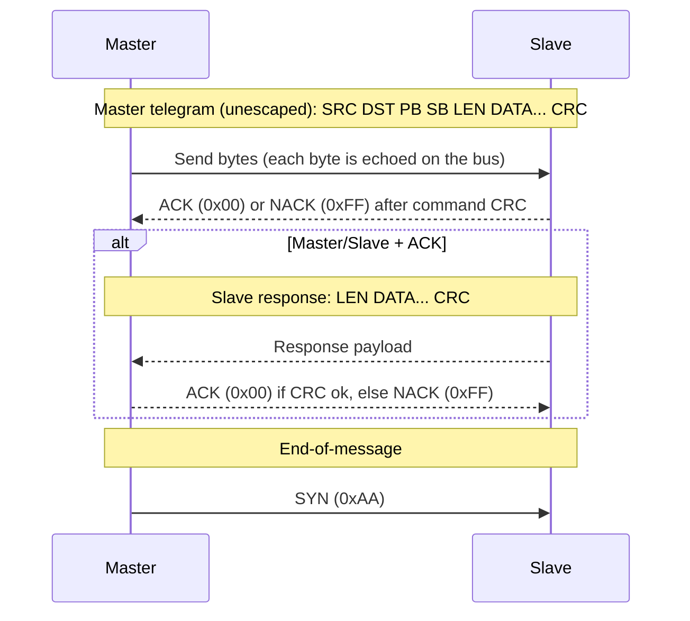

# eBUS Overview (Wire-Level)

This document describes the wire-level framing and rules that are implemented. It focuses on the minimum required to interpret bytes on the bus.

## Frame Layout

An eBUS frame on the wire is represented as:

```text
| SRC | DST | PB | SB | LEN | DATA... | CRC |
|  1  |  1  |  1 |  1 |  1  |  LEN    |  1  |
```

- **SRC**: source address
- **DST**: destination address
- **PB/SB**: primary/secondary command bytes
- **LEN**: number of data bytes
- **DATA**: payload bytes
- **CRC**: CRC8 over the unescaped data (see CRC section)

## Frame Types

Frame type is derived from the destination address:

- **Broadcast**: `DST = 0xFE`
- **Master/Master**: `DST` has a valid master address pattern
- **Master/Slave**: any other valid destination address

This inference determines whether an ACK-only exchange is expected (master/master) or a full response frame (master/slave).

### Master Address Pattern

In direct-mode eBUS implementations (including Helianthus), “master” addresses are typically recognized by a nibble pattern:

- A destination is treated as a **master address** if **both** the high and low nibbles are one of: `0x0`, `0x1`, `0x3`, `0x7`, `0xF`.
- Examples: `0x10`, `0x31`, `0xF1`, `0x33`.

Addresses equal to `0xA9` (escape) or `0xAA` (SYN) are invalid in address positions.

## ACK/NACK Symbols

The bus uses one-byte symbols:

```text
ACK  = 0x00
NACK = 0xFF
```

Broadcast frames do not receive ACK/NACK or responses.

Idle periods may include `SYN` (`0xAA`) bytes on the bus; receivers typically ignore these while waiting for an `ACK`/`NACK`.

## Transaction Flow (Direct Mode)

The eBUS “direct” transaction flow used by ebusd-style implementations is:



Key points:

- **Per-byte echo**: When a master drives a symbol onto the bus it will also observe the same symbol (“echo”). An echo mismatch indicates arbitration loss or a collision.
- **ACK/NAK timing**: `ACK`/`NACK` is exchanged **once per command**, after the master sends the command CRC (not after each byte).
- **Response shape**: In master/slave transactions the slave response begins with a **length byte** and does not repeat source/target addresses.
- **SYN** (`0xAA`) is used as an **end-of-message** delimiter and may also appear during idle.

## CRC8 and Escaping

CRC8 is computed over the frame data with special handling for control symbols:

- **CRC8 polynomial:** `0x9B` (init `0x00`).
- `0xA9` (escape) is treated as `0xA9 0x00`
- `0xAA` (SYN) is treated as `0xA9 0x01`

This substitution is applied before CRC8 updates so that control symbols do not break framing.

CRC8 coverage depends on the direct-mode phase:

- **Master telegram CRC** is computed over: `SRC DST PB SB LEN DATA...`
- **Slave response CRC** is computed over: `LEN DATA...` (responses do not repeat addresses in direct mode)

On the wire, the same escape mechanism is used when sending these control bytes:

- Literal `0xA9` is encoded as `0xA9 0x00`
- Literal `0xAA` is encoded as `0xA9 0x01`

## Example

```text
SRC=0x10 DST=0x08 PB=0xB5 SB=0x04 LEN=0x01 DATA=0x7F CRC=0x??
```

The CRC byte depends on the exact CRC8 implementation and the escape-aware substitution described above.

## Common Discovery Functions

This section documents common discovery-style requests used to enumerate devices and read basic identity metadata. The layouts describe the **payload bytes** inside an eBUS frame (not including CRC/escaping).

### QueryExistence (0x07 0xFE)

QueryExistence is commonly used as a best-effort “who is present?” broadcast.

```text
Master telegram:
  DST = 0xFE (broadcast)
  PB  = 0x07
  SB  = 0xFE
  LEN = 0x00
  DATA = (empty)
```

Notes:
- Broadcast messages do not have a response telegram.
- Some stacks (including ebusd) use QueryExistence as a trigger to refresh internal address state that can later be queried (e.g. via the ebusd TCP `info` command).

### Identification Scan (0x07 0x04)

Identification (often “scan” in ebusd terminology) reads a device’s manufacturer, device id, and software/hardware versions.

```text
Master telegram:
  DST = <candidate slave address>
  PB  = 0x07
  SB  = 0x04
  LEN = 0x00
  DATA = (empty)
```

Observed slave response payload layout:

```text
  0: manufacturer   byte
  1..(N-5): device_id ASCII (NUL-padded; length varies)
  (N-4)..(N-3): sw   2 bytes (opaque)
  (N-2)..(N-1): hw   2 bytes (opaque)
```

Notes:
- The response length varies by device because the device id field is variable-length.
- Many tools treat `sw`/`hw` as opaque hex.

## See Also

- `protocols/ebusd-tcp.md` – ebusd daemon TCP command protocol (for tooling that sends direct-mode telegrams via ebusd).
- `protocols/basv.md` – BASV discovery flow (observed).
