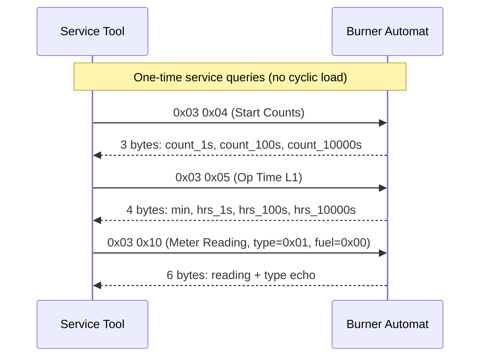

# eBUS Service 0x03 — Service Data, Burner Automats (Application Layer)

> Source: eBUS Specification Application Layer (OSI 7) V1.6.1, §3.1

## Scope

Service `0x03` provides diagnostic and service data collection from burner control units. It covers start counts, operating times (multi-level burners), fuel consumption, and a generic meter reading query. All commands are one-time (service-event only), generating no recurring bus load.

## Terminology

<!-- legacy-role-mapping:begin -->
> Legacy role mapping: `master` → `initiator`, `slave` → `target`. Helianthus documentation uses `initiator`/`target`.
<!-- legacy-role-mapping:end -->

Secondary commands `0x00`–`0x03` are barred for historical reasons.

## Command Summary

| PB | SB | Name | Direction | Telegram Type | Cycle Rate |
|---:|---:|---|---|---|---|
| `0x03` | `0x04` | Start Counts | Initiator → Target | Initiator/Target | One-time |
| `0x03` | `0x05` | Operating Time Level 1 | Initiator → Target | Initiator/Target | One-time |
| `0x03` | `0x06` | Operating Time Level 2 | Initiator → Target | Initiator/Target | One-time |
| `0x03` | `0x07` | Operating Time Level 3 | Initiator → Target | Initiator/Target | One-time |
| `0x03` | `0x08` | Fuel Quantity Counter | Initiator → Target | Initiator/Target | One-time |
| `0x03` | `0x10` | Meter Reading | Initiator → Target | Initiator/Target or Initiator/Initiator | One-time |

## Commands

### Service 0x03 0x04 — Complete Reading of Start Counts

**Description:** Reads the total start count of a burner control unit. The response carries three CHAR bytes (decimal 0–99 each), encoding a value 0–999999.

**Request payload:** Empty (`NN=0x00`).

**Response payload:**

| Byte | Field | Type | Range | Description |
|---:|---|---|---|---|
| 0 | start_count_1s | CHAR | 0–99 | 1s position (decimal, not BCD) |
| 1 | start_count_100s | CHAR | 0–99 | 100s position |
| 2 | start_count_10000s | CHAR | 0–99 | 10000s position |

**Decoding:** `total = byte0 + byte1 × 100 + byte2 × 10000`

---

### Service 0x03 0x05 — Complete Operating Time, Level 1

**Description:** Reads the operating time counter for level 1 (or single-level burners). Response format: `DD.HH.HH:MM` (99.99.99:59).

**Request payload:** Empty (`NN=0x00`).

**Response payload:**

| Byte | Field | Type | Range | Description |
|---:|---|---|---|---|
| 0 | minutes | CHAR | 0–59 | Operating minutes |
| 1 | hours_1s | CHAR | 0–99 | 1s hours |
| 2 | hours_100s | CHAR | 0–99 | 100s hours |
| 3 | hours_10000s | CHAR | 0–99 | 10000s hours |

**Decoding:** `total_hours = byte1 + byte2 × 100 + byte3 × 10000`, `total_minutes = byte0`

---

### Service 0x03 0x06 — Complete Operating Time, Level 2

**Description:** Reads the operating time counter for burner level 2. Same response format as level 1.

**Request payload:** Empty (`NN=0x00`).

**Response payload:** Identical layout to [0x03 0x05](#service-0x03-0x05--complete-operating-time-level-1).

---

### Service 0x03 0x07 — Complete Operating Time, Level 3

**Description:** Reads the operating time counter for burner level 3. Same response format as level 1.

**Request payload:** Empty (`NN=0x00`).

**Response payload:** Identical layout to [0x03 0x05](#service-0x03-0x05--complete-operating-time-level-1).

---

### Service 0x03 0x08 — Complete Reading of Fuel Quantity Counter

**Description:** Reads the fuel quantity counter. The first byte indicates the fuel unit, followed by four CHAR-encoded quantity digits (decimal 0–99 each).

**Request payload:** Empty (`NN=0x00`).

**Response payload:**

| Byte | Field | Type | Range | Description |
|---:|---|---|---|---|
| 0 | fuel_unit | CHAR | 1–2 | `0x01` = oil (litres), `0x02` = gas (m³) |
| 1 | qty_1s | CHAR | 0–99 | 1s digits |
| 2 | qty_100s | CHAR | 0–99 | 100s digits |
| 3 | qty_10000s | CHAR | 0–99 | 10000s digits |
| 4 | qty_100000s | CHAR | 0–9 | 100000s digit |

---

### Service 0x03 0x10 — Read Meter Reading

**Description:** Generic meter reading query. The request selects a meter type and fuel type. The response depends on whether the target is an initiator or target address.

**Request payload:**

| Byte | Field | Type | Range | Description |
|---:|---|---|---|---|
| 0 | meter_type | BYTE | — | `0x00`=start-up, `0x01`=op hours L1, `0x02`=op hours L2, `0x03`=op hours L3, `0x04`=op hours L4, `0x05`=modulating op, `0x10`=fuel qty |
| 1 | fuel_type | BYTE | — | `0x00`=all fuels, `0x01`=oil, `0x02`=gas |

**Response payload (target response, `NN=0x06`):**

| Byte | Field | Type | Range | Description |
|---:|---|---|---|---|
| 0 | reading_1s | BCD | 0–99 | Minutes / 1s digits |
| 1 | reading_100s | BCD | 0–99 | 1s hours / 100s digits |
| 2 | reading_10000s | BCD | 0–99 | 100s hours / 10000s digits |
| 3 | reading_1000000s | BCD | 0–99 | 10000s hours / 1000000s digits |
| 4 | meter_type | BYTE | — | Echo of request byte 0 |
| 5 | fuel_type | BYTE | — | Echo of request byte 1 |

When the target is an initiator address, the response is sent as a separate initiator telegram (same payload layout) rather than a target response.

## Communication Flow

## See Also

- [`ebus-application-layer.md`](./ebus-application-layer.md) — service index
- [`ebus-overview.md`](./ebus-overview.md) — wire-level framing and transaction flow
- [`ebus-service-05h.md`](./ebus-service-05h.md) — burner control (runtime operational data, complements service data)
