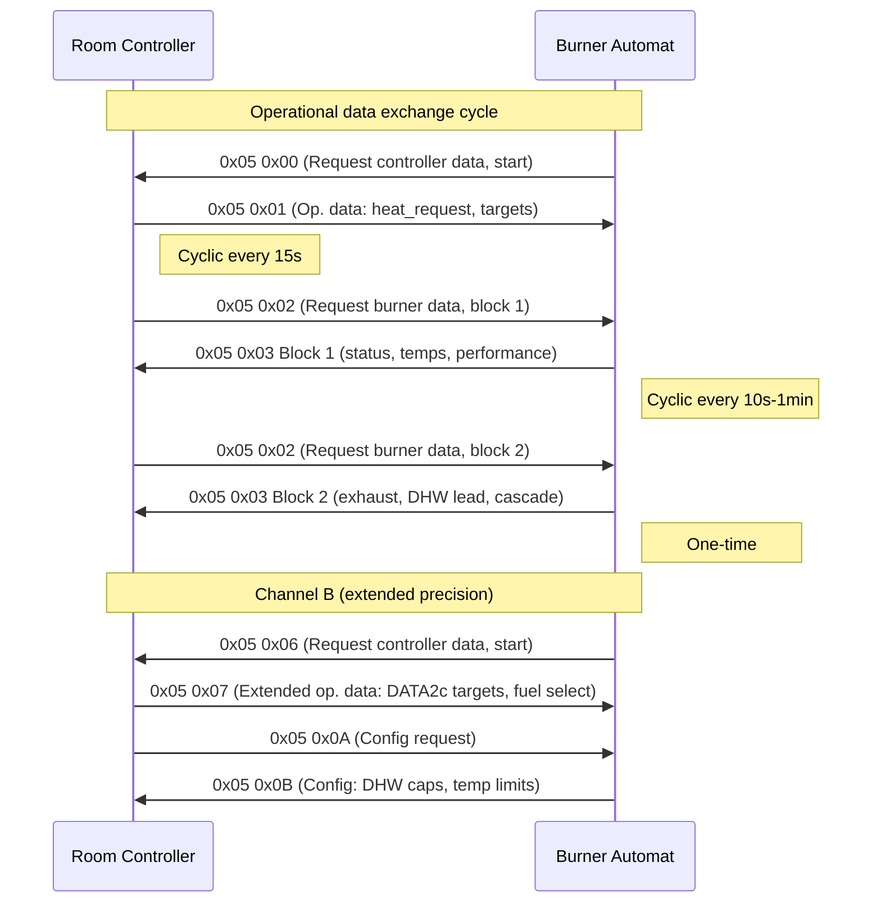

# eBUS Service 0x05 — Burner Control (Application Layer)

> Source: eBUS Specification Application Layer (OSI 7) V1.6.1, §3.2

## Scope

Service `0x05` is the primary communication protocol between burner control units and room controllers. It covers operational data exchange, configuration queries, and performance control. This is the largest Application Layer service with 17 command variants organized around two parallel channel groups (`0x00`–`0x04` and `0x06`–`0x0D`).

## Terminology

<!-- legacy-role-mapping:begin -->
> Legacy role mapping: `master` → `initiator`, `slave` → `target`. Helianthus documentation uses `initiator`/`target`.
<!-- legacy-role-mapping:end -->

- **FA (Feuerungsautomat):** Burner control unit / burner automat.
- **Room controller:** The heating system controller that issues demands to the burner.

## Command Summary

| PB | SB | Name | Direction | Cycle Rate |
|---:|---:|---|---|---|
| `0x05` | `0x00` | Op. Data Request (FA→RC) | Burner → Controller | 1/15min |
| `0x05` | `0x01` | Op. Data (RC→FA) | Controller → Burner | 1/15s |
| `0x05` | `0x02` | Op. Data Request (RC→FA) | Controller → Burner | 1/15min |
| `0x05` | `0x03` | Op. Data (FA→RC) Block 1 | Burner → Controller | 1/10s–1/1min |
| `0x05` | `0x03` | Op. Data (FA→RC) Block 2 | Burner → Controller | 1/10s–1/1min |
| `0x05` | `0x04` | Control Stop Response | Burner → Controller | 1/15s |
| `0x05` | `0x05` | *(barred)* | — | — |
| `0x05` | `0x06` | Op. Data Request (FA→RC) | Burner → Controller | 1/15min |
| `0x05` | `0x07` | Op. Data (RC→FA) | Controller → Burner | 1/15s |
| `0x05` | `0x08` | Op. Data Request (RC→FA) | Controller → Burner | 1/15min |
| `0x05` | `0x09` | Op. Data (FA→RC) Block 1 | Burner → Controller | 1/1s–1/1min |
| `0x05` | `0x09` | Op. Data (FA→RC) Block 2 | Burner → Controller | 1/10s–1/1min |
| `0x05` | `0x09` | Op. Data (FA→RC) Block 3 | Burner → Controller | 1/10s–... |
| `0x05` | `0x0A` | Config Data Request (RC→FA) | Controller → Burner | One-time |
| `0x05` | `0x0B` | Config Data (FA→RC) | Burner → Controller | One-time |
| `0x05` | `0x0C` | Op. Requirements (FA→RC) | Burner → Controller | One-time |
| `0x05` | `0x0D` | Op. Data (RC→FA) | Controller → Burner | 1/10s |

## Channel Groups

The service defines two parallel channel groups with symmetric structure:

| Function | Channel A (legacy) | Channel B (extended) |
|---|---|---|
| Burner requests controller data | `0x00` | `0x06` |
| Controller sends operational data | `0x01` | `0x07` |
| Controller requests burner data | `0x02` | `0x08` |
| Burner sends operational data | `0x03` | `0x09` |
| Control stop response | `0x04` | — |
| Config request / response | — | `0x0A` / `0x0B` |
| Extended requirements / data | — | `0x0C` / `0x0D` |

## Commands

### Service 0x05 0x00 — Operational Data Request (Burner → Controller)

**Description:** The burner control unit requests operational data from the room controller. The requirement status byte controls whether cyclic transmission should start or stop.

**Payload (`NN=0x01`):**

| Byte | Field | Type | Range | Description |
|---:|---|---|---|---|
| 0 | req_status | BYTE | — | `0x55` = stop cyclic transmission, `0xAA` = start cyclic transmission |

---

### Service 0x05 0x01 — Operational Data (Controller → Burner)

**Description:** One-time or cyclic controller operational data, sent upon request from `0x05 0x00` or independently (min cycle 5s). Replacement values used for unsupported fields.

**Payload (`NN=0x05`):**

| Byte | Field | Type | Range | Repl. | Description |
|---:|---|---|---|---|---|
| 0 | heat_request | BYTE | — | — | `0x00`=shutdown, `0x55`=DHW, `0xAA`=heating, `0xCC`=emission check, `0xDD`=QC service, `0xEE`=controller stop |
| 1 | boiler_target | CHAR | 0–100 degC | — | Boiler target temperature |
| 2 | dhw_target | CHAR | 0–100 degC | — | Service water target temperature |
| 3 | outside_temp | SIGNED CHAR | -50 to +50 degC | `0x3F` | Outside temperature effective value |
| 4 | setting_degree | CHAR | 0–100% | — | Setting degree between min/max boiler performance |

**Bus load:** 0.36% at 1/15s.

---

### Service 0x05 0x02 — Operational Data Request (Controller → Burner)

**Description:** The room controller requests operational data blocks from the burner control unit. The block number determines which data set to send (response via `0x05 0x03`).

**Payload (`NN=0x01`):**

| Byte | Field | Type | Range | Description |
|---:|---|---|---|---|
| 0 | block_number | BYTE | — | `0x00`=terminate, `0x01`=block 1 (cyclic), `0x02`+=block N (one-time) |

---

### Service 0x05 0x03 Block 1 — Operational Data (Burner → Controller)

**Description:** Cyclic burner operational data (requested by `0x05 0x02`, block 1). Contains status flags, temperatures, and performance data.

**Payload (`NN=0x08`):**

| Byte | Field | Type | Range | Repl. | Description |
|---:|---|---|---|---|---|
| 0 | block_number | BYTE | — | — | `0x01` |
| 1 | state_number | — | — | — | Status/state indication; error code if Bit7 in byte 2 = 1 |
| 2 | signals | BIT | — | — | Bit0:LDW, Bit1:GDW, Bit2:WS, Bit3:flame, Bit4:valve1, Bit5:valve2, Bit6:UWP, Bit7:alarm |
| 3 | setting_degree | CHAR | 0–100% | — | Setting degree (min–max boiler performance) |
| 4 | boiler_temp | DATA1c | 0–100 degC | — | Boiler temperature |
| 5 | return_temp | CHAR | 0–100 degC | — | Return water temperature |
| 6 | boiler_temp_2 | CHAR | 0–100 degC | — | Boiler temperature (BT, secondary reading) |
| 7 | outside_temp | SIGNED CHAR | -30 to +50 degC | `0x3F` | Outside temperature |

**Bus load:** 0.66% at 1/10s–1/1min.

---

### Service 0x05 0x03 Block 2 — Operational Data (Burner → Controller)

**Description:** Burner data block with exhaust temperature, DHW lead temperature, and performance values. Requested once via block number, but the spec assigns a nonzero cycle-rate window.

**Payload (`NN=0x07`):**

| Byte | Field | Type | Range | Repl. | Description |
|---:|---|---|---|---|---|
| 0 | block_number | BYTE | — | — | `0x02` |
| 1–2 | exhaust_temp | DATA2c | 0–600 degC | — | Exhaust gas temperature |
| 3 | dhw_lead_temp | DATA1c | 0–100 degC | — | DHW lead water temperature |
| 4 | eff_rel_perf | DATA1c | 0–100% | — | Effective relative boiler performance |
| 5 | cascade_lead | DATA1c | 0–100 degC | — | Joint lead water temp (cascade operation) |
| 6 | reserved | — | — | `0xFF` | Reserved |

**Bus load:** 0.66% at 1/10s–1/1min.

---

### Service 0x05 0x04 — Control Stop Response

**Description:** Burner responds to a "control stop" request (from `0x05 0x01` with `heat_request=0xEE`) with the effective blower setting degree and its min/max limits.

**Payload (`NN=0x03`):**

| Byte | Field | Type | Range | Description |
|---:|---|---|---|---|
| 0 | eff_setting | CHAR | 0–100% | Effective setting degree |
| 1 | min_setting | CHAR | 0–100% | Minimum setting degree |
| 2 | max_setting | CHAR | 0–100% | Maximum setting degree |

---

### Service 0x05 0x05 — Barred

This secondary command is barred for compatibility reasons.

---

### Service 0x05 0x06 — Operational Data Request (Burner → Controller, Channel B)

**Description:** Same function as `0x05 0x00` but in channel B. Burner requests controller data; controller responds via `0x05 0x07`.

**Payload (`NN=0x01`):**

| Byte | Field | Type | Range | Description |
|---:|---|---|---|---|
| 0 | req_status | BYTE | — | `0x55` = stop, `0xAA` = start |

---

### Service 0x05 0x07 — Operational Data (Controller → Burner, Channel B)

**Description:** Extended controller operational data (Channel B). Richer than `0x05 0x01` with DATA2c/DATA2b precision and fuel selection.

**Payload (`NN=0x09`):**

| Byte | Field | Type | Range | Repl. | Description |
|---:|---|---|---|---|---|
| 0 | heat_request | BYTE | — | — | `0x00`=shutdown, `0x01`=no action, `0x55`=DHW, `0xAA`=heating, `0xCC`=emission, `0xDD`=tech check, `0xEE`=controller stop |
| 1 | pump_control | BYTE | — | — | `0x00`=no action, `0x01`=pump off, `0x02`=pump on, `0x03`=variable user off, `0x04`=variable user on |
| 2–3 | boiler_target | DATA2c | 0–2000 degC | — | Boiler target temperature |
| 4–5 | boiler_press | DATA2b | 0–100 bar | — | Boiler target pressure |
| 6 | setting_degree | DATA1c | 0–100% | `0xFF` | Stepped operation (0=off, 1–4=step 1–4) or modulating (min–max boiler performance). **Source note:** the official spec references stepped mode via `M6=44h`, but `0x44` does not appear in the `heat_request` enum; this is treated as a source erratum. The `heat_request` byte determines which interpretation applies |
| 7 | dhw_target | DATA1c | 0–100 degC | `0xFF` | Service water target |
| 8 | fuel_select | BYTE | — | `0xFF` | Bit1/Bit0: `00`/`11`=don't care, `01`=gas, `10`=oil |

**Bus load:** 0.47% at 1/15s.

---

### Service 0x05 0x08 — Operational Data Request (Controller → Burner, Channel B)

**Description:** Same function as `0x05 0x02` but in channel B. Controller requests burner data blocks; burner responds via `0x05 0x09`.

**Payload (`NN=0x01`):**

| Byte | Field | Type | Range | Description |
|---:|---|---|---|---|
| 0 | block_number | BYTE | — | `0x00`=terminate, `0x01`=block 1 (cyclic), `0x02`+=block N (one-time) |

---

### Service 0x05 0x09 Block 1 — Operational Data (Burner → Controller, Channel B)

**Description:** Cyclic burner operational data (Channel B, block 1). Higher precision than `0x05 0x03` block 1, with DATA2c boiler temperatures and dual target/effective value fields.

**Payload (`NN=0x09`):**

| Byte | Field | Type | Range | Repl. | Description |
|---:|---|---|---|---|---|
| 0 | block_number | BYTE | — | — | `0x01` |
| 1 | phase_or_error | BYTE | — | — | Effective phase number or error code (if Bit5 in byte 3 = alarm). If Bit6 = 1: start prevention reason |
| 2 | signals_1 | BIT | — | — | Bit0:fuel(0=gas,1=oil), Bit1:ODW_min/GDW_min, Bit2:ODW_max/GDW_max, Bit3:LDW, Bit4:flame, Bit5:valve1, Bit6:valve2, Bit7:valve3 |
| 3 | signals_2 | BIT | — | — | Bit0:blower, Bit1:ignition, Bit2:magn. clutch/oil pump, Bit3:value mode(0=temp,1=pressure), Bit4:fuel source(0=local,1=GLT), Bit5:alarm, Bit6:start prevention, Bit7:error reset |
| 4 | eff_performance | CHAR | 0–100% | — | Effective performance (setting degree) |
| 5–6 | boiler_actual | DATA2c | 0–2000 degC/0–100 bar | — | Boiler temp or pressure actual (per Bit3 of byte 3) |
| 7–8 | boiler_target | DATA2c | 0–2000 degC/0–100 bar | — | Boiler temp or pressure target (per Bit3 of byte 3) |

**Bus load:** 7.0% at 1/1s. The official spec states `Cycle rate: 1/1s (Tolerance: -, Default: 1/10s) to 1/1min`, indicating 1/10s as the expected default period within the 1/1s–1/1min range.

---

### Service 0x05 0x09 Block 2 — Operational Data (Burner → Controller, Channel B)

**Description:** Burner data (Channel B, block 2). Gas analysis and temperature readings. Requested once via block number, but the spec assigns a nonzero cycle-rate window.

**Payload (`NN=0x09`):**

| Byte | Field | Type | Range | Repl. | Description |
|---:|---|---|---|---|---|
| 0 | block_number | BYTE | — | — | `0x02` |
| 1–2 | o2_value | DATA2b | 0–25% | — | O2 measurement (`0x7FFF` if invalid) |
| 3–4 | input_air_temp | DATA2c | -20 to +400 degC | — | Input air temperature |
| 5–6 | exhaust_temp | DATA2c | -20 to +400 degC | — | Exhaust gas temperature (ARF value) |
| 7–8 | boiler_target_end | DATA2c | 0–2000 degC/0–100 bar | — | Boiler target end value |

**Bus load:** 0.70% at 1/10s–1/1min.

---

### Service 0x05 0x09 Block 3 — Operational Data (Burner → Controller, Channel B)

**Description:** Burner data (Channel B, block 3). Fuel burning coefficient.

**Payload (`NN=0x09`):**

| Byte | Field | Type | Range | Repl. | Description |
|---:|---|---|---|---|---|
| 0 | block_number | BYTE | — | — | `0x03` |
| 1–2 | fuel_coefficient | DATA2c | 0–110% | `0x8000` | Fuel burning technological coefficient |
| 3–4 | reserved_1 | — | — | `0x8000` | Reserved |
| 5–6 | reserved_2 | — | — | `0x8000` | Reserved |
| 7 | reserved_3 | — | — | `0xFF` | Reserved |
| 8 | reserved_4 | — | — | `0xFF` | Reserved |

---

### Service 0x05 0x0A — Configuration Data Request (Controller → Burner)

**Description:** Room controller requests configuration data from the burner control unit. Response via `0x05 0x0B`.

**Payload:** Empty (`NN=0x00`).

---

### Service 0x05 0x0B — Configuration Data (Burner → Controller)

**Description:** Burner configuration data in response to `0x05 0x0A`. Contains DHW capabilities, setting ranges, and temperature limits.

**Payload (`NN=0x0A`):**

| Byte | Field | Type | Range | Repl. | Description |
|---:|---|---|---|---|---|
| 0 | dhw_config | BIT | — | — | Bit0:DHW exists, Bit1:parallel(1)/preference(0), Bit2:thermostat, Bit3:flow-through heater. Bit4–7: reserved (must be 0) |
| 1 | min_setting | DATA1c | 0–100% | — | Minimum setting degree |
| 2 | min_dhw_target | DATA1c | 0–100 degC | — | Minimum DHW target temperature |
| 3 | max_dhw_target | DATA1c | 0–100 degC | — | Maximum DHW target temperature |
| 4 | min_boiler_target | DATA1c | 0–100 degC | — | Minimum boiler target temperature |
| 5 | max_boiler_target | DATA1c | 0–100 degC | — | Maximum boiler target temperature |
| 6–7 | reserved_1 | — | — | `0x8000` | Reserved |
| 8 | reserved_2 | — | — | `0xFF` | Reserved |
| 9 | reserved_3 | — | — | `0xFF` | Reserved |

---

### Service 0x05 0x0C — Operational Requirements (Burner → Controller)

**Description:** Burner requests operational data from the room controller with configurable transmission mode. Response via `0x05 0x0D`.

**Payload (`NN=0x01`):**

| Byte | Field | Type | Range | Description |
|---:|---|---|---|---|
| 0 | mode | BYTE | 0–4 | `0x00`=terminate, `0x01`=cyclic, `0x02`=event-driven, `0x03`=single, `0x04`=cyclic+event |

---

### Service 0x05 0x0D — Operational Data (Controller → Burner, Extended)

**Description:** Cyclic and/or event-driven controller data (min 1 degC change or status change triggers transmission). Requested via `0x05 0x0C`.

**Payload (`NN=0x0A`):**

| Byte | Field | Type | Range | Repl. | Description |
|---:|---|---|---|---|---|
| 0 | room_target | DATA1c | 0–100 degC | — | Room temperature target |
| 1–2 | room_actual | DATA2c | -50 to +50 degC | — | Room temperature actual |
| 3 | status | BIT | — | — | Bit0: DHW preparation active. Bit1–7: reserved (must be 0) |
| 4–5 | reserved_1 | — | — | `0x8000` | Reserved |
| 6–7 | reserved_2 | — | — | `0x8000` | Reserved |
| 8 | reserved_3 | — | — | `0xFF` | Reserved |
| 9 | reserved_4 | — | — | `0xFF` | Reserved |

**Bus load:** 0.75% at 1/10s.

## Communication Flow

## See Also

- [`ebus-application-layer.md`](./ebus-application-layer.md) — service index
- [`ebus-overview.md`](./ebus-overview.md) — wire-level framing
- [`ebus-service-03h.md`](./ebus-service-03h.md) — burner service data (diagnostic complement to runtime control)
- [`ebus-service-08h.md`](./ebus-service-08h.md) — controller-to-controller (distributes aggregated data)
