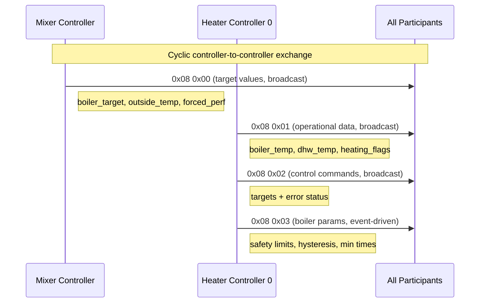

# eBUS Service 0x08 — Controller-to-Controller (Application Layer)

> Source: eBUS Specification Application Layer (OSI 7) V1.6.1, §3.4

## Scope

Service `0x08` handles communication between heating controllers and mixer modules. It distributes target values, effective temperatures, boiler parameters, error status, and system remote control commands. Most commands are broadcasts from the primary heater controller (controller 0) to all bus participants.

## Terminology

<!-- legacy-role-mapping:begin -->
> Legacy role mapping: `master` → `initiator`, `slave` → `target`. Helianthus documentation uses `initiator`/`target`.
<!-- legacy-role-mapping:end -->

- **Controller 0 (heater controller):** The primary controller that aggregates demands and distributes parameters.
- **Slave controllers / mixer modules:** Secondary controllers that submit target values and receive operational data.

## Command Summary

| PB | SB | Name | Direction | Telegram Type | Cycle Rate |
|---:|---:|---|---|---|---|
| `0x08` | `0x00` | Target Values | Secondary → Controller 0 | Broadcast | 1/10s |
| `0x08` | `0x01` | Operational Data | Controller 0 → all | Broadcast | 1/10s |
| `0x08` | `0x02` | Control Commands | Controller 0 → all | Broadcast | 1/30s |
| `0x08` | `0x03` | Boiler Parameters | Controller 0 → all | Broadcast | Event-driven |
| `0x08` | `0x04` | System Remote Control | PC/modem/clock → controller | Initiator/Target | Event-driven |

## Commands

### Service 0x08 0x00 — Target Values (Secondary → Controller 0)

**Description:** Secondary controllers and mixer modules transmit their requirements (boiler target temperature, outside temperature, forced performance, service water target) to heater controller 0 via broadcast.

**Payload (initiator telegram, broadcast):**

| Byte | Field | Type | Range | Description |
|---:|---|---|---|---|
| 0–1 | boiler_target | DATA2b | — | Boiler target temperature (degC), low byte first |
| 2–3 | outside_temp | DATA2b | — | Outside temperature (degC), from module's sensor |
| 4 | forced_perf | DATA1b | -100 to +100 | Forced performance: negative=reduce/close mixer, positive=open mixer |
| 5 | status | BIT | — | Bit0: service water controller active, Bit1: heating circuit active |
| 6–7 | dhw_target | DATA2b | — | Service water target temperature (degC) |

**Bus load:** 0.62% at 1/10s cycle.

---

### Service 0x08 0x01 — Operational Data (Controller 0 → all)

**Description:** Heater controller 0 broadcasts effective temperatures, emission test status, and heating system flags to all bus participants.

**Payload (initiator telegram, broadcast):**

| Byte | Field | Type | Range | Description |
|---:|---|---|---|---|
| 0–1 | boiler_temp | DATA2b | — | Boiler effective temperature (degC) |
| 2–3 | dhw_temp | DATA2b | — | Service water effective temperature (degC) |
| 4 | emission | BYTE | 0–4 | `0x00`=none, `0x01`=emission BR1, `0x02`=STB test BR1, `0x03`=emission BR1+2, `0x04`=STB test BR1+2 |
| 5 | heating_flags | BIT | — | Bit0: DHW active, Bit1: pump release, Bit2: boiler 1 running, Bit3: boiler 2 running, Bit4: loading pump, Bit5: DHW loading, Bit6: TBF connected |
| 6–7 | return_temp | DATA2b | — | Return flow temperature (degC) |

**Bus load:** 0.62% at 1/10s cycle.

---

### Service 0x08 0x02 — Control Commands (Controller 0 → Slave Controllers)

**Description:** Heater controller 0 broadcasts target values and burner error status to auxiliary controllers and remote actuators.

**Payload (initiator telegram, broadcast):**

| Byte | Field | Type | Range | Description |
|---:|---|---|---|---|
| 0–1 | boiler_target | DATA2b | — | Boiler target temperature (degC) |
| 2–3 | dhw_target | DATA2b | — | Service water target temperature (degC) |
| 4 | perf_demand | DATA1b | -100 to +100 | Performance demand: -100%=deficiency, 0%=no target, +100%=maximum |
| 5 | fa_number | BYTE | — | Number of first burner control unit with error |
| 6 | error_code | BYTE | — | Manufacturer-specific error code |

**Bus load:** 0.19% at 1/30s cycle.

---

### Service 0x08 0x03 — Boiler Parameters

**Description:** Heater controller 0 broadcasts boiler operating parameters to mixer modules. Event-driven — sent when a parameter changes.

**Payload (initiator telegram, broadcast):**

| Byte | Field | Type | Range | Description |
|---:|---|---|---|---|
| 0 | safety_temp | DATA1b | — | Boiler safety temperature (degC) |
| 1 | support_temp | DATA1b | — | Boiler support temperature (degC) |
| 2 | min_burner_time | BYTE | — | Minimum burner operating time (minutes) |
| 3 | hysteresis | DATA1b | — | Boiler temperature hysteresis (degC) |
| 4 | flags | BIT | — | Bit0: boiler corrosion protection enabled |
| 5 | min_return_temp | DATA1b | — | Minimum return flow temperature (degC) |

---

### Service 0x08 0x04 — System Remote Control

**Description:** Allows a PC, modem, digital clock, or superior controller to remotely control the heating system or individual circuits. Supports separate operation mode control for heating and service water channels.

**Payload (initiator telegram):**

| Byte | Field | Type | Range | Repl. | Description |
|---:|---|---|---|---|---|
| 0 | sys_control | BYTE | — | `0xFF` | Low nibble = DHW circuit mode, High nibble = heating circuit mode. Values: 0=standby+antifreeze, 1=auto, 2=day, 3=night, 4=target value day, 5=target value night |
| 1–2 | heating_target | DATA2c | 0–200 degC | `0x8000` | Heating target temperature |
| 3 | dhw_target | DATA1c | 0–100 degC | `0xFF` | DHW target temperature |
| 4 | reserved_1 | — | — | `0xFF` | Reserved |
| 5 | reserved_2 | — | — | `0xFF` | Reserved |

## Communication Flow

## See Also

- [`ebus-application-layer.md`](./ebus-application-layer.md) — service index
- [`ebus-overview.md`](./ebus-overview.md) — broadcast frame type definition
- [`ebus-service-05h.md`](./ebus-service-05h.md) — burner control (burner↔controller pair, complements inter-controller `0x08`)
