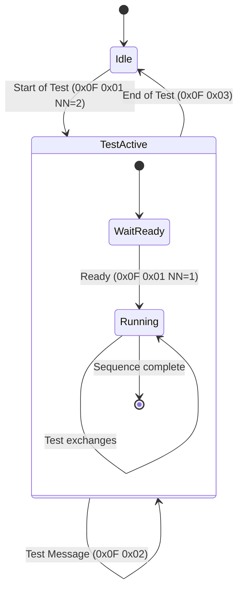
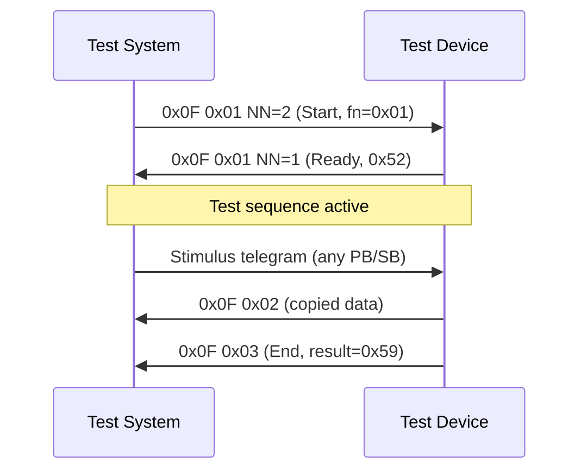

# eBUS Service 0x0F — Test Commands (Application Layer)

> Source: eBUS Specification Application Layer (OSI 7) V1.6.1, §3.6

## Scope

Service `0x0F` provides a structured test framework for factory and service testing of eBUS devices. It defines a lifecycle (start → ready → test → end) and a set of test sequences that exercise initiator and target communication paths. All commands are one-time with no recurring bus load.

## Terminology

<!-- legacy-role-mapping:begin -->
> Legacy role mapping: `master` → `initiator`, `slave` → `target`. Helianthus documentation uses `initiator`/`target`.
<!-- legacy-role-mapping:end -->

- **Test system:** Software or hardware that controls and verifies the test run.
- **Test device:** The device under test with implemented test firmware.

## Command Summary

| PB | SB | Name | Direction | Telegram Type | Description |
|---:|---:|---|---|---|---|
| `0x0F` | `0x01` (NN=2) | Start of Test | Test system → test device | Initiator/Target or Initiator/Initiator | Initiates a test sequence |
| `0x0F` | `0x01` (NN=1) | Ready | Test device → test system | Initiator/Target or Broadcast | Confirms test start receipt |
| `0x0F` | `0x02` | Test Message | Varies | Varies | Carries test data |
| `0x0F` | `0x03` | End of Test | Test device → test system | Initiator/Target or Initiator/Initiator | Reports test result |

## Test Lifecycle

## Commands

### Service 0x0F 0x01 (NN=0x02) — Start of Test

**Description:** Sent by the test system to initiate a test sequence. The function number determines which test sequence to execute. If the target is an initiator address, the test device responds with ACK. If the target is a target address, it responds with `0x52` ("SOT received and confirmed").

**Request payload:**

| Byte | Field | Type | Range | Description |
|---:|---|---|---|---|
| 0 | test_device_type | BYTE | 1–2 | `0x01` = initiator device, `0x02` = target device |
| 1 | function_number | BYTE | — | Test sequence number (see [Test Sequence Table](#test-sequence-table)) |

**Response (target device):** `NN=0x01`, data = `0x52` (SOT confirmed).

---

### Service 0x0F 0x01 (NN=0x01) — Ready

**Description:** Sent by the test device to acknowledge receipt and interpretation of the start command.

**Payload:**

| Byte | Field | Type | Range | Description |
|---:|---|---|---|---|
| 0 | status | BYTE | — | `0x52` = OK |

---

### Service 0x0F 0x02 — Test Message

**Description:** Generic data carrier for test sequence execution. Payload length and content vary per test sequence. Both initiator-to-initiator and initiator-to-target telegram types are used depending on the active test function.

**Payload:** Variable (`0x00 ≤ NN ≤ 0x10`), test-sequence-specific data bytes.

---

### Service 0x0F 0x03 — End of Test

**Description:** Sent by the test device to report whether the test sequence was successful.

**Payload:**

| Byte | Field | Type | Range | Description |
|---:|---|---|---|---|
| 0 | result | BYTE | — | `0x59` = test successful, any other value = error |

**Response:** When the target is an initiator address: ACK/SYN only (no data response). When the target is a target address: `NN=0x01`, data = `0x59` (EOT confirmed).

## Test Sequence Table

| Function | Test Device | Test System | Description |
|---:|---|---|---|
| `0x01` | Initiator | Initiator | Copy next received telegram and return to test system |
| `0x02` | Initiator | Initiator | Copy next received telegram and broadcast (`DST=0xFE`) |
| `0x03` | Initiator | Initiator | Sum all data bytes of next telegram, return via `0x0F 0x02` |
| `0x07` | Initiator | Initiator | Copy next 2 received telegrams and return each |
| `0x08` | Initiator | Initiator | Copy next 24 received telegrams and return each |
| `0x11` | Initiator | Target | Copy 24 telegrams, route to companion target address (`QQ + 0x05`), return target responses via `0x0F 0x02` |
| `0x14` | Initiator | Target | Copy telegram, cycle through all 228 target addresses (skipping own), return each exchange |
| `0x21` | Target | Initiator | Read broadcast data, copy into subsequent target response |
| `0x22` | Target | Initiator | Echo initiator data in target response, repeat until End of Test (`0x0F 0x03`) is received |
| `0x25` | Target | Initiator | Same as `0x22` |

For initiator-device functions (`0x01`–`0x14`), the test device sends End of Test (`0x0F 0x03`). For target-device functions (`0x22`/`0x25`), the sequence repeats until an End of Test is received as a master-slave telegram.

## Communication Flow

## See Also

- [`ebus-application-layer.md`](./ebus-application-layer.md) — service index
- [`ebus-overview.md`](./ebus-overview.md) — wire-level framing
- [`ebus-service-09h.md`](./ebus-service-09h.md) — memory server (also service-mode restricted)
