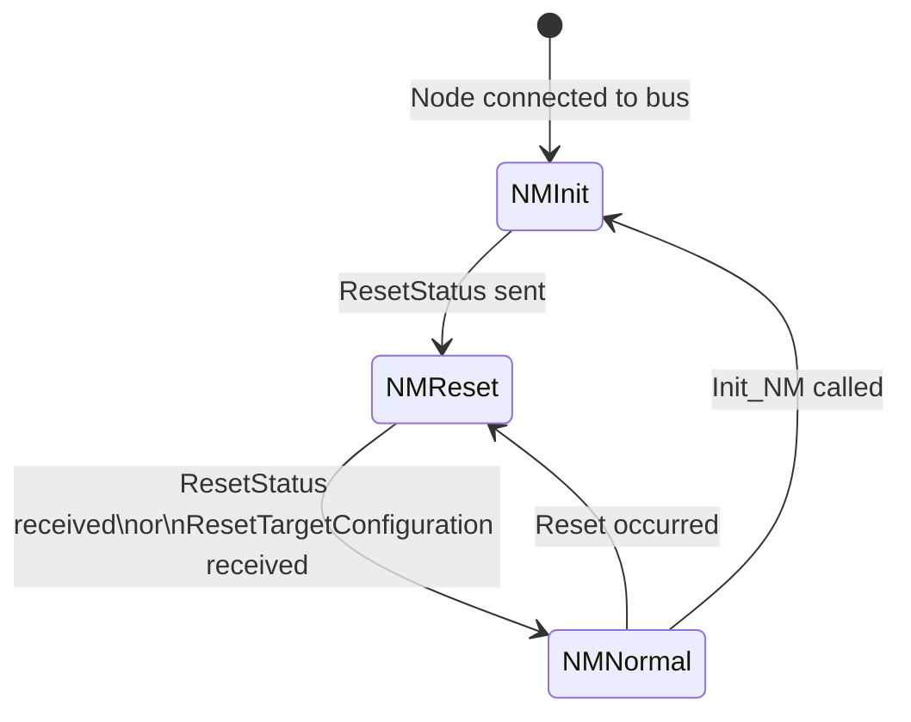
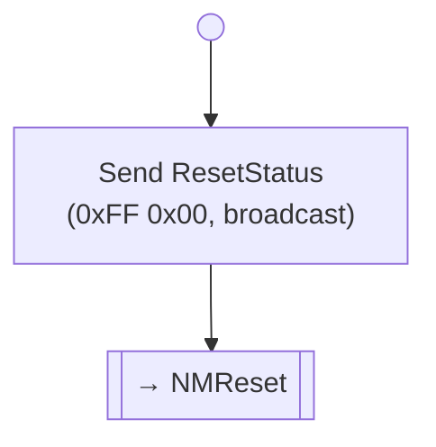
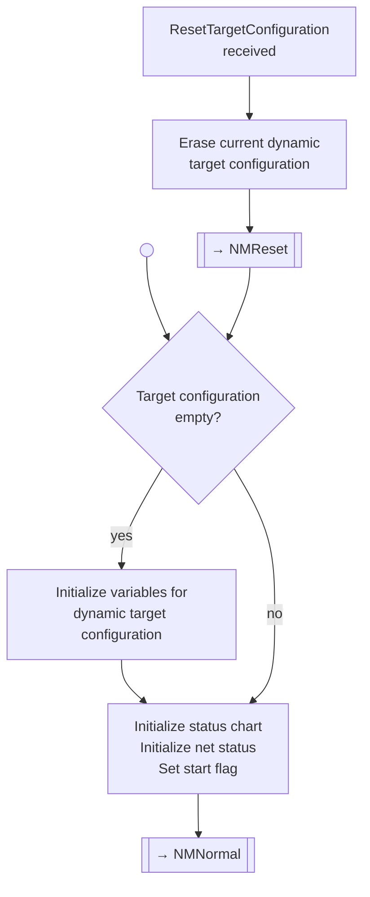
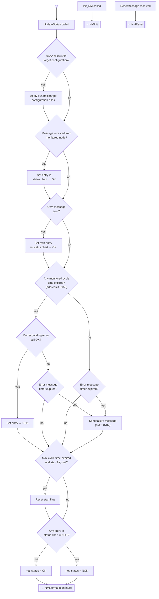
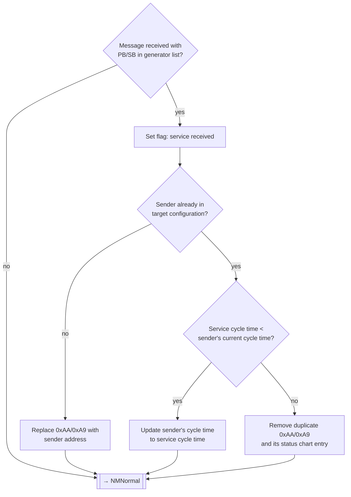

# eBUS Service 0xFF — Network Management (Application Layer)

> Source: eBUS Specification Application Layer (OSI 7) V1.6.1, §3.8; eBUS Specification Network Management V1.0.1.

## Scope

Service `0xFF` carries all Network Management (NM) messages. NM enables safe operation and interaction of bus nodes through:

- Determining which nodes are required for proper function
- Monitoring the presence of required nodes via cyclic message observation
- Monitoring the node's own ability to transmit
- Providing status information to the application layer

NM is based on **indirect network management** (OSEK/VDX concept): it monitors the bus by observing cyclic application messages, adding **no extra bus load** for monitoring. NM implementation is optional. Target devices have no network management — each target is monitored by the initiator nodes that need it.

> **Helianthus implementation:** For the Helianthus-specific NM model (passive/indirect approach with semantic polling as the heartbeat source), see [`../architecture/nm-model.md`](../architecture/nm-model.md).

## Terminology

<!-- legacy-role-mapping:begin -->
> Legacy role mapping: `master` → `initiator`, `slave` → `target`. Helianthus documentation uses `initiator`/`target`.
<!-- legacy-role-mapping:end -->

## Command Summary

| PB | SB | Name | Direction | Telegram Type | Required |
|---:|---:|---|---|---|---|
| `0xFF` | `0x00` | Reset Status NM | Joining node → all | Broadcast | **Mandatory** |
| `0xFF` | `0x01` | Reset Target Configuration | Any → all | Broadcast | Optional |
| `0xFF` | `0x02` | Failure Message | Detecting node → all | Broadcast | **Mandatory** |
| `0xFF` | `0x03` | Net Status Query | Any → target | Initiator/Target | Optional |
| `0xFF` | `0x04` | Monitored Participants Query | Any → target | Initiator/Target | Optional |
| `0xFF` | `0x05` | Failed Nodes Query | Any → target | Initiator/Target | Optional |
| `0xFF` | `0x06` | Required Services Query | Any → target | Initiator/Target | Optional |

When implementing NM, at minimum `0xFF 0x00` (Reset Status) and `0xFF 0x02` (Failure Message) must be supported.

## NM State Machine

NM has three states:

### NMInit

Entered when a node first connects to the bus. The node sends a ResetStatus message (`0xFF 0x00`), which causes all existing NM nodes to transition to NMReset.

### NMReset

Resets all NM state: status chart, net status, internal variables. Sets the start flag. If dynamic target configuration is used and not yet generated, initializes it.

### NMNormal

The main monitoring loop. Handles message receipt/transmission tracking, cycle-time expiry detection, failure message emission, start flag management, and net status computation.

> **Error message timer:** Failure messages may be repeated with a minimum interval of 15 minutes while at least one monitored node remains failed.

## NM Data Structures

| Element | Description |
|---|---|
| **Target configuration** | List of eBUS addresses to monitor (including own node implicitly) |
| **Status chart** | Per-node status: OK (message received within cycle time) / NOK (expired) |
| **Cycle times** | Per-node or default time window within which a message is expected |
| **Start flag** | Set after reset; cleared when the longest cycle time expires once. While set, OK entries may be default (unchecked) |
| **Net status** (optional) | Summary: OK if all monitored nodes OK and own node can send; NOK otherwise |

### Target Configuration Types

| Type | Description |
|---|---|
| **Static** | Known at startup, does not change during operation |
| **Dynamic** | Generated during NMNormal by observing bus messages. Uses placeholder addresses: `0xAA` = required service (triggers failure on timeout), `0xA9` = optional service (no failure on timeout) |
| **Combined** | Mix of static addresses and dynamic placeholders |

## NM Interface Services

### Application → NM

| Service | Description |
|---|---|
| **Init_NM** | Start/restart network management (→ NMInit) |
| **UpdateStatus** | Request status chart and net status update |
| **GetConfig** | Read status chart with monitored node statuses |
| **GetStartFlag** | Read current start flag state |
| **GetStatus** (optional) | Read net status summary |

### eBUS Driver → NM

| Service | Description |
|---|---|
| **MessageReceived** | Triggers UpdateStatus on message receipt |
| **MessageTransmitted** | Triggers UpdateStatus on successful own transmission |
| **SendErrorMessage** | Sends failure message (`0xFF 0x02`) when a monitored node fails |

## Commands

### Service 0xFF 0x00 — Reset Status NM

**Description:** Broadcast by a node when it first joins the bus. All existing NM nodes reset their status charts, net status, and internal variables to defaults. Dynamic target configurations that have not yet been generated are initialized.

**Payload (broadcast):** Empty (`NN=0x00`).

**NM transition:** All receivers → NMReset. Sender → NMReset.

---

### Service 0xFF 0x01 — Reset Target Configuration NM

**Description:** Broadcast that causes all nodes to reset their status charts and net status. Additionally, any dynamically generated target configuration is erased and re-initialized.

**Payload (broadcast):** Empty (`NN=0x00`).

**NM transition:** All receivers → NMReset (with target configuration erasure).

---

### Service 0xFF 0x02 — Failure Message

**Description:** Broadcast issued when NM detects that a monitored node has failed (cycle time expired without message). May be repeated every ≥15 minutes while failure persists.

**Payload (broadcast):** Empty (`NN=0x00`).

> **Note:** The failure message itself carries no identification of the failed node. Interrogation commands (`0xFF 0x04`, `0xFF 0x05`) must be used to determine which nodes have failed.

---

### Service 0xFF 0x03 — Net Status Query

**Description:** Queries the net status of a specific initiator node (addressed via its companion target address).

**Request payload:** Empty (`NN=0x00`).

**Response payload (`NN=0x01`):**

| Byte | Field | Type | Range | Description |
|---:|---|---|---|---|
| 0 | nm_status | BIT | — | Bit1: net status OK (1=OK). Bit2: start flag set (1=still in startup, status may be default) |

---

### Service 0xFF 0x04 — Monitored Participants Query

**Description:** Queries the status chart of an NM node — returns monitored addresses with their OK/NOK status. Supports block-based pagination for large configurations.

**Request payload (`NN=0x01`):**

| Byte | Field | Type | Range | Description |
|---:|---|---|---|---|
| 0 | block_number | CHAR | 0+ | `0` = first 8 monitored nodes, `1` = next 8, etc. |

**Response payload (`NN=0x01..0x0A`):**

| Byte | Field | Type | Description |
|---:|---|---|---|
| 0 | follow_block | BIT | Bit0–4: total blocks needed. Bit7: 1=more data, 0=complete |
| 1 | nm_status | BIT | Bit0–7: status of addresses in bytes 2–9. 0=NOK, 1=OK. Bit0 = status of address in byte 2 |
| 2..NN-1 | addresses | CHAR×(NN-2) | eBUS addresses of monitored nodes |

---

### Service 0xFF 0x05 — Failed Nodes Query

**Description:** Returns the addresses of nodes currently marked as NOK in the status chart. Block-paginated.

**Request payload (`NN=0x01`):**

| Byte | Field | Type | Range | Description |
|---:|---|---|---|---|
| 0 | block_number | CHAR | 0+ | `0` = first 9 failed nodes, `1` = next 9, etc. |

**Response payload (`NN=0x01..0x0A`):**

| Byte | Field | Type | Description |
|---:|---|---|---|
| 0 | follow_block | BIT | Bit0–4: total blocks needed. Bit7: 1=more data, 0=complete |
| 1..NN-1 | addresses | CHAR×(NN-1) | eBUS addresses of failed nodes |

---

### Service 0xFF 0x06 — Required Services Query

**Description:** Queries the required services of a node that uses dynamic target configuration — returns the PB/SB pairs that the node needs to receive. Block-paginated.

**Request payload (`NN=0x01`):**

| Byte | Field | Type | Range | Description |
|---:|---|---|---|---|
| 0 | block_number | CHAR | 0+ | `0` = first 4 services, `1` = next 4, etc. |

**Response payload (`NN=0x01..0x0A`):**

| Byte | Field | Type | Description |
|---:|---|---|---|
| 0 | follow_block | BIT | Bit0–4: total blocks needed. Bit7: 1=more data, 0=complete |
| 1 | pb_1 | CHAR | PB of first required service |
| 2 | sb_1 | CHAR | SB of first required service |
| ... | ... | ... | Additional PB/SB pairs |

## Dynamic Target Configuration

When a node does not know at startup which addresses to monitor, it uses dynamic generation:

1. In NMReset, the target configuration is initialized with `0xAA` placeholders (one per required service) and `0xA9` placeholders (one per optional service), plus the node's own address.
2. In NMNormal, when a message matching a required service PB/SB is received, the sender's address replaces the `0xAA` placeholder.
3. If `0xAA` remains when its cycle time expires, a failure message is sent (the service is missing).
4. `0xA9` (optional) entries do not trigger failure messages on timeout.

### Dynamic Configuration Data Lifecycle

**At NMNormal entry:**

| Structure | Content |
|---|---|
| Generator list | PB₁/SB₁/Time₁/not-received, ..., PBₙ/SBₙ/Timeₙ/not-received |
| Target configuration | `0xAA`, ..., `0xAA`, own-address |
| Status chart | OK, ..., OK, OK |
| Net status | OK |
| Start flag | Set |

**After all required services received:**

| Structure | Content |
|---|---|
| Generator list | PB₁/SB₁/Time₁/**received**, ..., PBₙ/SBₙ/Timeₙ/**received** |
| Target configuration | addr₁, ..., addrₙ, own-address |
| Status chart | OK, ..., OK, OK |
| Net status | OK |
| Start flag | **Not set** (max cycle time expired) |

## Memory Requirements

Per-node memory cost for NM (static target configuration, default cycle time):

| Component | Bits per monitored node | Overhead (own node) |
|---|---|---|
| Own address configuration | — | 8 |
| Target configuration (address) | 8 | — |
| Status chart | 1 | 1 |
| Current time data | 8 | 8 |
| Start flag | — | 1 |
| Net status | — | 1 |
| **Total** | **17** | **19** |

Formula: `19 + (monitored_nodes × 17)` bits.

## See Also

- [`ebus-application-layer.md`](./ebus-application-layer.md) — service index
- [`ebus-overview.md`](./ebus-overview.md) — wire-level framing, QueryExistence (`0x07 0xFE`)
- [`../architecture/nm-model.md`](../architecture/nm-model.md) — Helianthus NM implementation (passive/indirect)
- [`../architecture/nm-discovery.md`](../architecture/nm-discovery.md) — Helianthus NM discovery mechanisms
- [`../architecture/nm-participant-policy.md`](../architecture/nm-participant-policy.md) — Helianthus NM participant policies
- [`ebus-service-FEh.md`](./ebus-service-FEh.md) — general broadcast error message (related but distinct from NM failure)
