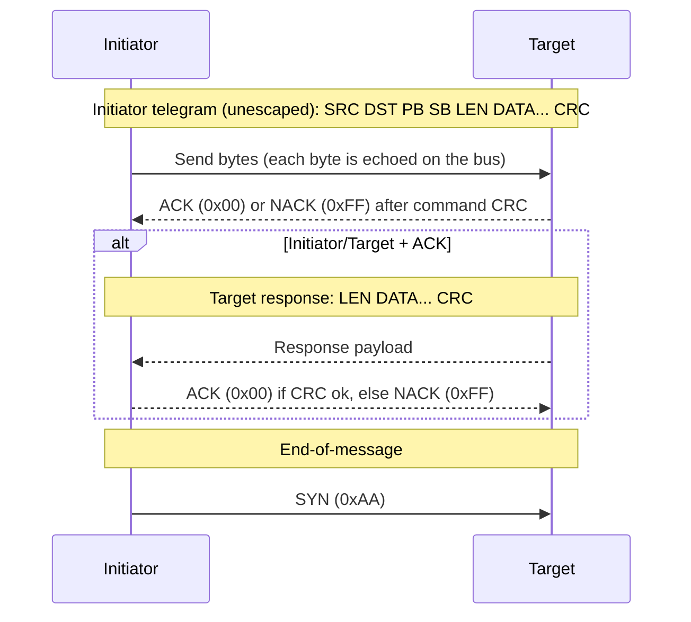

# eBUS Overview (Wire-Level)

This document describes the wire-level framing and rules that are implemented. It focuses on the minimum required to interpret bytes on the bus.

## Terminology

This documentation uses role terms that align with modern, inclusive terminology:

- **Initiator**: the node that begins a transaction by sending a command telegram onto the bus.
- **Target**: the addressed node that ACK/NACKs the command and (for initiator/target transactions) may return a response payload.

<!-- legacy-role-mapping:begin -->
> Legacy role mapping (for cross-referencing older materials): `master` → `initiator`, `slave` → `target`. Helianthus documentation uses `initiator`/`target`.
<!-- legacy-role-mapping:end -->

## Frame Layout

An eBUS frame on the wire is represented as:

```text
| SRC | DST | PB | SB | LEN | DATA... | CRC |
|  1  |  1  |  1 |  1 |  1  |  LEN    |  1  |
```

- **SRC**: source address
- **DST**: destination address
- **PB/SB**: primary/secondary command bytes
- **LEN**: number of data bytes
- **DATA**: payload bytes
- **CRC**: CRC8 over the unescaped data (see CRC section)

## Frame Types

Frame type is derived from the destination address:

- **Broadcast**: `DST = 0xFE`
- **Initiator/Initiator**: `DST` has a valid initiator address pattern
- **Initiator/Target**: any other valid destination address

This inference determines whether an ACK-only exchange is expected (initiator/initiator) or a full response frame (initiator/target).

### Initiator Address Pattern

In direct-mode eBUS implementations (including Helianthus), initiator addresses are typically recognized by a nibble pattern:

- A destination is treated as an **initiator address** if **both** the high and low nibbles are one of: `0x0`, `0x1`, `0x3`, `0x7`, `0xF`.
- Examples: `0x10`, `0x31`, `0xF1`, `0x33`.

Addresses equal to `0xA9` (escape) or `0xAA` (SYN) are invalid in address positions.

### Helianthus Source Address Selection

When Helianthus must choose an initiator address on a live bus, it performs
source address selection plus gateway active-probe validation. It does not
perform a protocol membership operation.

The standard source-address table is frozen in
[`architecture/ebus_standard/12-source-address-table.md`](../../architecture/ebus_standard/12-source-address-table.md).
The default gateway candidate order is:

```text
0xFF, 0x7F, 0x3F, 0x1F,
0xF7, 0x77, 0x37, 0x17, 0x07,
0x11, 0x31,
0x00
```

This order is Helianthus policy. It is not the eBUS arbitration rank. On the
wire, p0 / `0x0` outranks p1 / `0x1`, then p2 / `0x3`, p3 / `0x7`, and p4 /
`0xF`; lower source byte wins only within otherwise equal contention.

`0xFF` is a valid source address and maps to companion `0x04`. The `0xFF`
NACK meaning applies only in ACK/NACK byte context.

Before startup scan or any normal gateway-owned bus-reaching operation, gateway
source-selection validation must actively validate the selected source and
companion. A failed active probe quarantines/excludes that source and either
tries the next candidate or enters `DEGRADED_SOURCE_SELECTION`, which emits no
Helianthus-originated eBUS traffic.

## ACK/NACK Symbols

The bus uses one-byte symbols:

```text
ACK  = 0x00
NACK = 0xFF
```

Broadcast frames do not receive ACK/NACK or responses.

**SYN during active waits:** If a `SYN` (`0xAA`) byte is received while waiting for an `ACK`/`NACK` or a target response, it signals end-of-transaction (timeout). All known implementations (ebusgo, ebusd, VRC Explorer) treat SYN during ACK/response wait as a timeout indicator and abort the current transaction. Ignoring SYN and continuing to wait is incorrect -- it causes the receiver to stall past the end of the transaction.

**ENH transport caveat:** On ENH-based transports, the adapter forwards raw eBUS wire bytes via `RECEIVED` events **without decoding wire escapes** (verified against PIC firmware `runtime.c:1835-1841`). Therefore `RECEIVED(0xAA)` is always a SYN boundary (raw wire `0xAA` = SYN). A logical data byte `0xAA` arrives as two separate events: `RECEIVED(0xA9)` followed by `RECEIVED(0x01)`, and the host-side escape decoder reassembles them into the logical `0xAA`. Host SYN guards apply to the `RECEIVED` event stream — `RECEIVED(0xAA)` signals bus idle; the escape-expanded `RECEIVED(0xA9) RECEIVED(0x01)` pair does not.

**Escape-aware SYN counting:** On raw bus transports, the escape sequence `0xA9 0x01` represents the data byte 0xAA and must NOT be counted as SYN. Only a standalone, unescaped `0xAA` outside of an active frame's data region indicates bus idle.

**0xAA data vs boundary scoping:** The byte `0xAA` serves as SYN (bus idle marker / frame boundary) ONLY at the raw eBUS wire layer and within raw byte-stream transports. At the logical protocol layer (inside frame payloads, register values, or ENH-decoded data), `0xAA` has no wire-boundary or idle meaning — it is a valid data byte. Implementations MUST NOT interpret a logical `0xAA` in payload data as a frame boundary or bus idle signal.

Exception: in ENH `START` requests, a logical `0xAA` in the initiator-address field is a protocol-level cancel sentinel for a running arbitration (see [enh.md §START](../enh.md#start--started--failed)). This is a command-level convention, not a wire-boundary meaning.

**Invariant name:** `XR_ENH_0xAA_DataNotSYN`

**Early SYN during request collection:** If SYN arrives when only 0 or 1 request bytes have been collected (`requestBytesSeen <= 1`), it indicates a new arbitration cycle rather than a framing error. Implementations should reset collection state and treat the next byte as the start of a new transaction.

## Transaction Flow (Direct Mode)

The eBUS “direct” transaction flow used by ebusd-style implementations is:



Key points:

- **Per-byte echo**: When an initiator drives a symbol onto the bus it will also observe the same symbol (“echo”). An echo mismatch indicates arbitration loss or a collision.
- **ACK/NAK timing**: `ACK`/`NACK` is exchanged **once per command**, after the initiator sends the command CRC (not after each byte).
- **Response shape**: In initiator/target transactions the target response begins with a **length byte** and does not repeat source/destination addresses. CRC is computed over `LEN DATA...` only (not including any address bytes). Implementors must **not** attempt to read header bytes (SRC/DST/PB/SB) from the target response -- they are inferred from the initiator telegram. See ebusgo#104 for a regression where phantom header reads caused all initiator-target transactions to fail.
- **SYN** (`0xAA`) is used as an **end-of-message** delimiter and may also appear during idle.

> **NACK retry semantics (per eBUS specification SS7.4):**
> - **CmdNACK**: If the target NACKs the command (responds with `0xFF` instead of ACK `0x00`), the initiator retries the command portion once WITHOUT re-arbitration. If the retry also receives NACK, the transaction fails.
> - **ResponseNACK**: If the initiator NACKs the target's response, the target retransmits the response once. If the second response also receives NACK, the transaction fails.
> - The NACK byte is specifically `0xFF`. Any other non-ACK byte indicates a bus error, not a deliberate NACK.

> **Note:** ENH-based adapters forward raw wire bytes (including SYN `0xAA`) as `RECEIVED` events — they do NOT abstract SYN detection away from the host (verified against PIC firmware `runtime.c:1835-1841`; see the ENH transport caveat in the SYN handling section above). Arbitration is signalled separately via ENH control frames (`STARTED`, `FAILED`) that are distinct from the `RECEIVED` byte stream, but raw SYN bytes remain visible to the host on the `RECEIVED` channel.

### Initiator-to-Initiator (i2i) Transactions

When the destination is an initiator-capable address, the eBUS transaction has **no response phase**. The target sends ACK after the command CRC and the transaction is complete. The initiator sends SYN (end-of-message) immediately after ACK -- it must not wait for a response length byte.

This is distinct from initiator/target transactions where the target returns a response payload (LEN DATA... CRC) after ACK.

Implementations must detect i2i frame type from the destination address pattern before entering the response-read phase. Entering WaitResponseLen for an i2i transaction causes an indefinite hang because no response bytes will arrive.

### Collision Detection Model (Helianthus)

For multi-client/proxy setups, Helianthus collision handling uses a receive-vs-transmit check:

- Maintain a bounded history of locally transmitted frames with timestamps.
- On receive, when `SRC == active initiator`:
  - if frame matches a recent local transmit inside the echo window (`200ms` default), treat as local echo,
  - otherwise classify as foreign same-source collision.
- In muted/listen-only mode, any `SRC == active initiator` receive frame is classified as collision.
- After initiator source changes, frames with the previous initiator source are ignored during a grace window (`750ms` default).
- While collision is active, write attempts fail fast with an arbitration-failed classification.

## CRC8 and Escaping

### CRC8

The CRC8 function accepts **logical frame bytes** (the bytes the application layer works with) and internally **expands** the two special values before feeding them into the polynomial:

- Logical `0xA9` (ESC) → CRC update with `0xA9, 0x00`
- Logical `0xAA` (SYN) → CRC update with `0xA9, 0x01`
- All other bytes → CRC update directly

- **CRC8 polynomial:** `0x9B` (init `0x00`).

> **Important:** The CRC function's API accepts logical bytes, but the polynomial is applied to the **wire-expanded form**. This means `CRC([0x01, 0xAA])` internally computes `CRC_update(0x01) → CRC_update(0xA9) → CRC_update(0x01)`, NOT `CRC_update(0x01) → CRC_update(0xAA)`. All three Helianthus implementations (ebusgo `protocol.CRC`, VRC Explorer `_crc()`, ebusd) implement this expansion. Omitting the expansion was the root cause of CRC bugs VE16, VE25, and EG47. This supersedes ADR-006.

CRC8 coverage depends on the direct-mode phase:

- **Initiator telegram CRC** is computed over: `SRC DST PB SB LEN DATA...`
- **Target response CRC** is computed over: `LEN DATA...` (responses do not repeat addresses in direct mode)

### Wire Escape Encoding

On the wire, two byte values require escape substitution because they have special meaning (ESC and SYN). This encoding is applied **after** CRC computation when transmitting, and reversed **before** CRC verification when receiving:

- Literal `0xA9` (ESC) is encoded as `0xA9 0x00`
- Literal `0xAA` (SYN) is encoded as `0xA9 0x01`

The escape encoding applies to all frame bytes on the wire, including the CRC byte itself. If the computed CRC value happens to be `0xA9` or `0xAA`, it is also escape-encoded for transmission.

## Example

```text
SRC=0x10 DST=0x08 PB=0xB5 SB=0x04 LEN=0x01 DATA=0x7F CRC=0x??
```

The CRC byte is computed over the logical bytes `SRC DST PB SB LEN DATA` using CRC8/0x9B. If the resulting CRC value is `0xA9` or `0xAA`, it is escape-encoded on the wire.

## Common Discovery Functions

This section documents common discovery-style requests used to enumerate devices and read basic identity metadata. The layouts describe the **payload bytes** inside an eBUS frame (not including CRC/escaping).

In BASV-style discovery orchestration, these standard functions are the protocol-level building blocks for presence refresh and identity probing.

### Inquiry of Existence (0x07 0xFE)

Inquiry of Existence is commonly used as a best-effort “who is present?”
broadcast.

```text
Initiator telegram:
  DST = 0xFE (broadcast)
  PB  = 0x07
  SB  = 0xFE
  LEN = 0x00
  DATA = (empty)
```

Notes:
- Broadcast messages do not have a response telegram.
- Some stacks (including ebusd) use Inquiry of Existence as a trigger to
  refresh internal address state that can later be queried (e.g. via the ebusd
  TCP `info` command).

Helianthus source-selection validation does not use `0x07/0xFE` as its first
startup validation probe. The active probe is bounded addressed
Identification (`0x07/0x04`) only.

### Identification Scan (0x07 0x04)

Identification (often “scan” in ebusd terminology) reads a device’s manufacturer, device id, and software/hardware versions.

```text
Initiator telegram:
  DST = <candidate target address>
  PB  = 0x07
  SB  = 0x04
  LEN = 0x00
  DATA = (empty)
```

Observed target response payload layout:

```text
  0: manufacturer   byte
  1..(N-5): device_id ASCII (NUL-padded; length varies)
  (N-4)..(N-3): sw   2 bytes (opaque)
  (N-2)..(N-1): hw   2 bytes (opaque)
```

Notes:
- The response length varies by device because the device id field is variable-length.
- Many tools treat `sw`/`hw` as opaque hex.
- Vaillant device IDs and prefixes observed through this scan are expanded in
  [`../vaillant/ebus-vaillant.md#device-id-prefix-glossary`](../vaillant/ebus-vaillant.md#device-id-prefix-glossary).

### Identify-Only Profile Fields (Generic)

For deterministic “identify-only” target emulation, a practical profile can be represented with:

- `address` (target address that receives the `0x07 0x04` query),
- `manufacturer` (1 byte),
- `device_id` (ASCII token),
- `software_version` (2 bytes, opaque),
- `hardware_version` (2 bytes, opaque),
- response-delay bounds (timing envelope; transport/runtime dependent).

For minimal compatibility, many emulators normalize `device_id` to a 5-byte ASCII field before generating the payload:

1. trim surrounding whitespace,
2. truncate to 5 bytes if longer,
3. right-pad with ASCII space (`0x20`) if shorter.

Given this normalization, the generated identify payload layout is:

```text
  0: manufacturer         (1 byte)
  1..5: device_id_5       (5 bytes ASCII)
  6: sw_hi                (1 byte)
  7: sw_lo                (1 byte)
  8: hw_hi                (1 byte)
  9: hw_lo                (1 byte)
```

Notes:
- This 10-byte shape is a minimal interoperability layout for identify-only emulation.
- Real devices may still return longer `device_id` fields and therefore larger identify payloads.

### Minimal VR90 Recognition Query Set (Observed)

For basic recognition of a wired VR90-style target in controlled setups, the smallest observed query set is:

1. Send one identification query to the candidate target address (`PB=0x07`, `SB=0x04`, empty payload).
2. Accept a valid target response payload with manufacturer + identity fields.

Minimal response payload shape used in practice:

```text
  0: manufacturer   byte
  1..5: device_id   5 bytes ASCII
  6..7: sw_version  2 bytes (opaque)
  8..9: hw_version  2 bytes (opaque)
```

Notes:
- This is a practical minimum profile for VR90 recognition behavior; it is not a full thermostat command set.
- Other targets may return longer device identifiers and therefore a different overall response length.

## See Also

- [`../ebusd-tcp.md`](../ebusd-tcp.md) -- ebusd daemon TCP command protocol (for tooling that sends direct-mode telegrams via ebusd).
- [`../vaillant/ebus-vaillant.md#vaillant-scanid-chunks-qq0x240x27`](../vaillant/ebus-vaillant.md#vaillant-scanid-chunks-qq0x240x27) -- Vaillant extended discovery (`0xB5 0x09`) details.
- [`../vaillant/basv.md`](../vaillant/basv.md) -- BASV discovery orchestration flow (observed).
