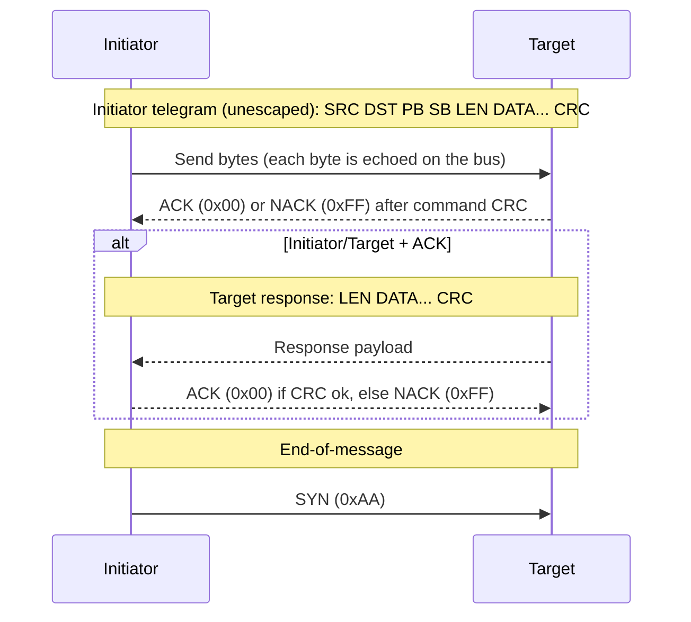

# eBUS Overview (Wire-Level)

This document describes the wire-level framing and rules that are implemented. It focuses on the minimum required to interpret bytes on the bus.

## Terminology

This documentation uses role terms that align with modern, inclusive terminology:

- **Initiator**: the node that begins a transaction by sending a command telegram onto the bus.
- **Target**: the addressed node that ACK/NACKs the command and (for initiator/target transactions) may return a response payload.

<!-- legacy-role-mapping:begin -->
> Legacy role mapping (for cross-referencing older materials): `master` → `initiator`, `slave` → `target`. Helianthus documentation uses `initiator`/`target`.
<!-- legacy-role-mapping:end -->

## Frame Layout

An eBUS frame on the wire is represented as:

```text
| SRC | DST | PB | SB | LEN | DATA... | CRC |
|  1  |  1  |  1 |  1 |  1  |  LEN    |  1  |
```

- **SRC**: source address
- **DST**: destination address
- **PB/SB**: primary/secondary command bytes
- **LEN**: number of data bytes
- **DATA**: payload bytes
- **CRC**: CRC8 over the unescaped data (see CRC section)

## Frame Types

Frame type is derived from the destination address:

- **Broadcast**: `DST = 0xFE`
- **Initiator/Initiator**: `DST` has a valid initiator address pattern
- **Initiator/Target**: any other valid destination address

This inference determines whether an ACK-only exchange is expected (initiator/initiator) or a full response frame (initiator/target).

### Initiator Address Pattern

In direct-mode eBUS implementations (including Helianthus), initiator addresses are typically recognized by a nibble pattern:

- A destination is treated as an **initiator address** if **both** the high and low nibbles are one of: `0x0`, `0x1`, `0x3`, `0x7`, `0xF`.
- Examples: `0x10`, `0x31`, `0xF1`, `0x33`.

Addresses equal to `0xA9` (escape) or `0xAA` (SYN) are invalid in address positions.

### Helianthus Initiator Join Strategy

When Helianthus must choose an initiator address on a live bus, it follows a low-disturbance join sequence:

1. Passive listen warmup (default `5s`), collecting observed source and destination activity.
2. Candidate selection from the valid 25-address initiator set.
3. Default preference for higher addresses first (`F7, F3, F1, ...`) to keep lower-priority arbitration behavior. (`0xFF` is excluded from the default preference list because it may conflict with NACK signaling.)
4. Companion-target heuristic: reject a candidate if `(initiator + 0x05)` appears active as a probable target source or is frequently addressed as destination traffic.
5. Optional active discovery (`0x07 0xFE`) is disabled by default and bounded/rate-limited when enabled.

If all 25 initiator addresses are observed as occupied, join fails by default with an explicit error. Force selection is opt-in.

## ACK/NACK Symbols

The bus uses one-byte symbols:

```text
ACK  = 0x00
NACK = 0xFF
```

Broadcast frames do not receive ACK/NACK or responses.

**SYN during active waits:** If a `SYN` (`0xAA`) byte is received while waiting for an `ACK`/`NACK` or a target response, it signals end-of-transaction (timeout). All known implementations (ebusgo, ebusd, VRC Explorer) treat SYN during ACK/response wait as a timeout indicator and abort the current transaction. Ignoring SYN and continuing to wait is incorrect -- it causes the receiver to stall past the end of the transaction.

**Early SYN during request collection:** If SYN arrives when only 0 or 1 request bytes have been collected (`requestBytesSeen <= 1`), it indicates a new arbitration cycle rather than a framing error. Implementations should reset collection state and treat the next byte as the start of a new transaction.

## Transaction Flow (Direct Mode)

The eBUS “direct” transaction flow used by ebusd-style implementations is:



Key points:

- **Per-byte echo**: When an initiator drives a symbol onto the bus it will also observe the same symbol (“echo”). An echo mismatch indicates arbitration loss or a collision.
- **ACK/NAK timing**: `ACK`/`NACK` is exchanged **once per command**, after the initiator sends the command CRC (not after each byte).
- **Response shape**: In initiator/target transactions the target response begins with a **length byte** and does not repeat source/destination addresses. CRC is computed over `LEN DATA...` only (not including any address bytes). Implementors must **not** attempt to read header bytes (SRC/DST/PB/SB) from the slave response — they are inferred from the initiator telegram. See ebusgo#104 for a regression where phantom header reads caused all master-slave transactions to fail.
- **SYN** (`0xAA`) is used as an **end-of-message** delimiter and may also appear during idle.

> **Note:** ENH-based adapters abstract physical SYN detection. The host does not observe raw SYN bytes; the adapter handles arbitration internally and signals transaction boundaries via ENH command framing (STARTED, FAILED, etc.).

### Initiator-to-Initiator (i2i) Transactions

When the destination is an initiator-capable address, the eBUS transaction has **no response phase**. The target sends ACK after the command CRC and the transaction is complete. The initiator sends SYN (end-of-message) immediately after ACK -- it must not wait for a response length byte.

This is distinct from initiator/target transactions where the target returns a response payload (LEN DATA... CRC) after ACK.

Implementations must detect i2i frame type from the destination address pattern before entering the response-read phase. Entering WaitResponseLen for an i2i transaction causes an indefinite hang because no response bytes will arrive.

### Collision Detection Model (Helianthus)

For multi-client/proxy setups, Helianthus collision handling uses a receive-vs-transmit check:

- Maintain a bounded history of locally transmitted frames with timestamps.
- On receive, when `SRC == active initiator`:
  - if frame matches a recent local transmit inside the echo window (`200ms` default), treat as local echo,
  - otherwise classify as foreign same-source collision.
- In muted/listen-only mode, any `SRC == active initiator` receive frame is classified as collision.
- After initiator rejoin, frames with the previous initiator source are ignored during a grace window (`750ms` default).
- While collision is active, write attempts fail fast with an arbitration-failed classification.

## CRC8 and Escaping

### CRC8

CRC8 is computed over the **logical (unescaped) frame bytes**:

- **CRC8 polynomial:** `0x9B` (init `0x00`).

> **Important:** CRC is always computed over the logical frame bytes, **before** escape substitution. The escaped wire representation is never used for CRC calculation. Confusing logical vs wire bytes was the root cause of CRC bugs across multiple codebases (VE16, VE25, EG47).

CRC8 coverage depends on the direct-mode phase:

- **Initiator telegram CRC** is computed over: `SRC DST PB SB LEN DATA...`
- **Target response CRC** is computed over: `LEN DATA...` (responses do not repeat addresses in direct mode)

### Wire Escape Encoding

On the wire, two byte values require escape substitution because they have special meaning (ESC and SYN). This encoding is applied **after** CRC computation when transmitting, and reversed **before** CRC verification when receiving:

- Literal `0xA9` (ESC) is encoded as `0xA9 0x00`
- Literal `0xAA` (SYN) is encoded as `0xA9 0x01`

The escape encoding applies to all frame bytes on the wire, including the CRC byte itself. If the computed CRC value happens to be `0xA9` or `0xAA`, it is also escape-encoded for transmission.

## Example

```text
SRC=0x10 DST=0x08 PB=0xB5 SB=0x04 LEN=0x01 DATA=0x7F CRC=0x??
```

The CRC byte is computed over the logical bytes `SRC DST PB SB LEN DATA` using CRC8/0x9B. If the resulting CRC value is `0xA9` or `0xAA`, it is escape-encoded on the wire.

## Common Discovery Functions

This section documents common discovery-style requests used to enumerate devices and read basic identity metadata. The layouts describe the **payload bytes** inside an eBUS frame (not including CRC/escaping).

In BASV-style discovery orchestration, these standard functions are the protocol-level building blocks for presence refresh and identity probing.

### QueryExistence (0x07 0xFE)

QueryExistence is commonly used as a best-effort “who is present?” broadcast.

```text
Initiator telegram:
  DST = 0xFE (broadcast)
  PB  = 0x07
  SB  = 0xFE
  LEN = 0x00
  DATA = (empty)
```

Notes:
- Broadcast messages do not have a response telegram.
- Some stacks (including ebusd) use QueryExistence as a trigger to refresh internal address state that can later be queried (e.g. via the ebusd TCP `info` command).

### Identification Scan (0x07 0x04)

Identification (often “scan” in ebusd terminology) reads a device’s manufacturer, device id, and software/hardware versions.

```text
Initiator telegram:
  DST = <candidate target address>
  PB  = 0x07
  SB  = 0x04
  LEN = 0x00
  DATA = (empty)
```

Observed target response payload layout:

```text
  0: manufacturer   byte
  1..(N-5): device_id ASCII (NUL-padded; length varies)
  (N-4)..(N-3): sw   2 bytes (opaque)
  (N-2)..(N-1): hw   2 bytes (opaque)
```

Notes:
- The response length varies by device because the device id field is variable-length.
- Many tools treat `sw`/`hw` as opaque hex.

### Identify-Only Profile Fields (Generic)

For deterministic “identify-only” target emulation, a practical profile can be represented with:

- `address` (target address that receives the `0x07 0x04` query),
- `manufacturer` (1 byte),
- `device_id` (ASCII token),
- `software_version` (2 bytes, opaque),
- `hardware_version` (2 bytes, opaque),
- response-delay bounds (timing envelope; transport/runtime dependent).

For minimal compatibility, many emulators normalize `device_id` to a 5-byte ASCII field before generating the payload:

1. trim surrounding whitespace,
2. truncate to 5 bytes if longer,
3. right-pad with ASCII space (`0x20`) if shorter.

Given this normalization, the generated identify payload layout is:

```text
  0: manufacturer         (1 byte)
  1..5: device_id_5       (5 bytes ASCII)
  6: sw_hi                (1 byte)
  7: sw_lo                (1 byte)
  8: hw_hi                (1 byte)
  9: hw_lo                (1 byte)
```

Notes:
- This 10-byte shape is a minimal interoperability layout for identify-only emulation.
- Real devices may still return longer `device_id` fields and therefore larger identify payloads.

### Minimal VR90 Recognition Query Set (Observed)

For basic recognition of a wired VR90-style target in controlled setups, the smallest observed query set is:

1. Send one identification query to the candidate target address (`PB=0x07`, `SB=0x04`, empty payload).
2. Accept a valid target response payload with manufacturer + identity fields.

Minimal response payload shape used in practice:

```text
  0: manufacturer   byte
  1..5: device_id   5 bytes ASCII
  6..7: sw_version  2 bytes (opaque)
  8..9: hw_version  2 bytes (opaque)
```

Notes:
- This is a practical minimum profile for VR90 recognition behavior; it is not a full thermostat command set.
- Other targets may return longer device identifiers and therefore a different overall response length.

## See Also

- `protocols/ebusd-tcp.md` – ebusd daemon TCP command protocol (for tooling that sends direct-mode telegrams via ebusd).
- `protocols/ebus-vaillant.md#vaillant-scanid-chunks-qq0x240x27` – Vaillant extended discovery (`0xB5 0x09`) details.
- `protocols/basv.md` – BASV discovery orchestration flow (observed).
