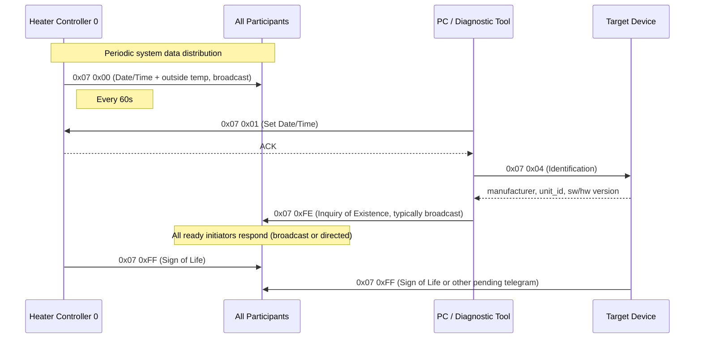

# eBUS Service 0x07 — System Data (Application Layer)

> Source: eBUS Specification Application Layer (OSI 7) V1.6.1, §3.3

## Scope

Service `0x07` manages system-wide data distribution and device discovery. Heater controller 0 periodically broadcasts date/time and outside temperature. Other commands support time setting, device identification, capability queries, and existence probing.

Several commands in this service are also documented (from the implementation perspective) in [`ebus-overview.md`](./ebus-overview.md) — specifically the Identification Scan (`0x07 0x04`) and QueryExistence (`0x07 0xFE`). This document provides the normative specification view.

## Terminology

<!-- legacy-role-mapping:begin -->
> Legacy role mapping (for cross-referencing older materials): `master` → `initiator`, `slave` → `target`. Helianthus documentation uses `initiator`/`target`.
<!-- legacy-role-mapping:end -->

## Command Summary

| PB | SB | Name | Direction | Telegram Type | Cycle Rate |
|---:|---:|---|---|---|---|
| `0x07` | `0x00` | Date/Time Broadcast | Controller 0 → all | Broadcast | 1/60s |
| `0x07` | `0x01` | Set Date/Time | PC/clock → controller | Initiator/Target | One-time |
| `0x07` | `0x02` | Set Outside Temperature | Service tool → controller | Initiator/Target | One-time |
| `0x07` | `0x03` | Query Supported Commands | Any → target | Initiator/Target | One-time |
| `0x07` | `0x04` | Identification | Any → target or broadcast | Initiator/Target or Broadcast | One-time |
| `0x07` | `0x05` | Query Supported Commands (extended) | Any → target | Initiator/Target | One-time |
| `0x07` | `0xFE` | Inquiry of Existence | Any → all | Broadcast (typically) | One-time (infrequent) |
| `0x07` | `0xFF` | Sign of Life | Any → all | Broadcast (typically) | One-time (response to 0xFE) |

## Commands

### Service 0x07 0x00 — Date/Time Broadcast

**Description:** Periodically broadcast by heater controller 0. Distributes current date, time, and outside temperature to all bus participants.

**Payload (initiator telegram, broadcast, `NN=0x09`):**

| Byte | Field | Type | Range | Description |
|---:|---|---|---|---|
| 0–1 | outside_temp | DATA2b | -50.0 to +50.0 degC | Outside temperature, low byte first |
| 2 | seconds | BCD | 0–59 | Current seconds |
| 3 | minutes | BCD | 0–59 | Current minutes |
| 4 | hours | BCD | 0–23 | Current hours |
| 5 | day | BCD | 1–31 | Day of month |
| 6 | month | BCD | 1–12 | Month |
| 7 | weekday | BCD | 1–7 | Day of week |
| 8 | year | BCD | 0–99 | Year (two-digit) |

**Bus load:** 0.11% at 1/60s cycle.

---

### Service 0x07 0x01 — Set Date/Time

**Description:** Allows a PC, manual terminal, or radio clock to set the system clock (in heater controller 0).

**Payload (initiator telegram, `NN=0x09`):**

| Byte | Field | Type | Range | Description |
|---:|---|---|---|---|
| 0 | seconds | BCD | 0–59 | Seconds |
| 1 | minutes | BCD | 0–59 | Minutes |
| 2 | hours | BCD | 0–23 | Hours |
| 3 | day | BCD | 1–31 | Day |
| 4 | month | BCD | 1–12 | Month |
| 5 | weekday | BCD | 1–7 | Weekday |
| 6 | year | BCD | 0–99 | Year |
| 7–8 | outside_temp | DATA2b | -50.0 to +50.0 degC | Outside temperature |

---

### Service 0x07 0x02 — Set Outside Temperature

**Description:** Temporarily or permanently overrides the system outside temperature during service.

**Payload (initiator telegram, `NN=0x03`):**

| Byte | Field | Type | Range | Description |
|---:|---|---|---|---|
| 0–1 | outside_temp | DATA2b | -50.0 to +50.0 degC | Temperature override |
| 2 | validity | BYTE | 0–255 | `0x00` = permanent (until further notice); nonzero = override duration in minutes. **Source note:** the official spec row names only `0x00` and `0x9B` (155) as example values, but the range column shows `0..255` and the unit is minutes, indicating the full byte range is valid |

---

### Service 0x07 0x03 — Query Supported Commands

**Description:** Queries which secondary commands a target device supports. The response has a fixed PB-per-byte mapping (`0x05`–`0x0C`). Useful for capability discovery from a PC or diagnostic tool.

**Request payload (`NN=0x01`):**

| Byte | Field | Type | Range | Description |
|---:|---|---|---|---|
| 0 | sb_block | BYTE | — | `0x00` = SBs 0–7, `0x01` = SBs 8–15, etc. |

**Response payload (`NN=0x0A`):**

| Byte | Field | Type | Range | Description |
|---:|---|---|---|---|
| 0 | version | BCD | 0–99 | Implementation version |
| 1 | revision | BCD | 0–99 | Implementation revision |
| 2 | pb_05 | BIT | — | Bits represent SBs for PB `0x05`. Bit0 = first SB in requested block, bit set = supported |
| 3 | pb_06 | BIT | — | SB support for PB `0x06` |
| 4 | pb_07 | BIT | — | SB support for PB `0x07` |
| 5 | pb_08 | BIT | — | SB support for PB `0x08` |
| 6 | pb_09 | BIT | — | SB support for PB `0x09` |
| 7 | pb_0A | BIT | — | SB support for PB `0x0A` |
| 8 | pb_0B | BIT | — | SB support for PB `0x0B` |
| 9 | pb_0C | BIT | — | SB support for PB `0x0C` |

Each response byte maps to a fixed primary command (`0x05`–`0x0C`). Within each byte, the bit position selects the secondary command from the requested SB block: e.g., with `sb_block=0x00`, bit0 = SB `0x00`, bit7 = SB `0x07`.

---

### Service 0x07 0x04 — Identification

**Description:** Requests device identity (manufacturer, unit ID, software/hardware version). Also used as a self-identification broadcast during initialization.

> **Cross-reference:** The implementation perspective of this command is documented in [`ebus-overview.md` § Identification Scan](./ebus-overview.md#identification-scan-0x07-0x04).

**Request/Response (Initiator/Target):**

Request payload: Empty (`NN=0x00`).

**Response payload (`NN=0x0A`):**

| Byte | Field | Type | Range | Description |
|---:|---|---|---|---|
| 0 | manufacturer | BYTE | 0–99 | Manufacturer code (per official spec). **Observed extension:** real-world devices use values beyond this range (e.g., Vaillant `0xB5`); implementations should accept the full byte range |
| 1–5 | unit_id | ASCII×5 | — | Unit/device identifier (5 bytes) |
| 6 | sw_version | BCD | 0–99 | Software version |
| 7 | sw_revision | BCD | 0–99 | Software revision |
| 8 | hw_version | BCD | 0–99 | Hardware version |
| 9 | hw_revision | BCD | 0–99 | Hardware revision |

**Broadcast (self-identification):**

Payload (`NN=0x0A`): Same fields as the response above, carried in the initiator telegram data with `DST=0xFE`.

---

### Service 0x07 0x05 — Query Supported Commands (Extended)

**Description:** Extended version of `0x07 0x03` that queries supported commands for a specific primary command block. **Source note:** the official request table row lists `SB = 03h` instead of `05h`; this is treated as a spec erratum given the distinct heading, description, and extended request shape.

**Request payload (`NN=0x02`):**

| Byte | Field | Type | Range | Description |
|---:|---|---|---|---|
| 0 | sb_block | BYTE | — | SB block selector (same as `0x07 0x03`) |
| 1 | pb_block | BYTE | — | PB block: `0x00` = PB `0x00`–`0x07`, `0x01` = PB `0x08`–`0x0F`, ..., `0x1F` = PB `0xF8`–`0xFF` |

**Response payload (`NN=0x0A`):**

| Byte | Field | Type | Range | Description |
|---:|---|---|---|---|
| 0 | version | BCD | 0–99 | Implementation version |
| 1 | revision | BCD | 0–99 | Implementation revision |
| 2–9 | pb_x..pb_x+7 | BIT×8 | — | Each byte maps to one PB in the selected block (byte 2 = first PB, byte 9 = eighth PB). Bits select SBs from the requested SB block, same as `0x07 0x03` |

Unlike `0x07 0x03` (which has fixed PB mapping `0x05`–`0x0C`), the PB-per-byte mapping here depends on the `pb_block` selector: block 0 → PBs `0x00`–`0x07`, block 1 → PBs `0x08`–`0x0F`, etc.

---

### Service 0x07 0xFE — Inquiry of Existence

**Description:** Triggers all ready-to-send initiators to transmit at the earliest opportunity. Typically sent as broadcast, but the spec notes it does not have to be. Should be used infrequently due to significant bus load impact.

> **Cross-reference:** The implementation perspective is documented in [`ebus-overview.md` § QueryExistence](./ebus-overview.md#queryexistence-0x07-0xfe).

**Payload:** Empty (`NN=0x00`). No response frame — initiators respond by sending their next scheduled telegram or a Sign of Life (`0x07 0xFF`).

---

### Service 0x07 0xFF — Sign of Life

**Description:** Broadcast response to an Inquiry of Existence (`0x07 0xFE`). Sent by initiators that have no other pending telegram.

**Payload (broadcast):** Empty (`NN=0x00`).

## Communication Flow

## See Also

- [`ebus-application-layer.md`](./ebus-application-layer.md) — service index
- [`ebus-overview.md`](./ebus-overview.md) — wire-level framing, QueryExistence and Identification Scan from the implementation perspective
- [`basv.md`](../vaillant/basv.md) — BASV discovery orchestration (uses `0x07 0x04` and `0x07 0xFE` as building blocks)
