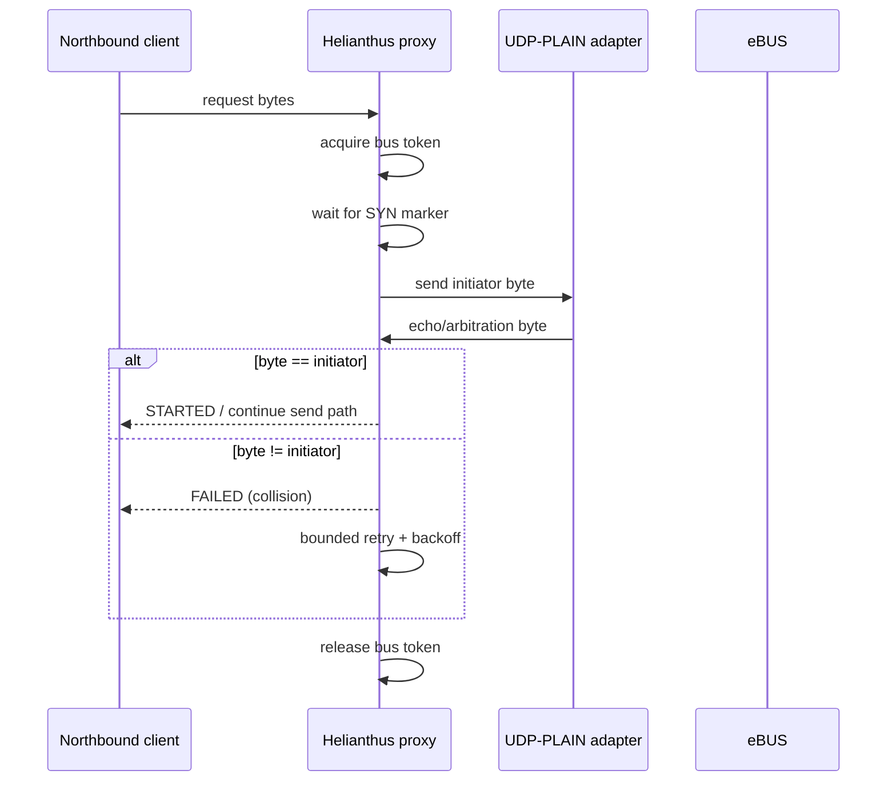

# UDP-PLAIN (Raw eBUS bytes over UDP)

Some Ethernet eBUS adapters expose the wire-level eBUS byte stream over UDP datagrams.

This transport is **not** ENH: there is no `<INIT>`, no `<START>` arbitration request, and no ENH command/data framing. The UDP payload is simply a sequence of bytes as observed on / written to the bus.

## Semantics

- **Unit of transfer:** UDP datagrams.
- **Payload:** raw eBUS bytes (including wire-level escape sequences where applicable).
- **Ordering:** datagrams may be dropped or reordered by the network. Consumers must treat this as an *unreliable* byte stream.

Helianthus models this as `UDPPlainTransport`, where:

- each received UDP datagram is buffered as a contiguous byte slice,
- `ReadByte()` returns bytes sequentially across datagrams.

## Arbitration and multi-client behavior

Because UDP-PLAIN does not provide an ENH-style `<START>` / `<STARTED>` handshake, the adapter cannot coordinate bus ownership on behalf of multiple clients.

For UDP-PLAIN setups, **software arbitration and multi-client mediation must be implemented above the adapter**, typically via an eBUS adapter proxy that:

- is the *sole* UDP client of the adapter,
- arbitrates bus ownership and schedules requests,
- multiplexes bus traffic to multiple northbound clients.

## Proxy arbitration model (Helianthus)

Helianthus treats the adapter as a **single southbound owner** resource:

- only the proxy talks to the adapter southbound,
- all northbound clients (ENH and optional UDP-PLAIN) go through proxy arbitration,
- one writer owns the bus token at a time.

### Why this is required

If multiple applications connect directly to a UDP-PLAIN adapter, each reads the same raw byte stream without request correlation. This leads to:

- out-of-order response ownership,
- request/response mismatch across clients,
- false collision/timeout behavior during scans.

### Arbitration sequence for UDP-PLAIN southbound



## Collision surfacing and retry policy

Current proxy behavior for UDP-PLAIN arbitration:

- collision is surfaced when arbitration byte differs from requested initiator,
- retries are bounded (`4` attempts),
- exponential backoff is applied (`25ms`, `50ms`, `100ms`, `200ms`, capped by config constants),
- timeout paths return host-side error to the northbound client.

This keeps retry behavior finite and prevents uncontrolled retry loops on busy buses.

## Examples

```text
udp-plain://203.0.113.10:9999
```
