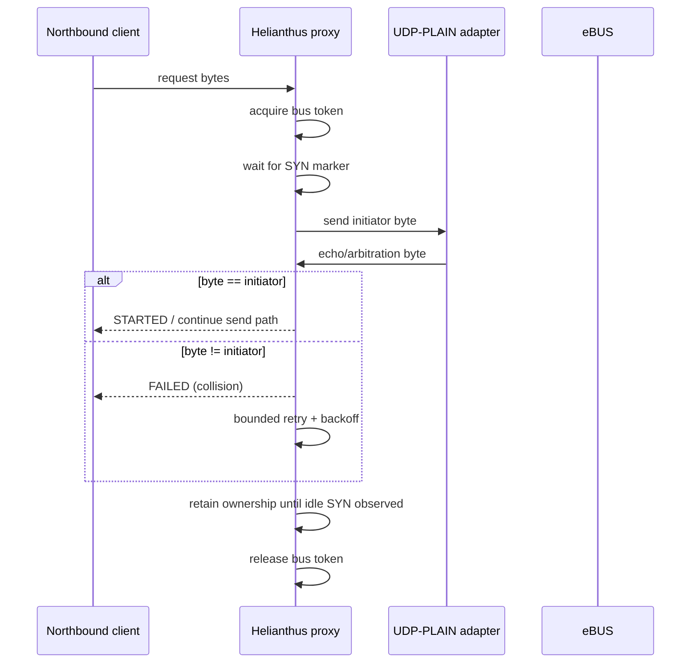

# UDP-PLAIN (Raw eBUS bytes over UDP)

Some Ethernet eBUS adapters expose the wire-level eBUS byte stream over UDP datagrams.

This transport is **not** ENH: there is no `<INIT>`, no `<START>` arbitration request, and no ENH command/data framing. The UDP payload is simply a sequence of bytes as observed on / written to the bus.

> **Important:** UDP-plain is a raw byte transport with NO bus arbitration and NO escape encoding/decoding. Bytes are forwarded as-is between the UDP client and the bus. When multiple UDP clients are active simultaneously, bus collisions are possible with no retry mechanism. UDP-plain is intended for single-client diagnostic use, not multi-client production deployments.

## Semantics

- **Unit of transfer:** UDP datagrams.
- **Payload:** raw eBUS bytes (including wire-level escape sequences where applicable).
- **Ordering:** datagrams may be dropped or reordered by the network. Consumers must treat this as an *unreliable* byte stream.

Helianthus models this as `UDPPlainTransport`, where:

- each received UDP datagram is buffered as a contiguous byte slice,
- `ReadByte()` returns bytes sequentially across datagrams.

## Arbitration and multi-client behavior

Because UDP-PLAIN does not provide an ENH-style `<START>` / `<STARTED>` handshake, the adapter cannot coordinate bus ownership on behalf of multiple clients.

For UDP-PLAIN setups, **software arbitration and multi-client mediation must be implemented above the adapter**, typically via an eBUS adapter proxy that:

- is the *sole* UDP client of the adapter,
- arbitrates bus ownership and schedules requests,
- multiplexes bus traffic to multiple northbound clients.

## Proxy arbitration model (Helianthus)

Helianthus treats the adapter as a **single southbound owner** resource:

- only the proxy talks to the adapter southbound,
- all northbound clients (ENH and optional UDP-PLAIN) go through proxy arbitration,
- one writer owns the bus token at a time.

### Why this is required

If multiple applications connect directly to a UDP-PLAIN adapter, each reads the same raw byte stream without request correlation. This leads to:

- out-of-order response ownership,
- request/response mismatch across clients,
- false collision/timeout behavior during scans.

### Arbitration sequence for UDP-PLAIN southbound



## Collision surfacing and retry policy

Current proxy behavior for UDP-PLAIN arbitration:

- collision is surfaced when arbitration byte differs from requested initiator,
- retries are bounded (`4` attempts),
- exponential backoff is applied (`25ms`, `50ms`, `100ms`, `200ms`, capped by config constants),
- bounded jitter is applied on retry backoff (`udp-retry-jitter`, default `0.2`) to avoid synchronized retry storms,
- START arbitration timeout is configurable (`udp-plain-start-wait`, default `5s`),
- timeout fallback to `STARTED` is enabled by default for plain-wire interoperability and can be disabled with `udp-plain-disable-start-fallback=true`,
- the proxy retains bus ownership after STARTED until idle SYN (`0xAA`) is observed on the upstream bus (not released immediately after STARTED); ownership is also released on terminal upstream errors (`ERROR_EBUS`, `ERROR_HOST`),
- timeout paths return host-side error to the northbound client.

This keeps retry behavior finite and prevents uncontrolled retry loops on busy buses.

### Auto initiator selection (`START` with `initiator=0x00`)

Proxy startup performs a passive warmup window (`auto-join-warmup`, default `5s`) and records observed initiator activity.

When a northbound client sends `START` with `initiator=0x00`, proxy selects an initiator automatically using:

- highest-priority-safe preference (`F7`, `F3`, `F1`, ...),
- recently observed initiator activity (window: `auto-join-activity-window`),
- currently leased initiators in proxy.

If no safe initiator is available, proxy returns a host-side error for the `START`.

### Ownership Lease TTL

Bus ownership acquired via UDP-PLAIN MUST be bounded by a maximum TTL (time-to-live). Ownership begins at one of two well-defined timestamps:

- **Normal path**: the moment the adapter echoes the requested initiator address byte on the bus (arbitration win, southbound signal — UDP-PLAIN has no `STARTED` response).
- **Fallback path** (when `udp-plain-disable-start-fallback=false`, the default): if no echo arrives within `udp-plain-start-wait` (default 5s), the proxy synthesizes a northbound `STARTED` and ownership begins at the synthesis timestamp. Implementations MUST record this synthesis timestamp explicitly and MUST NOT skip TTL enforcement because the echo was absent.

If the proxy does not observe idle SYN (`0xAA`) within the TTL period after the recorded lease-start timestamp, ownership MUST be released unconditionally to prevent bus lockout.

The TTL cap applies to both:
- **Active ownership**: the proxy is sending data and waiting for ACK/response.
- **Passive ownership**: the arbitration byte has been echoed but the proxy has not yet sent data.

Note: `STARTED` is an optional northbound (proxy-emitted) event, not a UDP-PLAIN adapter message. The lease TTL is anchored to the southbound arbitration-byte echo.

Implementations SHOULD use a configurable TTL with a reasonable default (e.g., 5 seconds). The TTL MUST NOT be refreshed by non-SYN raw bus traffic (that is, observing other bus bytes or proxy-emitted notifications does not extend the lease).

**Invariant name:** `XR_UDP_LeaseTTL_CapRefresh_Bounded`

### Fail-fast send behavior after collision

If arbitration reaches terminal failure for a session, the next send attempt for that session is short-circuited with `FAILED` (`ENHResFailed`) and the winning initiator byte in payload (when available), instead of generic host error.

## Examples

```text
udp-plain://203.0.113.10:9999
```
