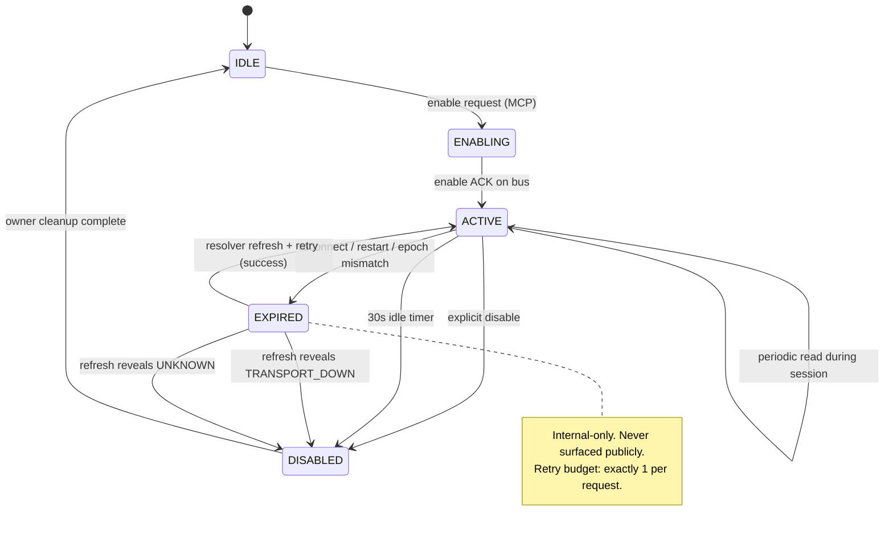

# Vaillant B503 — Diagnostic, Service, and HMU Live-Monitor (normative)

`PB=0xB5`, `SB=0x03`.

This document is the **normative L7 protocol specification** for the Vaillant
`B503` selector family within the Helianthus `vaillant/b503` namespace. It is
the `M0_DOC_GATE` deliverable for execution-plans#19 (plan
`vaillant-b503-namespace-w17-26`, canonical SHA `896a82e7`). Downstream code
milestones `M1_DECODER` (helianthus-ebusgo), `M2a_GATEWAY_MCP` /
`M2b_GATEWAY_GRAPHQL` / `M5_TRANSPORT_MATRIX` (helianthus-ebusgateway), `M3`
portal and `M4` Home Assistant MUST cite this document as their doc-gate
companion.

## 1. Status

**Normative.** Formerly reverse-engineered selector family. The seven selectors
listed in §3 are locked per plan AD01..AD15 as the v1 delivery surface. The
wire shape is stable; decoder structure, invoke-safety classification, session
model, error model, and public-surface normalization rules are frozen for v1.

Changes to this document require a new plan revision and a corresponding
doc-gate PR before any downstream code change may land.

Evidence labels used throughout:

- `LOCAL_TYPESPEC`: vendored john30 `ebusd-configuration` TypeSpec files.
- `LOCAL_CAPTURE`: operator-provided or repository-local bus captures.
- `LOCAL_MCP`: Helianthus MCP runtime observations.
- `PUBLIC_CONFIG`: upstream john30 `ebusd-configuration` repository.
- `INFERENCE`: falsifiable interpretation from the sources above.

## 2. Wire Shape

`B503` requests are **always** a two-byte selector. The request payload is
opaque to `protocol.Frame`; framing, CRC, escaping, and bus-transaction
behaviour are unchanged. No new transport semantics are introduced by this
namespace.

```text
Request payload (normative baseline — all selectors start with these 2 bytes):
  family   : byte     # 0x00 current-read | 0x01 history-lookup | 0x02 clear-command
  selector : byte     # 0x01 error        | 0x02 service        | 0x03 HMU live-monitor
```

The `family` byte classifies the request CLASS; its value is not itself a
history index. `selector` classifies the data plane (error / service / HMU
live-monitor). The two bytes together identify the row in §3.

**History reads** (`family = 0x01`, selectors `Errorhistory` / `Servicehistory`)
are indexable. Per `LOCAL_TYPESPEC`, the response carries an echoed `index`
field; the mechanism by which the client SELECTS which history entry to
retrieve is **device-class dependent** and MAY append additional bytes after
the two-byte baseline. Implementers MUST consult the per-target decoder in
`helianthus-ebusgo/protocol/vaillant/b503` and the LOCAL_TYPESPEC / LOCAL_CAPTURE
evidence for the target device class, and MUST run the falsification test in
§3 against multiple history indexes on real hardware before locking the
request encoding for a given target.

Response shape is selector-dependent; see §3 and the `helianthus-ebusgo`
per-selector struct definitions under `protocol/vaillant/b503`.

## 3. Selector Catalog (NORMATIVE)

The table below is the full v1 selector set. The `Invoke-Safety` column is the
authoritative classification applied at the gateway invoke boundary (§7).
`Install-write` selectors (`02 01`, `02 02`) are classified `INSTALL_WRITE` and
MUST NOT be reachable through any public surface in v1 (§9).

| Request payload | Direction | Name | Invoke-Safety | Response shape | Evidence | Falsification test |
|---|---:|---|---|---|---|---|
| `00 01` | read | `Currenterror` | `READ` | five LE `uint16` error slots (`errors`), `0xFFFF` = empty | `LOCAL_TYPESPEC`, `LOCAL_CAPTURE` | Read `B503 00 01` from BAI00 and disprove that response bytes decode as five little-endian unsigned 16-bit slots with `0xFFFF` sentinel. |
| `01 01` | read | `Errorhistory` | `READ` | index + `errorhistory` payload | `LOCAL_TYPESPEC` | Query multiple history indexes and show response does not change with the index byte or does not carry an error-history record. |
| `02 01` | install write | `Clearerrorhistory` | `INSTALL_WRITE` — **NOT exposed v1** | ACK / side effect | `LOCAL_TYPESPEC` | On isolated hardware, write the clear command and show error history remains unchanged after successful ACK. |
| `00 02` | read | `Currentservice` | `READ` | five LE `uint16` service slots (`errors` shape) | `LOCAL_TYPESPEC` | Read `B503 00 02` from a target with a service message and show no five-slot response exists. |
| `01 02` | read | `Servicehistory` | `READ` | index + `errorhistory`-shaped payload | `LOCAL_TYPESPEC` | Query indexes and show no indexed service-history payload. |
| `02 02` | install write | `Clearservicehistory` | `INSTALL_WRITE` — **NOT exposed v1** | ACK / side effect | `LOCAL_TYPESPEC` | Clear on isolated hardware and verify history is unchanged after ACK. |
| `00 03` | service write/read pair | HMU `LiveMonitorMain` enable + status | `SERVICE_WRITE` | response begins with `status`, `function`; trailing bytes reserved | `LOCAL_TYPESPEC`, `LOCAL_CAPTURE` | Enable live monitor, then read `B503 00 03`; falsify if first two data bytes do not track live-monitor status/function changes. |

## 4. Invoke-Safety Classes

Three classes are defined (plan AD04). The decoder package in
`helianthus-ebusgo/protocol/vaillant/b503` exports this as an enum and the
gateway MUST consult it at the invoke boundary before dispatching a frame.

| Class | Semantics | Gateway behaviour |
|---|---|---|
| `READ` | Passive-safe, idempotent. No session state. | May be invoked directly via `ebus.v1.rpc.invoke` substrate. |
| `SERVICE_WRITE` | Side-effectful, stateful. Gated by live-monitor session (§6). | MUST acquire `liveMonitorMu` and respect the FSM in §6. |
| `INSTALL_WRITE` | Side-effectful, requires installer authority. | MUST NOT be exposed on any public surface in v1. Negative tests in M2a / M2b / M3 assert absence on MCP, GraphQL, and portal respectively. |

Install-write classification for `02 01` (`Clearerrorhistory`) and `02 02`
(`Clearservicehistory`) is **mandatory** and non-overridable in v1. See §9.

## 5. Sentinel Rules and `first_active_error`

### 5.1 Sentinel

In the five-slot composite payloads returned by `00 01` (`Currenterror`) and
`00 02` (`Currentservice`), each slot is a little-endian `uint16`. The value
`0xFFFF` denotes an **empty slot** (no error / no service message occupying
that position). Sentinel detection is per-slot; a `0xFFFF` in slot N does not
truncate scanning of slot N+1.

### 5.2 `first_active_error`

`first_active_error` is defined normatively as:

> The first slot, scanning from slot 0 upward (ascending index), whose decoded
> LE `uint16` value is **not** `0xFFFF`. If all five slots are `0xFFFF`,
> `first_active_error` is absent.

Home Assistant entity `boiler_active_error` (plan M4) publishes this value
directly as a decimal integer, or the entity reports `unavailable` if absent
(see §11 for availability semantics).

### 5.3 Worked example (LOCAL_CAPTURE)

Captured from BAI00 (`0x08`) during plan R1 evidence gathering:

```text
REQ:  f1 08 b5 03 02 00 01
RESP: 0a 19 01 ff ff ff ff ff ff ff ff
```

Decode:

- Response length byte `0x0a` = 10 payload bytes.
- Slot 0: `19 01` → LE `0x0119` → decimal `281`.
- Slots 1..4: `ff ff` → `0xFFFF` → empty.

`first_active_error` = `281`. See §10 for the F.xxx correlation caveat
governing how this decimal is surfaced to consumers.

## 6. Live-Monitor Session

### 6.1 State machine (plan AD04)

The gateway runs a single-owner FSM per transport incarnation for selector
`00 03` (HMU `LiveMonitorMain`). `EXPIRED` is an **internal** sub-state
emitted only after the transport epoch advances under an in-flight owner
handle; it MUST NOT appear on any public surface (§7.2).



### 6.2 Ownership key

```text
ownership_key = (adapter_instance_id, transport_incarnation_epoch)
```

- A second claimant presenting a different `ownership_key` receives `BUSY`.
- A first-claimant handle whose `transport_incarnation_epoch` has advanced
  since claim acquisition receives `EXPIRED` (internal) and is auto-refreshed
  per §7.3 exactly once.

### 6.3 Transitions (normative)

| From | Event | To | Side effect |
|---|---|---|---|
| `IDLE` | enable request, no owner | `ENABLING` | emit enable frame after poll-quiesce |
| `ENABLING` | enable ACK received | `ACTIVE` | start 30s idle timer; arm reads |
| `ENABLING` | ACK timeout / NAK | `DISABLED` | release `liveMonitorMu` |
| `ACTIVE` | read request | `ACTIVE` | reset idle timer |
| `ACTIVE` | explicit disable | `DISABLED` | emit disable frame after quiesce |
| `ACTIVE` | 30s idle | `DISABLED` | emit disable frame after quiesce |
| `ACTIVE` | epoch advance detected | `EXPIRED` | internal; trigger refresh-once |
| `EXPIRED` | refresh succeeds | `ACTIVE` | resume; retry budget consumed |
| `EXPIRED` | refresh → `TRANSPORT_DOWN` | `DISABLED` | surface `TRANSPORT_DOWN` (NOT `SESSION_BUSY`) |
| `EXPIRED` | refresh → `UNKNOWN` | `DISABLED` | surface `UNKNOWN` (NOT `SESSION_BUSY`) |
| any | transport disconnect | `DISABLED` | MUST release `liveMonitorMu`; owner cleanup |
| any | gateway restart | `DISABLED` | MUST release `liveMonitorMu`; owner cleanup |

## 7. Gateway Operational Contract

This section is the primary doc-gate companion for `M2a_GATEWAY_MCP` and
`M5_TRANSPORT_MATRIX`. It is sourced directly from plan §11. All statements
are normative (MUST / MUST NOT / SHOULD).

### 7.1 Public error model

Exactly **two** public outcomes exist for `SERVICE_WRITE` and `READ`
operations that depend on capability state. Both are members of the
public `B503Availability` enum (§11) or map onto it:

| Public value | Meaning | When it surfaces |
|---|---|---|
| `BUSY` (`SESSION_BUSY`) | Live-monitor session owned by another client, OR bounded lifecycle/contention ambiguity. | Concurrent claim with different `ownership_key`; genuine contention that is not transport loss. |
| `UNAVAILABLE` (`TRANSPORT_DOWN` / `UNKNOWN` / `NOT_SUPPORTED`) | Capability is not currently usable; distinguish reason per public enum (§11). | Transport disconnected; gateway has not yet determined availability; device class does not implement B503. |

#### 7.1.1 Internal-only state (NOT public)

`EXPIRED` is a gateway-internal FSM sub-state (§6.1) and MUST NOT appear
in any public MCP / GraphQL / portal / HA surface. It exists only inside
the gateway and is consumed by the resolver refresh-once policy (§7.3):

| Internal value | Where it lives | Public exposure |
|---|---|---|
| `EXPIRED` | gateway FSM only | **forbidden** — surfaces as `AVAILABLE` (after successful refresh), `BUSY`, or `UNAVAILABLE` per §8 normalization |

Downstream contract tests (M2a, M2b) MUST assert that no public response
ever carries `EXPIRED`; any such surface is a gateway bug.

### 7.2 Quiesce timing bounds (normative)

The gateway MUST apply a **poll-quiesce window** around the emission of every
live-monitor enable and disable frame. Bounds:

- **Lower bound: 0.** The quiesce window MAY be zero when no B524 poll frame is
  in flight.
- **Upper bound:** enforced by the transport layer — the gateway MUST NOT emit a
  B503 live-monitor enable or disable frame while a B524 poll frame is in
  flight on the same bus. Observed upper bound on adapter-direct and
  `ebusd_tcp` transports is one B524 transaction window (validated in
  `M5_TRANSPORT_MATRIX`, artefact `matrix/M6a-vaillant-b503.md`).

### 7.3 Retry and refresh

- Maximum **1 auto-retry per request** on `EXPIRED`. No recursive or unbounded
  retries.
- On refresh success → retry once; then surface the retry outcome.
- On refresh revealing `TRANSPORT_DOWN` or `UNKNOWN` → surface that value
  literally (§11). It MUST NOT be collapsed into `SESSION_BUSY`.
- No infinite reconnect loops. Reconnect is driven by the transport layer, not
  by B503 resolvers.

### 7.4 Ownership release

- On transport disconnect, the gateway MUST release `liveMonitorMu` and
  transition the FSM to `DISABLED`.
- On gateway restart, the gateway MUST release `liveMonitorMu` and transition
  the FSM to `DISABLED`. No state persists across restart.
- `liveMonitorMu` is a **distinct** `sync.Mutex` from the B524 `readMu`.
  Acquisition order when both are needed: `liveMonitorMu` → (optional)
  `readMu`. The reverse order is forbidden.

### 7.5 Reconnect handling

- On reconnect, the `transport_incarnation_epoch` advances. Any surviving owner
  handle from the prior incarnation is `EXPIRED` (internal) on next touch.
- The resolver applies the §7.3 refresh-once policy.
- The gateway MUST NOT auto-resume a live-monitor session across transport
  incarnations. A new enable from the client is required.

### 7.6 30s idle-timeout semantics

- In `ACTIVE`, if no read request arrives within 30 seconds, the gateway emits
  a disable frame (with quiesce) and transitions to `DISABLED`.
- The 30s timer resets on every successful read.
- Idle disable transitions the **internal** FSM from `ACTIVE` to `DISABLED`.
  The **public capability signal** (§11) remains `AVAILABLE` throughout: idle
  auto-disable is a session-lifecycle event, not a capability change. A client
  that issues a new live-monitor request simply re-enters `ENABLING`. Idle
  auto-disable MUST NOT be reported to consumers as `NOT_SUPPORTED`, which is
  reserved for "device class does not implement B503" (§11).

### 7.7 Concurrency with B524

- READ selectors (`00 01`, `01 01`, `00 02`, `01 02`) MAY proceed concurrently
  with B524 polling.
- SERVICE_WRITE (`00 03`) enable/disable frames serialize via `liveMonitorMu`
  and the quiesce window (§7.2). `M5_TRANSPORT_MATRIX` MUST include an
  explicit regression scenario (plan AD12) proving B524 baseline throughput is
  unchanged with the new mutex in place.

### 7.8 Stable API error model

The stable API (GraphQL `B503Availability` enum + MCP error code) exposes:

- `AVAILABLE`
- `NOT_SUPPORTED`
- `TRANSPORT_DOWN`
- `SESSION_BUSY`
- `UNKNOWN`

`EXPIRED` is not a member of this enum and never appears in any public
payload. See §8 for the normative normalization rules and §11 for the GraphQL
capability-signal contract.

## 8. Public Normalization Rules

The following rules are normative and binding on every downstream consumer
path (MCP resolvers, GraphQL resolvers, HA integration, portal).

1. **EXPIRED is internal-only.** Internal state `EXPIRED` MUST NOT appear in
   any public-facing enum, error model, or payload exposed to downstream
   consumers (MCP, GraphQL, portal, Home Assistant).
2. **Refresh-once on EXPIRED.** On `EXPIRED` detected inside a resolver, the
   resolver MUST auto-refresh session state and retry the operation
   **exactly once**.
3. **No collapse of transport/unknown outcomes.** After refresh, if the
   capability query reveals `TRANSPORT_DOWN` or `UNKNOWN`, those outcomes MUST
   be surfaced literally. They MUST NOT be collapsed into `SESSION_BUSY`.
4. **SESSION_BUSY is narrow.** `SESSION_BUSY` is reserved **only** for bounded
   lifecycle/contention ambiguity (another claimant, genuine in-flight
   contention). It is not a catch-all for unknown or transport failures.
5. **Bounded retries.** Maximum 1 auto-retry per request. No infinite
   reconnect loops. The transport layer owns reconnect; B503 resolvers do not.

## 9. Install-Writes Non-Exposure (v1 invariant)

`Clearerrorhistory` (selector `02 01`) and `Clearservicehistory` (selector
`02 02`) are classified `INSTALL_WRITE` (§4) and are subject to the following
normative v1 invariant:

> **`02 01` and `02 02` MUST NOT be exposed on any public surface in v1.**
> This includes, without exception, MCP tools, GraphQL mutations, portal UI
> affordances (including hidden / feature-flagged DOM), and Home Assistant
> services.

Enforcement:

- `M2a_GATEWAY_MCP` acceptance includes a negative test asserting no MCP tool
  exists for these selectors.
- `M2b_GATEWAY_GRAPHQL` acceptance includes a schema introspection diff
  asserting no mutation exists for these selectors.
- `M3_PORTAL` acceptance includes a DOM audit scanning for any element
  referencing `clear`, `delete`, or `reset` keywords in the B503 pane.

Any future exposure of these selectors requires a **separate plan** and a new
doc-gate PR per `AGENTS.md §8.4`, including installer-mode authentication
design and isolated-hardware bench evidence.

## 10. F.xxx Decimal Caveat (LOCAL_CAPTURE only)

The normative public contract publishes active-error and service slot values
**as decimal integers, as-is**. There is **no cross-device F.xxx lookup
table** in this specification.

A single local correlation has been observed:

- LOCAL_CAPTURE on BAI00: first slot `0x0119` = decimal `281` (§5.3).
- Unpublished operator UI observation on the same BAI00: `F.281 Flame loss
  during the stabilisation period`.

This proves **only** that on this specific BAI00 device generation, the first
active-error slot was equal to the decimal component of the operator UI code.
It does **not** prove that every Vaillant `F.xxx` code is mirrored as the same
decimal value on every device generation, nor that the mapping is stable
across HMU, EHP, or VRC720-family controllers.

Downstream consumers therefore:

- MUST publish the raw decimal value.
- MUST NOT present a translated F.xxx label in entity state or GraphQL
  resolver output.
- MAY attach a decoder-metadata annotation carrying `provenance=LOCAL_CAPTURE`
  for diagnostic purposes only, with no claim of cross-device validity.

Building a cross-device F.xxx table is deferred to a separate RE plan (see
plan §Scope OUT).

## 11. GraphQL Capability Signal (public contract)

The GraphQL capability signal `vaillantCapabilities.b503` is the authoritative
availability surface for HA and portal. It is defined here for doc-gate
completeness; the authoritative schema lives in
`helianthus-ebusgateway/graphql/schema`.

```graphql
type VaillantCapabilities {
  b503: B503Capability!
}

type B503Capability {
  available: Boolean!         # true only when reason == AVAILABLE
  reason: B503Availability!
}

enum B503Availability {
  AVAILABLE
  NOT_SUPPORTED    # device class does not implement B503
  TRANSPORT_DOWN   # transport currently disconnected
  SESSION_BUSY     # live-monitor session owned by another client
  UNKNOWN          # gateway has not yet determined availability
}
```

`EXPIRED` is **not** a member of this enum, per §8.

## 12. Evidence Labels (preserved)

The evidence labels defined in §1 are used throughout. In particular:

- The §3 selector catalog is `LOCAL_TYPESPEC` + `LOCAL_CAPTURE` grounded.
- The §5.3 worked example is `LOCAL_CAPTURE`.
- The §10 F.xxx correlation is `LOCAL_CAPTURE`-only; no `PUBLIC_CONFIG` or
  cross-device evidence has been admitted into this spec.
- Future device-class coverage additions MUST cite the evidence label that
  supports them before entering the normative catalog.

## 13. Companion Links (downstream code milestones)

| Milestone | Repo | Artefact |
|---|---|---|
| `M1_DECODER` | `helianthus-ebusgo` | `protocol/vaillant/b503` decoder package + invoke-safety enum |
| `M2a_GATEWAY_MCP` | `helianthus-ebusgateway` | MCP tools `ebus.v1.vaillant.errors.get`, `.errors.history.get`, `.service.current.get`, `.service.history.get`, `.live_monitor.get` |
| `M5_TRANSPORT_MATRIX` | `helianthus-ebusgateway` | `matrix/M6a-vaillant-b503.md` — adapter-direct + `ebusd_tcp` (+ `ebusd_serial` if lab-available) |
| `M2b_GATEWAY_GRAPHQL` | `helianthus-ebusgateway` | GraphQL read-only parity + `vaillantCapabilities.b503` signal |
| `M3_PORTAL` | `helianthus-ebusgateway` | Vaillant pane (errors / service / live-monitor tabs, read-only) |
| `M4_HA` | `helianthus-ha-integration` | diagnostic sensor `boiler_active_error` + `error_history` attribute, capability-signal-gated |

Dependency DAG (plan AD09):
`M0 → M1 → M2a → M5 → M2b → {M3, M4}`.

All downstream PRs MUST include a companion-link reference to this document in
their PR body.

## 14. References

- Plan: `helianthus-execution-plans/vaillant-b503-namespace-w17-26.locked/`
  (canonical SHA `896a82e720b33eefb449ea532570e0a962bfa76504519996825f13d92ec9bb28`).
- Meta-issue: [execution-plans#19](https://github.com/Project-Helianthus/helianthus-execution-plans/issues/19).
- Doc-gate issue: [docs-ebus#282](https://github.com/Project-Helianthus/helianthus-docs-ebus/issues/282).
- Public TypeSpec: [errors_inc.tsp](https://github.com/john30/ebusd-configuration/blob/23a460b8fe1cc6e7a7e6d549190573ccfcfc450f/src/vaillant/errors_inc.tsp)
- Public TypeSpec: [service_inc.tsp](https://github.com/john30/ebusd-configuration/blob/23a460b8fe1cc6e7a7e6d549190573ccfcfc450f/src/vaillant/service_inc.tsp)
- Public TypeSpec: [08.hmu.tsp](https://github.com/john30/ebusd-configuration/blob/23a460b8fe1cc6e7a7e6d549190573ccfcfc450f/src/vaillant/08.hmu.tsp)
- Data type reference: [`../../types/ebusd-csv.md`](../../types/ebusd-csv.md)
- Consolidated local reference: [`ebus-vaillant.md`](ebus-vaillant.md)
- Sibling normative doc (structure precedent): [`ebus-vaillant-B505.md`](ebus-vaillant-B505.md)
