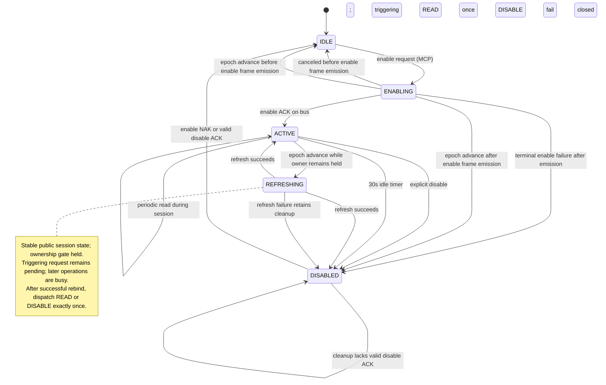
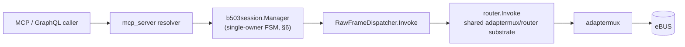

# Vaillant B503 — Diagnostic, Service, and HMU Live-Monitor (normative)

`PB=0xB5`, `SB=0x03`.

This document is the **normative L7 protocol specification** for the Vaillant
`B503` selector family within the Helianthus `vaillant/b503` namespace. It is
the `M0_DOC_GATE` deliverable for execution-plans#19 (plan
`vaillant-b503-namespace-w17-26`, canonical SHA `86495340`). Downstream code
milestones `M1_DECODER` (helianthus-ebusgo), `M2a_GATEWAY_MCP` /
`M2b_GATEWAY_GRAPHQL` / `M5_TRANSPORT_MATRIX` (helianthus-ebusgateway), `M3`
portal and `M4` Home Assistant MUST cite this document as their doc-gate
companion.

Amendment-1 (2026-04-25) extends the v1 surface with the `M0b_DOC_DISPATCHER_BRIDGE`
deliverable (this doc, §12) and the production-dispatch milestone
`M6_DISPATCHER_BRIDGE` (helianthus-ebusgateway). The amendment adds the
production dispatcher contract, the AD18 capability-signal 8-state truth
table, and the AD16 lock-order + epoch-tagged in-flight discipline. All
amendment-1 content is rendered in §12 and cross-referenced from §13 and §14.

## 1. Status

**Normative.** Formerly reverse-engineered selector family. The seven selectors
listed in §3 are locked per plan AD01..AD15 as the v1 delivery surface. The
wire shape is stable; decoder structure, invoke-safety classification, session
model, error model, and public-surface normalization rules are frozen for v1.

Amendment-1 (2026-04-25) keeps the v1 wire/safety surface unchanged and
extends the document with the production dispatcher contract in §12
(plan AD16 + AD18). The amendment is additive within that archived amendment:
no v1 selector, wire shape, or invoke-safety classification is altered.

**Current public session authority.** The five-state public session contract in
§6–§8 is governed by this document's current doc-gate revision (docs-ebus#523)
and supersedes prior public session-presentation vocabulary here. The
amendment-1 plan SHA remains traceability evidence for its original §12 scope;
it is not authority to retain a superseded public FSM vocabulary. This current
contract does not add a compatibility state, route, or fallback.

Changes to plan-owned selectors, wire shape, or invoke-safety classification
require a new plan revision and corresponding doc-gate PR. A correction limited
to the current public session contract requires its own doc-gate PR and current
source evidence; it does not claim or create execution-plan state.

Evidence labels used throughout:

- `LOCAL_TYPESPEC`: vendored john30 `ebusd-configuration` TypeSpec files.
- `LOCAL_CAPTURE`: operator-provided or repository-local bus captures.
- `LOCAL_MCP`: Helianthus MCP runtime observations.
- `PUBLIC_CONFIG`: upstream john30 `ebusd-configuration` repository.
- `INFERENCE`: falsifiable interpretation from the sources above.

## 2. Wire Shape

`B503` requests **always begin with a two-byte `(family, selector)` prefix**.
The prefix identifies the §3 catalog row; per-selector request lengths MAY
extend beyond 2 bytes (see "History reads" below for the documented
extension case). The request payload is opaque to `protocol.Frame`;
framing, CRC, escaping, and bus-transaction behaviour are unchanged. No new
transport semantics are introduced by this namespace.

```text
Request payload (normative baseline — all selectors start with these 2 bytes):
  family   : byte     # 0x00 current | 0x01 history-lookup | 0x02 clear-command
  selector : byte     # 0x01 error   | 0x02 service        | 0x03 HMU live-monitor
```

The `family` byte classifies the request CLASS; its value is not itself a
history index. `selector` classifies the data plane (error / service / HMU
live-monitor). The two bytes together identify the row in §3.

**The `family` byte is NOT safety-bearing.** Invoke-safety classification
(`READ` / `SERVICE_WRITE` / `INSTALL_WRITE`) is a property of the *complete*
`(family, selector)` tuple as enumerated in §3 / §4, NOT of the family byte
alone. In particular, `family=0x00` includes both `READ` selectors
(`00 01`, `00 02`) and the `SERVICE_WRITE` live-monitor selector
(`00 03`). Implementations MUST derive invoke safety from the §3 catalog
lookup (or equivalent decoder-table entry), never from the family byte in
isolation. A gateway that treats `family=0x00` as passive-by-default would
bypass the session gating required in §6–§7 for `00 03`.

**History reads** (`family = 0x01`, selectors `Errorhistory` / `Servicehistory`)
are indexable. Per `LOCAL_TYPESPEC`, the response carries an echoed `index`
field; the mechanism by which the client SELECTS which history entry to
retrieve is **device-class dependent** and MAY append additional bytes after
the two-byte baseline. Implementers MUST consult the per-target decoder in
`helianthus-ebusgo/protocol/vaillant/b503` and the LOCAL_TYPESPEC / LOCAL_CAPTURE
evidence for the target device class, and MUST run the falsification test in
§3 against multiple history indexes on real hardware before locking the
request encoding for a given target.

Response shape is selector-dependent; see §3 and the `helianthus-ebusgo`
per-selector struct definitions under `protocol/vaillant/b503`.

## 3. Selector Catalog (NORMATIVE)

The table below is the full v1 selector set. The `Invoke-Safety` column is the
authoritative classification applied at the gateway invoke boundary (§7).
`Install-write` selectors (`02 01`, `02 02`) are classified `INSTALL_WRITE` and
MUST NOT be reachable through any public surface in v1 (§9).

| Request payload | Direction | Name | Invoke-Safety | Response shape | Evidence | Falsification test |
|---|---:|---|---|---|---|---|
| `00 01` | read | `Currenterror` | `READ` | five LE `uint16` error slots (`errors`), `0xFFFF` = empty | `LOCAL_TYPESPEC`, `LOCAL_CAPTURE` | Read `B503 00 01` from BAI00 and disprove that response bytes decode as five little-endian unsigned 16-bit slots with `0xFFFF` sentinel. |
| `01 01` | read | `Errorhistory` | `READ` | index + `errorhistory` payload | `LOCAL_TYPESPEC` | Query multiple history indexes and show response does not change with the index byte or does not carry an error-history record. |
| `02 01` | install write | `Clearerrorhistory` | `INSTALL_WRITE` — **NOT exposed v1** | ACK / side effect | `LOCAL_TYPESPEC` | On isolated hardware, write the clear command and show error history remains unchanged after successful ACK. |
| `00 02` | read | `Currentservice` | `READ` | five LE `uint16` service slots (`errors` shape) | `LOCAL_TYPESPEC` | Read `B503 00 02` from a target with a service message and show no five-slot response exists. |
| `01 02` | read | `Servicehistory` | `READ` | index + `errorhistory`-shaped payload | `LOCAL_TYPESPEC` | Query indexes and show no indexed service-history payload. |
| `02 02` | install write | `Clearservicehistory` | `INSTALL_WRITE` — **NOT exposed v1** | ACK / side effect | `LOCAL_TYPESPEC` | Clear on isolated hardware and verify history is unchanged after ACK. |
| `00 03` | service write/read pair | HMU `LiveMonitorMain` enable + status | `SERVICE_WRITE` | response begins with `status`, `function`; trailing bytes reserved | `LOCAL_TYPESPEC`, `LOCAL_CAPTURE` | Enable live monitor, then read `B503 00 03`; falsify if first two data bytes do not track live-monitor status/function changes. |

## 4. Invoke-Safety Classes

Three classes are defined (plan AD04). The decoder package in
`helianthus-ebusgo/protocol/vaillant/b503` exports this as an enum and the
gateway MUST consult it at the invoke boundary before dispatching a frame.

| Class | Semantics | Gateway behaviour |
|---|---|---|
| `READ` | Passive-safe, idempotent. No session state. | May be invoked directly via `ebus.v1.rpc.invoke` substrate. |
| `SERVICE_WRITE` | Side-effectful, stateful. Gated by live-monitor session (§6). | MUST acquire `liveMonitorMu` and respect the FSM in §6. |
| `INSTALL_WRITE` | Side-effectful, requires installer authority. | MUST NOT be exposed on any public surface in v1. Negative tests in M2a / M2b / M3 assert absence on MCP, GraphQL, and portal respectively. |

Install-write classification for `02 01` (`Clearerrorhistory`) and `02 02`
(`Clearservicehistory`) is **mandatory** and non-overridable in v1. See §9.

## 5. Sentinel Rules and `first_active_error`

### 5.1 Sentinel

In the five-slot composite payloads returned by `00 01` (`Currenterror`) and
`00 02` (`Currentservice`), each slot is a little-endian `uint16`. The value
`0xFFFF` denotes an **empty slot** (no error / no service message occupying
that position). Sentinel detection is per-slot; a `0xFFFF` in slot N does not
truncate scanning of slot N+1.

### 5.2 `first_active_error`

`first_active_error` is defined normatively as:

> The first slot, scanning from slot 0 upward (ascending index), whose decoded
> LE `uint16` value is **not** `0xFFFF`. If all five slots are `0xFFFF`,
> `first_active_error` is absent.

Home Assistant entity `boiler_active_error` (plan M4) publishes this value
directly as a decimal integer when `first_active_error` is present. When
`first_active_error` is absent (all five slots `0xFFFF` — i.e. the device
reports no active fault), the entity state is `None` (rendered as HA
`unknown`), signalling a healthy "no-active-error" state.

**This is distinct from `unavailable`.** `unavailable` is reserved for
capability / transport outages per §11 (`TRANSPORT_DOWN`, `UNKNOWN`,
`NOT_SUPPORTED`). A read that successfully returns five `0xFFFF` slots is a
positive health signal, NOT an outage: the entity MUST NOT be rendered
`unavailable` in that case. Conflating the two states would cause
downstream automations to treat normal operation as device unavailability.

### 5.3 Worked example (LOCAL_CAPTURE)

Captured from BAI00 (`0x08`) during plan R1 evidence gathering:

```text
REQ:  f1 08 b5 03 02 00 01
RESP: 0a 19 01 ff ff ff ff ff ff ff ff
```

Decode:

- Response length byte `0x0a` = 10 payload bytes.
- Slot 0: `19 01` → LE `0x0119` → decimal `281`.
- Slots 1..4: `ff ff` → `0xFFFF` → empty.

`first_active_error` = `281`. See §10 for the F.xxx correlation caveat
governing how this decimal is surfaced to consumers.

## 6. Live-Monitor Session

### 6.1 State machine (plan AD04)

The gateway runs a single-owner FSM per transport incarnation for selector
`00 03` (HMU `LiveMonitorMain`). The public session observation has exactly
five stable states: `Idle`, `Enabling`, `Active`, `Refreshing`, and `Disabled`.
`Refreshing` means an epoch refresh holds the ownership gate. The already
admitted triggering request remains pending; subsequent bus-facing live-monitor
operations are busy. Refresh success dispatches a triggering read exactly once
and returns `Active`, or dispatches a triggering current-owner disable exactly
once. Only a valid disable ACK completes owner cleanup to `Idle`; any other
disable outcome retains fail-closed cleanup. Refresh failure releases the gate,
enters internal `DISABLED`, retains a Gateway cleanup obligation, and returns
the exact Gateway-supplied failure to that request; its public session
observation is `Idle` with `owned:false` and unavailable capability.
`Disabled` is never reported with `owned:true`.

A **confirmed cleanup success** means a valid native disable ACK. A NAK,
timeout, CRC mismatch, bus-arbitration failure, disconnect, or any other outcome
without that ACK does not prove that a possibly active device session stopped.
It therefore retains the applicable process-local defensive-cleanup obligation
and never makes the session slot re-claimable.


```mermaid
stateDiagram-v2
    [*] --> IDLE
    IDLE --> ENABLING: enable request (MCP)
    ENABLING --> ACTIVE: enable ACK on bus
    ENABLING --> IDLE: canceled before enable frame emission
    ENABLING --> DISABLED: terminal enable failure after emission
    ENABLING --> IDLE: epoch advance before enable frame emission
    ENABLING --> DISABLED: epoch advance after enable frame emission
    ACTIVE --> ACTIVE: periodic read during session
    ACTIVE --> DISABLED: explicit disable
    ACTIVE --> DISABLED: 30s idle timer
    DISABLED --> IDLE: enable NAK or valid disable ACK

    ACTIVE --> REFRESHING: epoch advance while owner remains held
    REFRESHING --> ACTIVE: refresh succeeds; triggering READ once
    REFRESHING --> DISABLED: refresh succeeds; triggering DISABLE once
    REFRESHING --> DISABLED: refresh failure retains cleanup
    DISABLED --> DISABLED: cleanup lacks valid disable ACK; fail closed

    note right of REFRESHING
      Stable public session state; ownership gate held.
      Triggering request remains pending; later operations are busy.
      After successful rebind, dispatch READ or DISABLE exactly once.
    end note
```

### 6.2 Ownership key

B503 live-monitor ownership has two composition layers:

```text
transport_key = (adapter_instance_id, transport_incarnation_epoch)
session_key   = (transport_key, issuer_token)
```

- `transport_key` is the bus-level identity: at most one live-monitor
  session may be ACTIVE per `transport_key` (physical bus constraint —
  HMU cannot multiplex simultaneous live-monitor streams).
- `issuer_token` is an **opaque, gateway-issued token** returned to the
  client on successful ENABLE. It scopes session control authority (disable,
  idle-extend) to the specific caller that claimed the session.

Rules (normative):

| Operation | Required key match | Outcome on mismatch |
|---|---|---|
| ENABLE | none (new claim) | succeeds iff FSM is `IDLE`; if any session is already `ENABLING`/`ACTIVE`/`REFRESHING` → `SESSION_BUSY` |
| DISABLE | full `session_key` must match the active session | A current-owner DISABLE that detects epoch advance remains pending as the triggering request; every subsequent DISABLE while `REFRESHING`, or a request from a non-owner, returns `SESSION_BUSY` |
| READ (`00 03`) | `transport_key` match; `issuer_token` ignored | Reads are permitted to any caller while a session is `ACTIVE`; a READ that detects epoch advance remains pending as the triggering request, and every subsequent live-monitor operation while `REFRESHING` is `SESSION_BUSY` |
| Epoch advance while `ACTIVE` owner remains held | old epoch key authorizes only the bounded refresh for an admitted READ or current-owner DISABLE | → `REFRESHING`; refresh once per §7.3; success atomically rebinds the same issuer token and target to the returned current transport epoch before dispatching the triggering operation exactly once; ENABLE is never a refresh trigger |
| Epoch advance while `ENABLING`, before enable-frame emission | — | → `IDLE`; cancel the queued frame, release the gate, and discard every stale completion or failure outcome from that enable attempt; explicit new Enable required |
| Epoch advance while `ENABLING`, after enable-frame emission | pending attempt identity and target remain Gateway-owned for cleanup only | → `DISABLED`; fence every stale completion, issue exactly one defensive disable after quiesce on the current transport epoch, and record its exact cleanup outcome as native evidence; a valid disable ACK completes cleanup to `IDLE`, while any other outcome retains the §7.4 process-local obligation and remains fail-closed in `DISABLED`; no automatic retry or active owner survives |

The `issuer_token` is opaque to clients; it MUST NOT be derived from
user-visible identifiers, and MUST be sufficient entropy that a second
client cannot forge another client's token (e.g., gateway-internal UUID or
cryptographic nonce). Clients obtain their token from the ENABLE response
envelope and return it in subsequent DISABLE calls.

On an `ACTIVE` epoch advance from N to N+1, the old `session_key` authorizes
only the one bounded refresh attempt. A successful refresh returns the current
`transport_key` for epoch N+1. Gateway MUST atomically replace the owner key
with `(transport_key[N+1], same issuer_token)` while retaining the same target,
then dispatch the admitted triggering operation exactly once. Completions and
control requests still bound to epoch N are stale and MUST NOT satisfy, disable,
extend, or mutate the rebound session. If refresh fails, no rebound key is
installed; Gateway releases client ownership, retains a fresh Gateway-owned
process-local cleanup obligation in internal `DISABLED`, presents public
session `Idle` with `owned:false`, preserves the exact unavailable capability,
and admits no Enable until cleanup succeeds.

This refines plan AD04's baseline `(adapter_instance_id,
transport_incarnation_epoch)` with a client-scoped control token. The
refinement is additive: the plan-level transport identity is preserved, and
the token layer only affects session control (enable/disable), not bus
access.

### 6.3 Transitions (normative)

| From | Event | To | Side effect |
|---|---|---|---|
| `IDLE` | enable request, no owner | `ENABLING` | emit enable frame after poll-quiesce |
| `ENABLING` | enable ACK received | `ACTIVE` | start 30s idle timer; arm reads |
| `ENABLING` | `ctx.Done` before enable-frame emission | `IDLE` | cancel the queued frame, release the ownership gate, and clear the pending attempt; no native disable is emitted |
| `ENABLING` | `ctx.Done` after enable-frame emission / ACK timeout / CRC mismatch / bus-arbitration timeout / any other ambiguous terminal failure | `DISABLED` | emit exactly one defensive native disable after quiesce, or queue it under §7.4 if transport disconnects first; release the owner on entry and complete cleanup to `IDLE` only after a valid disable ACK confirms cleanup success; return the original exact failure outcome |
| `ENABLING` | NAK | `DISABLED` | release the owner on entry and complete cleanup to `IDLE` without a defensive disable because NAK proves the enable was rejected |
| `ENABLING` | epoch advance detected before enable-frame emission | `IDLE` | cancel the queued frame, release ownership, and discard every stale completion or failure outcome from that enable attempt; explicit new Enable required |
| `ENABLING` | epoch advance detected after enable-frame emission | `DISABLED` | fence every stale completion, issue exactly one defensive disable after quiesce on the current transport epoch, and record its exact cleanup outcome as native evidence; a valid disable ACK completes cleanup to `IDLE`, while any other outcome retains the §7.4 process-local obligation and remains fail-closed in `DISABLED`; no automatic retry or active owner survives |
| `ACTIVE` | read request | `ACTIVE` | reset idle timer |
| `ACTIVE` | explicit disable; valid disable ACK | `DISABLED` | emit disable frame exactly once after quiesce, return success, release the owner, clear cleanup, and complete to `IDLE` |
| `ACTIVE` | explicit disable; NAK / timeout / CRC mismatch / bus-arbitration failure / disconnect / any other outcome without a valid disable ACK | `DISABLED` | emit disable frame exactly once after quiesce, return its exact outcome, release the owner, retain `(targetAddress, fresh gatewayCleanupAttemptID, currentTransportEpoch)` as the process-local §7.4 cleanup obligation, and do not enter `IDLE` |
| `ACTIVE` | 30s idle | `DISABLED` | emit disable frame after quiesce |
| `ACTIVE` | admitted request detects epoch advance | `REFRESHING` | ownership gate remains held; triggering request remains pending; subsequent live-monitor operations are busy |
| `REFRESHING` | refresh succeeds for triggering READ | `ACTIVE` | atomically rebind the owner from epoch N to the returned current `transport_key` at N+1, retaining the same issuer token and target; fence every epoch-N completion; dispatch READ exactly once using the rebound key, return its outcome, and retain the owner |
| `REFRESHING` | refresh succeeds for triggering current-owner DISABLE; valid disable ACK | `DISABLED` | atomically rebind to the N+1 key, fence every epoch-N completion, emit disable exactly once after quiesce using the rebound key, return success, and complete owner cleanup to `IDLE` |
| `REFRESHING` | refresh succeeds for triggering current-owner DISABLE; NAK / timeout / CRC mismatch / bus-arbitration failure / disconnect / any other outcome without a valid disable ACK | `DISABLED` | atomically rebind to the N+1 key, fence every epoch-N completion, emit disable exactly once after quiesce using the rebound key, return its exact outcome, release the owner, and retain `(targetAddress, fresh gatewayCleanupAttemptID, transportEpoch[N+1])` only as the process-local §7.4 defensive-cleanup obligation; do not enter `IDLE` |
| `REFRESHING` | refresh failure | `DISABLED` | release ownership gate, return the exact Gateway-supplied failure outcome to the triggering request without dispatching its native operation, and retain `(targetAddress, fresh gatewayCleanupAttemptID, attemptedTransportEpoch)` as the process-local §7.4 cleanup obligation; public session is `Idle` with `owned:false`, capability remains the exact unavailable outcome, and no Enable is admitted |
| `DISABLED` | defensive disable has no valid ACK while transport remains connected | `DISABLED` | retain the process-local §7.4 defensive-cleanup obligation, publish capability `UNKNOWN`, admit no Enable, and perform no same-epoch retry; only a later transport epoch may attempt one bounded cleanup under §7.5 |
| `DISABLED` | enable NAK proves no device session, or valid disable ACK confirms cleanup success | `IDLE` | clear any defensive-cleanup obligation; session may be re-claimed by any client only when capability is `AVAILABLE` |
| any | transport disconnect | `DISABLED` | release any owner; if an enable may have reached the wire and no disable has a confirmed terminal outcome, retain the target and attempt only as the process-local §7.4 defensive-cleanup obligation |
| any | gateway restart | `DISABLED` | release any owner and destroy every caller handle; reconstruct no session and emit no automatic B503 enable or disable; each qualified target's live-monitor capability stays `UNKNOWN` with no Enable until explicit operator-authorized target recovery under §7.5 |

**Lock lifecycle (single assignment, owner-conditional):**
`liveMonitorMu` is acquired exactly once on the `IDLE → ENABLING`
transition. It is released exactly once on a terminal transition from a
held-owner state: on entry to `DISABLED` from `ENABLING`, `ACTIVE`, or
`REFRESHING`, or on either direct `ENABLING → IDLE` path (cancellation or epoch advance before
frame emission). The "any" transitions
(transport disconnect, gateway restart) release the mutex only when FSM was in
a held-owner state at the time the event fired; if the FSM was already `IDLE`
or `DISABLED` (no owner), no release occurs. The `DISABLED → IDLE` transition
does NOT release the mutex; it only marks the session slot as re-claimable
after cleanup completes. Implementations MUST NOT release the mutex at any
other transition, and MUST NOT attempt a release when no owner is held. This
keeps the release single-sourced, owner-conditional, and free of double-unlock
panics on timeout/NAK paths or disconnect-while-idle events.

**Stable public `Disabled` mapping:** `Disabled` with `owned:false` represents
only an explicit operator or configuration disable. Enable failure, the 30s
idle timeout, transport disconnect, and gateway restart may traverse the
internal cleanup path through `DISABLED`, but their stable public session
observation is `Idle` with `owned:false`. While a process-local cleanup
obligation remains, capability is `UNKNOWN` and Enable is unavailable; `Idle`
does not make the internal slot re-claimable. `Disabled` is never reported with
`owned:true`.

## 7. Gateway Operational Contract

This section is the primary doc-gate companion for `M2a_GATEWAY_MCP` and
`M5_TRANSPORT_MATRIX`. It is sourced directly from plan §11. All statements
are normative (MUST / MUST NOT / SHOULD).

### 7.1 Public error model

Exactly **two** public outcomes exist for `SERVICE_WRITE` and `READ`
operations that depend on capability state. Both are members of the
public `B503Availability` enum (§11) or map onto it:

| Public value | Meaning | When it surfaces |
|---|---|---|
| `BUSY` (`SESSION_BUSY`) | Live-monitor session already claimed under a different `issuer_token`, OR bounded lifecycle/contention ambiguity. | Another client holds the session (ENABLE/DISABLE mismatch per §6.2); genuine contention that is not transport loss. |
| `UNAVAILABLE` (`TRANSPORT_DOWN` / `UNKNOWN` / `NOT_SUPPORTED`) | Capability is not currently usable; distinguish reason per public enum (§11). | Transport disconnected; gateway has not yet determined availability; device class does not implement B503. |

#### 7.1.1 Refreshing session state (public)

`Refreshing` is the stable Gateway-owned session observation for an epoch
refresh (§6.1). It holds the ownership gate while the already-admitted
triggering READ or current-owner DISABLE remains pending. Every subsequent
bus-facing live-monitor operation surfaces `SESSION_BUSY` during that interval.
It is a session-status value, not a sixth `B503Availability` reason:

| Session value | Where it surfaces | Ownership and outcome |
|---|---|---|
| `Refreshing` | Gateway session status, GraphQL, and portal strip | `owned:true`; refresh success for READ → `Active`; refresh failure releases the gate, retains Gateway cleanup, and presents session `Idle`, `owned:false`, with the exact unavailable capability; a refreshed DISABLE releases ownership and reaches `Idle` only after a valid disable ACK, otherwise Gateway retains fail-closed cleanup with session `Idle`, `owned:false`, and capability `UNKNOWN` |

Downstream contract tests (M2a, M2b, M3) MUST assert the five stable session
states and MUST reject `Disabled` paired with `owned:true`.

When a consumer leaves a target or navigates away while its locally initiated
enable is pending, it MUST register cleanup under the exact
`(targetAddress, localEnableAttemptID, presentationEpoch)` tuple. The consumer
allocates a fresh opaque `localEnableAttemptID` before dispatch and never reuses
it. Successful
completion of that same attempt supplies the issuer token and dispatches
exactly one target/token disable. Any other completion—including `ctx.Done`
before bus turnaround, ACK timeout, NAK, CRC mismatch, bus-arbitration timeout,
epoch-advance discard, transport disconnect, gateway restart, or any other
terminal failure—clears that registration without issuing a client disable
before any later enable is admitted. The registration MUST NOT transfer to a
later attempt or session. Gateway may separately emit the single defensive
native disable required by the §6.3 terminal-failure transition.

When a locally token-owning consumer leaves a target or navigates away while
its session is `Refreshing`, it MUST queue that target/token disable without
invoking the busy operation. After successful refresh reaches `Active`, it
dispatches the queued disable; after refresh failure releases ownership and
presents `Idle`, it clears the browser queued pair without a client disable
while Gateway retains the process-local cleanup obligation. If the triggering request was itself the
current-owner DISABLE, that single disable is the only client dispatch. A valid
disable ACK completes `Disabled` cleanup to `Idle`; any other outcome returns
exactly and leaves the process-local defensive cleanup with Gateway. In both
cases the consumer clears the queued pair without issuing a second disable.
During a held `Refreshing` epoch, the
session strip remains observable alongside temporarily `UNKNOWN` capability,
but it is status-only: only `vaillantCapabilities` and
`vaillantLiveMonitorSession` remain admitted so the client can observe
completion. No B503 card, tabs, bus-facing reads, or actions are admitted until
capability returns `AVAILABLE`.

### 7.2 Quiesce timing bounds (normative)

The gateway MUST apply a **poll-quiesce window** around the emission of every
live-monitor enable and disable frame. Bounds:

- **Lower bound: 0.** The quiesce window MAY be zero when no B524 poll frame is
  in flight.
- **Upper bound:** enforced by the transport layer — the gateway MUST NOT emit a
  B503 live-monitor enable or disable frame while a B524 poll frame is in
  flight on the same bus. Observed upper bound on adapter-direct and
  `ebusd_tcp` transports is one B524 transaction window (validated in
  `M5_TRANSPORT_MATRIX`, artefact `matrix/M6a-vaillant-b503.md`).

### 7.3 Retry and refresh

- Maximum **1 refresh attempt** per epoch advance. No recursive or unbounded
  retries.
- On refresh success for a surviving authenticated current-owner handle, the
  old epoch-N key authorizes only that refresh. Gateway atomically installs the
  returned current `transport_key` for epoch N+1 with the same issuer token and
  target before returning to `Active`; every epoch-N completion is fenced. This
  is continuation, not reconstruction or auto-resume. The already-admitted
  triggering request remains pending during refresh; after successful rebind,
  Gateway dispatches that request's native operation exactly once using the
  rebound key and returns its exact outcome. A triggering READ retains the
  owner in `Active`; a triggering current-owner DISABLE emits its disable after
  quiesce and enters `Disabled`. A valid disable ACK completes owner cleanup to
  `Idle`. Any other disable outcome returns exactly, releases the owner, retains
  a process-local defensive-cleanup obligation, publishes capability `UNKNOWN`,
  and admits no Enable; it does not enter `Idle`. ENABLE is
  never a refresh trigger. This one dispatch consumes the request's only retry
  budget. Every subsequent bus-facing live-monitor operation during refresh
  returns `SESSION_BUSY`. On refresh failure, no rebound key is installed:
  release the ownership gate, retain a fresh Gateway-owned process-local cleanup
  obligation in internal `DISABLED`, present public session `Idle` with
  `owned:false`, and return the exact Gateway-supplied failure to the triggering
  request without dispatching its native operation. Capability remains that
  exact unavailable outcome and no Enable is admitted until cleanup succeeds.
- On refresh revealing `TRANSPORT_DOWN` or `UNKNOWN` → surface that value
  literally (§11). It MUST NOT be collapsed into `SESSION_BUSY`.
- No infinite reconnect loops. Reconnect is driven by the transport layer, not
  by B503 resolvers.

### 7.4 Ownership release

Release is owner-conditional (§6.3 "Lock lifecycle"). The release
obligations below apply **only when an owner is held at the moment the
event fires**; they are no-ops when the FSM is already `IDLE` or
`DISABLED`:

- Every native disable used for explicit, idle-timeout, refreshed, or defensive
  cleanup clears its obligation only after a valid native
  disable ACK. A NAK, timeout, CRC mismatch, bus-arbitration failure,
  disconnect, or any other outcome without that ACK retains the target plus a
  fresh Gateway-owned `gatewayCleanupAttemptID` and the attempted transport
  epoch as process-local,
  operation-ineligible cleanup state. Gateway publishes capability `UNKNOWN`,
  admits no Enable, and performs no retry in that transport epoch. The internal
  FSM remains `DISABLED`; a later transport epoch may attempt one bounded
  target-specific cleanup under §7.5.
- Gateway allocates `gatewayCleanupAttemptID` when the cleanup obligation is
  created and never reuses it. This opaque ID is internal to Gateway; it is not
  the browser-local `localEnableAttemptID`, is not supplied by a caller, and
  confers no owner or operation authority.
- On transport disconnect, the gateway MUST transition the FSM to
  `DISABLED` and — if an owner was held — release `liveMonitorMu`. If an enable
  may have reached the wire and no disable has a confirmed terminal outcome,
  Gateway retains `(targetAddress, gatewayCleanupAttemptID, priorTransportEpoch)`
  only as a process-local defensive-cleanup obligation across transport
  reconnect. It carries no issuer token, owner authority, session continuation,
  or operation eligibility and does not survive gateway process restart.
- On gateway restart, the gateway MUST transition the FSM to `DISABLED`
  and — if an owner was held — release `liveMonitorMu`. No session or cleanup
  tuple persists across restart. Because Gateway can no longer distinguish its
  pre-restart session from a session owned by another bus client, it MUST NOT
  emit an automatic B503 enable or disable. Each qualified target starts with
  live-monitor capability `UNKNOWN`, and Enable remains unavailable until the
  explicit operator-authorized target recovery in §7.5 succeeds.
- If the FSM was already `IDLE` or `DISABLED` at disconnect/restart time,
  these events are no-ops with respect to the mutex; no release is
  attempted. A pre-existing defensive-cleanup obligation remains independent
  of that mutex rule.
- `liveMonitorMu` is a **distinct** `sync.Mutex` from the B524 `readMu`.
  Acquisition order when both are needed: `liveMonitorMu` → (optional)
  `readMu`. The reverse order is forbidden.

### 7.5 Reconnect handling

- On reconnect, the `transport_incarnation_epoch` advances. Any surviving owner
  handle that remains held without a §7.4 transport-disconnect cleanup enters
  `Refreshing` on next touch.
- The resolver applies the §7.3 refresh-once policy.
- A terminal transport disconnect follows §7.4: it releases the owner and does
  not enter `Refreshing` on reconnect. If no defensive cleanup is pending, the
  later reconnect reaches `Idle` and requires a new explicit client Enable.
- If defensive cleanup is pending, the transport layer MUST NOT publish the new
  epoch as B503-usable or admit any Enable. After quiesce on the current
  transport epoch, Gateway issues exactly one target-specific defensive disable
  for that reconnect attempt and records its exact native outcome. A confirmed
  terminal cleanup clears the obligation, publishes the epoch as usable, and
  reaches `Idle`; an ambiguous or transport failure retains the obligation,
  leaves B503 `TRANSPORT_DOWN` or `UNKNOWN` as applicable, and admits no Enable.
  There is no retry within the same transport epoch; a later transport lifecycle
  attempt may execute one bounded cleanup again before publication.
- After every Gateway process restart, enumerate the finite registry-qualified
  B503 targets, set each target's live-monitor capability to `UNKNOWN`, admit no
  Enable, and emit no automatic B503 enable or disable. For a selected target,
  only an explicit operator-authorized maintenance recovery may issue one
  target-specific disable after quiesce. That recovery is outside the public
  GraphQL and Portal v1 surfaces and requires action-time confirmation. Record
  the exact native outcome. A valid disable ACK permits that target's normal
  availability evaluation; any other outcome leaves it `UNKNOWN`, admits no
  Enable, and performs no retry in the same transport epoch. Without explicit
  authorization, Gateway performs no write and the live-monitor capability
  remains unavailable. This fence reconstructs no caller handle or session and
  requires no persisted cleanup tuple.
- Gateway MUST NOT reconstruct or auto-resume a session after restart, a lost
  owner handle, or an absent/invalid current issuer token; each requires an
  explicit new client Enable. After restart that Enable is admitted only after
  the explicit operator-authorized target recovery succeeds and capability is
  `AVAILABLE`; Gateway never performs that recovery automatically. The surviving
  authenticated current-owner refresh path in §7.3 is the only continuation
  allowed across an epoch advance.

### 7.6 30s idle-timeout semantics

- In `ACTIVE`, if no read request arrives within 30 seconds, the gateway emits
  a disable frame (with quiesce) and transitions to `DISABLED`.
- The 30s timer resets on every successful read.
- Idle disable transitions the **internal** FSM from `ACTIVE` to `DISABLED`.
  A valid disable ACK clears cleanup, returns the internal FSM to `IDLE`, and
  keeps the **public capability signal** (§11) `AVAILABLE`; a later explicit
  request may then re-enter `ENABLING`. A NAK, timeout, CRC mismatch,
  bus-arbitration failure, disconnect, or any other outcome without that ACK
  follows §7.4: retain the process-local cleanup obligation, publish capability
  `UNKNOWN`, admit no Enable, and perform no same-epoch retry. Idle auto-disable
  MUST NOT be reported to consumers as `NOT_SUPPORTED`, which is reserved for
  "device class does not implement B503" (§11).

### 7.7 Concurrency with B524

- READ selectors (`00 01`, `01 01`, `00 02`, `01 02`) MAY proceed concurrently
  with B524 polling.
- SERVICE_WRITE (`00 03`) enable/disable frames serialize via `liveMonitorMu`
  and the quiesce window (§7.2). `M5_TRANSPORT_MATRIX` MUST include an
  explicit regression scenario (plan AD12) proving B524 baseline throughput is
  unchanged with the new mutex in place.

### 7.8 Stable API error model

The stable API (GraphQL `B503Availability` enum + MCP error code) exposes:

- `AVAILABLE`
- `NOT_SUPPORTED`
- `TRANSPORT_DOWN`
- `SESSION_BUSY`
- `UNKNOWN`

`Refreshing` is a session-status value and not a member of this availability
enum. See §8 for the normative normalization rules and §11 for the GraphQL
capability-signal contract.

## 8. Public Normalization Rules

The following rules are normative and binding on every downstream consumer
path (MCP resolvers, GraphQL resolvers, HA integration, portal).

1. **Refreshing is session-specific.** `Refreshing` appears only in the stable
   session observation, never as a sixth availability reason or as a substitute
   for a Gateway error outcome.
2. **Refresh once.** On epoch advance with a held session, Gateway transitions
   to `Refreshing` and makes exactly one refresh attempt. The already-admitted
   triggering READ or current-owner DISABLE remains pending and is dispatched
   exactly once only after successful rebind. READ returns Gateway to `Active`;
   DISABLE releases ownership and completes the normal `Disabled` cleanup to
   `Idle` only after a valid disable ACK. Any other disable outcome retains the
   §7.4 process-local cleanup obligation, publishes capability `UNKNOWN`, admits
   no Enable, and returns its exact outcome. Subsequent bus-facing live-monitor
   operations are `SESSION_BUSY` during refresh. Refresh failure likewise
   releases client ownership but retains Gateway cleanup in internal `DISABLED`,
   preserves the exact unavailable capability, and admits no Enable.
3. **No collapse of transport/unknown outcomes.** After refresh, if the
   capability query reveals `TRANSPORT_DOWN` or `UNKNOWN`, those outcomes MUST
   be surfaced literally. They MUST NOT be collapsed into `SESSION_BUSY`.
4. **SESSION_BUSY is narrow.** `SESSION_BUSY` is reserved **only** for bounded
   lifecycle/contention ambiguity (another claimant, genuine in-flight
   contention). It is not a catch-all for unknown or transport failures.
5. **Bounded retries.** Maximum 1 auto-retry per request. No infinite
   reconnect loops. The transport layer owns reconnect; B503 resolvers do not.

## 9. Install-Writes Non-Exposure (v1 invariant)

`Clearerrorhistory` (selector `02 01`) and `Clearservicehistory` (selector
`02 02`) are classified `INSTALL_WRITE` (§4) and are subject to the following
normative v1 invariant:

> **`02 01` and `02 02` MUST NOT be exposed on any public surface in v1.**
> This includes, without exception, MCP tools, GraphQL mutations, portal UI
> affordances (including hidden / feature-flagged DOM), and Home Assistant
> services.

Enforcement:

- `M2a_GATEWAY_MCP` acceptance includes a negative test asserting no MCP tool
  exists for these selectors.
- `M2b_GATEWAY_GRAPHQL` acceptance includes a schema introspection diff
  asserting no mutation exists for these selectors.
- `M3_PORTAL` acceptance includes a DOM audit scanning for any element
  referencing `clear`, `delete`, or `reset` keywords in the B503 pane.

Any future exposure of these selectors requires a **separate plan** and a new
doc-gate PR per `AGENTS.md §8.4`, including installer-mode authentication
design and isolated-hardware bench evidence.

## 10. F.xxx Decimal Caveat (LOCAL_CAPTURE only)

The normative public contract publishes active-error and service slot values
**as decimal integers, as-is**. There is **no cross-device F.xxx lookup
table** in this specification.

A single local correlation has been observed:

- LOCAL_CAPTURE on BAI00: first slot `0x0119` = decimal `281` (§5.3).
- Unpublished operator UI observation on the same BAI00: `F.281 Flame loss
  during the stabilisation period`.

This proves **only** that on this specific BAI00 device generation, the first
active-error slot was equal to the decimal component of the operator UI code.
It does **not** prove that every Vaillant `F.xxx` code is mirrored as the same
decimal value on every device generation, nor that the mapping is stable
across HMU, EHP, or VRC720-family controllers.

Downstream consumers therefore:

- MUST publish the raw decimal value.
- MUST NOT present a translated F.xxx label in entity state or GraphQL
  resolver output.
- MAY attach a decoder-metadata annotation carrying `provenance=LOCAL_CAPTURE`
  for diagnostic purposes only, with no claim of cross-device validity.

Building a cross-device F.xxx table is deferred to a separate RE plan (see
plan §Scope OUT).

## 11. GraphQL Capability Signal (public contract)

The GraphQL capability signal `vaillantCapabilities.b503` is the authoritative
availability surface for HA and portal. It is defined here for doc-gate
completeness; the authoritative schema lives in
`helianthus-ebusgateway/graphql/schema`.

```graphql
type VaillantCapabilities {
  b503: B503Capability!
}

type B503Capability {
  available: Boolean!         # true only when reason == AVAILABLE
  reason: B503Availability!
}

enum B503Availability {
  AVAILABLE
  NOT_SUPPORTED    # device class does not implement B503
  TRANSPORT_DOWN   # transport currently disconnected
  SESSION_BUSY     # bounded contention: session held by another client OR in-flight lifecycle ambiguity (see §7.1, §8)
  UNKNOWN          # gateway has not yet determined availability
}
```

`Refreshing` is a session-status value, not a member of this availability enum,
per §8.

## 12. Production dispatcher contract

This section is the `M0b_DOC_DISPATCHER_BRIDGE` deliverable for execution-plans#19
amendment-1 and is the doc-gate companion for `M6_DISPATCHER_BRIDGE`
(helianthus-ebusgateway). It mirrors plan decisions AD16 (production raw-frame
dispatcher contract) and AD18 (capability-signal 8-state truth table +
stale-epoch discipline) from plan canonical SHA
`86495340799be9340dc191c371a49a958f65c357c76a1e0a2974502c8489b508`. The plan
chunks `13-amendment-1-dispatcher-portal-ux.md` and `10-scope-decisions.md` are
the canonical source; this section MUST NOT diverge. On conflict, the plan
wins and this section is updated by a follow-up doc-gate PR.

### 12.1 Dispatcher path overview


```mermaid
flowchart LR
    Caller[MCP / GraphQL caller]
    MCP[mcp_server resolver]
    Mgr["b503session.Manager<br/>(single-owner FSM, §6)"]
    Disp[RawFrameDispatcher.Invoke]
    Router[router.Invoke<br/>shared adaptermux/router substrate]
    Mux[adaptermux]
    Bus[(eBUS)]

    Caller --> MCP
    MCP --> Mgr
    Mgr --> Disp
    Disp --> Router
    Router --> Mux
    Mux --> Bus
```

The dispatcher path is single-substrate. There is **no** parallel transport
path for B503 (AD16). B524 and B525 already traverse the same `router.Invoke`
substrate; B503 production dispatch reuses that substrate verbatim. A gateway
configuration that injects any other transport path for B503 is
non-conforming.

### 12.2 `RawFrameDispatcher.Invoke` contract <a id="rawframedispatcher-invoke-contract"></a>

The dispatcher exposes a single method whose Go signature is fixed:

```go
Invoke(ctx context.Context, target byte, payload []byte) ([]byte, error)
```

Normative obligations:

- **Request shape.** `target` is the bus address of the destination responder
  (e.g. `0x08` for BAI00). `payload` is the L7 request body whose first
  two bytes are the §2 `(family, selector)` prefix (e.g. `00 01` for
  `Currenterror`, `01 01` for `Errorhistory`, `00 03` for the HMU
  live-monitor enable). The dispatcher MUST NOT prepend or rewrite those
  two bytes — the caller is responsible for emitting the correct §2
  prefix and any per-selector extensions documented in §3 (e.g. the
  history-index byte for `01 01` / `01 02`). The namespace bytes
  `PB=0xB5` / `SB=0x03` are NOT part of `payload`; they are populated
  by the framing layer when building the `protocol.Frame`
  (`Primary=0xB5`, `Secondary=0x03`, `Data=payload`) and MUST NOT appear
  inside `payload` itself. A `payload` that starts with `b5 03` is
  malformed and the dispatcher MUST reject it (M6 acceptance enforces
  this).
- **Response shape.** On success the returned `[]byte` is the decoded L7
  response payload exactly as delivered by the underlying `router.Invoke`
  substrate, with no B503-specific stripping or padding.
- **Cancellation discipline.** The dispatcher MUST honour `ctx.Done()`.
  Cancellation before bus turnaround MUST surface as an
  `UPSTREAM_TIMEOUT` per §12.4 with `structured.detail.phase="ctx_canceled"`.
  In-flight bus traffic that is already on the wire MAY complete and be
  discarded; the dispatcher MUST NOT block on bus-quiesce after `ctx.Done()`.
- **Error mapping.** Transport and protocol errors are translated to the
  caller-visible enum in §12.4. Legitimate B503 protocol errors (NAK from
  the device) MUST NOT be collapsed into transport-level errors
  (`TRANSPORT_DOWN`).
- **Stub forbidden post-M6.** Once `M6_DISPATCHER_BRIDGE` lands, the
  `b503StubDispatcher{}` injection in `cmd/gateway/vaillant_b503_wiring.go`
  MUST be removed. The only acceptable post-deploy state is the production
  dispatcher live; reintroducing a stub fallback is a defect class (AD16).

### 12.3 Shared adaptermux/router routing semantics <a id="shared-router-substrate"></a>

The dispatcher routes through the **same** `router.Invoke` substrate used
by B524 and B525 (AD16). Implementation rules:

- The B503 dispatcher MUST NOT open its own adaptermux subscription, its
  own bus session, or any auxiliary transport channel.
- READ selectors (`00 01`, `01 01`, `00 02`, `01 02`) MAY proceed
  concurrently with B524 / B525 traffic on the same router (consistent
  with §7.7).
- `SERVICE_WRITE` (`00 03`) enable / disable frames serialise via
  `liveMonitorMu` and the §7.2 quiesce window, but the actual bus
  transaction is still issued through `router.Invoke`. The router is the
  one and only bus-access primitive.
- Transport disconnect MUST be propagated to
  `b503session.Manager.OnTransportDisconnect()` so the AD04 quiesce-release
  fires; the dispatcher acts as the propagation site.

### 12.4 Error-mapping table (NORMATIVE) <a id="error-mapping-table"></a>

The dispatcher translates transport and protocol errors to caller-visible
public surfaces as follows. The `structured.detail` discriminator keys are
the assertion targets for `M6_DISPATCHER_BRIDGE` tests; M6 tests fail if
any row collapses to a different public surface or omits the detail keys.

| Transport / protocol error | Caller-visible error | `structured.detail` keys |
|---|---|---|
| transport_down (adaptermux disconnected) | `TRANSPORT_DOWN` | `transport_state="down"`, `last_seen_ts=<unix>` |
| `ctx.Done` before bus turnaround | `UPSTREAM_TIMEOUT` | `timeout_ms=<int>`, `phase="ctx_canceled"` |
| bus NAK | `UPSTREAM_RPC_FAILED` | `nak_byte=<hex>`, `target=<hex>` |
| CRC mismatch | `UPSTREAM_RPC_FAILED` | `crc_expected=<hex>`, `crc_got=<hex>` |
| stale-epoch reply (AD18 row 8) | (frame discarded; caller still pending) | n/a — see §12.7 stale-epoch discipline |

Discriminator rules:

- `TRANSPORT_DOWN` is reserved for transport-level loss. A device NAK is a
  legitimate B503 protocol response and MUST NOT be reported as
  `TRANSPORT_DOWN`. A CRC mismatch is a protocol-layer failure and MUST
  NOT be reported as `TRANSPORT_DOWN` either.
- `UPSTREAM_TIMEOUT` is reserved for caller-driven cancellation
  (`ctx.Done`) before the bus has produced a reply. Bus arbitration
  timeouts that occur after the request reaches the wire are reported as
  `UPSTREAM_RPC_FAILED` with a `phase="bus_timeout"` detail key (added by
  M6 if observed; not pre-declared here).
- `UPSTREAM_RPC_FAILED` is the catch-all for protocol-level failure with
  a populated discriminator. The discriminator MUST be present; an
  `UPSTREAM_RPC_FAILED` without `structured.detail` is non-conforming.

### 12.5 Capability-signal 8-state truth table (mirror of AD18) <a id="capability-truth-table"></a>

The `vaillantCapabilities.b503` capability output (§11) follows the 8-state
truth table below. The plan AD18 entry in
`vaillant-b503-namespace-w17-26.implementing/10-scope-decisions.md` is the
canonical source; this table mirrors it for doc-gate completeness. Each
row is a separate `M6_DISPATCHER_BRIDGE` test target; missing-coverage on
any row is an automatic merge-gate block.

| # | State | Capability output | Stale-frame discipline |
|---|---|---|---|
| 1 | cold-boot, no successful dispatch yet | `UNKNOWN` | n/a |
| 2 | post-first-success steady state | `AVAILABLE` | n/a |
| 3 | disconnect during ACTIVE session | `TRANSPORT_DOWN` (literal) | in-flight requests fail `TRANSPORT_DOWN`; no late mutation |
| 4 | reconnect, before first post-reconnect dispatch | `UNKNOWN` (NOT sticky `AVAILABLE`) | reset to `UNKNOWN` regardless of pre-disconnect state |
| 5 | reconnect, post-first-success-after-reconnect | `AVAILABLE` | n/a |
| 6 | timeout/NAK/CRC during dispatch | `UPSTREAM_RPC_FAILED` to caller; capability stays last-known only when the operation creates no cleanup obligation; any disable or refresh failure that retains cleanup publishes `UNKNOWN` per §6–§8 | cleanup-bearing outcomes retain the Gateway-owned attempt identity, admit no Enable, and follow the bounded later-epoch cleanup rule |
| 7 | held-session epoch refresh; session status `Refreshing` | `UNKNOWN` (temporary; not sticky `AVAILABLE`) | triggering READ or current-owner DISABLE remains pending and is dispatched exactly once only after successful rebind; READ returns to `Active`, DISABLE releases ownership and completes cleanup to `Idle` only after a valid ACK, and subsequent live-monitor operations are `SESSION_BUSY`; only `vaillantCapabilities` and `vaillantLiveMonitorSession` status queries remain admitted, with no B503 card, tabs, bus-facing reads, or actions until capability returns `AVAILABLE` |
| 8 | stale in-flight completion across epoch rollover | n/a — frame discarded | reply/NAK/timeout from epoch N arriving after reconnect to epoch N+1 MUST be discarded; MUST NOT mutate capability to `AVAILABLE`; MUST NOT satisfy any post-reconnect waiter |

**Forbidden states** (M6 tests assert absence):

- sticky `AVAILABLE` after transport loss;
- premature `AVAILABLE` before the first real dispatch;
- silent fallback to `UNKNOWN` once `TRANSPORT_DOWN` is knowable.

`Refreshing` remains a session-status state per §7.1.1 and §8; row 7 above
does not add a public capability value.

### 12.6 Lock acquisition order invariant <a id="lock-order"></a>

The gateway uses two B503-related mutexes:

- `liveMonitorMu` — write-class mutex acquired by `b503session.Manager.Enable`,
  `Read` on the `00 03` selector, and `Disable`. It is **distinct** from
  the B524 `readMu` (§7.4).
- `readMu` — the B524 family poll mutex.

**Acquisition order is INVARIANT: `liveMonitorMu → readMu`.** Reversal is a
defect class (AD16). Concretely, when both mutexes participate in the same
critical section, callers MUST acquire `liveMonitorMu` BEFORE `readMu`, and
MUST release in the reverse (LIFO) order. The forbidden orderings — and the
ones the M6 tracer flags as defects — are:

- entering `liveMonitorMu` while already holding `readMu` (reverse acquisition);
- entering `liveMonitorMu` while a goroutine on this stack is waiting on `readMu` (deadlock potential under partial overlap).

Holding `liveMonitorMu` and then entering `readMu` is the canonical, allowed
order and is what `b503session.Manager.Read` does on the `00 03` selector.

`M6_DISPATCHER_BRIDGE` acceptance verifies this mechanically: the test
harness installs a build-tagged lock tracer/hook on `liveMonitorMu` and
`readMu` that records every `Lock()` / `Unlock()` with goroutine ID and
timestamp. Each `M6-CONC-*` concurrency test asserts via the tracer that no
goroutine ever crossed the forbidden order. `-race` and a 30 s deadlock
timeout are SECONDARY trip-wires, not the primary proof (AD16 + R3 A1 fix
in plan §13).

### 12.7 Epoch-tagged in-flight requests <a id="epoch-tagged-inflight"></a>

Per AD18 row 8 (stale-epoch discipline), every B503 dispatch request MUST
capture the current `b503session.Manager.epoch` value into an in-flight
request record at issue-time. Reply, NAK, and timeout completion paths
MUST compare against the **stored** epoch BEFORE waking waiters or
mutating capability state.

Normative rules:

- Epoch comparison is **request-side metadata**, populated when the
  request leaves `RawFrameDispatcher.Invoke`. It MUST NOT be re-derived
  from `Manager` at receive time.
- A reply / NAK / timeout from epoch N that arrives after the transport
  has rolled over to epoch N+1 MUST be:
  1. discarded silently;
  2. NOT used to mutate the capability signal to `AVAILABLE`;
  3. NOT used to satisfy any post-reconnect waiter.
- The discard path MUST NOT inspect the new (epoch N+1) `Manager` state to
  decide; the request's stored epoch is sufficient on its own.

This is the only correct closure for the AD18 row 8 stale-frame race. A
completion path that compares against `Manager.epoch` at receive time is
non-conforming because the epoch may have advanced between request issue
and reply arrival, allowing a stale frame to satisfy a fresh waiter.

### 12.8 Companion test surface

`M6_DISPATCHER_BRIDGE` acceptance lives in the plan
(`13-amendment-1-dispatcher-portal-ux.md §M6`); §12.4–§12.7 are the
assertion targets (error-mapping rows, 8 truth-table tests, 4 `M6-CONC-*`
lock-tracer tests, stale-epoch in-flight completion test). On disagreement
between this doc and the plan, the plan wins and a follow-up doc-gate PR
realigns §12.

## 13. Evidence Labels (preserved)

The evidence labels defined in §1 are used throughout. In particular:

- The §3 selector catalog is `LOCAL_TYPESPEC` + `LOCAL_CAPTURE` grounded.
- The §5.3 worked example is `LOCAL_CAPTURE`.
- The §10 F.xxx correlation is `LOCAL_CAPTURE`-only; no `PUBLIC_CONFIG` or
  cross-device evidence has been admitted into this spec.
- Future device-class coverage additions MUST cite the evidence label that
  supports them before entering the normative catalog.

## 14. Companion Links (downstream code milestones)

| Milestone | Repo | Artefact |
|---|---|---|
| `M1_DECODER` | `helianthus-ebusgo` | `protocol/vaillant/b503` decoder package + invoke-safety enum |
| `M2a_GATEWAY_MCP` | `helianthus-ebusgateway` | MCP tools `ebus.v1.vaillant.errors.get`, `.errors.history.get`, `.service.current.get`, `.service.history.get`, `.live_monitor.get` |
| `M5_TRANSPORT_MATRIX` | `helianthus-ebusgateway` | `matrix/M6a-vaillant-b503.md` — adapter-direct + `ebusd_tcp` (+ `ebusd_serial` if lab-available) |
| `M2b_GATEWAY_GRAPHQL` | `helianthus-ebusgateway` | GraphQL diagnostic read-only parity + `vaillantCapabilities.b503` signal and five-state `vaillantLiveMonitor` session status (`Idle` / `Enabling` / `Active` / `Refreshing` / `Disabled`); only the bounded session enable/disable action through the §6 FSM |
| `M3_PORTAL` | `helianthus-ebusgateway` | Vaillant pane (errors / service / live-monitor diagnostic reads) plus Gateway-owned five-state live-monitor session strip (`Idle` / `Enabling` / `Active` / `Refreshing` / `Disabled`) and only the bounded session enable/disable action through the §6 FSM |
| `M4_HA` | `helianthus-ha-integration` | diagnostic sensor `boiler_active_error` + `error_history` attribute, capability-signal-gated |
| `M6_DISPATCHER_BRIDGE` (amendment-1) | `helianthus-ebusgateway` | production `RawFrameDispatcher` replacing `b503StubDispatcher{}` injection in `cmd/gateway/vaillant_b503_wiring.go`; contract per §12 (PR ref: TBD) |

Dependency DAG (plan AD09 + amendment-1):
`M0 → M1 → M2a → M5 → M2b → {M3, M4} → M6 → {M7, M8}` with
`M0b` parallel to `M6` and merge-blocking it.

All downstream PRs MUST include a companion-link reference to this document in
their PR body.

## 15. References

- Plan: `helianthus-execution-plans/vaillant-b503-namespace-w17-26.implementing/`
  (canonical SHA `86495340799be9340dc191c371a49a958f65c357c76a1e0a2974502c8489b508`,
  amendment-1 locked 2026-04-25). Prior v1.0 baseline canonical SHA was
  `896a82e720b33eefb449ea532570e0a962bfa76504519996825f13d92ec9bb28`; amendment-1
  supersedes it.
- Amendment-1 chunk: [`13-amendment-1-dispatcher-portal-ux.md`](https://github.com/Project-Helianthus/helianthus-execution-plans/blob/main/vaillant-b503-namespace-w17-26.implementing/13-amendment-1-dispatcher-portal-ux.md)
  — canonical source for §12 (M0b / M6 / M7 / M8).
- Decision matrix: [`10-scope-decisions.md`](https://github.com/Project-Helianthus/helianthus-execution-plans/blob/main/vaillant-b503-namespace-w17-26.implementing/10-scope-decisions.md)
  — canonical source for AD16 (production dispatcher contract) and AD18
  (capability-signal 8-state truth table + stale-epoch discipline).
- Meta-issue: [execution-plans#19](https://github.com/Project-Helianthus/helianthus-execution-plans/issues/19).
- Doc-gate issue (v1.0): [docs-ebus#282](https://github.com/Project-Helianthus/helianthus-docs-ebus/issues/282).
- Doc-gate issue (amendment-1 / M0b): [docs-ebus#288](https://github.com/Project-Helianthus/helianthus-docs-ebus/issues/288).
- Public TypeSpec: [errors_inc.tsp](https://github.com/john30/ebusd-configuration/blob/23a460b8fe1cc6e7a7e6d549190573ccfcfc450f/src/vaillant/errors_inc.tsp)
- Public TypeSpec: [service_inc.tsp](https://github.com/john30/ebusd-configuration/blob/23a460b8fe1cc6e7a7e6d549190573ccfcfc450f/src/vaillant/service_inc.tsp)
- Public TypeSpec: [08.hmu.tsp](https://github.com/john30/ebusd-configuration/blob/23a460b8fe1cc6e7a7e6d549190573ccfcfc450f/src/vaillant/08.hmu.tsp)
- Data type reference: [`../../types/ebusd-csv.md`](../../types/ebusd-csv.md)
- Consolidated local reference: [`ebus-vaillant.md`](ebus-vaillant.md)
- Sibling normative doc (structure precedent): [`ebus-vaillant-B505.md`](ebus-vaillant-B505.md)
