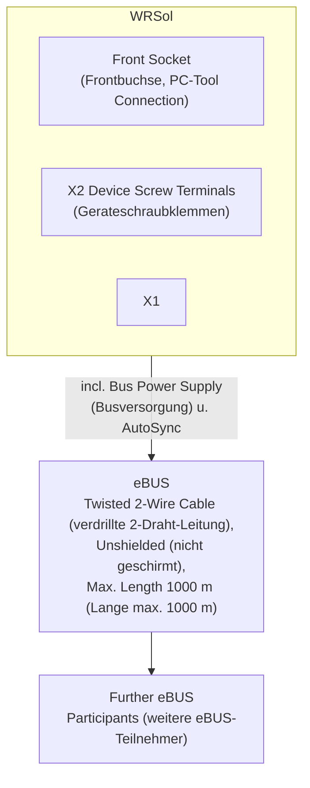
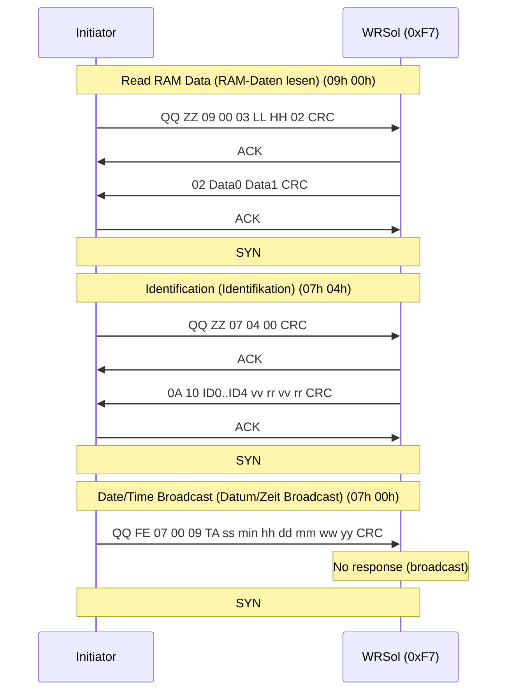

# WRSol -- Implemented eBUS Commands of the Weishaupt Devices (Implementierte eBUS-Befehle der Weishaupt-Gerate)

<!-- legacy-role-mapping:begin -->
> Legacy role mapping (for cross-referencing older materials): `master` → `initiator`, `slave` → `target`. Helianthus documentation uses `initiator`/`target`.
<!-- legacy-role-mapping:end -->

> **Source:** Weishaupt Technique -- Implemented eBUS Commands of the Weishaupt Devices (Implementierte eBUS-Befehle der Weishaupt-Gerate), Version 8\_16
> **Date:** FG-Schb / 24.09.2007
> **Section:** Chapter 11 -- WRSol
> **Pages:** 84--88 / 92

---

## Table of Contents

- [11.1 eBUS Connection (Anschluss an eBUS)](#111-ebus-connection-anschluss-an-ebus)
- [11.2 Settings (Einstellungen)](#112-settings-einstellungen)
  - [11.2.1 Activate eBUS (eBUS aktivieren)](#1121-activate-ebus-ebus-aktivieren)
  - [11.2.2 Bus Power Supply (Busversorgung)](#1122-bus-power-supply-busversorgung)
  - [11.2.3 AutoSync Generator](#1123-autosync-generator)
  - [11.2.4 eBUS Address (eBUS-Adresse)](#1124-ebus-address-ebus-adresse)
- [11.3 Command Overview (Ubersicht der verwendeten Befehle)](#113-command-overview-ubersicht-der-verwendeten-befehle)
- [11.4 System Data Commands (Systemdatenbefehle) (PB 07h)](#114-system-data-commands-systemdatenbefehle-pb-07h)
  - [11.4.1 Date / Time Message (Datum- / Zeit-Meldung) (07h 00h)](#1141-date--time-message-datum---zeit-meldung-07h-00h)
  - [11.4.2 Identification (Identifikation) (07h 04h)](#1142-identification-identifikation-07h-04h)
- [11.5 MemoryServer Commands (MemoryServer-Befehle) (PB 09h)](#115-memoryserver-commands-memoryserver-befehle-pb-09h)
  - [11.5.1 Read RAM Data (RAM-Daten lesen) (09h 00h)](#1151-read-ram-data-ram-daten-lesen-09h-00h)
  - [RAM Address Map](#ram-address-map)

---

## 11.1 eBUS Connection (Anschluss an eBUS)



For hardwired connection, the eBUS signal is available at the device screw terminals:

| Terminal | Signal  |
|----------|---------|
| X2-1     | eBUS +  |
| X2-2     | eBUS -  |

The front socket beneath the display is intended for connecting the PC-Tool.

---

## 11.2 Settings (Einstellungen)

### 11.2.1 Activate eBUS (eBUS aktivieren)

The data readiness for eBUS signals in the WRSol is **always activated**.

### 11.2.2 Bus Power Supply (Busversorgung)

The WRSol generates a bus power supply of **26 mA** for powering external (passive) eBUS components.

### 11.2.3 AutoSync Generator

The WRSol generates an AutoSync signal after a defined time period, if no other bus participant has supplied an AutoSync signal up to that point.

### 11.2.4 eBUS Address (eBUS-Adresse)

The WRSol has the eBUS address:

```
0xF7
```

---

## 11.3 Command Overview (Ubersicht der verwendeten Befehle)

| PB   | SB   | Description                                        | Direction | Notes          |
|------|------|----------------------------------------------------|-----------|----------------|
| `07h`| `00h`| Receive Time Message (Zeit-Meldung empfangen)      | -> WRSol  | WRSol 2.0 only |
| `07h`| `04h`| Identification (Identifikation)                    | -> WRSol  |                |
| `09h`| `00h`| Read RAM Data (RAM-Daten lesen)                    | -> WRSol  |                |

---

## 11.4 System Data Commands (Systemdatenbefehle) (PB 07h)

### 11.4.1 Date / Time Message (Datum- / Zeit-Meldung) (07h 00h)

**Communication direction:** -> WRSol
**Cycle rate:** 1 / 60s

**Description:** An eBUS participant sends this telegram. It transmits the time and the measured outdoor temperature via this broadcast telegram to all bus participants.

**Communication load:** Cycle rate: 1 / 60s
**Tolerance:** --
**Bus load:** 0.11%

#### Frame Structure

| Initiator/Target Byte No. | Abbrev. | Description                           | Unit | Range       | Type / Format | PMC DB 81 | Notes                              |
|------------------------|---------|---------------------------------------|------|-------------|---------------|-----------|------------------------------------|
| M 1                    | QQ      | Source Address (Quelladresse)         |      |             |               |           | Broadcast                          |
| M 2                    | ZZ = FEh| Destination Address (Zieladresse)    |      |             |               |           | Broadcast                          |
| M 3                    | PB = 07h| System Command (Systembefehl)         |      |             |               |           |                                    |
| M 4                    | SB = 00h| Date / Time Message (Datum / Zeit-Meldung) |  |           |               |           |                                    |
| M 5                    | NN = 09h| Data Length (Datenlange)              |      |             |               |           |                                    |
| M 6                    | TA_L    | Outdoor Temperature Low (Aussentemperatur low) | C | -50.0..50.0 | DATA2b 1/256 | DW 60 | Ignored by WRSol (Wird vom WRSol ignoriert) |
| M 7                    | TA_H    | Outdoor Temperature High (Aussentemperatur high) | C | |            |               |           |                                    |
| M 8                    | ss      | Seconds (Sekunden)                    | s    | 0..59       | BCD           | DL 61     |                                    |
| M 9                    | min     | Minutes (Minuten)                     | min  | 0..59       | BCD           | DR 61     |                                    |
| M 10                   | hh      | Hours (Stunden)                       | h    | 0..23       | BCD           | DL 62     |                                    |
| M 11                   | dd      | Day (Tag)                             |      | 1..31       | BCD           | DR 62     | see M 7                            |
| M 12                   | mm      | Month (Monat)                         |      | 1..12       | BCD           | DL 63     | see M 7                            |
| M 13                   | ww      | Weekday (Wochentag)                   |      | 1..7        | BCD           | DL 63     |                                    |
| M 14                   | yy      | Year (Jahr)                           |      | 0..99       | BCD           | DL 64     | see M 7                            |
| M 15                   | CRC     |                                       |      |             |               |           |                                    |
| M 16                   | SYN     |                                       |      |             |               |           |                                    |

> **Note:** This command is only processed by the **WRSol 2.0**.

#### Example Frame (Hex)

```
QQ FE 07 00 09 TA_L TA_H ss min hh dd mm ww yy CRC SYN
```

---

### 11.4.2 Identification (Identifikation) (07h 04h)

**Communication direction:** -> WRSol
**Cycle rate:** once (einmalig)

#### Frame Structure

| Initiator/Target Byte No. | Abbrev.     | Description                            | Unit | Range | Type / Format | PMC DB 81 | Notes        |
|------------------------|-------------|----------------------------------------|------|-------|---------------|-----------|--------------|
| M 1                    | QQ          | Source Address (Quelladresse)          |      |       |               |           |              |
| M 2                    | ZZ          | Destination Address / Target (Zieladresse) |   |       |               |           |              |
| M 3                    | PB = 07h    | System Commands (Systembefehle)        |      |       |               |           |              |
| M 4                    | SB = 04h    | Identification (Identifikation)        |      |       |               |           |              |
| M 5                    | NN = 00h    | Data Length (Datenlange)               |      |       |               |           |              |
| M 6                    | CRC         |                                        |      |       |               |           |              |
| S 1                    | ACK         |                                        |      |       |               |           |              |
| S 2                    | NN = 0Ah    | Data Length (Datenlange)               |      |       |               |           |              |
| S 3                    | HH          | Manufacturer = 10h (Hersteller = 10h) |      | 0..99 | BYTE          | DL 673    |              |

#### Device ID Response

| Target Byte | Abbrev.      | Description                          | Format   | PMC DB 81 | V. 2.30 | V. 2.40 |
|------------|--------------|--------------------------------------|----------|-----------|---------|---------|
| S 4        | gg           | Device ID 0 (Gerate\_ID\_0)          | ASCII    | DR 673    | P       | W       |
| S 5        |              | Device ID 1 (Gerate\_ID\_1)          | BYTE     | DL 674    | S       | R       |
| S 6        |              | Device ID 2 (Gerate\_ID\_2)          | BYTE     | DR 674    | 5       | S       |
| S 7        |              | Device ID 3 (Gerate\_ID\_3)          | BYTE     | DL 675    | 5       | o       |
| S 8        |              | Device ID 4 (Gerate\_ID\_4)          | BYTE     | DR 675    | 1       | l       |
| S 9        | vv           | Software Version (Softwareversion)   | BCD      | DL 676    | 49      | 24      |
| S 10       | rr           | Software Revision (Softwarerevision) | BCD      | DR 676    | 120     | 22      |
| S 11       | vv           | Hardware Version (Hardwareversion)   | BCD      | DL 677    | 120     | 11      |
| S 12       | rr           | Hardware Revision (Hardwarerevision) | BCD      | DR 677    | 120     | 12      |
| S 13       | CRC          |                                      |          |           |         |         |
| M 7        | ACK          |                                      |          |           |         |         |
| M 8        | SYN          |                                      |          |           |         |         |

#### Identification Decoding

**Manufacturer byte (S3):** `0x10` = Weishaupt

**Device ID (S4--S8) as ASCII:**

| Version | Device ID String (Gerate\_ID String) | Meaning             |
|---------|--------------------------------------|---------------------|
| V. 2.30 | `PS551`                              | WRSol V. 2.30       |
| V. 2.40 | `WRSol`                              | WRSol V. 2.40       |

> **Note:** The internal version number (see S4--S12) is displayed on the controller for approx. 3 seconds after power recovery. It is also retrievable under the menu item "Temp. u. Werte auslesen".

#### Example Frame (Hex)

```
QQ ZZ 07 04 00 CRC | ACK 0A 10 gg gg gg gg gg vv rr vv rr CRC | ACK SYN
```

---

## 11.5 MemoryServer Commands (MemoryServer-Befehle) (PB 09h)

### 11.5.1 Read RAM Data (RAM-Daten lesen) (09h 00h)

**Communication direction:** -> WRSol

#### Frame Structure

| Initiator/Target Byte No. | Abbrev.     | Description                                   | Unit | Range | Type / Format | PMC DB 81 | Notes  |
|------------------------|-------------|-----------------------------------------------|------|-------|---------------|-----------|--------|
| M 1                    | QQ          | Source Address (Quelladresse)                 |      |       |               |           |        |
| M 2                    | ZZ          | Destination Address / Target (Zieladresse)     |      |       |               |           |        |
| M 3                    | PB = 09h    |                                               |      |       |               |           |        |
| M 4                    | SB = 00h    | Read RAM (RAM lesen)                          |      |       |               |           |        |
| M 5                    | NN = 03h    | Following Bytes (folgende Bytes)              |      |       |               |           |        |
| M 6                    | LL          | Start Address Low Byte (Low-Byte Startadresse)|      |       | BYTE          | DL 600    |        |
| M 7                    | HH          | Start Address High Byte (High-Byte Startadresse)|    |       | BYTE          | DR 600    |        |
| M 8                    | DN = 02h    | Number of Data Bytes to Read (Anzahl zu lesender Datenbytes) | | | BYTE    | DL 601    |        |
| M 9                    | CRC         |                                               |      |       |               |           |        |
| S 1                    | ACK         |                                               |      |       |               |           |        |
| S 2                    | NN = 02h    | Number of Received Data Bytes (Anzahl empfangener Datenbytes) | | |    |           |        |
| S 3                    | Data 0      | Value Low Byte (Low-Byte Wert)                |      |       | BYTE          | DL 605    | DW 615 |
| S 4                    | Data 1      | Value High Byte (High-Byte Wert)              |      |       | BYTE          | DR 605    |        |
| S 5                    | CRC         |                                               |      |       |               |           |        |
| M 10                   | ACK         |                                               |      |       |               |           |        |
| M 11                   | SYN         |                                               |      |       |               |           |        |

#### Example Frame (Hex)

```
QQ ZZ 09 00 03 LL HH 02 CRC | ACK 02 D0 D1 CRC | ACK SYN
```

Where `LL HH` = RAM start address (little-endian), `D0 D1` = returned 2-byte value.

---

### RAM Address Map

RAM data to be read (dependent on configuration / hydraulic variant HV being present):

| RAM Addr. | Variable         | Description                                                                         | Format  | Scale | Unit |
|-----------|------------------|-------------------------------------------------------------------------------------|---------|-------|------|
| `0xF484`  | TSO              | Tank Top Temperature (Speicher Oben Temperatur)                                     | Integer | X10   | C    |
| `0xF488`  | TSU              | Tank Bottom Temperature (Speicher Unten Temperatur)                                 | Integer | X10   | C    |
| `0xF48A`  | TWT / PWT        | DHW Plate Heat Exchanger Temperature (Brauchwasser Plattentauscher Temperatur)      | Integer | X10   | C    |
| `0xF48C`  | TZW              | Circulation Return Temperature (Zirkulations Rucklauftemperatur)                   | Integer | X10   | C    |
| `0xF492`  | Drehzahl\_BW\_P1 | Collector Tank Pump Speed HV 50 (Drehzahl Kollektor Speicher Pumpe HV 50)          | Integer | X10   | %    |
| `0xF494`  | Drehzahl\_BW\_P2 | Collector Buffer Pump Speed HV 50 (Drehzahl Kollektor Puffer Pumpe HV 50)          | Integer | X10   | %    |
| `0xF496`  | Drehzahl\_BW\_WT | DHW Plate Heat Exchanger Pump Speed (Drehzahl Brauchwasser Plattentauscher Pumpe)  | Integer | X10   | %    |
| `0xF4C8`  | TSB              | Swimming Pool Temperature (Schwimmbad Temperatur)                                   | Integer | X10   | C    |
| `0xF4F2`  | TPO              | Buffer Top Temperature (Puffer Oben Temperatur)                                     | Integer | X10   | C    |
| `0xF4F4`  | TPU              | Buffer Bottom Temperature (Puffer Unten Temperatur)                                 | Integer | X10   | C    |
| `0xF4F6`  | TWT              | Buffer Plate Heat Exchanger Temperature (Puffer Plattentauscher Temperatur)         | Integer | X10   | C    |
| `0xF4F8`  | THR              | Heating Return Temperature (Heizungs Rucklauftemperatur)                            | Integer | X10   | C    |
| `0xF4FC`  | Drehzahl\_Puf\_WT| Buffer Plate Heat Exchanger Pump Speed (Drehzahl Puffer Plattentauscher Pumpe)     | Integer | X10   | %    |
| `0xF504`  | TWW              | Hot Water Temperature HV 14 (Warmwasser Temperatur HV 14)                          | Integer | X10   | C    |
| `0xF506`  | TKW              | Cold Water Temperature HV 14 (Kaltwasser Temperatur HV 14)                         | Integer | X10   | C    |
| `0xF508`  | Drehzahl\_WW     | DHW Charging Pump Speed HV 14 (Drehzahl Warmwasser Ladepumpe HV 14)               | Integer | X10   | %    |
| `0xF51C`  | TKO              | Collector 1 Temperature (Kollektor 1 Temperatur)                                    | Integer | X10   | C    |
| `0xF530`  | Drehzahl\_K1     | Collector 1 Pump Speed (Drehzahl Kollektor 1 Pumpe)                                 | Integer | X10   | %    |
| `0xF532`  | MittlDrehz\_1    | Average Collector 1 Pump Speed (Mittlere Drehzahl Kollektor 1 Pumpe)               | Integer | X10   | %    |
| `0xF536`  | SolarLeistung1   | Solar Power Collector 1 (Solare Leistung Kollektor 1)                               | Word    | X1    | kW   |
| `0xF53A`  | Gewinn1          | Solar Gain Collector 1 (Solargewinn Kollektor 1)                                    | Word    | X1    | kWh  |
| `0xF53C`  | GewinnTotLow1    | Total Solar Gain Low Collector 1, 0--9999 kWh (Solargewinn total Kollektor 1)      | Word    | X1    | kWh  |
| `0xF53E`  | GewinnTot1       | Total Solar Gain High Collector 1, 0.1--999.9 MWh (Solargewinn total Kollektor 1)  | Word    | X10   | MWh  |
| `0xF540`  | Bstd\_Kol1       | Collector 1 Pump Operating Hours (Betriebsstunden Kollektor Pumpe 1)               | Integer | X1    | h    |
| `0xF544`  | TK2              | Collector 2 Temperature (Kollektor 2 Temperatur)                                    | Integer | X10   | C    |
| `0xF558`  | Drehzahl\_K2     | Collector 2 Pump Speed (Drehzahl Kollektor 2 Pumpe)                                 | Integer | X10   | %    |
| `0xF55A`  | MittlDrehz\_2    | Average Collector 2 Pump Speed (Mittlere Drehzahl Kollektor 2 Pumpe)               | Integer | X10   | %    |
| `0xF55E`  | SolarLeistung2   | Solar Power Collector 2 (Solare Leistung Kollektor 2)                               | Word    | X1    | kW   |
| `0xF562`  | Gewinn2          | Solar Gain Collector 2 (Solargewinn Kollektor 2)                                    | Word    | X1    | kWh  |
| `0xF564`  | GewinnTotLow2    | Total Solar Gain Low Collector 2, 0--9999 kWh (Solargewinn total Kollektor 2)      | Word    | X1    | kWh  |
| `0xF566`  | GewinnTot2       | Total Solar Gain High Collector 2, 0.1--999.9 MWh (Solargewinn total Kollektor 2)  | Word    | X10   | MWh  |
| `0xF568`  | Bstd\_Kol2       | Collector 2 Pump Operating Hours (Betriebsstunden Kollektor Pumpe 2)               | Integer | X1    | h    |
| `0xF56C`  | TKV              | Collector Flow Temperature (Kollektor Vorlauftemperatur)                            | Integer | X10   | C    |
| `0xF56E`  | TKR              | Collector Return Temperature (Kollektor Rucklauftemperatur)                         | Integer | X10   | C    |
| `0xF570`  | TBY              | Bypass Temperature (Beipass Temperatur)                                             | Integer | X10   | C    |
| `0xF572`  | STR              | Radiation Temperature (Strahlungs Temperatur)                                       | Integer | X10   | C    |
| `0xF58A`  | TKOL\_hoechst    | Collector Maximum Temperature (Kollektor Hochsttemperatur)                          | Integer | X10   | C    |
| `0xF58C`  | VolumStrom       | Volume Flow (Volumenstrom)                                                          | Integer | X10   | l/h  |
| `0xF4CA`  | TFK              | Solid Fuel Boiler Flow Temperature (Feststoffkessel Vorlauftemperatur)              | Integer | X10   | C    |
| `0xF4CC`  | TFKR             | Solid Fuel Boiler Return Temperature (Feststoffkessel Rucklauftemperatur)           | Integer | X10   | C    |
| `0xF5B4`  | WE\_sperre       | Heat Generator Lockout (Warmeerzeuger Sperre)                                       | Integer | X10   | C    |
| `0xFC00`  | ActualTime       | Current Time and Weekday (Aktuelle Uhrzeit und Wochentag)                           | T, hh, mm, ss | -- | -- |
| `0xF430`  | ErrorBits        | Error Register, Bit 0--15 (Fehlerregister)                                          | Word    | --    | --   |

> **Note:** This list applies to **WRSol 1.0 and 2.0** with internal version number **2.40**. The controller displays this version number for approx. 3 seconds after power recovery. It is also retrievable under the menu item "Temp. u. Werte auslesen".

---

## Appendix: Data Type Reference

| Type    | Description                                                    |
|---------|----------------------------------------------------------------|
| BCD     | Binary-Coded Decimal                                           |
| BYTE    | Unsigned 8-bit integer (0..255)                                |
| Integer | Signed 16-bit integer (little-endian: Low-Byte first)          |
| Word    | Unsigned 16-bit integer (little-endian: Low-Byte first)        |
| DATA2b  | Signed fixed-point, resolution 1/256 C                         |
| ASCII   | ASCII character                                                |

## Appendix: Scale Factors

| Scale | Meaning                                         |
|-------|-------------------------------------------------|
| X1    | Value used as-is (multiply by 1)                |
| X10   | Raw value divided by 10 to get physical value   |

## Appendix: eBUS Communication Flow


